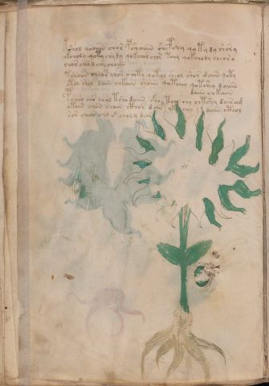

# Voynich Speculative Procedural Protocol — f28v

IMPORTANT: this is NOT a real or validated translation of the Voynich Manuscript. It is a speculative/procedural model that interprets EVA using a user-defined grammar to generate experimental recipes using safe, known edible substitutes.

This file is generated automatically from IVTFF/EVA transliteration plus a user-defined procedural grammar.



## Page / Folio
- currier: A
- folio: f28v
- page_number: 54
- section: herbal

## EVA Text (Transliteration)
```text
kshol qooiiin shor pshoiiin shepchy qoty dy shory
ykcholy qoty chy dy qokchol chor tchy qokchody cheor o
chor chol chy choiin
tshoiin cheor chor o chty qotol sheol shor daiin qoty
otol chol daiin chkaiin shoiin qotchey qotshey daiiin
daiin chkaiin
pchol oiir chol tsho daiin sho tco chy chtshy dair am
okain chan chain cthor dain yk chy daiin cthol
sor chear chl [c':s] choly dar
```

## Domain Context (Heuristic; Not a Translation)

This section summarizes recurring **basewords** in this IVTFF domain and shows simple substring evidence that the token markers used by the procedural grammar occur inside frequent words.

Any Italian anagram / English gloss is a best-effort lexicon match, not a decipherment.


### Associated basewords (non-generic; top by frequency in this domain)
- `daiin` (count=461) → Italian anagram `piani`; English: plans (arrangements)
- `okaiin` (count=59) → Italian anagram `coniai`; English: [n/a]
- `chaiin` (count=39) → Italian anagram `acini`; English: [n/a]
- `saiin` (count=37) → Italian anagram `asini`; English: [n/a]
- `qokaiin` (count=34) → Italian anagram `ciancio`; English: [n/a]
- `qokar` (count=29) → Italian anagram `carco`; English: [n/a]
- `odaiin` (count=27) → Italian anagram `inopia`; English: poverty
- `otchol` (count=25) → Italian anagram `colto`; English: cultivated
- `kaiin` (count=24) → Italian anagram `acini`; English: [n/a]
- `chodaiin` (count=24) → Italian anagram `apocini`; English: [n/a]
- `qotol` (count=20) → Italian anagram `colto`; English: cultivated
- `okain` (count=19) → Italian anagram `acino`; English: a berry
- `qotor` (count=18) → Italian anagram `corto`; English: short
- `ykaiin` (count=16) → Italian anagram `acini`; English: [n/a]
- `qodaiin` (count=15) → Italian anagram `apocini`; English: [n/a]

### Marker evidence (substring in frequent basewords)
- `qo`: 57 basewords; examples: `qotchy`, `qokchy`, `qokedy`, `qokaiin`, `qoky`, `qokol`
- `q`: 58 basewords; examples: `qotchy`, `qokchy`, `qokedy`, `qokaiin`, `qoky`, `qokol`
- `o`: 252 basewords; examples: `chol`, `o`, `chor`, `or`, `shol`, `ol`
- `k`: 142 basewords; examples: `okaiin`, `oky`, `chckhy`, `qokchy`, `qokedy`, `okal`
- `t`: 102 basewords; examples: `cthy`, `oty`, `qotchy`, `cthol`, `cthor`, `otaiin`
- `p`: 15 basewords; examples: `cphy`, `ypchedy`, `opchy`, `opchey`, `pchor`, `qopchy`
- `ch`: 138 basewords; examples: `chol`, `chor`, `chy`, `chey`, `chedy`, `chdy`
- `sh`: 46 basewords; examples: `shol`, `sho`, `shy`, `shor`, `shey`, `shedy`
- `f`: 1 basewords; examples: `f`
- `cth`: 17 basewords; examples: `cthy`, `cthol`, `cthor`, `cthey`, `chcthy`, `ctho`
- `ckh`: 15 basewords; examples: `chckhy`, `ckhy`, `ckhol`, `ckhey`, `checkhy`, `shckhy`
- `cph`: 2 basewords; examples: `cphy`, `cphol`
- `dy`: 78 basewords; examples: `dy`, `chedy`, `chdy`, `chody`, `qokedy`, `shedy`
- `iin`: 39 basewords; examples: `daiin`, `aiin`, `okaiin`, `chaiin`, `saiin`, `qokaiin`
- `aiin`: 32 basewords; examples: `daiin`, `aiin`, `okaiin`, `chaiin`, `saiin`, `qokaiin`

## Recipes Index (This Page)
- [f28v.1,@P0](#f28v-1-f28v-1-p0)
- [f28v.2,+P0](#f28v-2-f28v-2-p0)
- [f28v.3,+P0](#f28v-3-f28v-3-p0)
- [f28v.4,+P0](#f28v-4-f28v-4-p0)
- [f28v.5,+P0](#f28v-5-f28v-5-p0)
- [f28v.6,+Pr](#f28v-6-f28v-6-pr)
- [f28v.7,*P0](#f28v-7-f28v-7-p0)
- [f28v.8,+P0](#f28v-8-f28v-8-p0)
- [f28v.9,+P0](#f28v-9-f28v-9-p0)

## Line Glosses (Procedural Gloss Only; Not a Translation)

<a id="f28v-1-f28v-1-p0"></a>

### f28v.1,@P0

EVA: kshol qooiiin shor pshoiiin shepchy qoty dy shory

Direct Gloss (Procedural, Not a Real Translation):
- kshol: add fermentable sugars → add secondary herb (safe substitute) → mix / transfer
- qooiiin: prepare liquid base → mix / transfer → duration level 3 → state: cooling/rest → medium phase
- shor: add secondary herb (safe substitute) → mix / transfer
- pshoiiin: add secondary herb (safe substitute) → mix / transfer → add starter / activate → duration level 3 → state: cooling/rest → medium phase
- shepchy: add main plant (safe substitute) → add secondary herb (safe substitute) → add starter / activate → duration level 1 → state: active extraction
- qoty: prepare liquid base → apply heat/cooking
- dy: add starter / activate
- shory: add secondary herb (safe substitute) → mix / transfer

<a id="f28v-2-f28v-2-p0"></a>

### f28v.2,+P0

EVA: ykcholy qoty chy dy qokchol chor tchy qokchody cheor o

Direct Gloss (Procedural, Not a Real Translation):
- ykcholy: add fermentable sugars → add main plant (safe substitute) → mix / transfer
- qoty: prepare liquid base → apply heat/cooking
- chy: add main plant (safe substitute)
- dy: add starter / activate
- qokchol: prepare liquid base → add fermentable sugars → add main plant (safe substitute) → mix / transfer
- chor: add main plant (safe substitute) → mix / transfer
- tchy: apply heat/cooking → add main plant (safe substitute)
- qokchody: prepare liquid base → add fermentable sugars → add main plant (safe substitute) → mix / transfer → add starter / activate
- cheor: add main plant (safe substitute) → mix / transfer → duration level 1 → state: active extraction
- o: mix / transfer

<a id="f28v-3-f28v-3-p0"></a>

### f28v.3,+P0

EVA: chor chol chy choiin

Direct Gloss (Procedural, Not a Real Translation):
- chor: add main plant (safe substitute) → mix / transfer
- chol: add main plant (safe substitute) → mix / transfer
- chy: add main plant (safe substitute)
- choiin: add main plant (safe substitute) → mix / transfer → duration level 2 → state: cooling/rest → medium phase

<a id="f28v-4-f28v-4-p0"></a>

### f28v.4,+P0

EVA: tshoiin cheor chor o chty qotol sheol shor daiin qoty

Direct Gloss (Procedural, Not a Real Translation):
- tshoiin: apply heat/cooking → add secondary herb (safe substitute) → mix / transfer → duration level 2 → state: cooling/rest → medium phase
- cheor: add main plant (safe substitute) → mix / transfer → duration level 1 → state: active extraction
- chor: add main plant (safe substitute) → mix / transfer
- o: mix / transfer
- chty: apply heat/cooking → add main plant (safe substitute)
- qotol: prepare liquid base → apply heat/cooking → mix / transfer
- sheol: add secondary herb (safe substitute) → mix / transfer → duration level 1 → state: active extraction
- shor: add secondary herb (safe substitute) → mix / transfer
- daiin: add starter / activate → duration level 1 → state: phase transition/start → long phase
- qoty: prepare liquid base → apply heat/cooking

<a id="f28v-5-f28v-5-p0"></a>

### f28v.5,+P0

EVA: otol chol daiin chkaiin shoiin qotchey qotshey daiiin

Direct Gloss (Procedural, Not a Real Translation):
- otol: apply heat/cooking → mix / transfer
- chol: add main plant (safe substitute) → mix / transfer
- daiin: add starter / activate → duration level 1 → state: phase transition/start → long phase
- chkaiin: add fermentable sugars → add main plant (safe substitute) → duration level 1 → state: phase transition/start → long phase
- shoiin: add secondary herb (safe substitute) → mix / transfer → duration level 2 → state: cooling/rest → medium phase
- qotchey: prepare liquid base → apply heat/cooking → add main plant (safe substitute) → duration level 1 → state: active extraction
- qotshey: prepare liquid base → apply heat/cooking → add secondary herb (safe substitute) → duration level 1 → state: active extraction
- daiiin: add starter / activate → duration level 1 → state: phase transition/start → medium phase

<a id="f28v-6-f28v-6-pr"></a>

### f28v.6,+Pr

EVA: daiin chkaiin

Direct Gloss (Procedural, Not a Real Translation):
- daiin: add starter / activate → duration level 1 → state: phase transition/start → long phase
- chkaiin: add fermentable sugars → add main plant (safe substitute) → duration level 1 → state: phase transition/start → long phase

<a id="f28v-7-f28v-7-p0"></a>

### f28v.7,*P0

EVA: pchol oiir chol tsho daiin sho tco chy chtshy dair am

Direct Gloss (Procedural, Not a Real Translation):
- pchol: add main plant (safe substitute) → mix / transfer → add starter / activate
- oiir: mix / transfer → duration level 2 → state: cooling/rest
- chol: add main plant (safe substitute) → mix / transfer
- tsho: apply heat/cooking → add secondary herb (safe substitute) → mix / transfer
- daiin: add starter / activate → duration level 1 → state: phase transition/start → long phase
- sho: add secondary herb (safe substitute) → mix / transfer
- tco: apply heat/cooking → mix / transfer
- chy: add main plant (safe substitute)
- chtshy: apply heat/cooking → add main plant (safe substitute) → add secondary herb (safe substitute)
- dair: add starter / activate → duration level 1 → state: phase transition/start
- am: duration level 1 → state: phase transition/start

<a id="f28v-8-f28v-8-p0"></a>

### f28v.8,+P0

EVA: okain chan chain cthor dain yk chy daiin cthol

Direct Gloss (Procedural, Not a Real Translation):
- okain: add fermentable sugars → mix / transfer → duration level 1 → state: phase transition/start
- chan: add main plant (safe substitute) → duration level 1 → state: phase transition/start
- chain: add main plant (safe substitute) → duration level 1 → state: phase transition/start
- cthor: mix / transfer → add complex herbal compound (safe blend)
- dain: add starter / activate → duration level 1 → state: phase transition/start
- yk: add fermentable sugars
- chy: add main plant (safe substitute)
- daiin: add starter / activate → duration level 1 → state: phase transition/start → long phase
- cthol: mix / transfer → add complex herbal compound (safe blend)

<a id="f28v-9-f28v-9-p0"></a>

### f28v.9,+P0

EVA: sor chear chl [c':s] choly dar

Direct Gloss (Procedural, Not a Real Translation):
- sor: mix / transfer
- chear: add main plant (safe substitute) → duration level 1 → state: active extraction
- chl: add main plant (safe substitute)
- c: [unparsed]
- s: [unparsed]
- choly: add main plant (safe substitute) → mix / transfer
- dar: add starter / activate → duration level 1 → state: phase transition/start
