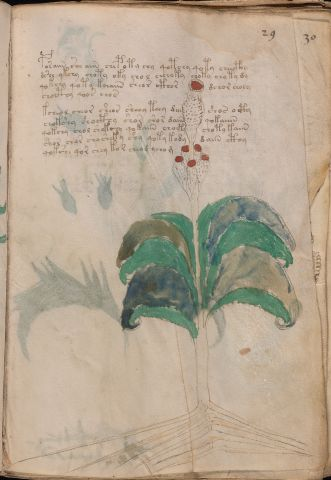

# Voynich Speculative Procedural Protocol — f29r

IMPORTANT: this is NOT a real or validated translation of the Voynich Manuscript. It is a speculative/procedural model that interprets EVA using a user-defined grammar to generate experimental recipes using safe, known edible substitutes.

This file is generated automatically from IVTFF/EVA transliteration plus a user-defined procedural grammar.



## Page / Folio
- currier: A
- folio: f29r
- page_number: 55
- section: herbal

## EVA Text (Transliteration)
```text
posaiin she aiin chep oty chy qotchy qoty cheecthy
dshe ykchy choty oky cho l chchoty choky chy ty dy
qokchy qoty kchaiin shear cthor dchor choly
chocthy qoos chos
kcheol cheor sheos sheey teey d[a:y] shos octy
chokshy shocthy shor shor daiin qokaiiin
qokchy chol shokchy qokaiin choety choty kaiin
shor chor shosheky shy qoty kody daiin cthy
qokshe qor chey kor cheod ychom
```

## Domain Context (Heuristic; Not a Translation)

This section summarizes recurring **basewords** in this IVTFF domain and shows simple substring evidence that the token markers used by the procedural grammar occur inside frequent words.

Any Italian anagram / English gloss is a best-effort lexicon match, not a decipherment.


### Associated basewords (non-generic; top by frequency in this domain)
- `daiin` (count=461) → Italian anagram `piani`; English: plans (arrangements)
- `okaiin` (count=59) → Italian anagram `coniai`; English: [n/a]
- `chaiin` (count=39) → Italian anagram `acini`; English: [n/a]
- `saiin` (count=37) → Italian anagram `asini`; English: [n/a]
- `qokaiin` (count=34) → Italian anagram `ciancio`; English: [n/a]
- `qokar` (count=29) → Italian anagram `carco`; English: [n/a]
- `odaiin` (count=27) → Italian anagram `inopia`; English: poverty
- `otchol` (count=25) → Italian anagram `colto`; English: cultivated
- `kaiin` (count=24) → Italian anagram `acini`; English: [n/a]
- `chodaiin` (count=24) → Italian anagram `apocini`; English: [n/a]
- `qotol` (count=20) → Italian anagram `colto`; English: cultivated
- `okain` (count=19) → Italian anagram `acino`; English: a berry
- `qotor` (count=18) → Italian anagram `corto`; English: short
- `ykaiin` (count=16) → Italian anagram `acini`; English: [n/a]
- `qodaiin` (count=15) → Italian anagram `apocini`; English: [n/a]

### Marker evidence (substring in frequent basewords)
- `qo`: 57 basewords; examples: `qotchy`, `qokchy`, `qokedy`, `qokaiin`, `qoky`, `qokol`
- `q`: 58 basewords; examples: `qotchy`, `qokchy`, `qokedy`, `qokaiin`, `qoky`, `qokol`
- `o`: 252 basewords; examples: `chol`, `o`, `chor`, `or`, `shol`, `ol`
- `k`: 142 basewords; examples: `okaiin`, `oky`, `chckhy`, `qokchy`, `qokedy`, `okal`
- `t`: 102 basewords; examples: `cthy`, `oty`, `qotchy`, `cthol`, `cthor`, `otaiin`
- `p`: 15 basewords; examples: `cphy`, `ypchedy`, `opchy`, `opchey`, `pchor`, `qopchy`
- `ch`: 138 basewords; examples: `chol`, `chor`, `chy`, `chey`, `chedy`, `chdy`
- `sh`: 46 basewords; examples: `shol`, `sho`, `shy`, `shor`, `shey`, `shedy`
- `f`: 1 basewords; examples: `f`
- `cth`: 17 basewords; examples: `cthy`, `cthol`, `cthor`, `cthey`, `chcthy`, `ctho`
- `ckh`: 15 basewords; examples: `chckhy`, `ckhy`, `ckhol`, `ckhey`, `checkhy`, `shckhy`
- `cph`: 2 basewords; examples: `cphy`, `cphol`
- `dy`: 78 basewords; examples: `dy`, `chedy`, `chdy`, `chody`, `qokedy`, `shedy`
- `iin`: 39 basewords; examples: `daiin`, `aiin`, `okaiin`, `chaiin`, `saiin`, `qokaiin`
- `aiin`: 32 basewords; examples: `daiin`, `aiin`, `okaiin`, `chaiin`, `saiin`, `qokaiin`

## Recipes Index (This Page)
- [f29r.1,@P0](#f29r-1-f29r-1-p0)
- [f29r.2,+P0](#f29r-2-f29r-2-p0)
- [f29r.3,+P0](#f29r-3-f29r-3-p0)
- [f29r.4,+P0](#f29r-4-f29r-4-p0)
- [f29r.5,+P0](#f29r-5-f29r-5-p0)
- [f29r.6,+P0](#f29r-6-f29r-6-p0)
- [f29r.7,+P0](#f29r-7-f29r-7-p0)
- [f29r.8,+P0](#f29r-8-f29r-8-p0)
- [f29r.9,+P0](#f29r-9-f29r-9-p0)

## Line Glosses (Procedural Gloss Only; Not a Translation)

<a id="f29r-1-f29r-1-p0"></a>

### f29r.1,@P0

EVA: posaiin she aiin chep oty chy qotchy qoty cheecthy

Direct Gloss (Procedural, Not a Real Translation):
- posaiin: mix / transfer → add starter / activate → duration level 1 → state: phase transition/start → long phase
- she: add secondary herb (safe substitute) → duration level 1 → state: active extraction
- aiin: duration level 1 → state: phase transition/start → long phase
- chep: add main plant (safe substitute) → add starter / activate → duration level 1 → state: active extraction
- oty: apply heat/cooking → mix / transfer
- chy: add main plant (safe substitute)
- qotchy: prepare liquid base → apply heat/cooking → add main plant (safe substitute)
- qoty: prepare liquid base → apply heat/cooking
- cheecthy: add main plant (safe substitute) → add complex herbal compound (safe blend) → duration level 2 → state: active extraction

<a id="f29r-2-f29r-2-p0"></a>

### f29r.2,+P0

EVA: dshe ykchy choty oky cho l chchoty choky chy ty dy

Direct Gloss (Procedural, Not a Real Translation):
- dshe: add secondary herb (safe substitute) → add starter / activate → duration level 1 → state: active extraction
- ykchy: add fermentable sugars → add main plant (safe substitute)
- choty: apply heat/cooking → add main plant (safe substitute) → mix / transfer
- oky: add fermentable sugars → mix / transfer
- cho: add main plant (safe substitute) → mix / transfer
- l: [unparsed]
- chchoty: apply heat/cooking → add main plant (safe substitute) → mix / transfer
- choky: add fermentable sugars → add main plant (safe substitute) → mix / transfer
- chy: add main plant (safe substitute)
- ty: apply heat/cooking
- dy: add starter / activate

<a id="f29r-3-f29r-3-p0"></a>

### f29r.3,+P0

EVA: qokchy qoty kchaiin shear cthor dchor choly

Direct Gloss (Procedural, Not a Real Translation):
- qokchy: prepare liquid base → add fermentable sugars → add main plant (safe substitute)
- qoty: prepare liquid base → apply heat/cooking
- kchaiin: add fermentable sugars → add main plant (safe substitute) → duration level 1 → state: phase transition/start → long phase
- shear: add secondary herb (safe substitute) → duration level 1 → state: active extraction
- cthor: mix / transfer → add complex herbal compound (safe blend)
- dchor: add main plant (safe substitute) → mix / transfer → add starter / activate
- choly: add main plant (safe substitute) → mix / transfer

<a id="f29r-4-f29r-4-p0"></a>

### f29r.4,+P0

EVA: chocthy qoos chos

Direct Gloss (Procedural, Not a Real Translation):
- chocthy: add main plant (safe substitute) → mix / transfer → add complex herbal compound (safe blend)
- qoos: prepare liquid base → mix / transfer
- chos: add main plant (safe substitute) → mix / transfer

<a id="f29r-5-f29r-5-p0"></a>

### f29r.5,+P0

EVA: kcheol cheor sheos sheey teey d[a:y] shos octy

Direct Gloss (Procedural, Not a Real Translation):
- kcheol: add fermentable sugars → add main plant (safe substitute) → mix / transfer → duration level 1 → state: active extraction
- cheor: add main plant (safe substitute) → mix / transfer → duration level 1 → state: active extraction
- sheos: add secondary herb (safe substitute) → mix / transfer → duration level 1 → state: active extraction
- sheey: add secondary herb (safe substitute) → duration level 2 → state: active extraction
- teey: apply heat/cooking → duration level 2 → state: active extraction
- d: add starter / activate
- a: duration level 1 → state: phase transition/start
- y: [unparsed]
- shos: add secondary herb (safe substitute) → mix / transfer
- octy: apply heat/cooking → mix / transfer

<a id="f29r-6-f29r-6-p0"></a>

### f29r.6,+P0

EVA: chokshy shocthy shor shor daiin qokaiiin

Direct Gloss (Procedural, Not a Real Translation):
- chokshy: add fermentable sugars → add main plant (safe substitute) → add secondary herb (safe substitute) → mix / transfer
- shocthy: add secondary herb (safe substitute) → mix / transfer → add complex herbal compound (safe blend)
- shor: add secondary herb (safe substitute) → mix / transfer
- shor: add secondary herb (safe substitute) → mix / transfer
- daiin: add starter / activate → duration level 1 → state: phase transition/start → long phase
- qokaiiin: prepare liquid base → add fermentable sugars → duration level 1 → state: phase transition/start → medium phase

<a id="f29r-7-f29r-7-p0"></a>

### f29r.7,+P0

EVA: qokchy chol shokchy qokaiin choety choty kaiin

Direct Gloss (Procedural, Not a Real Translation):
- qokchy: prepare liquid base → add fermentable sugars → add main plant (safe substitute)
- chol: add main plant (safe substitute) → mix / transfer
- shokchy: add fermentable sugars → add main plant (safe substitute) → add secondary herb (safe substitute) → mix / transfer
- qokaiin: prepare liquid base → add fermentable sugars → duration level 1 → state: phase transition/start → long phase
- choety: apply heat/cooking → add main plant (safe substitute) → mix / transfer → duration level 1 → state: active extraction
- choty: apply heat/cooking → add main plant (safe substitute) → mix / transfer
- kaiin: add fermentable sugars → duration level 1 → state: phase transition/start → long phase

<a id="f29r-8-f29r-8-p0"></a>

### f29r.8,+P0

EVA: shor chor shosheky shy qoty kody daiin cthy

Direct Gloss (Procedural, Not a Real Translation):
- shor: add secondary herb (safe substitute) → mix / transfer
- chor: add main plant (safe substitute) → mix / transfer
- shosheky: add fermentable sugars → add secondary herb (safe substitute) → mix / transfer → duration level 1 → state: active extraction
- shy: add secondary herb (safe substitute)
- qoty: prepare liquid base → apply heat/cooking
- kody: add fermentable sugars → mix / transfer → add starter / activate
- daiin: add starter / activate → duration level 1 → state: phase transition/start → long phase
- cthy: add complex herbal compound (safe blend)

<a id="f29r-9-f29r-9-p0"></a>

### f29r.9,+P0

EVA: qokshe qor chey kor cheod ychom

Direct Gloss (Procedural, Not a Real Translation):
- qokshe: prepare liquid base → add fermentable sugars → add secondary herb (safe substitute) → duration level 1 → state: active extraction
- qor: prepare liquid base
- chey: add main plant (safe substitute) → duration level 1 → state: active extraction
- kor: add fermentable sugars → mix / transfer
- cheod: add main plant (safe substitute) → mix / transfer → add starter / activate → duration level 1 → state: active extraction
- ychom: add main plant (safe substitute) → mix / transfer
