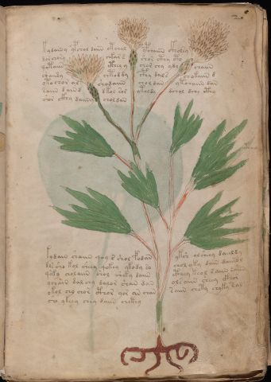

# Voynich Speculative Procedural Protocol — f2r

IMPORTANT: this is NOT a real or validated translation of the Voynich Manuscript. It is a speculative/procedural model that interprets EVA using a user-defined grammar to generate experimental recipes using safe, known edible substitutes.

This file is generated automatically from IVTFF/EVA transliteration plus a user-defined procedural grammar.



## Page / Folio
- currier: A
- folio: f2r
- page_number: 3
- section: herbal

## EVA Text (Transliteration)
```text
kydainy ypchol daiin otchal ypchaiin ckholsy
dorchory chkar s shor cthy cto
qotaiin cthey y chor chy ydy chaiin
c'oaiidy chtod dy cphy dals chokaiin d
otochor al shodaiin chol dan ytchaiin dan
saiin dain d dkol sor ytoldy dchol dchy cthy
shor ckhy daiiny chol dan
kydain shaiin qoy s shol fodan yksh olsheey daiildy
dls sho kol sheey qokey ykody so chol yky dain daiisol
qo'ky cholaiin shol sheky daiin cthey keol saiin e'a'iin
ychain dal chy dalor shan dan olsaiin sheey ckhor
okol chy chor cthor yor an chan saiin chety chyky sal
sho ykeey chey daiin chcthy
ytoail
ios an on
```

## Domain Context (Heuristic; Not a Translation)

This section summarizes recurring **basewords** in this IVTFF domain and shows simple substring evidence that the token markers used by the procedural grammar occur inside frequent words.

Any Italian anagram / English gloss is a best-effort lexicon match, not a decipherment.


### Associated basewords (non-generic; top by frequency in this domain)
- `daiin` (count=461) → Italian anagram `piani`; English: plans (arrangements)
- `okaiin` (count=59) → Italian anagram `coniai`; English: [n/a]
- `chaiin` (count=39) → Italian anagram `acini`; English: [n/a]
- `saiin` (count=37) → Italian anagram `asini`; English: [n/a]
- `qokaiin` (count=34) → Italian anagram `ciancio`; English: [n/a]
- `qokar` (count=29) → Italian anagram `carco`; English: [n/a]
- `odaiin` (count=27) → Italian anagram `inopia`; English: poverty
- `otchol` (count=25) → Italian anagram `colto`; English: cultivated
- `kaiin` (count=24) → Italian anagram `acini`; English: [n/a]
- `chodaiin` (count=24) → Italian anagram `apocini`; English: [n/a]
- `qotol` (count=20) → Italian anagram `colto`; English: cultivated
- `okain` (count=19) → Italian anagram `acino`; English: a berry
- `qotor` (count=18) → Italian anagram `corto`; English: short
- `ykaiin` (count=16) → Italian anagram `acini`; English: [n/a]
- `qodaiin` (count=15) → Italian anagram `apocini`; English: [n/a]

### Marker evidence (substring in frequent basewords)
- `qo`: 57 basewords; examples: `qotchy`, `qokchy`, `qokedy`, `qokaiin`, `qoky`, `qokol`
- `q`: 58 basewords; examples: `qotchy`, `qokchy`, `qokedy`, `qokaiin`, `qoky`, `qokol`
- `o`: 252 basewords; examples: `chol`, `o`, `chor`, `or`, `shol`, `ol`
- `k`: 142 basewords; examples: `okaiin`, `oky`, `chckhy`, `qokchy`, `qokedy`, `okal`
- `t`: 102 basewords; examples: `cthy`, `oty`, `qotchy`, `cthol`, `cthor`, `otaiin`
- `p`: 15 basewords; examples: `cphy`, `ypchedy`, `opchy`, `opchey`, `pchor`, `qopchy`
- `ch`: 138 basewords; examples: `chol`, `chor`, `chy`, `chey`, `chedy`, `chdy`
- `sh`: 46 basewords; examples: `shol`, `sho`, `shy`, `shor`, `shey`, `shedy`
- `f`: 1 basewords; examples: `f`
- `cth`: 17 basewords; examples: `cthy`, `cthol`, `cthor`, `cthey`, `chcthy`, `ctho`
- `ckh`: 15 basewords; examples: `chckhy`, `ckhy`, `ckhol`, `ckhey`, `checkhy`, `shckhy`
- `cph`: 2 basewords; examples: `cphy`, `cphol`
- `dy`: 78 basewords; examples: `dy`, `chedy`, `chdy`, `chody`, `qokedy`, `shedy`
- `iin`: 39 basewords; examples: `daiin`, `aiin`, `okaiin`, `chaiin`, `saiin`, `qokaiin`
- `aiin`: 32 basewords; examples: `daiin`, `aiin`, `okaiin`, `chaiin`, `saiin`, `qokaiin`

## Recipes Index (This Page)
- [f2r.1,@P0](#f2r-1-f2r-1-p0)
- [f2r.2,+P0](#f2r-2-f2r-2-p0)
- [f2r.3,+P0](#f2r-3-f2r-3-p0)
- [f2r.4,+P0](#f2r-4-f2r-4-p0)
- [f2r.5,+P0](#f2r-5-f2r-5-p0)
- [f2r.6,+P0](#f2r-6-f2r-6-p0)
- [f2r.7,+P0](#f2r-7-f2r-7-p0)
- [f2r.8,+P0](#f2r-8-f2r-8-p0)
- [f2r.9,+P0](#f2r-9-f2r-9-p0)
- [f2r.10,+P0](#f2r-10-f2r-10-p0)
- [f2r.11,+P0](#f2r-11-f2r-11-p0)
- [f2r.12,+P0](#f2r-12-f2r-12-p0)
- [f2r.13,+P0](#f2r-13-f2r-13-p0)
- [f2r.14,@Lp](#f2r-14-f2r-14-lp)
- [f2r.15,@L0](#f2r-15-f2r-15-l0)

## Line Glosses (Procedural Gloss Only; Not a Translation)

<a id="f2r-1-f2r-1-p0"></a>

### f2r.1,@P0

EVA: kydainy ypchol daiin otchal ypchaiin ckholsy

Direct Gloss (Procedural, Not a Real Translation):
- kydainy: add fermentable sugars → add starter / activate → duration level 1 → state: phase transition/start
- ypchol: add main plant (safe substitute) → mix / transfer → add starter / activate
- daiin: add starter / activate → duration level 1 → state: phase transition/start → long phase
- otchal: apply heat/cooking → add main plant (safe substitute) → mix / transfer → duration level 1 → state: phase transition/start
- ypchaiin: add main plant (safe substitute) → add starter / activate → duration level 1 → state: phase transition/start → long phase
- ckholsy: mix / transfer → add complex herbal compound (safe blend)

<a id="f2r-2-f2r-2-p0"></a>

### f2r.2,+P0

EVA: dorchory chkar s shor cthy cto

Direct Gloss (Procedural, Not a Real Translation):
- dorchory: add main plant (safe substitute) → mix / transfer → add starter / activate
- chkar: add fermentable sugars → add main plant (safe substitute) → duration level 1 → state: phase transition/start
- s: [unparsed]
- shor: add secondary herb (safe substitute) → mix / transfer
- cthy: add complex herbal compound (safe blend)
- cto: apply heat/cooking → mix / transfer

<a id="f2r-3-f2r-3-p0"></a>

### f2r.3,+P0

EVA: qotaiin cthey y chor chy ydy chaiin

Direct Gloss (Procedural, Not a Real Translation):
- qotaiin: prepare liquid base → apply heat/cooking → duration level 1 → state: phase transition/start → long phase
- cthey: add complex herbal compound (safe blend) → duration level 1 → state: active extraction
- y: [unparsed]
- chor: add main plant (safe substitute) → mix / transfer
- chy: add main plant (safe substitute)
- ydy: add starter / activate
- chaiin: add main plant (safe substitute) → duration level 1 → state: phase transition/start → long phase

<a id="f2r-4-f2r-4-p0"></a>

### f2r.4,+P0

EVA: c'oaiidy chtod dy cphy dals chokaiin d

Direct Gloss (Procedural, Not a Real Translation):
- c: [unparsed]
- oaiidy: mix / transfer → add starter / activate → duration level 1 → state: phase transition/start
- chtod: apply heat/cooking → add main plant (safe substitute) → mix / transfer → add starter / activate
- dy: add starter / activate
- cphy: add complex herbal compound (safe blend)
- dals: add starter / activate → duration level 1 → state: phase transition/start
- chokaiin: add fermentable sugars → add main plant (safe substitute) → mix / transfer → duration level 1 → state: phase transition/start → long phase
- d: add starter / activate

<a id="f2r-5-f2r-5-p0"></a>

### f2r.5,+P0

EVA: otochor al shodaiin chol dan ytchaiin dan

Direct Gloss (Procedural, Not a Real Translation):
- otochor: apply heat/cooking → add main plant (safe substitute) → mix / transfer
- al: duration level 1 → state: phase transition/start
- shodaiin: add secondary herb (safe substitute) → mix / transfer → add starter / activate → duration level 1 → state: phase transition/start → long phase
- chol: add main plant (safe substitute) → mix / transfer
- dan: add starter / activate → duration level 1 → state: phase transition/start
- ytchaiin: apply heat/cooking → add main plant (safe substitute) → duration level 1 → state: phase transition/start → long phase
- dan: add starter / activate → duration level 1 → state: phase transition/start

<a id="f2r-6-f2r-6-p0"></a>

### f2r.6,+P0

EVA: saiin dain d dkol sor ytoldy dchol dchy cthy

Direct Gloss (Procedural, Not a Real Translation):
- saiin: duration level 1 → state: phase transition/start → long phase
- dain: add starter / activate → duration level 1 → state: phase transition/start
- d: add starter / activate
- dkol: add fermentable sugars → mix / transfer → add starter / activate
- sor: mix / transfer
- ytoldy: apply heat/cooking → mix / transfer → add starter / activate
- dchol: add main plant (safe substitute) → mix / transfer → add starter / activate
- dchy: add main plant (safe substitute) → add starter / activate
- cthy: add complex herbal compound (safe blend)

<a id="f2r-7-f2r-7-p0"></a>

### f2r.7,+P0

EVA: shor ckhy daiiny chol dan

Direct Gloss (Procedural, Not a Real Translation):
- shor: add secondary herb (safe substitute) → mix / transfer
- ckhy: add complex herbal compound (safe blend)
- daiiny: add starter / activate → duration level 1 → state: phase transition/start → long phase
- chol: add main plant (safe substitute) → mix / transfer
- dan: add starter / activate → duration level 1 → state: phase transition/start

<a id="f2r-8-f2r-8-p0"></a>

### f2r.8,+P0

EVA: kydain shaiin qoy s shol fodan yksh olsheey daiildy

Direct Gloss (Procedural, Not a Real Translation):
- kydain: add fermentable sugars → add starter / activate → duration level 1 → state: phase transition/start
- shaiin: add secondary herb (safe substitute) → duration level 1 → state: phase transition/start → long phase
- qoy: prepare liquid base
- s: [unparsed]
- shol: add secondary herb (safe substitute) → mix / transfer
- fodan: add aroma modifier → mix / transfer → add starter / activate → duration level 1 → state: phase transition/start
- yksh: add fermentable sugars → add secondary herb (safe substitute)
- olsheey: add secondary herb (safe substitute) → mix / transfer → duration level 2 → state: active extraction
- daiildy: add starter / activate → duration level 1 → state: phase transition/start

<a id="f2r-9-f2r-9-p0"></a>

### f2r.9,+P0

EVA: dls sho kol sheey qokey ykody so chol yky dain daiisol

Direct Gloss (Procedural, Not a Real Translation):
- dls: add starter / activate
- sho: add secondary herb (safe substitute) → mix / transfer
- kol: add fermentable sugars → mix / transfer
- sheey: add secondary herb (safe substitute) → duration level 2 → state: active extraction
- qokey: prepare liquid base → add fermentable sugars → duration level 1 → state: active extraction
- ykody: add fermentable sugars → mix / transfer → add starter / activate
- so: mix / transfer
- chol: add main plant (safe substitute) → mix / transfer
- yky: add fermentable sugars
- dain: add starter / activate → duration level 1 → state: phase transition/start
- daiisol: mix / transfer → add starter / activate → duration level 1 → state: phase transition/start

<a id="f2r-10-f2r-10-p0"></a>

### f2r.10,+P0

EVA: qo'ky cholaiin shol sheky daiin cthey keol saiin e'a'iin

Direct Gloss (Procedural, Not a Real Translation):
- qo: prepare liquid base
- ky: add fermentable sugars
- cholaiin: add main plant (safe substitute) → mix / transfer → duration level 1 → state: phase transition/start → long phase
- shol: add secondary herb (safe substitute) → mix / transfer
- sheky: add fermentable sugars → add secondary herb (safe substitute) → duration level 1 → state: active extraction
- daiin: add starter / activate → duration level 1 → state: phase transition/start → long phase
- cthey: add complex herbal compound (safe blend) → duration level 1 → state: active extraction
- keol: add fermentable sugars → mix / transfer → duration level 1 → state: active extraction
- saiin: duration level 1 → state: phase transition/start → long phase
- e: duration level 1 → state: active extraction
- a: duration level 1 → state: phase transition/start
- iin: duration level 2 → state: cooling/rest → medium phase

<a id="f2r-11-f2r-11-p0"></a>

### f2r.11,+P0

EVA: ychain dal chy dalor shan dan olsaiin sheey ckhor

Direct Gloss (Procedural, Not a Real Translation):
- ychain: add main plant (safe substitute) → duration level 1 → state: phase transition/start
- dal: add starter / activate → duration level 1 → state: phase transition/start
- chy: add main plant (safe substitute)
- dalor: mix / transfer → add starter / activate → duration level 1 → state: phase transition/start
- shan: add secondary herb (safe substitute) → duration level 1 → state: phase transition/start
- dan: add starter / activate → duration level 1 → state: phase transition/start
- olsaiin: mix / transfer → duration level 1 → state: phase transition/start → long phase
- sheey: add secondary herb (safe substitute) → duration level 2 → state: active extraction
- ckhor: mix / transfer → add complex herbal compound (safe blend)

<a id="f2r-12-f2r-12-p0"></a>

### f2r.12,+P0

EVA: okol chy chor cthor yor an chan saiin chety chyky sal

Direct Gloss (Procedural, Not a Real Translation):
- okol: add fermentable sugars → mix / transfer
- chy: add main plant (safe substitute)
- chor: add main plant (safe substitute) → mix / transfer
- cthor: mix / transfer → add complex herbal compound (safe blend)
- yor: mix / transfer
- an: duration level 1 → state: phase transition/start
- chan: add main plant (safe substitute) → duration level 1 → state: phase transition/start
- saiin: duration level 1 → state: phase transition/start → long phase
- chety: apply heat/cooking → add main plant (safe substitute) → duration level 1 → state: active extraction
- chyky: add fermentable sugars → add main plant (safe substitute)
- sal: duration level 1 → state: phase transition/start

<a id="f2r-13-f2r-13-p0"></a>

### f2r.13,+P0

EVA: sho ykeey chey daiin chcthy

Direct Gloss (Procedural, Not a Real Translation):
- sho: add secondary herb (safe substitute) → mix / transfer
- ykeey: add fermentable sugars → duration level 2 → state: active extraction
- chey: add main plant (safe substitute) → duration level 1 → state: active extraction
- daiin: add starter / activate → duration level 1 → state: phase transition/start → long phase
- chcthy: add main plant (safe substitute) → add complex herbal compound (safe blend)

<a id="f2r-14-f2r-14-lp"></a>

### f2r.14,@Lp

EVA: ytoail

Direct Gloss (Procedural, Not a Real Translation):
- ytoail: apply heat/cooking → mix / transfer → duration level 1 → state: phase transition/start

<a id="f2r-15-f2r-15-l0"></a>

### f2r.15,@L0

EVA: ios an on

Direct Gloss (Procedural, Not a Real Translation):
- ios: mix / transfer → duration level 1 → state: cooling/rest
- an: duration level 1 → state: phase transition/start
- on: mix / transfer
