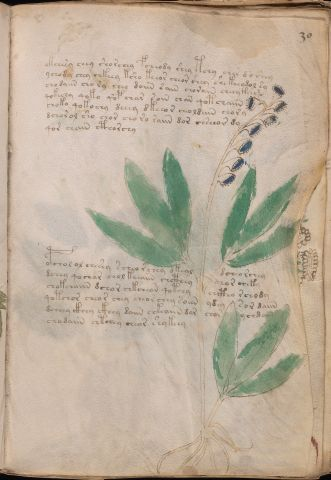

# Voynich Speculative Herbal Ferment Recipe — f30r

IMPORTANT: this is NOT a real or validated translation of the Voynich Manuscript. It is a speculative/procedural model that interprets EVA using a user-defined grammar to generate experimental recipes using safe, known edible substitutes.

This file is generated automatically from IVTFF/EVA transliteration plus a user-defined procedural grammar.



## Page / Folio
- currier: A
- folio: f30r
- page_number: 57
- section: herbal

## EVA Text (Transliteration)
```text
okeeesy chey shorchey fcheody shey tchy che[s:r] d o shey
ychody chey chkeey ksho keeor cheor shey she keeodol sy
chodaiin cho ry chey doiin sain chorain cheey keem
qokechy qoko qop char soin chan qot chaiin
choko qokochy deeey dkeeor cheoldain chory
dchorol sho chor cho ro raiin dor chseeor dy
qor chain cthorchy
opchol ol chesey scheo r chey okeal dcheo rchey
dchey qochar chol keeaiin chcthey chor cheky
chokchaiin dchor chkchean qotchy chctho rchody
qotchor cheor chey cheor chey so[eeb:een] ydey sor daiin
dcheey ckhey ckhey daiin chkeaiin dar chor ychdain
chodaiin chtchey chear shy keey
```

## Domain Context (Heuristic; Not a Translation)

This section summarizes recurring **basewords** in this IVTFF domain and shows simple substring evidence that the token markers used by the procedural grammar occur inside frequent words.

Any Italian anagram / English gloss is a best-effort lexicon match, not a decipherment.


### Associated basewords (non-generic; top by frequency in this domain)
- `daiin` (count=461) → Italian anagram `piani`; English: plans (arrangements)
- `okaiin` (count=59) → Italian anagram `coniai`; English: [n/a]
- `chaiin` (count=39) → Italian anagram `acini`; English: [n/a]
- `saiin` (count=37) → Italian anagram `asini`; English: [n/a]
- `qokaiin` (count=34) → Italian anagram `ciancio`; English: [n/a]
- `qokar` (count=29) → Italian anagram `carco`; English: [n/a]
- `odaiin` (count=27) → Italian anagram `inopia`; English: poverty
- `otchol` (count=25) → Italian anagram `colto`; English: cultivated
- `kaiin` (count=24) → Italian anagram `acini`; English: [n/a]
- `chodaiin` (count=24) → Italian anagram `apocini`; English: [n/a]
- `qotol` (count=20) → Italian anagram `colto`; English: cultivated
- `okain` (count=19) → Italian anagram `acino`; English: a berry
- `qotor` (count=18) → Italian anagram `corto`; English: short
- `ykaiin` (count=16) → Italian anagram `acini`; English: [n/a]
- `qodaiin` (count=15) → Italian anagram `apocini`; English: [n/a]

### Marker evidence (substring in frequent basewords)
- `qo`: 57 basewords; examples: `qotchy`, `qokchy`, `qokedy`, `qokaiin`, `qoky`, `qokol`
- `q`: 58 basewords; examples: `qotchy`, `qokchy`, `qokedy`, `qokaiin`, `qoky`, `qokol`
- `o`: 252 basewords; examples: `chol`, `o`, `chor`, `or`, `shol`, `ol`
- `k`: 142 basewords; examples: `okaiin`, `oky`, `chckhy`, `qokchy`, `qokedy`, `okal`
- `t`: 102 basewords; examples: `cthy`, `oty`, `qotchy`, `cthol`, `cthor`, `otaiin`
- `p`: 15 basewords; examples: `cphy`, `ypchedy`, `opchy`, `opchey`, `pchor`, `qopchy`
- `ch`: 138 basewords; examples: `chol`, `chor`, `chy`, `chey`, `chedy`, `chdy`
- `sh`: 46 basewords; examples: `shol`, `sho`, `shy`, `shor`, `shey`, `shedy`
- `f`: 1 basewords; examples: `f`
- `cth`: 17 basewords; examples: `cthy`, `cthol`, `cthor`, `cthey`, `chcthy`, `ctho`
- `ckh`: 15 basewords; examples: `chckhy`, `ckhy`, `ckhol`, `ckhey`, `checkhy`, `shckhy`
- `cph`: 2 basewords; examples: `cphy`, `cphol`
- `dy`: 78 basewords; examples: `dy`, `chedy`, `chdy`, `chody`, `qokedy`, `shedy`
- `iin`: 39 basewords; examples: `daiin`, `aiin`, `okaiin`, `chaiin`, `saiin`, `qokaiin`
- `aiin`: 32 basewords; examples: `daiin`, `aiin`, `okaiin`, `chaiin`, `saiin`, `qokaiin`

## Recipes Index (This Page)
- [f30r.1,@P0](#f30r-1-f30r-1-p0)
- [f30r.2,+P0](#f30r-2-f30r-2-p0)
- [f30r.3,+P0](#f30r-3-f30r-3-p0)
- [f30r.4,+P0](#f30r-4-f30r-4-p0)
- [f30r.5,+P0](#f30r-5-f30r-5-p0)
- [f30r.6,+P0](#f30r-6-f30r-6-p0)
- [f30r.7,+P0](#f30r-7-f30r-7-p0)
- [f30r.8,+P0](#f30r-8-f30r-8-p0)
- [f30r.9,+P0](#f30r-9-f30r-9-p0)
- [f30r.10,+P0](#f30r-10-f30r-10-p0)
- [f30r.11,+P0](#f30r-11-f30r-11-p0)
- [f30r.12,+P0](#f30r-12-f30r-12-p0)
- [f30r.13,+P0](#f30r-13-f30r-13-p0)

## Line Glosses (Procedural Gloss Only; Not a Translation)

<a id="f30r-1-f30r-1-p0"></a>

### f30r.1,@P0

EVA: okeeesy chey shorchey fcheody shey tchy che[s:r] d o shey

Direct Gloss (Procedural, Not a Real Translation):
- okeeesy: add fermentable sugars → mix / transfer → duration level 3 → state: active extraction
- chey: add main plant (safe substitute) → duration level 1 → state: active extraction
- shorchey: add main plant (safe substitute) → add secondary herb (safe substitute) → mix / transfer → duration level 1 → state: active extraction
- fcheody: add main plant (safe substitute) → add aroma modifier → mix / transfer → start fermentation (yeast) → duration level 1 → state: active extraction
- shey: add secondary herb (safe substitute) → duration level 1 → state: active extraction
- tchy: apply heat/cooking → add main plant (safe substitute)
- che: add main plant (safe substitute) → duration level 1 → state: active extraction
- s: [unparsed]
- r: [unparsed]
- d: start fermentation (yeast)
- o: mix / transfer
- shey: add secondary herb (safe substitute) → duration level 1 → state: active extraction

<a id="f30r-2-f30r-2-p0"></a>

### f30r.2,+P0

EVA: ychody chey chkeey ksho keeor cheor shey she keeodol sy

Direct Gloss (Procedural, Not a Real Translation):
- ychody: add main plant (safe substitute) → mix / transfer → start fermentation (yeast)
- chey: add main plant (safe substitute) → duration level 1 → state: active extraction
- chkeey: add fermentable sugars → add main plant (safe substitute) → duration level 2 → state: active extraction
- ksho: add fermentable sugars → add secondary herb (safe substitute) → mix / transfer
- keeor: add fermentable sugars → mix / transfer → duration level 2 → state: active extraction
- cheor: add main plant (safe substitute) → mix / transfer → duration level 1 → state: active extraction
- shey: add secondary herb (safe substitute) → duration level 1 → state: active extraction
- she: add secondary herb (safe substitute) → duration level 1 → state: active extraction
- keeodol: add fermentable sugars → mix / transfer → start fermentation (yeast) → duration level 2 → state: active extraction
- sy: [unparsed]

<a id="f30r-3-f30r-3-p0"></a>

### f30r.3,+P0

EVA: chodaiin cho ry chey doiin sain chorain cheey keem

Direct Gloss (Procedural, Not a Real Translation):
- chodaiin: add main plant (safe substitute) → mix / transfer → start fermentation (yeast) → duration level 1 → state: fermentation start → long fermentation / aging phase
- cho: add main plant (safe substitute) → mix / transfer
- ry: [unparsed]
- chey: add main plant (safe substitute) → duration level 1 → state: active extraction
- doiin: mix / transfer → start fermentation (yeast) → duration level 2 → state: cooling/rest → medium fermentation phase
- sain: duration level 1 → state: fermentation start
- chorain: add main plant (safe substitute) → mix / transfer → duration level 1 → state: fermentation start
- cheey: add main plant (safe substitute) → duration level 2 → state: active extraction
- keem: add fermentable sugars → duration level 2 → state: active extraction

<a id="f30r-4-f30r-4-p0"></a>

### f30r.4,+P0

EVA: qokechy qoko qop char soin chan qot chaiin

Direct Gloss (Procedural, Not a Real Translation):
- qokechy: prepare liquid base → add fermentable sugars → add main plant (safe substitute) → duration level 1 → state: active extraction
- qoko: prepare liquid base → add fermentable sugars → mix / transfer
- qop: prepare liquid base → start fermentation (yeast)
- char: add main plant (safe substitute) → duration level 1 → state: fermentation start
- soin: mix / transfer → duration level 1 → state: cooling/rest
- chan: add main plant (safe substitute) → duration level 1 → state: fermentation start
- qot: prepare liquid base → apply heat/cooking
- chaiin: add main plant (safe substitute) → duration level 1 → state: fermentation start → long fermentation / aging phase

<a id="f30r-5-f30r-5-p0"></a>

### f30r.5,+P0

EVA: choko qokochy deeey dkeeor cheoldain chory

Direct Gloss (Procedural, Not a Real Translation):
- choko: add fermentable sugars → add main plant (safe substitute) → mix / transfer
- qokochy: prepare liquid base → add fermentable sugars → add main plant (safe substitute) → mix / transfer
- deeey: start fermentation (yeast) → duration level 3 → state: active extraction
- dkeeor: add fermentable sugars → mix / transfer → start fermentation (yeast) → duration level 2 → state: active extraction
- cheoldain: add main plant (safe substitute) → mix / transfer → start fermentation (yeast) → duration level 1 → state: active extraction
- chory: add main plant (safe substitute) → mix / transfer

<a id="f30r-6-f30r-6-p0"></a>

### f30r.6,+P0

EVA: dchorol sho chor cho ro raiin dor chseeor dy

Direct Gloss (Procedural, Not a Real Translation):
- dchorol: add main plant (safe substitute) → mix / transfer → start fermentation (yeast)
- sho: add secondary herb (safe substitute) → mix / transfer
- chor: add main plant (safe substitute) → mix / transfer
- cho: add main plant (safe substitute) → mix / transfer
- ro: mix / transfer
- raiin: duration level 1 → state: fermentation start → long fermentation / aging phase
- dor: mix / transfer → start fermentation (yeast)
- chseeor: add main plant (safe substitute) → mix / transfer → duration level 2 → state: active extraction
- dy: start fermentation (yeast)

<a id="f30r-7-f30r-7-p0"></a>

### f30r.7,+P0

EVA: qor chain cthorchy

Direct Gloss (Procedural, Not a Real Translation):
- qor: prepare liquid base
- chain: add main plant (safe substitute) → duration level 1 → state: fermentation start
- cthorchy: add main plant (safe substitute) → mix / transfer → add complex herbal compound (safe blend)

<a id="f30r-8-f30r-8-p0"></a>

### f30r.8,+P0

EVA: opchol ol chesey scheo r chey okeal dcheo rchey

Direct Gloss (Procedural, Not a Real Translation):
- opchol: add main plant (safe substitute) → mix / transfer → start fermentation (yeast)
- ol: mix / transfer
- chesey: add main plant (safe substitute) → duration level 1 → state: active extraction
- scheo: add main plant (safe substitute) → mix / transfer → duration level 1 → state: active extraction
- r: [unparsed]
- chey: add main plant (safe substitute) → duration level 1 → state: active extraction
- okeal: add fermentable sugars → mix / transfer → duration level 1 → state: active extraction
- dcheo: add main plant (safe substitute) → mix / transfer → start fermentation (yeast) → duration level 1 → state: active extraction
- rchey: add main plant (safe substitute) → duration level 1 → state: active extraction

<a id="f30r-9-f30r-9-p0"></a>

### f30r.9,+P0

EVA: dchey qochar chol keeaiin chcthey chor cheky

Direct Gloss (Procedural, Not a Real Translation):
- dchey: add main plant (safe substitute) → start fermentation (yeast) → duration level 1 → state: active extraction
- qochar: prepare liquid base → add main plant (safe substitute) → duration level 1 → state: fermentation start
- chol: add main plant (safe substitute) → mix / transfer
- keeaiin: add fermentable sugars → duration level 2 → state: active extraction → long fermentation / aging phase
- chcthey: add main plant (safe substitute) → add complex herbal compound (safe blend) → duration level 1 → state: active extraction
- chor: add main plant (safe substitute) → mix / transfer
- cheky: add fermentable sugars → add main plant (safe substitute) → duration level 1 → state: active extraction

<a id="f30r-10-f30r-10-p0"></a>

### f30r.10,+P0

EVA: chokchaiin dchor chkchean qotchy chctho rchody

Direct Gloss (Procedural, Not a Real Translation):
- chokchaiin: add fermentable sugars → add main plant (safe substitute) → mix / transfer → duration level 1 → state: fermentation start → long fermentation / aging phase
- dchor: add main plant (safe substitute) → mix / transfer → start fermentation (yeast)
- chkchean: add fermentable sugars → add main plant (safe substitute) → duration level 1 → state: active extraction
- qotchy: prepare liquid base → apply heat/cooking → add main plant (safe substitute)
- chctho: add main plant (safe substitute) → mix / transfer → add complex herbal compound (safe blend)
- rchody: add main plant (safe substitute) → mix / transfer → start fermentation (yeast)

<a id="f30r-11-f30r-11-p0"></a>

### f30r.11,+P0

EVA: qotchor cheor chey cheor chey so[eeb:een] ydey sor daiin

Direct Gloss (Procedural, Not a Real Translation):
- qotchor: prepare liquid base → apply heat/cooking → add main plant (safe substitute) → mix / transfer
- cheor: add main plant (safe substitute) → mix / transfer → duration level 1 → state: active extraction
- chey: add main plant (safe substitute) → duration level 1 → state: active extraction
- cheor: add main plant (safe substitute) → mix / transfer → duration level 1 → state: active extraction
- chey: add main plant (safe substitute) → duration level 1 → state: active extraction
- so: mix / transfer
- eeb: duration level 2 → state: active extraction
- een: duration level 2 → state: active extraction
- ydey: start fermentation (yeast) → duration level 1 → state: active extraction
- sor: mix / transfer
- daiin: start fermentation (yeast) → duration level 1 → state: fermentation start → long fermentation / aging phase

<a id="f30r-12-f30r-12-p0"></a>

### f30r.12,+P0

EVA: dcheey ckhey ckhey daiin chkeaiin dar chor ychdain

Direct Gloss (Procedural, Not a Real Translation):
- dcheey: add main plant (safe substitute) → start fermentation (yeast) → duration level 2 → state: active extraction
- ckhey: add complex herbal compound (safe blend) → duration level 1 → state: active extraction
- ckhey: add complex herbal compound (safe blend) → duration level 1 → state: active extraction
- daiin: start fermentation (yeast) → duration level 1 → state: fermentation start → long fermentation / aging phase
- chkeaiin: add fermentable sugars → add main plant (safe substitute) → duration level 1 → state: active extraction → long fermentation / aging phase
- dar: start fermentation (yeast) → duration level 1 → state: fermentation start
- chor: add main plant (safe substitute) → mix / transfer
- ychdain: add main plant (safe substitute) → start fermentation (yeast) → duration level 1 → state: fermentation start

<a id="f30r-13-f30r-13-p0"></a>

### f30r.13,+P0

EVA: chodaiin chtchey chear shy keey

Direct Gloss (Procedural, Not a Real Translation):
- chodaiin: add main plant (safe substitute) → mix / transfer → start fermentation (yeast) → duration level 1 → state: fermentation start → long fermentation / aging phase
- chtchey: apply heat/cooking → add main plant (safe substitute) → duration level 1 → state: active extraction
- chear: add main plant (safe substitute) → duration level 1 → state: active extraction
- shy: add secondary herb (safe substitute)
- keey: add fermentable sugars → duration level 2 → state: active extraction
