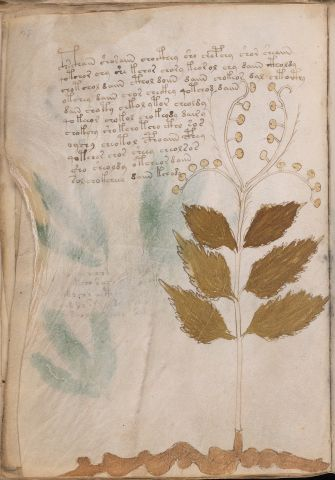

# Voynich Speculative Herbal Ferment Recipe — f30v

IMPORTANT: this is NOT a real or validated translation of the Voynich Manuscript. It is a speculative/procedural model that interprets EVA using a user-defined grammar to generate experimental recipes using safe, known edible substitutes.

This file is generated automatically from IVTFF/EVA transliteration plus a user-defined procedural grammar.



## Page / Folio
- currier: A
- folio: f30v
- page_number: 58
- section: herbal

## EVA Text (Transliteration)
```text
c@132;hsc@133;hain shosaiin chocthey sho chepchy shor sheaiin
qotchor chy she kchor chory keor ol chy daiin ctholdy
chotchol daiin cthol doiin daiin chokeor dal chto[ith:cth]y
otchey daiin chor checkhy qotchod daiin
dain choty chkol ytor cheoldy
qokeeor chokol chokeody dair y
ch[a:o]kchy sho kcho tcho ctho sos
oyshy cheotol cphoaiin cphey
qotchor chor sheey cheolsos
sho sheoldy otcheor daiin
sol chokcheey daiin kchydy
```

## Recipes Index (This Page)
- [f30v.1,@P0](#f30v-1-f30v-1-p0)
- [f30v.2,+P0](#f30v-2-f30v-2-p0)
- [f30v.3,+P0](#f30v-3-f30v-3-p0)
- [f30v.4,+P0](#f30v-4-f30v-4-p0)
- [f30v.5,+P0](#f30v-5-f30v-5-p0)
- [f30v.6,+P0](#f30v-6-f30v-6-p0)
- [f30v.7,+P0](#f30v-7-f30v-7-p0)
- [f30v.8,+P0](#f30v-8-f30v-8-p0)
- [f30v.9,+P0](#f30v-9-f30v-9-p0)
- [f30v.10,+P0](#f30v-10-f30v-10-p0)
- [f30v.11,+P0](#f30v-11-f30v-11-p0)

## Line Glosses (Procedural Gloss Only; Not a Translation)

<a id="f30v-1-f30v-1-p0"></a>

### f30v.1,@P0

EVA: c@132;hsc@133;hain shosaiin chocthey sho chepchy shor sheaiin

Direct Gloss (Procedural, Not a Real Translation):
- c: [unparsed]
- hsc: [unparsed]
- hain: duration level 1 → state: fermentation start
- shosaiin: add secondary herb (safe substitute) → mix / transfer → duration level 1 → state: fermentation start → long fermentation / aging phase
- chocthey: add main plant (safe substitute) → mix / transfer → add complex herbal compound (safe blend) → duration level 1 → state: active extraction
- sho: add secondary herb (safe substitute) → mix / transfer
- chepchy: add main plant (safe substitute) → start fermentation (yeast) → duration level 1 → state: active extraction
- shor: add secondary herb (safe substitute) → mix / transfer
- sheaiin: add secondary herb (safe substitute) → duration level 1 → state: active extraction → long fermentation / aging phase

<a id="f30v-2-f30v-2-p0"></a>

### f30v.2,+P0

EVA: qotchor chy she kchor chory keor ol chy daiin ctholdy

Direct Gloss (Procedural, Not a Real Translation):
- qotchor: prepare liquid base → apply heat/cooking → add main plant (safe substitute) → mix / transfer
- chy: add main plant (safe substitute)
- she: add secondary herb (safe substitute) → duration level 1 → state: active extraction
- kchor: add fermentable sugars → add main plant (safe substitute) → mix / transfer
- chory: add main plant (safe substitute) → mix / transfer
- keor: add fermentable sugars → mix / transfer → duration level 1 → state: active extraction
- ol: mix / transfer
- chy: add main plant (safe substitute)
- daiin: start fermentation (yeast) → duration level 1 → state: fermentation start → long fermentation / aging phase
- ctholdy: mix / transfer → start fermentation (yeast) → add complex herbal compound (safe blend)

<a id="f30v-3-f30v-3-p0"></a>

### f30v.3,+P0

EVA: chotchol daiin cthol doiin daiin chokeor dal chto[ith:cth]y

Direct Gloss (Procedural, Not a Real Translation):
- chotchol: apply heat/cooking → add main plant (safe substitute) → mix / transfer
- daiin: start fermentation (yeast) → duration level 1 → state: fermentation start → long fermentation / aging phase
- cthol: mix / transfer → add complex herbal compound (safe blend)
- doiin: mix / transfer → start fermentation (yeast) → duration level 2 → state: cooling/rest → medium fermentation phase
- daiin: start fermentation (yeast) → duration level 1 → state: fermentation start → long fermentation / aging phase
- chokeor: add fermentable sugars → add main plant (safe substitute) → mix / transfer → duration level 1 → state: active extraction
- dal: start fermentation (yeast) → duration level 1 → state: fermentation start
- chto: apply heat/cooking → add main plant (safe substitute) → mix / transfer
- ith: apply heat/cooking → duration level 1 → state: cooling/rest
- cth: add complex herbal compound (safe blend)
- y: [unparsed]

<a id="f30v-4-f30v-4-p0"></a>

### f30v.4,+P0

EVA: otchey daiin chor checkhy qotchod daiin

Direct Gloss (Procedural, Not a Real Translation):
- otchey: apply heat/cooking → add main plant (safe substitute) → mix / transfer → duration level 1 → state: active extraction
- daiin: start fermentation (yeast) → duration level 1 → state: fermentation start → long fermentation / aging phase
- chor: add main plant (safe substitute) → mix / transfer
- checkhy: add main plant (safe substitute) → add complex herbal compound (safe blend) → duration level 1 → state: active extraction
- qotchod: prepare liquid base → apply heat/cooking → add main plant (safe substitute) → mix / transfer → start fermentation (yeast)
- daiin: start fermentation (yeast) → duration level 1 → state: fermentation start → long fermentation / aging phase

<a id="f30v-5-f30v-5-p0"></a>

### f30v.5,+P0

EVA: dain choty chkol ytor cheoldy

Direct Gloss (Procedural, Not a Real Translation):
- dain: start fermentation (yeast) → duration level 1 → state: fermentation start
- choty: apply heat/cooking → add main plant (safe substitute) → mix / transfer
- chkol: add fermentable sugars → add main plant (safe substitute) → mix / transfer
- ytor: apply heat/cooking → mix / transfer
- cheoldy: add main plant (safe substitute) → mix / transfer → start fermentation (yeast) → duration level 1 → state: active extraction

<a id="f30v-6-f30v-6-p0"></a>

### f30v.6,+P0

EVA: qokeeor chokol chokeody dair y

Direct Gloss (Procedural, Not a Real Translation):
- qokeeor: prepare liquid base → add fermentable sugars → mix / transfer → duration level 2 → state: active extraction
- chokol: add fermentable sugars → add main plant (safe substitute) → mix / transfer
- chokeody: add fermentable sugars → add main plant (safe substitute) → mix / transfer → start fermentation (yeast) → duration level 1 → state: active extraction
- dair: start fermentation (yeast) → duration level 1 → state: fermentation start
- y: [unparsed]

<a id="f30v-7-f30v-7-p0"></a>

### f30v.7,+P0

EVA: ch[a:o]kchy sho kcho tcho ctho sos

Direct Gloss (Procedural, Not a Real Translation):
- ch: add main plant (safe substitute)
- a: duration level 1 → state: fermentation start
- o: mix / transfer
- kchy: add fermentable sugars → add main plant (safe substitute)
- sho: add secondary herb (safe substitute) → mix / transfer
- kcho: add fermentable sugars → add main plant (safe substitute) → mix / transfer
- tcho: apply heat/cooking → add main plant (safe substitute) → mix / transfer
- ctho: mix / transfer → add complex herbal compound (safe blend)
- sos: mix / transfer

<a id="f30v-8-f30v-8-p0"></a>

### f30v.8,+P0

EVA: oyshy cheotol cphoaiin cphey

Direct Gloss (Procedural, Not a Real Translation):
- oyshy: add secondary herb (safe substitute) → mix / transfer
- cheotol: apply heat/cooking → add main plant (safe substitute) → mix / transfer → duration level 1 → state: active extraction
- cphoaiin: mix / transfer → add complex herbal compound (safe blend) → duration level 1 → state: fermentation start → long fermentation / aging phase
- cphey: add complex herbal compound (safe blend) → duration level 1 → state: active extraction

<a id="f30v-9-f30v-9-p0"></a>

### f30v.9,+P0

EVA: qotchor chor sheey cheolsos

Direct Gloss (Procedural, Not a Real Translation):
- qotchor: prepare liquid base → apply heat/cooking → add main plant (safe substitute) → mix / transfer
- chor: add main plant (safe substitute) → mix / transfer
- sheey: add secondary herb (safe substitute) → duration level 2 → state: active extraction
- cheolsos: add main plant (safe substitute) → mix / transfer → duration level 1 → state: active extraction

<a id="f30v-10-f30v-10-p0"></a>

### f30v.10,+P0

EVA: sho sheoldy otcheor daiin

Direct Gloss (Procedural, Not a Real Translation):
- sho: add secondary herb (safe substitute) → mix / transfer
- sheoldy: add secondary herb (safe substitute) → mix / transfer → start fermentation (yeast) → duration level 1 → state: active extraction
- otcheor: apply heat/cooking → add main plant (safe substitute) → mix / transfer → duration level 1 → state: active extraction
- daiin: start fermentation (yeast) → duration level 1 → state: fermentation start → long fermentation / aging phase

<a id="f30v-11-f30v-11-p0"></a>

### f30v.11,+P0

EVA: sol chokcheey daiin kchydy

Direct Gloss (Procedural, Not a Real Translation):
- sol: mix / transfer
- chokcheey: add fermentable sugars → add main plant (safe substitute) → mix / transfer → duration level 2 → state: active extraction
- daiin: start fermentation (yeast) → duration level 1 → state: fermentation start → long fermentation / aging phase
- kchydy: add fermentable sugars → add main plant (safe substitute) → start fermentation (yeast)
