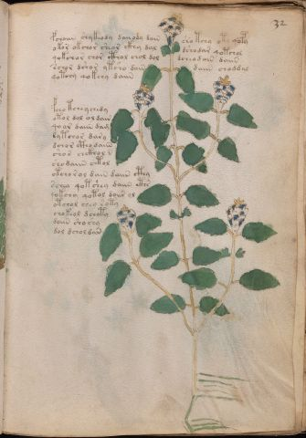

# Voynich Speculative Procedural Protocol — f32r

IMPORTANT: this is NOT a real or validated translation of the Voynich Manuscript. It is a speculative/procedural model that interprets EVA using a user-defined grammar to generate experimental recipes using safe, known edible substitutes.

This file is generated automatically from IVTFF/EVA transliteration plus a user-defined procedural grammar.



## Page / Folio
- currier: A
- folio: f32r
- page_number: 61
- section: herbal

## EVA Text (Transliteration)
```text
fchaiin shykeody daiiody dain sho tchy oty qopy
okor okchor sheor ckhy dal dshodar qotchol
qokchor chor cthol chol dol dcheodain daiin
schor dsh[o:a]r ytsho dain daiin choddal
qotchy qokchy daiin
fcho tcheychedy
otol dol ol dair
qo ar daiin dam
dytchor dary
dchor ctho daiin
shos chckhol n
shodaiin @150;tol
otcho rol dain daiin cthy
schey qot shey daiin cths
qokchy qotol doiir ol
otchol chey soty
chokeol dchoty
doiin sho shy
dol dchol dan
```

## Domain Context (Heuristic; Not a Translation)

This section summarizes recurring **basewords** in this IVTFF domain and shows simple substring evidence that the token markers used by the procedural grammar occur inside frequent words.

Any Italian anagram / English gloss is a best-effort lexicon match, not a decipherment.


### Associated basewords (non-generic; top by frequency in this domain)
- `daiin` (count=461) → Italian anagram `piani`; English: plans (arrangements)
- `okaiin` (count=59) → Italian anagram `coniai`; English: [n/a]
- `chaiin` (count=39) → Italian anagram `acini`; English: [n/a]
- `saiin` (count=37) → Italian anagram `asini`; English: [n/a]
- `qokaiin` (count=34) → Italian anagram `ciancio`; English: [n/a]
- `qokar` (count=29) → Italian anagram `carco`; English: [n/a]
- `odaiin` (count=27) → Italian anagram `inopia`; English: poverty
- `otchol` (count=25) → Italian anagram `colto`; English: cultivated
- `kaiin` (count=24) → Italian anagram `acini`; English: [n/a]
- `chodaiin` (count=24) → Italian anagram `apocini`; English: [n/a]
- `qotol` (count=20) → Italian anagram `colto`; English: cultivated
- `okain` (count=19) → Italian anagram `acino`; English: a berry
- `qotor` (count=18) → Italian anagram `corto`; English: short
- `ykaiin` (count=16) → Italian anagram `acini`; English: [n/a]
- `qodaiin` (count=15) → Italian anagram `apocini`; English: [n/a]

### Marker evidence (substring in frequent basewords)
- `qo`: 57 basewords; examples: `qotchy`, `qokchy`, `qokedy`, `qokaiin`, `qoky`, `qokol`
- `q`: 58 basewords; examples: `qotchy`, `qokchy`, `qokedy`, `qokaiin`, `qoky`, `qokol`
- `o`: 252 basewords; examples: `chol`, `o`, `chor`, `or`, `shol`, `ol`
- `k`: 142 basewords; examples: `okaiin`, `oky`, `chckhy`, `qokchy`, `qokedy`, `okal`
- `t`: 102 basewords; examples: `cthy`, `oty`, `qotchy`, `cthol`, `cthor`, `otaiin`
- `p`: 15 basewords; examples: `cphy`, `ypchedy`, `opchy`, `opchey`, `pchor`, `qopchy`
- `ch`: 138 basewords; examples: `chol`, `chor`, `chy`, `chey`, `chedy`, `chdy`
- `sh`: 46 basewords; examples: `shol`, `sho`, `shy`, `shor`, `shey`, `shedy`
- `f`: 1 basewords; examples: `f`
- `cth`: 17 basewords; examples: `cthy`, `cthol`, `cthor`, `cthey`, `chcthy`, `ctho`
- `ckh`: 15 basewords; examples: `chckhy`, `ckhy`, `ckhol`, `ckhey`, `checkhy`, `shckhy`
- `cph`: 2 basewords; examples: `cphy`, `cphol`
- `dy`: 78 basewords; examples: `dy`, `chedy`, `chdy`, `chody`, `qokedy`, `shedy`
- `iin`: 39 basewords; examples: `daiin`, `aiin`, `okaiin`, `chaiin`, `saiin`, `qokaiin`
- `aiin`: 32 basewords; examples: `daiin`, `aiin`, `okaiin`, `chaiin`, `saiin`, `qokaiin`

## Recipes Index (This Page)
- [f32r.1,@P0](#f32r-1-f32r-1-p0)
- [f32r.2,+P0](#f32r-2-f32r-2-p0)
- [f32r.3,+P0](#f32r-3-f32r-3-p0)
- [f32r.4,+P0](#f32r-4-f32r-4-p0)
- [f32r.5,+P0](#f32r-5-f32r-5-p0)
- [f32r.6,+P0](#f32r-6-f32r-6-p0)
- [f32r.7,+P0](#f32r-7-f32r-7-p0)
- [f32r.8,+P0](#f32r-8-f32r-8-p0)
- [f32r.9,+P0](#f32r-9-f32r-9-p0)
- [f32r.10,+P0](#f32r-10-f32r-10-p0)
- [f32r.11,+P0](#f32r-11-f32r-11-p0)
- [f32r.12,+P0](#f32r-12-f32r-12-p0)
- [f32r.13,+P0](#f32r-13-f32r-13-p0)
- [f32r.14,+P0](#f32r-14-f32r-14-p0)
- [f32r.15,+P0](#f32r-15-f32r-15-p0)
- [f32r.16,+P0](#f32r-16-f32r-16-p0)
- [f32r.17,+P0](#f32r-17-f32r-17-p0)
- [f32r.18,+P0](#f32r-18-f32r-18-p0)
- [f32r.19,+P0](#f32r-19-f32r-19-p0)

## Line Glosses (Procedural Gloss Only; Not a Translation)

<a id="f32r-1-f32r-1-p0"></a>

### f32r.1,@P0

EVA: fchaiin shykeody daiiody dain sho tchy oty qopy

Direct Gloss (Procedural, Not a Real Translation):
- fchaiin: add main plant (safe substitute) → add aroma modifier → duration level 1 → state: phase transition/start → long phase
- shykeody: add fermentable sugars → add secondary herb (safe substitute) → mix / transfer → add starter / activate → duration level 1 → state: active extraction
- daiiody: mix / transfer → add starter / activate → duration level 1 → state: phase transition/start
- dain: add starter / activate → duration level 1 → state: phase transition/start
- sho: add secondary herb (safe substitute) → mix / transfer
- tchy: apply heat/cooking → add main plant (safe substitute)
- oty: apply heat/cooking → mix / transfer
- qopy: prepare liquid base → add starter / activate

<a id="f32r-2-f32r-2-p0"></a>

### f32r.2,+P0

EVA: okor okchor sheor ckhy dal dshodar qotchol

Direct Gloss (Procedural, Not a Real Translation):
- okor: add fermentable sugars → mix / transfer
- okchor: add fermentable sugars → add main plant (safe substitute) → mix / transfer
- sheor: add secondary herb (safe substitute) → mix / transfer → duration level 1 → state: active extraction
- ckhy: add complex herbal compound (safe blend)
- dal: add starter / activate → duration level 1 → state: phase transition/start
- dshodar: add secondary herb (safe substitute) → mix / transfer → add starter / activate → duration level 1 → state: phase transition/start
- qotchol: prepare liquid base → apply heat/cooking → add main plant (safe substitute) → mix / transfer

<a id="f32r-3-f32r-3-p0"></a>

### f32r.3,+P0

EVA: qokchor chor cthol chol dol dcheodain daiin

Direct Gloss (Procedural, Not a Real Translation):
- qokchor: prepare liquid base → add fermentable sugars → add main plant (safe substitute) → mix / transfer
- chor: add main plant (safe substitute) → mix / transfer
- cthol: mix / transfer → add complex herbal compound (safe blend)
- chol: add main plant (safe substitute) → mix / transfer
- dol: mix / transfer → add starter / activate
- dcheodain: add main plant (safe substitute) → mix / transfer → add starter / activate → duration level 1 → state: active extraction
- daiin: add starter / activate → duration level 1 → state: phase transition/start → long phase

<a id="f32r-4-f32r-4-p0"></a>

### f32r.4,+P0

EVA: schor dsh[o:a]r ytsho dain daiin choddal

Direct Gloss (Procedural, Not a Real Translation):
- schor: add main plant (safe substitute) → mix / transfer
- dsh: add secondary herb (safe substitute) → add starter / activate
- o: mix / transfer
- a: duration level 1 → state: phase transition/start
- r: [unparsed]
- ytsho: apply heat/cooking → add secondary herb (safe substitute) → mix / transfer
- dain: add starter / activate → duration level 1 → state: phase transition/start
- daiin: add starter / activate → duration level 1 → state: phase transition/start → long phase
- choddal: add main plant (safe substitute) → mix / transfer → add starter / activate → duration level 1 → state: phase transition/start

<a id="f32r-5-f32r-5-p0"></a>

### f32r.5,+P0

EVA: qotchy qokchy daiin

Direct Gloss (Procedural, Not a Real Translation):
- qotchy: prepare liquid base → apply heat/cooking → add main plant (safe substitute)
- qokchy: prepare liquid base → add fermentable sugars → add main plant (safe substitute)
- daiin: add starter / activate → duration level 1 → state: phase transition/start → long phase

<a id="f32r-6-f32r-6-p0"></a>

### f32r.6,+P0

EVA: fcho tcheychedy

Direct Gloss (Procedural, Not a Real Translation):
- fcho: add main plant (safe substitute) → add aroma modifier → mix / transfer
- tcheychedy: apply heat/cooking → add main plant (safe substitute) → add starter / activate → duration level 1 → state: active extraction

<a id="f32r-7-f32r-7-p0"></a>

### f32r.7,+P0

EVA: otol dol ol dair

Direct Gloss (Procedural, Not a Real Translation):
- otol: apply heat/cooking → mix / transfer
- dol: mix / transfer → add starter / activate
- ol: mix / transfer
- dair: add starter / activate → duration level 1 → state: phase transition/start

<a id="f32r-8-f32r-8-p0"></a>

### f32r.8,+P0

EVA: qo ar daiin dam

Direct Gloss (Procedural, Not a Real Translation):
- qo: prepare liquid base
- ar: duration level 1 → state: phase transition/start
- daiin: add starter / activate → duration level 1 → state: phase transition/start → long phase
- dam: add starter / activate → duration level 1 → state: phase transition/start

<a id="f32r-9-f32r-9-p0"></a>

### f32r.9,+P0

EVA: dytchor dary

Direct Gloss (Procedural, Not a Real Translation):
- dytchor: apply heat/cooking → add main plant (safe substitute) → mix / transfer → add starter / activate
- dary: add starter / activate → duration level 1 → state: phase transition/start

<a id="f32r-10-f32r-10-p0"></a>

### f32r.10,+P0

EVA: dchor ctho daiin

Direct Gloss (Procedural, Not a Real Translation):
- dchor: add main plant (safe substitute) → mix / transfer → add starter / activate
- ctho: mix / transfer → add complex herbal compound (safe blend)
- daiin: add starter / activate → duration level 1 → state: phase transition/start → long phase

<a id="f32r-11-f32r-11-p0"></a>

### f32r.11,+P0

EVA: shos chckhol n

Direct Gloss (Procedural, Not a Real Translation):
- shos: add secondary herb (safe substitute) → mix / transfer
- chckhol: add main plant (safe substitute) → mix / transfer → add complex herbal compound (safe blend)
- n: [unparsed]

<a id="f32r-12-f32r-12-p0"></a>

### f32r.12,+P0

EVA: shodaiin @150;tol

Direct Gloss (Procedural, Not a Real Translation):
- shodaiin: add secondary herb (safe substitute) → mix / transfer → add starter / activate → duration level 1 → state: phase transition/start → long phase
- tol: apply heat/cooking → mix / transfer

<a id="f32r-13-f32r-13-p0"></a>

### f32r.13,+P0

EVA: otcho rol dain daiin cthy

Direct Gloss (Procedural, Not a Real Translation):
- otcho: apply heat/cooking → add main plant (safe substitute) → mix / transfer
- rol: mix / transfer
- dain: add starter / activate → duration level 1 → state: phase transition/start
- daiin: add starter / activate → duration level 1 → state: phase transition/start → long phase
- cthy: add complex herbal compound (safe blend)

<a id="f32r-14-f32r-14-p0"></a>

### f32r.14,+P0

EVA: schey qot shey daiin cths

Direct Gloss (Procedural, Not a Real Translation):
- schey: add main plant (safe substitute) → duration level 1 → state: active extraction
- qot: prepare liquid base → apply heat/cooking
- shey: add secondary herb (safe substitute) → duration level 1 → state: active extraction
- daiin: add starter / activate → duration level 1 → state: phase transition/start → long phase
- cths: add complex herbal compound (safe blend)

<a id="f32r-15-f32r-15-p0"></a>

### f32r.15,+P0

EVA: qokchy qotol doiir ol

Direct Gloss (Procedural, Not a Real Translation):
- qokchy: prepare liquid base → add fermentable sugars → add main plant (safe substitute)
- qotol: prepare liquid base → apply heat/cooking → mix / transfer
- doiir: mix / transfer → add starter / activate → duration level 2 → state: cooling/rest
- ol: mix / transfer

<a id="f32r-16-f32r-16-p0"></a>

### f32r.16,+P0

EVA: otchol chey soty

Direct Gloss (Procedural, Not a Real Translation):
- otchol: apply heat/cooking → add main plant (safe substitute) → mix / transfer
- chey: add main plant (safe substitute) → duration level 1 → state: active extraction
- soty: apply heat/cooking → mix / transfer

<a id="f32r-17-f32r-17-p0"></a>

### f32r.17,+P0

EVA: chokeol dchoty

Direct Gloss (Procedural, Not a Real Translation):
- chokeol: add fermentable sugars → add main plant (safe substitute) → mix / transfer → duration level 1 → state: active extraction
- dchoty: apply heat/cooking → add main plant (safe substitute) → mix / transfer → add starter / activate

<a id="f32r-18-f32r-18-p0"></a>

### f32r.18,+P0

EVA: doiin sho shy

Direct Gloss (Procedural, Not a Real Translation):
- doiin: mix / transfer → add starter / activate → duration level 2 → state: cooling/rest → medium phase
- sho: add secondary herb (safe substitute) → mix / transfer
- shy: add secondary herb (safe substitute)

<a id="f32r-19-f32r-19-p0"></a>

### f32r.19,+P0

EVA: dol dchol dan

Direct Gloss (Procedural, Not a Real Translation):
- dol: mix / transfer → add starter / activate
- dchol: add main plant (safe substitute) → mix / transfer → add starter / activate
- dan: add starter / activate → duration level 1 → state: phase transition/start
