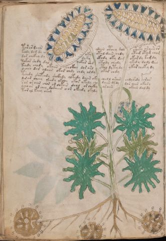

# Voynich Speculative Herbal Ferment Recipe — f33v

IMPORTANT: this is NOT a real or validated translation of the Voynich Manuscript. It is a speculative/procedural model that interprets EVA using a user-defined grammar to generate experimental recipes using safe, known edible substitutes.

This file is generated automatically from IVTFF/EVA transliteration plus a user-defined procedural grammar.



## Page / Folio
- currier: B
- folio: f33v
- page_number: 64
- section: herbal

## EVA Text (Transliteration)
```text
tar ar daiin ydain cthey dols sheky ar aiin cs
kchdy dam dy oky otal dain chdy ytam otam cham
dar chckhy dy dyky ckhdy oky d[a:ch]m okar dy kam dy
tokar shdy dal qokar shd otody chedy ykedy dodl dain
tchdy chody okaiin chckhy dor arl cthy dy ty dy ykar cheky dy
ycheo dar olaiin okar chdy chdy oldy okar chdy
tshdy shefchdy shckhdy oltedy daiin oky cheol orain chdyshdy porar
dar ar sheey keedy okchy okar okedy chy daiin dy' dy dar aiin okary
sar or aiin chor or shkair shol or chckhy ar aiin okain dal dy
lcho ar or chey lodaiin o or okeedy okaly
tar al keey oram
```

## Recipes Index (This Page)
- [f33v.1,@P0](#f33v-1-f33v-1-p0)
- [f33v.2,+P0](#f33v-2-f33v-2-p0)
- [f33v.3,+P0](#f33v-3-f33v-3-p0)
- [f33v.4,+P0](#f33v-4-f33v-4-p0)
- [f33v.5,+P0](#f33v-5-f33v-5-p0)
- [f33v.6,+P0](#f33v-6-f33v-6-p0)
- [f33v.7,+P0](#f33v-7-f33v-7-p0)
- [f33v.8,+P0](#f33v-8-f33v-8-p0)
- [f33v.9,+P0](#f33v-9-f33v-9-p0)
- [f33v.10,+P0](#f33v-10-f33v-10-p0)
- [f33v.11,+P0](#f33v-11-f33v-11-p0)

## Line Glosses (Procedural Gloss Only; Not a Translation)

<a id="f33v-1-f33v-1-p0"></a>

### f33v.1,@P0

EVA: tar ar daiin ydain cthey dols sheky ar aiin cs

Direct Gloss (Procedural, Not a Real Translation):
- tar: apply heat/cooking → duration level 1 → state: fermentation start
- ar: duration level 1 → state: fermentation start
- daiin: start fermentation (yeast) → duration level 1 → state: fermentation start → long fermentation / aging phase
- ydain: start fermentation (yeast) → duration level 1 → state: fermentation start
- cthey: add complex herbal compound (safe blend) → duration level 1 → state: active extraction
- dols: mix / transfer → start fermentation (yeast)
- sheky: add fermentable sugars → add secondary herb (safe substitute) → duration level 1 → state: active extraction
- ar: duration level 1 → state: fermentation start
- aiin: duration level 1 → state: fermentation start → long fermentation / aging phase
- cs: [unparsed]

<a id="f33v-2-f33v-2-p0"></a>

### f33v.2,+P0

EVA: kchdy dam dy oky otal dain chdy ytam otam cham

Direct Gloss (Procedural, Not a Real Translation):
- kchdy: add fermentable sugars → add main plant (safe substitute) → start fermentation (yeast)
- dam: start fermentation (yeast) → duration level 1 → state: fermentation start
- dy: start fermentation (yeast)
- oky: add fermentable sugars → mix / transfer
- otal: apply heat/cooking → mix / transfer → duration level 1 → state: fermentation start
- dain: start fermentation (yeast) → duration level 1 → state: fermentation start
- chdy: add main plant (safe substitute) → start fermentation (yeast)
- ytam: apply heat/cooking → duration level 1 → state: fermentation start
- otam: apply heat/cooking → mix / transfer → duration level 1 → state: fermentation start
- cham: add main plant (safe substitute) → duration level 1 → state: fermentation start

<a id="f33v-3-f33v-3-p0"></a>

### f33v.3,+P0

EVA: dar chckhy dy dyky ckhdy oky d[a:ch]m okar dy kam dy

Direct Gloss (Procedural, Not a Real Translation):
- dar: start fermentation (yeast) → duration level 1 → state: fermentation start
- chckhy: add main plant (safe substitute) → add complex herbal compound (safe blend)
- dy: start fermentation (yeast)
- dyky: add fermentable sugars → start fermentation (yeast)
- ckhdy: start fermentation (yeast) → add complex herbal compound (safe blend)
- oky: add fermentable sugars → mix / transfer
- d: start fermentation (yeast)
- a: duration level 1 → state: fermentation start
- ch: add main plant (safe substitute)
- m: [unparsed]
- okar: add fermentable sugars → mix / transfer → duration level 1 → state: fermentation start
- dy: start fermentation (yeast)
- kam: add fermentable sugars → duration level 1 → state: fermentation start
- dy: start fermentation (yeast)

<a id="f33v-4-f33v-4-p0"></a>

### f33v.4,+P0

EVA: tokar shdy dal qokar shd otody chedy ykedy dodl dain

Direct Gloss (Procedural, Not a Real Translation):
- tokar: add fermentable sugars → apply heat/cooking → mix / transfer → duration level 1 → state: fermentation start
- shdy: add secondary herb (safe substitute) → start fermentation (yeast)
- dal: start fermentation (yeast) → duration level 1 → state: fermentation start
- qokar: prepare liquid base → add fermentable sugars → duration level 1 → state: fermentation start
- shd: add secondary herb (safe substitute) → start fermentation (yeast)
- otody: apply heat/cooking → mix / transfer → start fermentation (yeast)
- chedy: add main plant (safe substitute) → start fermentation (yeast) → duration level 1 → state: active extraction
- ykedy: add fermentable sugars → start fermentation (yeast) → duration level 1 → state: active extraction
- dodl: mix / transfer → start fermentation (yeast)
- dain: start fermentation (yeast) → duration level 1 → state: fermentation start

<a id="f33v-5-f33v-5-p0"></a>

### f33v.5,+P0

EVA: tchdy chody okaiin chckhy dor arl cthy dy ty dy ykar cheky dy

Direct Gloss (Procedural, Not a Real Translation):
- tchdy: apply heat/cooking → add main plant (safe substitute) → start fermentation (yeast)
- chody: add main plant (safe substitute) → mix / transfer → start fermentation (yeast)
- okaiin: add fermentable sugars → mix / transfer → duration level 1 → state: fermentation start → long fermentation / aging phase
- chckhy: add main plant (safe substitute) → add complex herbal compound (safe blend)
- dor: mix / transfer → start fermentation (yeast)
- arl: duration level 1 → state: fermentation start
- cthy: add complex herbal compound (safe blend)
- dy: start fermentation (yeast)
- ty: apply heat/cooking
- dy: start fermentation (yeast)
- ykar: add fermentable sugars → duration level 1 → state: fermentation start
- cheky: add fermentable sugars → add main plant (safe substitute) → duration level 1 → state: active extraction
- dy: start fermentation (yeast)

<a id="f33v-6-f33v-6-p0"></a>

### f33v.6,+P0

EVA: ycheo dar olaiin okar chdy chdy oldy okar chdy

Direct Gloss (Procedural, Not a Real Translation):
- ycheo: add main plant (safe substitute) → mix / transfer → duration level 1 → state: active extraction
- dar: start fermentation (yeast) → duration level 1 → state: fermentation start
- olaiin: mix / transfer → duration level 1 → state: fermentation start → long fermentation / aging phase
- okar: add fermentable sugars → mix / transfer → duration level 1 → state: fermentation start
- chdy: add main plant (safe substitute) → start fermentation (yeast)
- chdy: add main plant (safe substitute) → start fermentation (yeast)
- oldy: mix / transfer → start fermentation (yeast)
- okar: add fermentable sugars → mix / transfer → duration level 1 → state: fermentation start
- chdy: add main plant (safe substitute) → start fermentation (yeast)

<a id="f33v-7-f33v-7-p0"></a>

### f33v.7,+P0

EVA: tshdy shefchdy shckhdy oltedy daiin oky cheol orain chdyshdy porar

Direct Gloss (Procedural, Not a Real Translation):
- tshdy: apply heat/cooking → add secondary herb (safe substitute) → start fermentation (yeast)
- shefchdy: add main plant (safe substitute) → add secondary herb (safe substitute) → add aroma modifier → start fermentation (yeast) → duration level 1 → state: active extraction
- shckhdy: add secondary herb (safe substitute) → start fermentation (yeast) → add complex herbal compound (safe blend)
- oltedy: apply heat/cooking → mix / transfer → start fermentation (yeast) → duration level 1 → state: active extraction
- daiin: start fermentation (yeast) → duration level 1 → state: fermentation start → long fermentation / aging phase
- oky: add fermentable sugars → mix / transfer
- cheol: add main plant (safe substitute) → mix / transfer → duration level 1 → state: active extraction
- orain: mix / transfer → duration level 1 → state: fermentation start
- chdyshdy: add main plant (safe substitute) → add secondary herb (safe substitute) → start fermentation (yeast)
- porar: mix / transfer → start fermentation (yeast) → duration level 1 → state: fermentation start

<a id="f33v-8-f33v-8-p0"></a>

### f33v.8,+P0

EVA: dar ar sheey keedy okchy okar okedy chy daiin dy' dy dar aiin okary

Direct Gloss (Procedural, Not a Real Translation):
- dar: start fermentation (yeast) → duration level 1 → state: fermentation start
- ar: duration level 1 → state: fermentation start
- sheey: add secondary herb (safe substitute) → duration level 2 → state: active extraction
- keedy: add fermentable sugars → start fermentation (yeast) → duration level 2 → state: active extraction
- okchy: add fermentable sugars → add main plant (safe substitute) → mix / transfer
- okar: add fermentable sugars → mix / transfer → duration level 1 → state: fermentation start
- okedy: add fermentable sugars → mix / transfer → start fermentation (yeast) → duration level 1 → state: active extraction
- chy: add main plant (safe substitute)
- daiin: start fermentation (yeast) → duration level 1 → state: fermentation start → long fermentation / aging phase
- dy: start fermentation (yeast)
- dy: start fermentation (yeast)
- dar: start fermentation (yeast) → duration level 1 → state: fermentation start
- aiin: duration level 1 → state: fermentation start → long fermentation / aging phase
- okary: add fermentable sugars → mix / transfer → duration level 1 → state: fermentation start

<a id="f33v-9-f33v-9-p0"></a>

### f33v.9,+P0

EVA: sar or aiin chor or shkair shol or chckhy ar aiin okain dal dy

Direct Gloss (Procedural, Not a Real Translation):
- sar: duration level 1 → state: fermentation start
- or: mix / transfer
- aiin: duration level 1 → state: fermentation start → long fermentation / aging phase
- chor: add main plant (safe substitute) → mix / transfer
- or: mix / transfer
- shkair: add fermentable sugars → add secondary herb (safe substitute) → duration level 1 → state: fermentation start
- shol: add secondary herb (safe substitute) → mix / transfer
- or: mix / transfer
- chckhy: add main plant (safe substitute) → add complex herbal compound (safe blend)
- ar: duration level 1 → state: fermentation start
- aiin: duration level 1 → state: fermentation start → long fermentation / aging phase
- okain: add fermentable sugars → mix / transfer → duration level 1 → state: fermentation start
- dal: start fermentation (yeast) → duration level 1 → state: fermentation start
- dy: start fermentation (yeast)

<a id="f33v-10-f33v-10-p0"></a>

### f33v.10,+P0

EVA: lcho ar or chey lodaiin o or okeedy okaly

Direct Gloss (Procedural, Not a Real Translation):
- lcho: add main plant (safe substitute) → mix / transfer
- ar: duration level 1 → state: fermentation start
- or: mix / transfer
- chey: add main plant (safe substitute) → duration level 1 → state: active extraction
- lodaiin: mix / transfer → start fermentation (yeast) → duration level 1 → state: fermentation start → long fermentation / aging phase
- o: mix / transfer
- or: mix / transfer
- okeedy: add fermentable sugars → mix / transfer → start fermentation (yeast) → duration level 2 → state: active extraction
- okaly: add fermentable sugars → mix / transfer → duration level 1 → state: fermentation start

<a id="f33v-11-f33v-11-p0"></a>

### f33v.11,+P0

EVA: tar al keey oram

Direct Gloss (Procedural, Not a Real Translation):
- tar: apply heat/cooking → duration level 1 → state: fermentation start
- al: duration level 1 → state: fermentation start
- keey: add fermentable sugars → duration level 2 → state: active extraction
- oram: mix / transfer → duration level 1 → state: fermentation start
