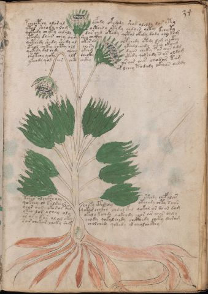

# Voynich Speculative Procedural Protocol — f34r

IMPORTANT: this is NOT a real or validated translation of the Voynich Manuscript. It is a speculative/procedural model that interprets EVA using a user-defined grammar to generate experimental recipes using safe, known edible substitutes.

This file is generated automatically from IVTFF/EVA transliteration plus a user-defined procedural grammar.



## Page / Folio
- currier: B
- folio: f34r
- page_number: 65
- section: herbal

## EVA Text (Transliteration)
```text
pcheoepchy olar yl yfody okedody shod ololdy dar ytey
ytar sheody o lam octhedy otedy chdain oltey kchy ty
qotedy chyty chdaly dar chd otedy qotol okedy dody ody kam
ytedy daiin chey aiin shy chckhy<~>oltchedy otedy dam checthy
qoteedy shedy shedy ol okes ar<~>ykeed l chedy otey okaiin
oteol chekey chetey oll chesy<~>daiin cheky fas aiir a[m:d]g
qokedy dal chdy olchy ykch[y:?]<~>ykedy qokchdy s as oldam
ch'otchy qoky olk checkhy<~>ys air air chodar ta[m:g]
ykchdy qod ar chct a[ikh:ckh]y<~>or lchey todaly okaiin dardy
tcheo olchckhy oly otchdy chefalchhs
qokeey sh kaldaiin cheky cthdaly otchedy chty s aiin
char aiin okor ar tol qokar chckhy chdal ked qokar ar daiin dam
ykeo lor ochey oly okaly kechdy qokchdy chor ar aiiin daly
or ar y kar ol al oky chody qokal chedy chcthedy cheky daram
sair chekar cheky shek cholchedy qokedy yk cheolchcthy
```

## Domain Context (Heuristic; Not a Translation)

This section summarizes recurring **basewords** in this IVTFF domain and shows simple substring evidence that the token markers used by the procedural grammar occur inside frequent words.

Any Italian anagram / English gloss is a best-effort lexicon match, not a decipherment.


### Associated basewords (non-generic; top by frequency in this domain)
- `paiin` (count=477) → Italian anagram `piani`; English: plans (arrangements)
- `okaiin` (count=59) → Italian anagram `coniai`; English: [n/a]
- `qokep` (count=41) → Italian anagram `pecco`; English: [n/a]
- `saiin` (count=40) → Italian anagram `asini`; English: [n/a]
- `kaiin` (count=40) → Italian anagram `acini`; English: [n/a]
- `chaiin` (count=39) → Italian anagram `acini`; English: [n/a]
- `qokaiin` (count=34) → Italian anagram `ciancio`; English: [n/a]
- `qokar` (count=29) → Italian anagram `carco`; English: [n/a]
- `opaiin` (count=29) → Italian anagram `inopia`; English: poverty
- `otchol` (count=25) → Italian anagram `colto`; English: cultivated
- `chopaiin` (count=24) → Italian anagram `apocini`; English: [n/a]
- `qotol` (count=20) → Italian anagram `colto`; English: cultivated
- `okain` (count=19) → Italian anagram `acino`; English: a berry
- `qotor` (count=18) → Italian anagram `corto`; English: short
- `qopaiin` (count=15) → Italian anagram `apocini`; English: [n/a]

### Marker evidence (substring in frequent basewords)
- `qo`: 58 basewords; examples: `qotch`, `qok`, `qot`, `qokch`, `qokep`, `qokaiin`
- `q`: 59 basewords; examples: `qotch`, `qok`, `qot`, `qokch`, `qokep`, `qokaiin`
- `o`: 274 basewords; examples: `chol`, `o`, `chor`, `or`, `shol`, `ol`
- `k`: 146 basewords; examples: `ok`, `k`, `okaiin`, `kch`, `chckh`, `qok`
- `t`: 101 basewords; examples: `cth`, `ot`, `t`, `qotch`, `cthol`, `qot`
- `p`: 152 basewords; examples: `paiin`, `p`, `par`, `pain`, `pal`, `chep`
- `ch`: 145 basewords; examples: `chol`, `chor`, `ch`, `che`, `chep`, `cho`
- `sh`: 51 basewords; examples: `shol`, `sh`, `sho`, `shor`, `she`, `shep`
- `f`: 2 basewords; examples: `fchep`, `f`
- `cth`: 18 basewords; examples: `cth`, `cthol`, `cthor`, `cthe`, `chcth`, `ctho`
- `ckh`: 18 basewords; examples: `chckh`, `ckh`, `ckhe`, `ckhol`, `shckh`, `checkh`
- `cph`: 3 basewords; examples: `cph`, `cphol`, `cphe`
- `iin`: 39 basewords; examples: `paiin`, `aiin`, `okaiin`, `saiin`, `kaiin`, `chaiin`
- `aiin`: 31 basewords; examples: `paiin`, `aiin`, `okaiin`, `saiin`, `kaiin`, `chaiin`

## Recipes Index (This Page)
- [f34r.1,@P0](#f34r-1-f34r-1-p0)
- [f34r.2,+P0](#f34r-2-f34r-2-p0)
- [f34r.3,+P0](#f34r-3-f34r-3-p0)
- [f34r.4,+P0](#f34r-4-f34r-4-p0)
- [f34r.5,+P0](#f34r-5-f34r-5-p0)
- [f34r.6,+P0](#f34r-6-f34r-6-p0)
- [f34r.7,+P0](#f34r-7-f34r-7-p0)
- [f34r.8,+P0](#f34r-8-f34r-8-p0)
- [f34r.9,+P0](#f34r-9-f34r-9-p0)
- [f34r.10,+P0](#f34r-10-f34r-10-p0)
- [f34r.11,+P0](#f34r-11-f34r-11-p0)
- [f34r.12,+P0](#f34r-12-f34r-12-p0)
- [f34r.13,+P0](#f34r-13-f34r-13-p0)
- [f34r.14,+P0](#f34r-14-f34r-14-p0)
- [f34r.15,+P0](#f34r-15-f34r-15-p0)

## Line Glosses (Procedural Gloss Only; Not a Translation)

<a id="f34r-1-f34r-1-p0"></a>

### f34r.1,@P0

EVA (original line):
```text
pcheoepchy olar yl yfody okedody shod ololdy dar ytey
```

English structural gloss (generated):

- pcheoepchy: tokens: p ch e o e p ch → vowel_run: e (level 1; class e)
- olar: tokens: o l a r → connectors: l r → vowel_run: a (level 1; class a)
- yl: tokens: l → connectors: l
- yfody: tokens: f o p
- okedody: tokens: o k e p o p → vowel_run: e (level 1; class e)
- shod: tokens: sh o p
- ololdy: tokens: o l o l p → connectors: l l
- dar: tokens: p a r → connectors: r → vowel_run: a (level 1; class a)
- ytey: tokens: t e → vowel_run: e (level 1; class e)

<a id="f34r-2-f34r-2-p0"></a>

### f34r.2,+P0

EVA (original line):
```text
ytar sheody o lam octhedy otedy chdain oltey kchy ty
```

English structural gloss (generated):

- ytar: tokens: t a r → connectors: r → vowel_run: a (level 1; class a)
- sheody: tokens: sh e o p → vowel_run: e (level 1; class e)
- o: tokens: o
- lam: tokens: l a m → connectors: l m → vowel_run: a (level 1; class a)
- octhedy: tokens: o cth e p → vowel_run: e (level 1; class e)
- otedy: tokens: o t e p → vowel_run: e (level 1; class e)
- chdain: tokens: ch p a i n → connectors: n → vowel_run: a (level 1; class a)
- oltey: tokens: o l t e → connectors: l → vowel_run: e (level 1; class e)
- kchy: tokens: k ch
- ty: tokens: t

<a id="f34r-3-f34r-3-p0"></a>

### f34r.3,+P0

EVA (original line):
```text
qotedy chyty chdaly dar chd otedy qotol okedy dody ody kam
```

English structural gloss (generated):

- qotedy: tokens: qo t e p → vowel_run: e (level 1; class e)
- chyty: tokens: ch t
- chdaly: tokens: ch p a l → connectors: l → vowel_run: a (level 1; class a)
- dar: tokens: p a r → connectors: r → vowel_run: a (level 1; class a)
- chd: tokens: ch p
- otedy: tokens: o t e p → vowel_run: e (level 1; class e)
- qotol: tokens: qo t o l → connectors: l (lexicon-context: `qotol` → `colto`; cultivated)
- okedy: tokens: o k e p → vowel_run: e (level 1; class e)
- dody: tokens: p o p
- ody: tokens: o p
- kam: tokens: k a m → connectors: m → vowel_run: a (level 1; class a)

<a id="f34r-4-f34r-4-p0"></a>

### f34r.4,+P0

EVA (original line):
```text
ytedy daiin chey aiin shy chckhy<~>oltchedy otedy dam checthy
```

English structural gloss (generated):

- ytedy: tokens: t e p → vowel_run: e (level 1; class e)
- daiin: tokens: p aiin → vowel_run: a (level 1; class a) → suffix: aiin (lexicon-context: `paiin` → `piani`; plans (arrangements))
- chey: tokens: ch e → vowel_run: e (level 1; class e)
- aiin: tokens: aiin → vowel_run: a (level 1; class a) → suffix: aiin
- shy: tokens: sh
- chckhy: tokens: ch ckh
- oltchedy: tokens: o l t ch e p → connectors: l → vowel_run: e (level 1; class e)
- otedy: tokens: o t e p → vowel_run: e (level 1; class e)
- dam: tokens: p a m → connectors: m → vowel_run: a (level 1; class a)
- checthy: tokens: ch e cth → vowel_run: e (level 1; class e)

<a id="f34r-5-f34r-5-p0"></a>

### f34r.5,+P0

EVA (original line):
```text
qoteedy shedy shedy ol okes ar<~>ykeed l chedy otey okaiin
```

English structural gloss (generated):

- qoteedy: tokens: qo t ee p → vowel_run: ee (level 2; class e)
- shedy: tokens: sh e p → vowel_run: e (level 1; class e)
- shedy: tokens: sh e p → vowel_run: e (level 1; class e)
- ol: tokens: o l → connectors: l
- okes: tokens: o k e s → connectors: s → vowel_run: e (level 1; class e)
- ar: tokens: a r → connectors: r → vowel_run: a (level 1; class a)
- ykeed: tokens: k ee p → vowel_run: ee (level 2; class e)
- l: tokens: l → connectors: l
- chedy: tokens: ch e p → vowel_run: e (level 1; class e)
- otey: tokens: o t e → vowel_run: e (level 1; class e)
- okaiin: tokens: o k aiin → vowel_run: a (level 1; class a) → suffix: aiin (lexicon-context: `okaiin` → `coniai`; [n/a])

<a id="f34r-6-f34r-6-p0"></a>

### f34r.6,+P0

EVA (original line):
```text
oteol chekey chetey oll chesy<~>daiin cheky fas aiir a[m:d]g
```

English structural gloss (generated):

- oteol: tokens: o t e o l → connectors: l → vowel_run: e (level 1; class e)
- chekey: tokens: ch e k e → vowel_run: e (level 1; class e)
- chetey: tokens: ch e t e → vowel_run: e (level 1; class e)
- oll: tokens: o l l → connectors: l l
- chesy: tokens: ch e s → connectors: s → vowel_run: e (level 1; class e)
- daiin: tokens: p aiin → vowel_run: a (level 1; class a) → suffix: aiin (lexicon-context: `paiin` → `piani`; plans (arrangements))
- cheky: tokens: ch e k → vowel_run: e (level 1; class e)
- fas: tokens: f a s → connectors: s → vowel_run: a (level 1; class a)
- aiir: tokens: a ii r → connectors: r → vowel_run: a (level 1; class a)
- a: tokens: a → vowel_run: a (level 1; class a)
- m: tokens: m → connectors: m
- d: tokens: p
- g: tokens: g

<a id="f34r-7-f34r-7-p0"></a>

### f34r.7,+P0

EVA (original line):
```text
qokedy dal chdy olchy ykch[y:?]<~>ykedy qokchdy s as oldam
```

English structural gloss (generated):

- qokedy: tokens: qo k e p → vowel_run: e (level 1; class e) (lexicon-context: `qokep` → `pecco`; [n/a])
- dal: tokens: p a l → connectors: l → vowel_run: a (level 1; class a)
- chdy: tokens: ch p
- olchy: tokens: o l ch → connectors: l
- ykch: tokens: k ch
- y: [unparsed]
- ykedy: tokens: k e p → vowel_run: e (level 1; class e)
- qokchdy: tokens: qo k ch p
- s: tokens: s → connectors: s
- as: tokens: a s → connectors: s → vowel_run: a (level 1; class a)
- oldam: tokens: o l p a m → connectors: l m → vowel_run: a (level 1; class a)

<a id="f34r-8-f34r-8-p0"></a>

### f34r.8,+P0

EVA (original line):
```text
ch'otchy qoky olk checkhy<~>ys air air chodar ta[m:g]
```

English structural gloss (generated):

- ch: tokens: ch
- otchy: tokens: o t ch
- qoky: tokens: qo k
- olk: tokens: o l k → connectors: l
- checkhy: tokens: ch e ckh → vowel_run: e (level 1; class e)
- ys: tokens: s → connectors: s
- air: tokens: a i r → connectors: r → vowel_run: a (level 1; class a)
- air: tokens: a i r → connectors: r → vowel_run: a (level 1; class a)
- chodar: tokens: ch o p a r → connectors: r → vowel_run: a (level 1; class a)
- ta: tokens: t a → vowel_run: a (level 1; class a)
- m: tokens: m → connectors: m
- g: tokens: g

<a id="f34r-9-f34r-9-p0"></a>

### f34r.9,+P0

EVA (original line):
```text
ykchdy qod ar chct a[ikh:ckh]y<~>or lchey todaly okaiin dardy
```

English structural gloss (generated):

- ykchdy: tokens: k ch p
- qod: tokens: qo p
- ar: tokens: a r → connectors: r → vowel_run: a (level 1; class a)
- chct: tokens: ch c t
- a: tokens: a → vowel_run: a (level 1; class a)
- ikh: tokens: i k h → vowel_run: i (level 1; class i) → unmodeled_tokens: h
- ckh: tokens: ckh
- y: [unparsed]
- or: tokens: o r → connectors: r
- lchey: tokens: l ch e → connectors: l → vowel_run: e (level 1; class e)
- todaly: tokens: t o p a l → connectors: l → vowel_run: a (level 1; class a)
- okaiin: tokens: o k aiin → vowel_run: a (level 1; class a) → suffix: aiin (lexicon-context: `okaiin` → `coniai`; [n/a])
- dardy: tokens: p a r p → connectors: r → vowel_run: a (level 1; class a)

<a id="f34r-10-f34r-10-p0"></a>

### f34r.10,+P0

EVA (original line):
```text
tcheo olchckhy oly otchdy chefalchhs
```

English structural gloss (generated):

- tcheo: tokens: t ch e o → vowel_run: e (level 1; class e)
- olchckhy: tokens: o l ch ckh → connectors: l
- oly: tokens: o l → connectors: l
- otchdy: tokens: o t ch p
- chefalchhs: tokens: ch e f a l ch h s → connectors: l s → vowel_run: e (level 1; class e) → unmodeled_tokens: h

<a id="f34r-11-f34r-11-p0"></a>

### f34r.11,+P0

EVA (original line):
```text
qokeey sh kaldaiin cheky cthdaly otchedy chty s aiin
```

English structural gloss (generated):

- qokeey: tokens: qo k ee → vowel_run: ee (level 2; class e)
- sh: tokens: sh
- kaldaiin: tokens: k a l p aiin → connectors: l → vowel_run: a (level 1; class a) → suffix: aiin (lexicon-context: `paiin` → `piani`; plans (arrangements))
- cheky: tokens: ch e k → vowel_run: e (level 1; class e)
- cthdaly: tokens: cth p a l → connectors: l → vowel_run: a (level 1; class a)
- otchedy: tokens: o t ch e p → vowel_run: e (level 1; class e)
- chty: tokens: ch t
- s: tokens: s → connectors: s
- aiin: tokens: aiin → vowel_run: a (level 1; class a) → suffix: aiin

<a id="f34r-12-f34r-12-p0"></a>

### f34r.12,+P0

EVA (original line):
```text
char aiin okor ar tol qokar chckhy chdal ked qokar ar daiin dam
```

English structural gloss (generated):

- char: tokens: ch a r → connectors: r → vowel_run: a (level 1; class a)
- aiin: tokens: aiin → vowel_run: a (level 1; class a) → suffix: aiin
- okor: tokens: o k o r → connectors: r
- ar: tokens: a r → connectors: r → vowel_run: a (level 1; class a)
- tol: tokens: t o l → connectors: l
- qokar: tokens: qo k a r → connectors: r → vowel_run: a (level 1; class a)
- chckhy: tokens: ch ckh
- chdal: tokens: ch p a l → connectors: l → vowel_run: a (level 1; class a)
- ked: tokens: k e p → vowel_run: e (level 1; class e)
- qokar: tokens: qo k a r → connectors: r → vowel_run: a (level 1; class a)
- ar: tokens: a r → connectors: r → vowel_run: a (level 1; class a)
- daiin: tokens: p aiin → vowel_run: a (level 1; class a) → suffix: aiin (lexicon-context: `paiin` → `piani`; plans (arrangements))
- dam: tokens: p a m → connectors: m → vowel_run: a (level 1; class a)

<a id="f34r-13-f34r-13-p0"></a>

### f34r.13,+P0

EVA (original line):
```text
ykeo lor ochey oly okaly kechdy qokchdy chor ar aiiin daly
```

English structural gloss (generated):

- ykeo: tokens: k e o → vowel_run: e (level 1; class e)
- lor: tokens: l o r → connectors: l r
- ochey: tokens: o ch e → vowel_run: e (level 1; class e)
- oly: tokens: o l → connectors: l
- okaly: tokens: o k a l → connectors: l → vowel_run: a (level 1; class a)
- kechdy: tokens: k e ch p → vowel_run: e (level 1; class e)
- qokchdy: tokens: qo k ch p
- chor: tokens: ch o r → connectors: r
- ar: tokens: a r → connectors: r → vowel_run: a (level 1; class a)
- aiiin: tokens: a iii n → connectors: n → vowel_run: a (level 1; class a) → suffix: iin
- daly: tokens: p a l → connectors: l → vowel_run: a (level 1; class a)

<a id="f34r-14-f34r-14-p0"></a>

### f34r.14,+P0

EVA (original line):
```text
or ar y kar ol al oky chody qokal chedy chcthedy cheky daram
```

English structural gloss (generated):

- or: tokens: o r → connectors: r
- ar: tokens: a r → connectors: r → vowel_run: a (level 1; class a)
- y: [unparsed]
- kar: tokens: k a r → connectors: r → vowel_run: a (level 1; class a)
- ol: tokens: o l → connectors: l
- al: tokens: a l → connectors: l → vowel_run: a (level 1; class a)
- oky: tokens: o k
- chody: tokens: ch o p
- qokal: tokens: qo k a l → connectors: l → vowel_run: a (level 1; class a) (lexicon-context: `qokal` → `calco`; cast (of sculpture))
- chedy: tokens: ch e p → vowel_run: e (level 1; class e)
- chcthedy: tokens: ch cth e p → vowel_run: e (level 1; class e)
- cheky: tokens: ch e k → vowel_run: e (level 1; class e)
- daram: tokens: p a r a m → connectors: r m → vowel_run: a (level 1; class a)

<a id="f34r-15-f34r-15-p0"></a>

### f34r.15,+P0

EVA (original line):
```text
sair chekar cheky shek cholchedy qokedy yk cheolchcthy
```

English structural gloss (generated):

- sair: tokens: s a i r → connectors: s r → vowel_run: a (level 1; class a)
- chekar: tokens: ch e k a r → connectors: r → vowel_run: e (level 1; class e)
- cheky: tokens: ch e k → vowel_run: e (level 1; class e)
- shek: tokens: sh e k → vowel_run: e (level 1; class e)
- cholchedy: tokens: ch o l ch e p → connectors: l → vowel_run: e (level 1; class e)
- qokedy: tokens: qo k e p → vowel_run: e (level 1; class e) (lexicon-context: `qokep` → `pecco`; [n/a])
- yk: tokens: k
- cheolchcthy: tokens: ch e o l ch cth → connectors: l → vowel_run: e (level 1; class e)
