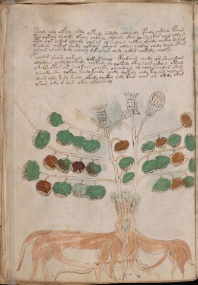

# Voynich Speculative Procedural Protocol — f34v

IMPORTANT: this is NOT a real or validated translation of the Voynich Manuscript. It is a speculative/procedural model that interprets EVA using a user-defined grammar to generate experimental recipes using safe, known edible substitutes.

This file is generated automatically from IVTFF/EVA transliteration plus a user-defined procedural grammar.



## Page / Folio
- currier: B
- folio: f34v
- page_number: 66
- section: herbal

## EVA Text (Transliteration)
```text
k[e':s]chdy chdy chefchy shdy qopchdy shdydy chdalchdy ypchdy chcthdy spaiin
tol qokchy dychedy okchy chckhdy chdaiin ckhy loees ykar aiin oldam
ytal shor chdal olchdy char or ol kedaiiin chcthy okchdy chckhy dasam
tchdaiin chekal shedy qokedar chdaiin oldar qoldar chedy daiin otam
lshaiir or air shedy chechey dykey kair chedy qokar chekaly ch[a:o]lky
pchedar shear qokchdy qokees cheol ypchdaiin chedy lr ar chedain
olchdaiin chedy chey keedy chy kedy dy qokedy okey s a[ir:is] chkain otain
ysheos otar ar choraiin cheky olchdaiin or oldar chdar oka[m:g]
lsheody cphy qokeey keedy kchdy chedy qokedy chdy kal shs oldaiin
daiin chdy tedy kchdy okeedy checkhy chdy kain chear or okedy okam
yshos ody s aiin okey okal shedy
```

## Domain Context (Heuristic; Not a Translation)

This section summarizes recurring **basewords** in this IVTFF domain and shows simple substring evidence that the token markers used by the procedural grammar occur inside frequent words.

Any Italian anagram / English gloss is a best-effort lexicon match, not a decipherment.


### Associated basewords (non-generic; top by frequency in this domain)
- `paiin` (count=477) → Italian anagram `piani`; English: plans (arrangements)
- `okaiin` (count=59) → Italian anagram `coniai`; English: [n/a]
- `qokep` (count=41) → Italian anagram `pecco`; English: [n/a]
- `saiin` (count=40) → Italian anagram `asini`; English: [n/a]
- `kaiin` (count=40) → Italian anagram `acini`; English: [n/a]
- `chaiin` (count=39) → Italian anagram `acini`; English: [n/a]
- `qokaiin` (count=34) → Italian anagram `ciancio`; English: [n/a]
- `qokar` (count=29) → Italian anagram `carco`; English: [n/a]
- `opaiin` (count=29) → Italian anagram `inopia`; English: poverty
- `otchol` (count=25) → Italian anagram `colto`; English: cultivated
- `chopaiin` (count=24) → Italian anagram `apocini`; English: [n/a]
- `qotol` (count=20) → Italian anagram `colto`; English: cultivated
- `okain` (count=19) → Italian anagram `acino`; English: a berry
- `qotor` (count=18) → Italian anagram `corto`; English: short
- `qopaiin` (count=15) → Italian anagram `apocini`; English: [n/a]

### Marker evidence (substring in frequent basewords)
- `qo`: 58 basewords; examples: `qotch`, `qok`, `qot`, `qokch`, `qokep`, `qokaiin`
- `q`: 59 basewords; examples: `qotch`, `qok`, `qot`, `qokch`, `qokep`, `qokaiin`
- `o`: 274 basewords; examples: `chol`, `o`, `chor`, `or`, `shol`, `ol`
- `k`: 146 basewords; examples: `ok`, `k`, `okaiin`, `kch`, `chckh`, `qok`
- `t`: 101 basewords; examples: `cth`, `ot`, `t`, `qotch`, `cthol`, `qot`
- `p`: 152 basewords; examples: `paiin`, `p`, `par`, `pain`, `pal`, `chep`
- `ch`: 145 basewords; examples: `chol`, `chor`, `ch`, `che`, `chep`, `cho`
- `sh`: 51 basewords; examples: `shol`, `sh`, `sho`, `shor`, `she`, `shep`
- `f`: 2 basewords; examples: `fchep`, `f`
- `cth`: 18 basewords; examples: `cth`, `cthol`, `cthor`, `cthe`, `chcth`, `ctho`
- `ckh`: 18 basewords; examples: `chckh`, `ckh`, `ckhe`, `ckhol`, `shckh`, `checkh`
- `cph`: 3 basewords; examples: `cph`, `cphol`, `cphe`
- `iin`: 39 basewords; examples: `paiin`, `aiin`, `okaiin`, `saiin`, `kaiin`, `chaiin`
- `aiin`: 31 basewords; examples: `paiin`, `aiin`, `okaiin`, `saiin`, `kaiin`, `chaiin`

## Recipes Index (This Page)
- [f34v.1,@P0](#f34v-1-f34v-1-p0)
- [f34v.2,+P0](#f34v-2-f34v-2-p0)
- [f34v.3,+P0](#f34v-3-f34v-3-p0)
- [f34v.4,+P0](#f34v-4-f34v-4-p0)
- [f34v.5,+P0](#f34v-5-f34v-5-p0)
- [f34v.6,+P0](#f34v-6-f34v-6-p0)
- [f34v.7,+P0](#f34v-7-f34v-7-p0)
- [f34v.8,+P0](#f34v-8-f34v-8-p0)
- [f34v.9,+P0](#f34v-9-f34v-9-p0)
- [f34v.10,+P0](#f34v-10-f34v-10-p0)
- [f34v.11,+P0](#f34v-11-f34v-11-p0)

## Line Glosses (Procedural Gloss Only; Not a Translation)

<a id="f34v-1-f34v-1-p0"></a>

### f34v.1,@P0

EVA (original line):
```text
k[e':s]chdy chdy chefchy shdy qopchdy shdydy chdalchdy ypchdy chcthdy spaiin
```

English structural gloss (generated):

- k: tokens: k
- e: tokens: e → vowel_run: e (level 1; class e)
- s: tokens: s → connectors: s
- chdy: tokens: ch p
- chdy: tokens: ch p
- chefchy: tokens: ch e f ch → vowel_run: e (level 1; class e)
- shdy: tokens: sh p
- qopchdy: tokens: qo p ch p
- shdydy: tokens: sh p p
- chdalchdy: tokens: ch p a l ch p → connectors: l → vowel_run: a (level 1; class a)
- ypchdy: tokens: p ch p
- chcthdy: tokens: ch cth p
- spaiin: tokens: s p aiin → connectors: s → vowel_run: a (level 1; class a) → suffix: aiin (lexicon-context: `paiin` → `piani`; plans (arrangements))

<a id="f34v-2-f34v-2-p0"></a>

### f34v.2,+P0

EVA (original line):
```text
tol qokchy dychedy okchy chckhdy chdaiin ckhy loees ykar aiin oldam
```

English structural gloss (generated):

- tol: tokens: t o l → connectors: l
- qokchy: tokens: qo k ch
- dychedy: tokens: p ch e p → vowel_run: e (level 1; class e)
- okchy: tokens: o k ch
- chckhdy: tokens: ch ckh p
- chdaiin: tokens: ch p aiin → vowel_run: a (level 1; class a) → suffix: aiin (lexicon-context: `paiin` → `piani`; plans (arrangements))
- ckhy: tokens: ckh
- loees: tokens: l o ee s → connectors: l s → vowel_run: ee (level 2; class e)
- ykar: tokens: k a r → connectors: r → vowel_run: a (level 1; class a)
- aiin: tokens: aiin → vowel_run: a (level 1; class a) → suffix: aiin
- oldam: tokens: o l p a m → connectors: l m → vowel_run: a (level 1; class a)

<a id="f34v-3-f34v-3-p0"></a>

### f34v.3,+P0

EVA (original line):
```text
ytal shor chdal olchdy char or ol kedaiiin chcthy okchdy chckhy dasam
```

English structural gloss (generated):

- ytal: tokens: t a l → connectors: l → vowel_run: a (level 1; class a)
- shor: tokens: sh o r → connectors: r
- chdal: tokens: ch p a l → connectors: l → vowel_run: a (level 1; class a)
- olchdy: tokens: o l ch p → connectors: l
- char: tokens: ch a r → connectors: r → vowel_run: a (level 1; class a)
- or: tokens: o r → connectors: r
- ol: tokens: o l → connectors: l
- kedaiiin: tokens: k e p a iii n → connectors: n → vowel_run: e (level 1; class e) → suffix: iin
- chcthy: tokens: ch cth
- okchdy: tokens: o k ch p
- chckhy: tokens: ch ckh
- dasam: tokens: p a s a m → connectors: s m → vowel_run: a (level 1; class a)

<a id="f34v-4-f34v-4-p0"></a>

### f34v.4,+P0

EVA (original line):
```text
tchdaiin chekal shedy qokedar chdaiin oldar qoldar chedy daiin otam
```

English structural gloss (generated):

- tchdaiin: tokens: t ch p aiin → vowel_run: a (level 1; class a) → suffix: aiin (lexicon-context: `paiin` → `piani`; plans (arrangements))
- chekal: tokens: ch e k a l → connectors: l → vowel_run: e (level 1; class e)
- shedy: tokens: sh e p → vowel_run: e (level 1; class e)
- qokedar: tokens: qo k e p a r → connectors: r → vowel_run: e (level 1; class e) (lexicon-context: `qokep` → `pecco`; [n/a])
- chdaiin: tokens: ch p aiin → vowel_run: a (level 1; class a) → suffix: aiin (lexicon-context: `paiin` → `piani`; plans (arrangements))
- oldar: tokens: o l p a r → connectors: l r → vowel_run: a (level 1; class a)
- qoldar: tokens: qo l p a r → connectors: l r → vowel_run: a (level 1; class a)
- chedy: tokens: ch e p → vowel_run: e (level 1; class e)
- daiin: tokens: p aiin → vowel_run: a (level 1; class a) → suffix: aiin (lexicon-context: `paiin` → `piani`; plans (arrangements))
- otam: tokens: o t a m → connectors: m → vowel_run: a (level 1; class a)

<a id="f34v-5-f34v-5-p0"></a>

### f34v.5,+P0

EVA (original line):
```text
lshaiir or air shedy chechey dykey kair chedy qokar chekaly ch[a:o]lky
```

English structural gloss (generated):

- lshaiir: tokens: l sh a ii r → connectors: l r → vowel_run: a (level 1; class a)
- or: tokens: o r → connectors: r
- air: tokens: a i r → connectors: r → vowel_run: a (level 1; class a)
- shedy: tokens: sh e p → vowel_run: e (level 1; class e)
- chechey: tokens: ch e ch e → vowel_run: e (level 1; class e)
- dykey: tokens: p k e → vowel_run: e (level 1; class e)
- kair: tokens: k a i r → connectors: r → vowel_run: a (level 1; class a)
- chedy: tokens: ch e p → vowel_run: e (level 1; class e)
- qokar: tokens: qo k a r → connectors: r → vowel_run: a (level 1; class a)
- chekaly: tokens: ch e k a l → connectors: l → vowel_run: e (level 1; class e)
- ch: tokens: ch
- a: tokens: a → vowel_run: a (level 1; class a)
- o: tokens: o
- lky: tokens: l k → connectors: l

<a id="f34v-6-f34v-6-p0"></a>

### f34v.6,+P0

EVA (original line):
```text
pchedar shear qokchdy qokees cheol ypchdaiin chedy lr ar chedain
```

English structural gloss (generated):

- pchedar: tokens: p ch e p a r → connectors: r → vowel_run: e (level 1; class e)
- shear: tokens: sh e a r → connectors: r → vowel_run: e (level 1; class e)
- qokchdy: tokens: qo k ch p
- qokees: tokens: qo k ee s → connectors: s → vowel_run: ee (level 2; class e)
- cheol: tokens: ch e o l → connectors: l → vowel_run: e (level 1; class e)
- ypchdaiin: tokens: p ch p aiin → vowel_run: a (level 1; class a) → suffix: aiin (lexicon-context: `paiin` → `piani`; plans (arrangements))
- chedy: tokens: ch e p → vowel_run: e (level 1; class e)
- lr: tokens: l r → connectors: l r
- ar: tokens: a r → connectors: r → vowel_run: a (level 1; class a)
- chedain: tokens: ch e p a i n → connectors: n → vowel_run: e (level 1; class e)

<a id="f34v-7-f34v-7-p0"></a>

### f34v.7,+P0

EVA (original line):
```text
olchdaiin chedy chey keedy chy kedy dy qokedy okey s a[ir:is] chkain otain
```

English structural gloss (generated):

- olchdaiin: tokens: o l ch p aiin → connectors: l → vowel_run: a (level 1; class a) → suffix: aiin (lexicon-context: `paiin` → `piani`; plans (arrangements))
- chedy: tokens: ch e p → vowel_run: e (level 1; class e)
- chey: tokens: ch e → vowel_run: e (level 1; class e)
- keedy: tokens: k ee p → vowel_run: ee (level 2; class e)
- chy: tokens: ch
- kedy: tokens: k e p → vowel_run: e (level 1; class e)
- dy: tokens: p
- qokedy: tokens: qo k e p → vowel_run: e (level 1; class e) (lexicon-context: `qokep` → `pecco`; [n/a])
- okey: tokens: o k e → vowel_run: e (level 1; class e)
- s: tokens: s → connectors: s
- a: tokens: a → vowel_run: a (level 1; class a)
- ir: tokens: i r → connectors: r → vowel_run: i (level 1; class i)
- is: tokens: i s → connectors: s → vowel_run: i (level 1; class i)
- chkain: tokens: ch k a i n → connectors: n → vowel_run: a (level 1; class a)
- otain: tokens: o t a i n → connectors: n → vowel_run: a (level 1; class a) (lexicon-context: `otain` → `notai`; [n/a])

<a id="f34v-8-f34v-8-p0"></a>

### f34v.8,+P0

EVA (original line):
```text
ysheos otar ar choraiin cheky olchdaiin or oldar chdar oka[m:g]
```

English structural gloss (generated):

- ysheos: tokens: sh e o s → connectors: s → vowel_run: e (level 1; class e)
- otar: tokens: o t a r → connectors: r → vowel_run: a (level 1; class a)
- ar: tokens: a r → connectors: r → vowel_run: a (level 1; class a)
- choraiin: tokens: ch o r aiin → connectors: r → vowel_run: a (level 1; class a) → suffix: aiin
- cheky: tokens: ch e k → vowel_run: e (level 1; class e)
- olchdaiin: tokens: o l ch p aiin → connectors: l → vowel_run: a (level 1; class a) → suffix: aiin (lexicon-context: `paiin` → `piani`; plans (arrangements))
- or: tokens: o r → connectors: r
- oldar: tokens: o l p a r → connectors: l r → vowel_run: a (level 1; class a)
- chdar: tokens: ch p a r → connectors: r → vowel_run: a (level 1; class a)
- oka: tokens: o k a → vowel_run: a (level 1; class a)
- m: tokens: m → connectors: m
- g: tokens: g

<a id="f34v-9-f34v-9-p0"></a>

### f34v.9,+P0

EVA (original line):
```text
lsheody cphy qokeey keedy kchdy chedy qokedy chdy kal shs oldaiin
```

English structural gloss (generated):

- lsheody: tokens: l sh e o p → connectors: l → vowel_run: e (level 1; class e)
- cphy: tokens: cph
- qokeey: tokens: qo k ee → vowel_run: ee (level 2; class e)
- keedy: tokens: k ee p → vowel_run: ee (level 2; class e)
- kchdy: tokens: k ch p
- chedy: tokens: ch e p → vowel_run: e (level 1; class e)
- qokedy: tokens: qo k e p → vowel_run: e (level 1; class e) (lexicon-context: `qokep` → `pecco`; [n/a])
- chdy: tokens: ch p
- kal: tokens: k a l → connectors: l → vowel_run: a (level 1; class a)
- shs: tokens: sh s → connectors: s
- oldaiin: tokens: o l p aiin → connectors: l → vowel_run: a (level 1; class a) → suffix: aiin (lexicon-context: `paiin` → `piani`; plans (arrangements))

<a id="f34v-10-f34v-10-p0"></a>

### f34v.10,+P0

EVA (original line):
```text
daiin chdy tedy kchdy okeedy checkhy chdy kain chear or okedy okam
```

English structural gloss (generated):

- daiin: tokens: p aiin → vowel_run: a (level 1; class a) → suffix: aiin (lexicon-context: `paiin` → `piani`; plans (arrangements))
- chdy: tokens: ch p
- tedy: tokens: t e p → vowel_run: e (level 1; class e)
- kchdy: tokens: k ch p
- okeedy: tokens: o k ee p → vowel_run: ee (level 2; class e)
- checkhy: tokens: ch e ckh → vowel_run: e (level 1; class e)
- chdy: tokens: ch p
- kain: tokens: k a i n → connectors: n → vowel_run: a (level 1; class a)
- chear: tokens: ch e a r → connectors: r → vowel_run: e (level 1; class e)
- or: tokens: o r → connectors: r
- okedy: tokens: o k e p → vowel_run: e (level 1; class e)
- okam: tokens: o k a m → connectors: m → vowel_run: a (level 1; class a)

<a id="f34v-11-f34v-11-p0"></a>

### f34v.11,+P0

EVA (original line):
```text
yshos ody s aiin okey okal shedy
```

English structural gloss (generated):

- yshos: tokens: sh o s → connectors: s
- ody: tokens: o p
- s: tokens: s → connectors: s
- aiin: tokens: aiin → vowel_run: a (level 1; class a) → suffix: aiin
- okey: tokens: o k e → vowel_run: e (level 1; class e)
- okal: tokens: o k a l → connectors: l → vowel_run: a (level 1; class a)
- shedy: tokens: sh e p → vowel_run: e (level 1; class e)
