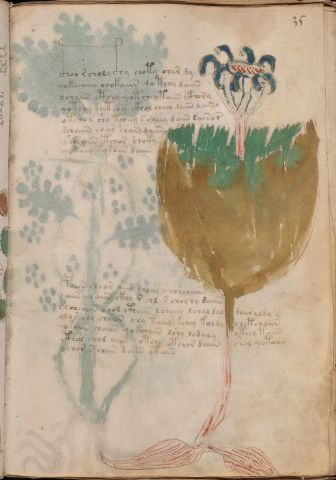

# Voynich Speculative Procedural Protocol — f35r

IMPORTANT: this is NOT a real or validated translation of the Voynich Manuscript. It is a speculative/procedural model that interprets EVA using a user-defined grammar to generate experimental recipes using safe, known edible substitutes.

This file is generated automatically from IVTFF/EVA transliteration plus a user-defined procedural grammar.



## Page / Folio
- currier: A
- folio: f35r
- page_number: 67
- section: herbal

## EVA Text (Transliteration)
```text
c@132;hoo r choly c@196;hy choty char dy
qokeeaiin chokaiin qo tchy daiin
dchaiin cthey qotchey taiin cthory
qotchy shet chy ckhol cheey daiin dainl
otchor sho tcheey scheey daiin dain or
schaiin char chan daiin
shosaiin tchor choky
qokeey ky kaiin daiin
paiin chear aiin chear shorchaiin
o aiin chaiin ckhy r chl s chochy daiin
sh[oh:ch]eaiin chol cthaiin l chaiin lchal dal dair aldy n
olor chy chaiin chy taiin kchey koldy chetchaiin
qokoiin chaiin qokchaiin lshy lodaly oteey taiin
cthol chol aiin qotchy otchor daiin shol qotaiin
ochor s chiin daiin ytain
```

## Domain Context (Heuristic; Not a Translation)

This section summarizes recurring **basewords** in this IVTFF domain and shows simple substring evidence that the token markers used by the procedural grammar occur inside frequent words.

Any Italian anagram / English gloss is a best-effort lexicon match, not a decipherment.


### Associated basewords (non-generic; top by frequency in this domain)
- `daiin` (count=461) → Italian anagram `piani`; English: plans (arrangements)
- `okaiin` (count=59) → Italian anagram `coniai`; English: [n/a]
- `chaiin` (count=39) → Italian anagram `acini`; English: [n/a]
- `saiin` (count=37) → Italian anagram `asini`; English: [n/a]
- `qokaiin` (count=34) → Italian anagram `ciancio`; English: [n/a]
- `qokar` (count=29) → Italian anagram `carco`; English: [n/a]
- `odaiin` (count=27) → Italian anagram `inopia`; English: poverty
- `otchol` (count=25) → Italian anagram `colto`; English: cultivated
- `kaiin` (count=24) → Italian anagram `acini`; English: [n/a]
- `chodaiin` (count=24) → Italian anagram `apocini`; English: [n/a]
- `qotol` (count=20) → Italian anagram `colto`; English: cultivated
- `okain` (count=19) → Italian anagram `acino`; English: a berry
- `qotor` (count=18) → Italian anagram `corto`; English: short
- `ykaiin` (count=16) → Italian anagram `acini`; English: [n/a]
- `qodaiin` (count=15) → Italian anagram `apocini`; English: [n/a]

### Marker evidence (substring in frequent basewords)
- `qo`: 57 basewords; examples: `qotchy`, `qokchy`, `qokedy`, `qokaiin`, `qoky`, `qokol`
- `q`: 58 basewords; examples: `qotchy`, `qokchy`, `qokedy`, `qokaiin`, `qoky`, `qokol`
- `o`: 252 basewords; examples: `chol`, `o`, `chor`, `or`, `shol`, `ol`
- `k`: 142 basewords; examples: `okaiin`, `oky`, `chckhy`, `qokchy`, `qokedy`, `okal`
- `t`: 102 basewords; examples: `cthy`, `oty`, `qotchy`, `cthol`, `cthor`, `otaiin`
- `p`: 15 basewords; examples: `cphy`, `ypchedy`, `opchy`, `opchey`, `pchor`, `qopchy`
- `ch`: 138 basewords; examples: `chol`, `chor`, `chy`, `chey`, `chedy`, `chdy`
- `sh`: 46 basewords; examples: `shol`, `sho`, `shy`, `shor`, `shey`, `shedy`
- `f`: 1 basewords; examples: `f`
- `cth`: 17 basewords; examples: `cthy`, `cthol`, `cthor`, `cthey`, `chcthy`, `ctho`
- `ckh`: 15 basewords; examples: `chckhy`, `ckhy`, `ckhol`, `ckhey`, `checkhy`, `shckhy`
- `cph`: 2 basewords; examples: `cphy`, `cphol`
- `dy`: 78 basewords; examples: `dy`, `chedy`, `chdy`, `chody`, `qokedy`, `shedy`
- `iin`: 39 basewords; examples: `daiin`, `aiin`, `okaiin`, `chaiin`, `saiin`, `qokaiin`
- `aiin`: 32 basewords; examples: `daiin`, `aiin`, `okaiin`, `chaiin`, `saiin`, `qokaiin`

## Recipes Index (This Page)
- [f35r.1,@P0](#f35r-1-f35r-1-p0)
- [f35r.2,+P0](#f35r-2-f35r-2-p0)
- [f35r.3,+P0](#f35r-3-f35r-3-p0)
- [f35r.4,+P0](#f35r-4-f35r-4-p0)
- [f35r.5,+P0](#f35r-5-f35r-5-p0)
- [f35r.6,+P0](#f35r-6-f35r-6-p0)
- [f35r.7,+P0](#f35r-7-f35r-7-p0)
- [f35r.8,+P0](#f35r-8-f35r-8-p0)
- [f35r.9,+P0](#f35r-9-f35r-9-p0)
- [f35r.10,+P0](#f35r-10-f35r-10-p0)
- [f35r.11,+P0](#f35r-11-f35r-11-p0)
- [f35r.12,+P0](#f35r-12-f35r-12-p0)
- [f35r.13,+P0](#f35r-13-f35r-13-p0)
- [f35r.14,+P0](#f35r-14-f35r-14-p0)
- [f35r.15,+P0](#f35r-15-f35r-15-p0)

## Line Glosses (Procedural Gloss Only; Not a Translation)

<a id="f35r-1-f35r-1-p0"></a>

### f35r.1,@P0

EVA: c@132;hoo r choly c@196;hy choty char dy

Direct Gloss (Procedural, Not a Real Translation):
- c: [unparsed]
- hoo: mix / transfer → unmodeled token(s) present: h
- r: [unparsed]
- choly: add main plant (safe substitute) → mix / transfer
- c: [unparsed]
- hy: unmodeled token(s) present: h
- choty: apply heat/cooking → add main plant (safe substitute) → mix / transfer
- char: add main plant (safe substitute) → duration level 1 → state: phase transition/start
- dy: add starter / activate

<a id="f35r-2-f35r-2-p0"></a>

### f35r.2,+P0

EVA: qokeeaiin chokaiin qo tchy daiin

Direct Gloss (Procedural, Not a Real Translation):
- qokeeaiin: prepare liquid base → add fermentable sugars → duration level 2 → state: active extraction → long phase
- chokaiin: add fermentable sugars → add main plant (safe substitute) → mix / transfer → duration level 1 → state: phase transition/start → long phase
- qo: prepare liquid base
- tchy: apply heat/cooking → add main plant (safe substitute)
- daiin: add starter / activate → duration level 1 → state: phase transition/start → long phase

<a id="f35r-3-f35r-3-p0"></a>

### f35r.3,+P0

EVA: dchaiin cthey qotchey taiin cthory

Direct Gloss (Procedural, Not a Real Translation):
- dchaiin: add main plant (safe substitute) → add starter / activate → duration level 1 → state: phase transition/start → long phase
- cthey: add complex herbal compound (safe blend) → duration level 1 → state: active extraction
- qotchey: prepare liquid base → apply heat/cooking → add main plant (safe substitute) → duration level 1 → state: active extraction
- taiin: apply heat/cooking → duration level 1 → state: phase transition/start → long phase
- cthory: mix / transfer → add complex herbal compound (safe blend)

<a id="f35r-4-f35r-4-p0"></a>

### f35r.4,+P0

EVA: qotchy shet chy ckhol cheey daiin dainl

Direct Gloss (Procedural, Not a Real Translation):
- qotchy: prepare liquid base → apply heat/cooking → add main plant (safe substitute)
- shet: apply heat/cooking → add secondary herb (safe substitute) → duration level 1 → state: active extraction
- chy: add main plant (safe substitute)
- ckhol: mix / transfer → add complex herbal compound (safe blend)
- cheey: add main plant (safe substitute) → duration level 2 → state: active extraction
- daiin: add starter / activate → duration level 1 → state: phase transition/start → long phase
- dainl: add starter / activate → duration level 1 → state: phase transition/start

<a id="f35r-5-f35r-5-p0"></a>

### f35r.5,+P0

EVA: otchor sho tcheey scheey daiin dain or

Direct Gloss (Procedural, Not a Real Translation):
- otchor: apply heat/cooking → add main plant (safe substitute) → mix / transfer
- sho: add secondary herb (safe substitute) → mix / transfer
- tcheey: apply heat/cooking → add main plant (safe substitute) → duration level 2 → state: active extraction
- scheey: add main plant (safe substitute) → duration level 2 → state: active extraction
- daiin: add starter / activate → duration level 1 → state: phase transition/start → long phase
- dain: add starter / activate → duration level 1 → state: phase transition/start
- or: mix / transfer

<a id="f35r-6-f35r-6-p0"></a>

### f35r.6,+P0

EVA: schaiin char chan daiin

Direct Gloss (Procedural, Not a Real Translation):
- schaiin: add main plant (safe substitute) → duration level 1 → state: phase transition/start → long phase
- char: add main plant (safe substitute) → duration level 1 → state: phase transition/start
- chan: add main plant (safe substitute) → duration level 1 → state: phase transition/start
- daiin: add starter / activate → duration level 1 → state: phase transition/start → long phase

<a id="f35r-7-f35r-7-p0"></a>

### f35r.7,+P0

EVA: shosaiin tchor choky

Direct Gloss (Procedural, Not a Real Translation):
- shosaiin: add secondary herb (safe substitute) → mix / transfer → duration level 1 → state: phase transition/start → long phase
- tchor: apply heat/cooking → add main plant (safe substitute) → mix / transfer
- choky: add fermentable sugars → add main plant (safe substitute) → mix / transfer

<a id="f35r-8-f35r-8-p0"></a>

### f35r.8,+P0

EVA: qokeey ky kaiin daiin

Direct Gloss (Procedural, Not a Real Translation):
- qokeey: prepare liquid base → add fermentable sugars → duration level 2 → state: active extraction
- ky: add fermentable sugars
- kaiin: add fermentable sugars → duration level 1 → state: phase transition/start → long phase
- daiin: add starter / activate → duration level 1 → state: phase transition/start → long phase

<a id="f35r-9-f35r-9-p0"></a>

### f35r.9,+P0

EVA: paiin chear aiin chear shorchaiin

Direct Gloss (Procedural, Not a Real Translation):
- paiin: add starter / activate → duration level 1 → state: phase transition/start → long phase
- chear: add main plant (safe substitute) → duration level 1 → state: active extraction
- aiin: duration level 1 → state: phase transition/start → long phase
- chear: add main plant (safe substitute) → duration level 1 → state: active extraction
- shorchaiin: add main plant (safe substitute) → add secondary herb (safe substitute) → mix / transfer → duration level 1 → state: phase transition/start → long phase

<a id="f35r-10-f35r-10-p0"></a>

### f35r.10,+P0

EVA: o aiin chaiin ckhy r chl s chochy daiin

Direct Gloss (Procedural, Not a Real Translation):
- o: mix / transfer
- aiin: duration level 1 → state: phase transition/start → long phase
- chaiin: add main plant (safe substitute) → duration level 1 → state: phase transition/start → long phase
- ckhy: add complex herbal compound (safe blend)
- r: [unparsed]
- chl: add main plant (safe substitute)
- s: [unparsed]
- chochy: add main plant (safe substitute) → mix / transfer
- daiin: add starter / activate → duration level 1 → state: phase transition/start → long phase

<a id="f35r-11-f35r-11-p0"></a>

### f35r.11,+P0

EVA: sh[oh:ch]eaiin chol cthaiin l chaiin lchal dal dair aldy n

Direct Gloss (Procedural, Not a Real Translation):
- sh: add secondary herb (safe substitute)
- oh: mix / transfer → unmodeled token(s) present: h
- ch: add main plant (safe substitute)
- eaiin: duration level 1 → state: active extraction → long phase
- chol: add main plant (safe substitute) → mix / transfer
- cthaiin: add complex herbal compound (safe blend) → duration level 1 → state: phase transition/start → long phase
- l: [unparsed]
- chaiin: add main plant (safe substitute) → duration level 1 → state: phase transition/start → long phase
- lchal: add main plant (safe substitute) → duration level 1 → state: phase transition/start
- dal: add starter / activate → duration level 1 → state: phase transition/start
- dair: add starter / activate → duration level 1 → state: phase transition/start
- aldy: add starter / activate → duration level 1 → state: phase transition/start
- n: [unparsed]

<a id="f35r-12-f35r-12-p0"></a>

### f35r.12,+P0

EVA: olor chy chaiin chy taiin kchey koldy chetchaiin

Direct Gloss (Procedural, Not a Real Translation):
- olor: mix / transfer
- chy: add main plant (safe substitute)
- chaiin: add main plant (safe substitute) → duration level 1 → state: phase transition/start → long phase
- chy: add main plant (safe substitute)
- taiin: apply heat/cooking → duration level 1 → state: phase transition/start → long phase
- kchey: add fermentable sugars → add main plant (safe substitute) → duration level 1 → state: active extraction
- koldy: add fermentable sugars → mix / transfer → add starter / activate
- chetchaiin: apply heat/cooking → add main plant (safe substitute) → duration level 1 → state: active extraction → long phase

<a id="f35r-13-f35r-13-p0"></a>

### f35r.13,+P0

EVA: qokoiin chaiin qokchaiin lshy lodaly oteey taiin

Direct Gloss (Procedural, Not a Real Translation):
- qokoiin: prepare liquid base → add fermentable sugars → mix / transfer → duration level 2 → state: cooling/rest → medium phase
- chaiin: add main plant (safe substitute) → duration level 1 → state: phase transition/start → long phase
- qokchaiin: prepare liquid base → add fermentable sugars → add main plant (safe substitute) → duration level 1 → state: phase transition/start → long phase
- lshy: add secondary herb (safe substitute)
- lodaly: mix / transfer → add starter / activate → duration level 1 → state: phase transition/start
- oteey: apply heat/cooking → mix / transfer → duration level 2 → state: active extraction
- taiin: apply heat/cooking → duration level 1 → state: phase transition/start → long phase

<a id="f35r-14-f35r-14-p0"></a>

### f35r.14,+P0

EVA: cthol chol aiin qotchy otchor daiin shol qotaiin

Direct Gloss (Procedural, Not a Real Translation):
- cthol: mix / transfer → add complex herbal compound (safe blend)
- chol: add main plant (safe substitute) → mix / transfer
- aiin: duration level 1 → state: phase transition/start → long phase
- qotchy: prepare liquid base → apply heat/cooking → add main plant (safe substitute)
- otchor: apply heat/cooking → add main plant (safe substitute) → mix / transfer
- daiin: add starter / activate → duration level 1 → state: phase transition/start → long phase
- shol: add secondary herb (safe substitute) → mix / transfer
- qotaiin: prepare liquid base → apply heat/cooking → duration level 1 → state: phase transition/start → long phase

<a id="f35r-15-f35r-15-p0"></a>

### f35r.15,+P0

EVA: ochor s chiin daiin ytain

Direct Gloss (Procedural, Not a Real Translation):
- ochor: add main plant (safe substitute) → mix / transfer
- s: [unparsed]
- chiin: add main plant (safe substitute) → duration level 2 → state: cooling/rest → medium phase
- daiin: add starter / activate → duration level 1 → state: phase transition/start → long phase
- ytain: apply heat/cooking → duration level 1 → state: phase transition/start
