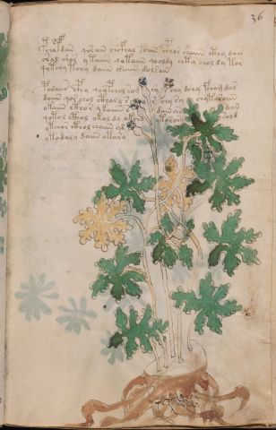

# Voynich Speculative Procedural Protocol — f36r

IMPORTANT: this is NOT a real or validated translation of the Voynich Manuscript. It is a speculative/procedural model that interprets EVA using a user-defined grammar to generate experimental recipes using safe, known edible substitutes.

This file is generated automatically from IVTFF/EVA transliteration plus a user-defined procedural grammar.



## Page / Folio
- currier: A
- folio: f36r
- page_number: 69
- section: herbal

## EVA Text (Transliteration)
```text
pcha@151;dan qorain chcfhal soiin cphor shaiin cthy dair
oral shor ytaiin qotaiin qooldy chty chol dy tor
qotchy tchy daiin @152;aiin dolsain
podaiir cphy qoypchol som c'y chy dchy fchom dar
daiin qor chol ctholy s o r chy sy chytaroiin
okaiin cthor y kaiiin s dain an dan
qotol cthol okol dy okchy ytorory sold
ytchor cthol chaiin yd
ytodaly daiin otaro
```

## Domain Context (Heuristic; Not a Translation)

This section summarizes recurring **basewords** in this IVTFF domain and shows simple substring evidence that the token markers used by the procedural grammar occur inside frequent words.

Any Italian anagram / English gloss is a best-effort lexicon match, not a decipherment.


### Associated basewords (non-generic; top by frequency in this domain)
- `daiin` (count=461) → Italian anagram `piani`; English: plans (arrangements)
- `okaiin` (count=59) → Italian anagram `coniai`; English: [n/a]
- `chaiin` (count=39) → Italian anagram `acini`; English: [n/a]
- `saiin` (count=37) → Italian anagram `asini`; English: [n/a]
- `qokaiin` (count=34) → Italian anagram `ciancio`; English: [n/a]
- `qokar` (count=29) → Italian anagram `carco`; English: [n/a]
- `odaiin` (count=27) → Italian anagram `inopia`; English: poverty
- `otchol` (count=25) → Italian anagram `colto`; English: cultivated
- `kaiin` (count=24) → Italian anagram `acini`; English: [n/a]
- `chodaiin` (count=24) → Italian anagram `apocini`; English: [n/a]
- `qotol` (count=20) → Italian anagram `colto`; English: cultivated
- `okain` (count=19) → Italian anagram `acino`; English: a berry
- `qotor` (count=18) → Italian anagram `corto`; English: short
- `ykaiin` (count=16) → Italian anagram `acini`; English: [n/a]
- `qodaiin` (count=15) → Italian anagram `apocini`; English: [n/a]

### Marker evidence (substring in frequent basewords)
- `qo`: 57 basewords; examples: `qotchy`, `qokchy`, `qokedy`, `qokaiin`, `qoky`, `qokol`
- `q`: 58 basewords; examples: `qotchy`, `qokchy`, `qokedy`, `qokaiin`, `qoky`, `qokol`
- `o`: 252 basewords; examples: `chol`, `o`, `chor`, `or`, `shol`, `ol`
- `k`: 142 basewords; examples: `okaiin`, `oky`, `chckhy`, `qokchy`, `qokedy`, `okal`
- `t`: 102 basewords; examples: `cthy`, `oty`, `qotchy`, `cthol`, `cthor`, `otaiin`
- `p`: 15 basewords; examples: `cphy`, `ypchedy`, `opchy`, `opchey`, `pchor`, `qopchy`
- `ch`: 138 basewords; examples: `chol`, `chor`, `chy`, `chey`, `chedy`, `chdy`
- `sh`: 46 basewords; examples: `shol`, `sho`, `shy`, `shor`, `shey`, `shedy`
- `f`: 1 basewords; examples: `f`
- `cth`: 17 basewords; examples: `cthy`, `cthol`, `cthor`, `cthey`, `chcthy`, `ctho`
- `ckh`: 15 basewords; examples: `chckhy`, `ckhy`, `ckhol`, `ckhey`, `checkhy`, `shckhy`
- `cph`: 2 basewords; examples: `cphy`, `cphol`
- `dy`: 78 basewords; examples: `dy`, `chedy`, `chdy`, `chody`, `qokedy`, `shedy`
- `iin`: 39 basewords; examples: `daiin`, `aiin`, `okaiin`, `chaiin`, `saiin`, `qokaiin`
- `aiin`: 32 basewords; examples: `daiin`, `aiin`, `okaiin`, `chaiin`, `saiin`, `qokaiin`

## Recipes Index (This Page)
- [f36r.1,@P0](#f36r-1-f36r-1-p0)
- [f36r.2,+P0](#f36r-2-f36r-2-p0)
- [f36r.3,+P0](#f36r-3-f36r-3-p0)
- [f36r.4,+P0](#f36r-4-f36r-4-p0)
- [f36r.5,+P0](#f36r-5-f36r-5-p0)
- [f36r.6,+P0](#f36r-6-f36r-6-p0)
- [f36r.7,+P0](#f36r-7-f36r-7-p0)
- [f36r.8,+P0](#f36r-8-f36r-8-p0)
- [f36r.9,+P0](#f36r-9-f36r-9-p0)

## Line Glosses (Procedural Gloss Only; Not a Translation)

<a id="f36r-1-f36r-1-p0"></a>

### f36r.1,@P0

EVA: pcha@151;dan qorain chcfhal soiin cphor shaiin cthy dair

Direct Gloss (Procedural, Not a Real Translation):
- pcha: tokens: p ch a → vowel_run: a (level 1; class a)
- dan: tokens: p a n → connectors: n → vowel_run: a (level 1; class a)
- qorain: tokens: qo r a i n → connectors: r n → vowel_run: a (level 1; class a)
- chcfhal: tokens: ch cfh a l → connectors: l → vowel_run: a (level 1; class a)
- soiin: tokens: s o iin → connectors: s → vowel_run: ii (level 2; class i) → suffix: iin
- cphor: tokens: cph o r → connectors: r
- shaiin: tokens: sh aiin → vowel_run: a (level 1; class a) → suffix: aiin
- cthy: tokens: cth
- dair: tokens: p a i r → connectors: r → vowel_run: a (level 1; class a)

<a id="f36r-2-f36r-2-p0"></a>

### f36r.2,+P0

EVA: oral shor ytaiin qotaiin qooldy chty chol dy tor

Direct Gloss (Procedural, Not a Real Translation):
- oral: tokens: o r a l → connectors: r l → vowel_run: a (level 1; class a)
- shor: tokens: sh o r → connectors: r
- ytaiin: tokens: t aiin → vowel_run: a (level 1; class a) → suffix: aiin
- qotaiin: tokens: qo t aiin → vowel_run: a (level 1; class a) → suffix: aiin
- qooldy: tokens: qo o l p → connectors: l
- chty: tokens: ch t
- chol: tokens: ch o l → connectors: l
- dy: tokens: p
- tor: tokens: t o r → connectors: r

<a id="f36r-3-f36r-3-p0"></a>

### f36r.3,+P0

EVA: qotchy tchy daiin @152;aiin dolsain

Direct Gloss (Procedural, Not a Real Translation):
- qotchy: tokens: qo t ch
- tchy: tokens: t ch
- daiin: tokens: p aiin → vowel_run: a (level 1; class a) → suffix: aiin
- aiin: tokens: aiin → vowel_run: a (level 1; class a) → suffix: aiin
- dolsain: tokens: p o l s a i n → connectors: l s n → vowel_run: a (level 1; class a)

<a id="f36r-4-f36r-4-p0"></a>

### f36r.4,+P0

EVA: podaiir cphy qoypchol som c'y chy dchy fchom dar

Direct Gloss (Procedural, Not a Real Translation):
- podaiir: tokens: p o p a ii r → connectors: r → vowel_run: a (level 1; class a)
- cphy: tokens: cph
- qoypchol: tokens: qo p ch o l → connectors: l
- som: tokens: s o m → connectors: s m
- c: tokens: c
- y: [unparsed]
- chy: tokens: ch
- dchy: tokens: p ch
- fchom: tokens: f ch o m → connectors: m
- dar: tokens: p a r → connectors: r → vowel_run: a (level 1; class a)

<a id="f36r-5-f36r-5-p0"></a>

### f36r.5,+P0

EVA: daiin qor chol ctholy s o r chy sy chytaroiin

Direct Gloss (Procedural, Not a Real Translation):
- daiin: tokens: p aiin → vowel_run: a (level 1; class a) → suffix: aiin
- qor: tokens: qo r → connectors: r
- chol: tokens: ch o l → connectors: l
- ctholy: tokens: cth o l → connectors: l
- s: tokens: s → connectors: s
- o: tokens: o
- r: tokens: r → connectors: r
- chy: tokens: ch
- sy: tokens: s → connectors: s
- chytaroiin: tokens: ch t a r o iin → connectors: r → vowel_run: a (level 1; class a) → suffix: iin

<a id="f36r-6-f36r-6-p0"></a>

### f36r.6,+P0

EVA: okaiin cthor y kaiiin s dain an dan

Direct Gloss (Procedural, Not a Real Translation):
- okaiin: tokens: o k aiin → vowel_run: a (level 1; class a) → suffix: aiin
- cthor: tokens: cth o r → connectors: r
- y: [unparsed]
- kaiiin: tokens: k a iii n → connectors: n → vowel_run: a (level 1; class a) → suffix: iin
- s: tokens: s → connectors: s
- dain: tokens: p a i n → connectors: n → vowel_run: a (level 1; class a)
- an: tokens: a n → connectors: n → vowel_run: a (level 1; class a)
- dan: tokens: p a n → connectors: n → vowel_run: a (level 1; class a)

<a id="f36r-7-f36r-7-p0"></a>

### f36r.7,+P0

EVA: qotol cthol okol dy okchy ytorory sold

Direct Gloss (Procedural, Not a Real Translation):
- qotol: tokens: qo t o l → connectors: l
- cthol: tokens: cth o l → connectors: l
- okol: tokens: o k o l → connectors: l
- dy: tokens: p
- okchy: tokens: o k ch
- ytorory: tokens: t o r o r → connectors: r r
- sold: tokens: s o l p → connectors: s l

<a id="f36r-8-f36r-8-p0"></a>

### f36r.8,+P0

EVA: ytchor cthol chaiin yd

Direct Gloss (Procedural, Not a Real Translation):
- ytchor: tokens: t ch o r → connectors: r
- cthol: tokens: cth o l → connectors: l
- chaiin: tokens: ch aiin → vowel_run: a (level 1; class a) → suffix: aiin
- yd: tokens: p

<a id="f36r-9-f36r-9-p0"></a>

### f36r.9,+P0

EVA: ytodaly daiin otaro

Direct Gloss (Procedural, Not a Real Translation):
- ytodaly: tokens: t o p a l → connectors: l → vowel_run: a (level 1; class a)
- daiin: tokens: p aiin → vowel_run: a (level 1; class a) → suffix: aiin
- otaro: tokens: o t a r o → connectors: r → vowel_run: a (level 1; class a)
