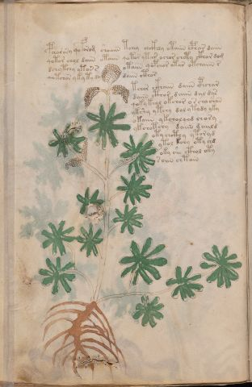

# Voynich Speculative Procedural Protocol — f36v

IMPORTANT: this is NOT a real or validated translation of the Voynich Manuscript. It is a speculative/procedural model that interprets EVA using a user-defined grammar to generate experimental recipes using safe, known edible substitutes.

This file is generated automatically from IVTFF/EVA transliteration plus a user-defined procedural grammar.



## Page / Folio
- currier: A
- folio: f36v
- page_number: 70
- section: herbal

## EVA Text (Transliteration)
```text
pchar asy qoforom shoaiin tchey ch[ckoh:ckhh]y otaiin cphar daiin
qotor chol daiin otaiin qotor ytar ochor chety ckh[o:a]r dom
dchytchy ytor s otaiin qopchor otar otchaiin s
qotchor y ky ty dy daiin cthor
tchor ckhoiin daiin cphchar
daiin cthor daiin dal dys
qoky keol okchor o s ch[y:a] shan
ykshy ytchy dol y tydy yky
okaiin y kcholqod chory
ykchotchy daiin daiild
oty chcthy ytoryd
ytol kchy oty chd
oky she cthol oty
soiin chtain
```

## Domain Context (Heuristic; Not a Translation)

This section summarizes recurring **basewords** in this IVTFF domain and shows simple substring evidence that the token markers used by the procedural grammar occur inside frequent words.

Any Italian anagram / English gloss is a best-effort lexicon match, not a decipherment.


### Associated basewords (non-generic; top by frequency in this domain)
- `daiin` (count=461) → Italian anagram `piani`; English: plans (arrangements)
- `okaiin` (count=59) → Italian anagram `coniai`; English: [n/a]
- `chaiin` (count=39) → Italian anagram `acini`; English: [n/a]
- `saiin` (count=37) → Italian anagram `asini`; English: [n/a]
- `qokaiin` (count=34) → Italian anagram `ciancio`; English: [n/a]
- `qokar` (count=29) → Italian anagram `carco`; English: [n/a]
- `odaiin` (count=27) → Italian anagram `inopia`; English: poverty
- `otchol` (count=25) → Italian anagram `colto`; English: cultivated
- `kaiin` (count=24) → Italian anagram `acini`; English: [n/a]
- `chodaiin` (count=24) → Italian anagram `apocini`; English: [n/a]
- `qotol` (count=20) → Italian anagram `colto`; English: cultivated
- `okain` (count=19) → Italian anagram `acino`; English: a berry
- `qotor` (count=18) → Italian anagram `corto`; English: short
- `ykaiin` (count=16) → Italian anagram `acini`; English: [n/a]
- `qodaiin` (count=15) → Italian anagram `apocini`; English: [n/a]

### Marker evidence (substring in frequent basewords)
- `qo`: 57 basewords; examples: `qotchy`, `qokchy`, `qokedy`, `qokaiin`, `qoky`, `qokol`
- `q`: 58 basewords; examples: `qotchy`, `qokchy`, `qokedy`, `qokaiin`, `qoky`, `qokol`
- `o`: 252 basewords; examples: `chol`, `o`, `chor`, `or`, `shol`, `ol`
- `k`: 142 basewords; examples: `okaiin`, `oky`, `chckhy`, `qokchy`, `qokedy`, `okal`
- `t`: 102 basewords; examples: `cthy`, `oty`, `qotchy`, `cthol`, `cthor`, `otaiin`
- `p`: 15 basewords; examples: `cphy`, `ypchedy`, `opchy`, `opchey`, `pchor`, `qopchy`
- `ch`: 138 basewords; examples: `chol`, `chor`, `chy`, `chey`, `chedy`, `chdy`
- `sh`: 46 basewords; examples: `shol`, `sho`, `shy`, `shor`, `shey`, `shedy`
- `f`: 1 basewords; examples: `f`
- `cth`: 17 basewords; examples: `cthy`, `cthol`, `cthor`, `cthey`, `chcthy`, `ctho`
- `ckh`: 15 basewords; examples: `chckhy`, `ckhy`, `ckhol`, `ckhey`, `checkhy`, `shckhy`
- `cph`: 2 basewords; examples: `cphy`, `cphol`
- `dy`: 78 basewords; examples: `dy`, `chedy`, `chdy`, `chody`, `qokedy`, `shedy`
- `iin`: 39 basewords; examples: `daiin`, `aiin`, `okaiin`, `chaiin`, `saiin`, `qokaiin`
- `aiin`: 32 basewords; examples: `daiin`, `aiin`, `okaiin`, `chaiin`, `saiin`, `qokaiin`

## Recipes Index (This Page)
- [f36v.1,@P0](#f36v-1-f36v-1-p0)
- [f36v.2,+P0](#f36v-2-f36v-2-p0)
- [f36v.3,+P0](#f36v-3-f36v-3-p0)
- [f36v.4,+P0](#f36v-4-f36v-4-p0)
- [f36v.5,+P1](#f36v-5-f36v-5-p1)
- [f36v.6,+P1](#f36v-6-f36v-6-p1)
- [f36v.7,+P1](#f36v-7-f36v-7-p1)
- [f36v.8,+P1](#f36v-8-f36v-8-p1)
- [f36v.9,+P1](#f36v-9-f36v-9-p1)
- [f36v.10,+P1](#f36v-10-f36v-10-p1)
- [f36v.11,+P1](#f36v-11-f36v-11-p1)
- [f36v.12,+P1](#f36v-12-f36v-12-p1)
- [f36v.13,+P1](#f36v-13-f36v-13-p1)
- [f36v.14,+P1](#f36v-14-f36v-14-p1)

## Line Glosses (Procedural Gloss Only; Not a Translation)

<a id="f36v-1-f36v-1-p0"></a>

### f36v.1,@P0

EVA: pchar asy qoforom shoaiin tchey ch[ckoh:ckhh]y otaiin cphar daiin

Direct Gloss (Procedural, Not a Real Translation):
- pchar: tokens: p ch a r → connectors: r → vowel_run: a (level 1; class a)
- asy: tokens: a s → connectors: s → vowel_run: a (level 1; class a)
- qoforom: tokens: qo f o r o m → connectors: r m
- shoaiin: tokens: sh o aiin → vowel_run: a (level 1; class a) → suffix: aiin
- tchey: tokens: t ch e → vowel_run: e (level 1; class e)
- ch: tokens: ch
- ckoh: tokens: c k o h → unmodeled_tokens: h
- ckhh: tokens: ckh h → unmodeled_tokens: h
- y: [unparsed]
- otaiin: tokens: o t aiin → vowel_run: a (level 1; class a) → suffix: aiin
- cphar: tokens: cph a r → connectors: r → vowel_run: a (level 1; class a)
- daiin: tokens: p aiin → vowel_run: a (level 1; class a) → suffix: aiin (lexicon-context: `daiin` → `piani`; plans (arrangements))

<a id="f36v-2-f36v-2-p0"></a>

### f36v.2,+P0

EVA: qotor chol daiin otaiin qotor ytar ochor chety ckh[o:a]r dom

Direct Gloss (Procedural, Not a Real Translation):
- qotor: tokens: qo t o r → connectors: r (lexicon-context: `qotor` → `corto`; short)
- chol: tokens: ch o l → connectors: l
- daiin: tokens: p aiin → vowel_run: a (level 1; class a) → suffix: aiin (lexicon-context: `daiin` → `piani`; plans (arrangements))
- otaiin: tokens: o t aiin → vowel_run: a (level 1; class a) → suffix: aiin
- qotor: tokens: qo t o r → connectors: r (lexicon-context: `qotor` → `corto`; short)
- ytar: tokens: t a r → connectors: r → vowel_run: a (level 1; class a)
- ochor: tokens: o ch o r → connectors: r
- chety: tokens: ch e t → vowel_run: e (level 1; class e)
- ckh: tokens: ckh
- o: tokens: o
- a: tokens: a → vowel_run: a (level 1; class a)
- r: tokens: r → connectors: r
- dom: tokens: p o m → connectors: m

<a id="f36v-3-f36v-3-p0"></a>

### f36v.3,+P0

EVA: dchytchy ytor s otaiin qopchor otar otchaiin s

Direct Gloss (Procedural, Not a Real Translation):
- dchytchy: tokens: p ch t ch
- ytor: tokens: t o r → connectors: r
- s: tokens: s → connectors: s
- otaiin: tokens: o t aiin → vowel_run: a (level 1; class a) → suffix: aiin
- qopchor: tokens: qo p ch o r → connectors: r
- otar: tokens: o t a r → connectors: r → vowel_run: a (level 1; class a)
- otchaiin: tokens: o t ch aiin → vowel_run: a (level 1; class a) → suffix: aiin (lexicon-context: `chaiin` → `acini`; [n/a])
- s: tokens: s → connectors: s

<a id="f36v-4-f36v-4-p0"></a>

### f36v.4,+P0

EVA: qotchor y ky ty dy daiin cthor

Direct Gloss (Procedural, Not a Real Translation):
- qotchor: tokens: qo t ch o r → connectors: r (lexicon-context: `otchor` → `corto`; short)
- y: [unparsed]
- ky: tokens: k
- ty: tokens: t
- dy: tokens: p
- daiin: tokens: p aiin → vowel_run: a (level 1; class a) → suffix: aiin (lexicon-context: `daiin` → `piani`; plans (arrangements))
- cthor: tokens: cth o r → connectors: r

<a id="f36v-5-f36v-5-p1"></a>

### f36v.5,+P1

EVA: tchor ckhoiin daiin cphchar

Direct Gloss (Procedural, Not a Real Translation):
- tchor: tokens: t ch o r → connectors: r
- ckhoiin: tokens: ckh o iin → vowel_run: ii (level 2; class i) → suffix: iin
- daiin: tokens: p aiin → vowel_run: a (level 1; class a) → suffix: aiin (lexicon-context: `daiin` → `piani`; plans (arrangements))
- cphchar: tokens: cph ch a r → connectors: r → vowel_run: a (level 1; class a)

<a id="f36v-6-f36v-6-p1"></a>

### f36v.6,+P1

EVA: daiin cthor daiin dal dys

Direct Gloss (Procedural, Not a Real Translation):
- daiin: tokens: p aiin → vowel_run: a (level 1; class a) → suffix: aiin (lexicon-context: `daiin` → `piani`; plans (arrangements))
- cthor: tokens: cth o r → connectors: r
- daiin: tokens: p aiin → vowel_run: a (level 1; class a) → suffix: aiin (lexicon-context: `daiin` → `piani`; plans (arrangements))
- dal: tokens: p a l → connectors: l → vowel_run: a (level 1; class a)
- dys: tokens: p s → connectors: s

<a id="f36v-7-f36v-7-p1"></a>

### f36v.7,+P1

EVA: qoky keol okchor o s ch[y:a] shan

Direct Gloss (Procedural, Not a Real Translation):
- qoky: tokens: qo k
- keol: tokens: k e o l → connectors: l → vowel_run: e (level 1; class e)
- okchor: tokens: o k ch o r → connectors: r (lexicon-context: `okchor` → `corco`; [n/a])
- o: tokens: o
- s: tokens: s → connectors: s
- ch: tokens: ch
- y: [unparsed]
- a: tokens: a → vowel_run: a (level 1; class a)
- shan: tokens: sh a n → connectors: n → vowel_run: a (level 1; class a)

<a id="f36v-8-f36v-8-p1"></a>

### f36v.8,+P1

EVA: ykshy ytchy dol y tydy yky

Direct Gloss (Procedural, Not a Real Translation):
- ykshy: tokens: k sh
- ytchy: tokens: t ch
- dol: tokens: p o l → connectors: l
- y: [unparsed]
- tydy: tokens: t p
- yky: tokens: k

<a id="f36v-9-f36v-9-p1"></a>

### f36v.9,+P1

EVA: okaiin y kcholqod chory

Direct Gloss (Procedural, Not a Real Translation):
- okaiin: tokens: o k aiin → vowel_run: a (level 1; class a) → suffix: aiin (lexicon-context: `okaiin` → `coniai`; [n/a])
- y: [unparsed]
- kcholqod: tokens: k ch o l qo p → connectors: l
- chory: tokens: ch o r → connectors: r

<a id="f36v-10-f36v-10-p1"></a>

### f36v.10,+P1

EVA: ykchotchy daiin daiild

Direct Gloss (Procedural, Not a Real Translation):
- ykchotchy: tokens: k ch o t ch
- daiin: tokens: p aiin → vowel_run: a (level 1; class a) → suffix: aiin (lexicon-context: `daiin` → `piani`; plans (arrangements))
- daiild: tokens: p a ii l p → connectors: l → vowel_run: a (level 1; class a)

<a id="f36v-11-f36v-11-p1"></a>

### f36v.11,+P1

EVA: oty chcthy ytoryd

Direct Gloss (Procedural, Not a Real Translation):
- oty: tokens: o t
- chcthy: tokens: ch cth
- ytoryd: tokens: t o r p → connectors: r

<a id="f36v-12-f36v-12-p1"></a>

### f36v.12,+P1

EVA: ytol kchy oty chd

Direct Gloss (Procedural, Not a Real Translation):
- ytol: tokens: t o l → connectors: l
- kchy: tokens: k ch
- oty: tokens: o t
- chd: tokens: ch p

<a id="f36v-13-f36v-13-p1"></a>

### f36v.13,+P1

EVA: oky she cthol oty

Direct Gloss (Procedural, Not a Real Translation):
- oky: tokens: o k
- she: tokens: sh e → vowel_run: e (level 1; class e)
- cthol: tokens: cth o l → connectors: l
- oty: tokens: o t

<a id="f36v-14-f36v-14-p1"></a>

### f36v.14,+P1

EVA: soiin chtain

Direct Gloss (Procedural, Not a Real Translation):
- soiin: tokens: s o iin → connectors: s → vowel_run: ii (level 2; class i) → suffix: iin
- chtain: tokens: ch t a i n → connectors: n → vowel_run: a (level 1; class a)
