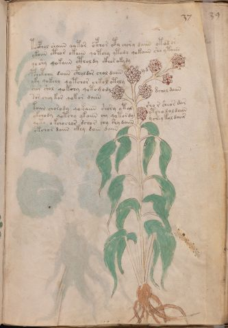

# Voynich Speculative Procedural Protocol — f37r

IMPORTANT: this is NOT a real or validated translation of the Voynich Manuscript. It is a speculative/procedural model that interprets EVA using a user-defined grammar to generate experimental recipes using safe, known edible substitutes.

This file is generated automatically from IVTFF/EVA transliteration plus a user-defined procedural grammar.



## Page / Folio
- currier: A
- folio: f37r
- page_number: 71
- section: herbal

## EVA Text (Transliteration)
```text
tocphol shaiin qotor ofchor oty chory daiin otod [o:a]r
ykoiin cthor okaiin qo tchy ytody qokaiin sho ytaiin
qo shy qokaiin cthol dy ckhor oky dy
pchotchy daiin cfholdar chol daiin yd
yky qokchy qotchor chkol otoly
shor shol qokchy qotomody dchol daiin
sor chey kor qokor daiin
koiin chorody qokaiin c'hhory otal shor sheor dar
ykchody qotchy ykaiin chy qotordy otcho loldaiin
qoto o kchochor dchor chy shy daiin ychey kol daiir
okchor daiin ckhy dain daiin
```

## Domain Context (Heuristic; Not a Translation)

This section summarizes recurring **basewords** in this IVTFF domain and shows simple substring evidence that the token markers used by the procedural grammar occur inside frequent words.

Any Italian anagram / English gloss is a best-effort lexicon match, not a decipherment.


### Associated basewords (non-generic; top by frequency in this domain)
- `daiin` (count=461) → Italian anagram `piani`; English: plans (arrangements)
- `okaiin` (count=59) → Italian anagram `coniai`; English: [n/a]
- `chaiin` (count=39) → Italian anagram `acini`; English: [n/a]
- `saiin` (count=37) → Italian anagram `asini`; English: [n/a]
- `qokaiin` (count=34) → Italian anagram `ciancio`; English: [n/a]
- `qokar` (count=29) → Italian anagram `carco`; English: [n/a]
- `odaiin` (count=27) → Italian anagram `inopia`; English: poverty
- `otchol` (count=25) → Italian anagram `colto`; English: cultivated
- `kaiin` (count=24) → Italian anagram `acini`; English: [n/a]
- `chodaiin` (count=24) → Italian anagram `apocini`; English: [n/a]
- `qotol` (count=20) → Italian anagram `colto`; English: cultivated
- `okain` (count=19) → Italian anagram `acino`; English: a berry
- `qotor` (count=18) → Italian anagram `corto`; English: short
- `ykaiin` (count=16) → Italian anagram `acini`; English: [n/a]
- `qodaiin` (count=15) → Italian anagram `apocini`; English: [n/a]

### Marker evidence (substring in frequent basewords)
- `qo`: 57 basewords; examples: `qotchy`, `qokchy`, `qokedy`, `qokaiin`, `qoky`, `qokol`
- `q`: 58 basewords; examples: `qotchy`, `qokchy`, `qokedy`, `qokaiin`, `qoky`, `qokol`
- `o`: 252 basewords; examples: `chol`, `o`, `chor`, `or`, `shol`, `ol`
- `k`: 142 basewords; examples: `okaiin`, `oky`, `chckhy`, `qokchy`, `qokedy`, `okal`
- `t`: 102 basewords; examples: `cthy`, `oty`, `qotchy`, `cthol`, `cthor`, `otaiin`
- `p`: 15 basewords; examples: `cphy`, `ypchedy`, `opchy`, `opchey`, `pchor`, `qopchy`
- `ch`: 138 basewords; examples: `chol`, `chor`, `chy`, `chey`, `chedy`, `chdy`
- `sh`: 46 basewords; examples: `shol`, `sho`, `shy`, `shor`, `shey`, `shedy`
- `f`: 1 basewords; examples: `f`
- `cth`: 17 basewords; examples: `cthy`, `cthol`, `cthor`, `cthey`, `chcthy`, `ctho`
- `ckh`: 15 basewords; examples: `chckhy`, `ckhy`, `ckhol`, `ckhey`, `checkhy`, `shckhy`
- `cph`: 2 basewords; examples: `cphy`, `cphol`
- `dy`: 78 basewords; examples: `dy`, `chedy`, `chdy`, `chody`, `qokedy`, `shedy`
- `iin`: 39 basewords; examples: `daiin`, `aiin`, `okaiin`, `chaiin`, `saiin`, `qokaiin`
- `aiin`: 32 basewords; examples: `daiin`, `aiin`, `okaiin`, `chaiin`, `saiin`, `qokaiin`

## Recipes Index (This Page)
- [f37r.1,@P0](#f37r-1-f37r-1-p0)
- [f37r.2,+P0](#f37r-2-f37r-2-p0)
- [f37r.3,+P0](#f37r-3-f37r-3-p0)
- [f37r.4,+P0](#f37r-4-f37r-4-p0)
- [f37r.5,+P0](#f37r-5-f37r-5-p0)
- [f37r.6,+P0](#f37r-6-f37r-6-p0)
- [f37r.7,+P0](#f37r-7-f37r-7-p0)
- [f37r.8,+P0](#f37r-8-f37r-8-p0)
- [f37r.9,+P0](#f37r-9-f37r-9-p0)
- [f37r.10,+P0](#f37r-10-f37r-10-p0)
- [f37r.11,+P0](#f37r-11-f37r-11-p0)

## Line Glosses (Procedural Gloss Only; Not a Translation)

<a id="f37r-1-f37r-1-p0"></a>

### f37r.1,@P0

EVA: tocphol shaiin qotor ofchor oty chory daiin otod [o:a]r

Direct Gloss (Procedural, Not a Real Translation):
- tocphol: tokens: t o cph o l → connectors: l
- shaiin: tokens: sh aiin → vowel_run: a (level 1; class a) → suffix: aiin (lexicon-context: `shaiin` → `asini`; [n/a])
- qotor: tokens: qo t o r → connectors: r (lexicon-context: `qotor` → `corto`; short)
- ofchor: tokens: o f ch o r → connectors: r
- oty: tokens: o t
- chory: tokens: ch o r → connectors: r
- daiin: tokens: p aiin → vowel_run: a (level 1; class a) → suffix: aiin (lexicon-context: `daiin` → `piani`; plans (arrangements))
- otod: tokens: o t o p
- o: tokens: o
- a: tokens: a → vowel_run: a (level 1; class a)
- r: tokens: r → connectors: r

<a id="f37r-2-f37r-2-p0"></a>

### f37r.2,+P0

EVA: ykoiin cthor okaiin qo tchy ytody qokaiin sho ytaiin

Direct Gloss (Procedural, Not a Real Translation):
- ykoiin: tokens: k o iin → vowel_run: ii (level 2; class i) → suffix: iin
- cthor: tokens: cth o r → connectors: r
- okaiin: tokens: o k aiin → vowel_run: a (level 1; class a) → suffix: aiin (lexicon-context: `okaiin` → `coniai`; [n/a])
- qo: tokens: qo
- tchy: tokens: t ch
- ytody: tokens: t o p
- qokaiin: tokens: qo k aiin → vowel_run: a (level 1; class a) → suffix: aiin (lexicon-context: `qokaiin` → `ciancio`; [n/a])
- sho: tokens: sh o
- ytaiin: tokens: t aiin → vowel_run: a (level 1; class a) → suffix: aiin

<a id="f37r-3-f37r-3-p0"></a>

### f37r.3,+P0

EVA: qo shy qokaiin cthol dy ckhor oky dy

Direct Gloss (Procedural, Not a Real Translation):
- qo: tokens: qo
- shy: tokens: sh
- qokaiin: tokens: qo k aiin → vowel_run: a (level 1; class a) → suffix: aiin (lexicon-context: `qokaiin` → `ciancio`; [n/a])
- cthol: tokens: cth o l → connectors: l
- dy: tokens: p
- ckhor: tokens: ckh o r → connectors: r
- oky: tokens: o k
- dy: tokens: p

<a id="f37r-4-f37r-4-p0"></a>

### f37r.4,+P0

EVA: pchotchy daiin cfholdar chol daiin yd

Direct Gloss (Procedural, Not a Real Translation):
- pchotchy: tokens: p ch o t ch
- daiin: tokens: p aiin → vowel_run: a (level 1; class a) → suffix: aiin (lexicon-context: `daiin` → `piani`; plans (arrangements))
- cfholdar: tokens: cfh o l p a r → connectors: l r → vowel_run: a (level 1; class a)
- chol: tokens: ch o l → connectors: l
- daiin: tokens: p aiin → vowel_run: a (level 1; class a) → suffix: aiin (lexicon-context: `daiin` → `piani`; plans (arrangements))
- yd: tokens: p

<a id="f37r-5-f37r-5-p0"></a>

### f37r.5,+P0

EVA: yky qokchy qotchor chkol otoly

Direct Gloss (Procedural, Not a Real Translation):
- yky: tokens: k
- qokchy: tokens: qo k ch
- qotchor: tokens: qo t ch o r → connectors: r (lexicon-context: `otchor` → `corto`; short)
- chkol: tokens: ch k o l → connectors: l
- otoly: tokens: o t o l → connectors: l

<a id="f37r-6-f37r-6-p0"></a>

### f37r.6,+P0

EVA: shor shol qokchy qotomody dchol daiin

Direct Gloss (Procedural, Not a Real Translation):
- shor: tokens: sh o r → connectors: r
- shol: tokens: sh o l → connectors: l
- qokchy: tokens: qo k ch
- qotomody: tokens: qo t o m o p → connectors: m
- dchol: tokens: p ch o l → connectors: l
- daiin: tokens: p aiin → vowel_run: a (level 1; class a) → suffix: aiin (lexicon-context: `daiin` → `piani`; plans (arrangements))

<a id="f37r-7-f37r-7-p0"></a>

### f37r.7,+P0

EVA: sor chey kor qokor daiin

Direct Gloss (Procedural, Not a Real Translation):
- sor: tokens: s o r → connectors: s r
- chey: tokens: ch e → vowel_run: e (level 1; class e)
- kor: tokens: k o r → connectors: r
- qokor: tokens: qo k o r → connectors: r (lexicon-context: `qokor` → `corco`; [n/a])
- daiin: tokens: p aiin → vowel_run: a (level 1; class a) → suffix: aiin (lexicon-context: `daiin` → `piani`; plans (arrangements))

<a id="f37r-8-f37r-8-p0"></a>

### f37r.8,+P0

EVA: koiin chorody qokaiin c'hhory otal shor sheor dar

Direct Gloss (Procedural, Not a Real Translation):
- koiin: tokens: k o iin → vowel_run: ii (level 2; class i) → suffix: iin
- chorody: tokens: ch o r o p → connectors: r
- qokaiin: tokens: qo k aiin → vowel_run: a (level 1; class a) → suffix: aiin (lexicon-context: `qokaiin` → `ciancio`; [n/a])
- c: tokens: c
- hhory: tokens: h h o r → connectors: r → unmodeled_tokens: h
- otal: tokens: o t a l → connectors: l → vowel_run: a (level 1; class a)
- shor: tokens: sh o r → connectors: r
- sheor: tokens: sh e o r → connectors: r → vowel_run: e (level 1; class e)
- dar: tokens: p a r → connectors: r → vowel_run: a (level 1; class a)

<a id="f37r-9-f37r-9-p0"></a>

### f37r.9,+P0

EVA: ykchody qotchy ykaiin chy qotordy otcho loldaiin

Direct Gloss (Procedural, Not a Real Translation):
- ykchody: tokens: k ch o p
- qotchy: tokens: qo t ch
- ykaiin: tokens: k aiin → vowel_run: a (level 1; class a) → suffix: aiin (lexicon-context: `ykaiin` → `acini`; [n/a])
- chy: tokens: ch
- qotordy: tokens: qo t o r p → connectors: r (lexicon-context: `qotor` → `corto`; short)
- otcho: tokens: o t ch o
- loldaiin: tokens: l o l p aiin → connectors: l l → vowel_run: a (level 1; class a) → suffix: aiin (lexicon-context: `daiin` → `piani`; plans (arrangements))

<a id="f37r-10-f37r-10-p0"></a>

### f37r.10,+P0

EVA: qoto o kchochor dchor chy shy daiin ychey kol daiir

Direct Gloss (Procedural, Not a Real Translation):
- qoto: tokens: qo t o
- o: tokens: o
- kchochor: tokens: k ch o ch o r → connectors: r
- dchor: tokens: p ch o r → connectors: r
- chy: tokens: ch
- shy: tokens: sh
- daiin: tokens: p aiin → vowel_run: a (level 1; class a) → suffix: aiin (lexicon-context: `daiin` → `piani`; plans (arrangements))
- ychey: tokens: ch e → vowel_run: e (level 1; class e)
- kol: tokens: k o l → connectors: l
- daiir: tokens: p a ii r → connectors: r → vowel_run: a (level 1; class a) (lexicon-context: `daiir` → `aprii`; [n/a])

<a id="f37r-11-f37r-11-p0"></a>

### f37r.11,+P0

EVA: okchor daiin ckhy dain daiin

Direct Gloss (Procedural, Not a Real Translation):
- okchor: tokens: o k ch o r → connectors: r (lexicon-context: `okchor` → `corco`; [n/a])
- daiin: tokens: p aiin → vowel_run: a (level 1; class a) → suffix: aiin (lexicon-context: `daiin` → `piani`; plans (arrangements))
- ckhy: tokens: ckh
- dain: tokens: p a i n → connectors: n → vowel_run: a (level 1; class a)
- daiin: tokens: p aiin → vowel_run: a (level 1; class a) → suffix: aiin (lexicon-context: `daiin` → `piani`; plans (arrangements))
