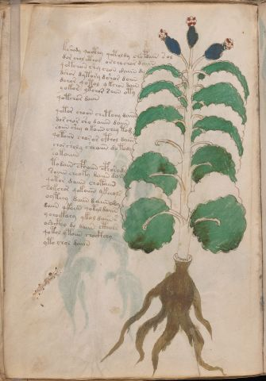

# Voynich Speculative Herbal Ferment Recipe — f37v

IMPORTANT: this is NOT a real or validated translation of the Voynich Manuscript. It is a speculative/procedural model that interprets EVA using a user-defined grammar to generate experimental recipes using safe, known edible substitutes.

This file is generated automatically from IVTFF/EVA transliteration plus a user-defined procedural grammar.



## Page / Folio
- currier: A
- folio: f37v
- page_number: 72
- section: herbal

## EVA Text (Transliteration)
```text
[t:k]shody qocthy qotoldy chopdain sol
dor chol cthor orchochor daiin
qokchon shy chon daiin dy
dshor dytory dshor daiin
dchor qotol ykchon dain
yokor ytchor saiin oty
qotchor daiin
qotor choiin chetchy daiin
dor chor sho daiiin daiin
soiin ch'ey o koiin chey tom
qotoiin choror cthol daiin
chor sh[y:o]ly sheaiin do tody
sotoiiin
todain cphaiin cphorods
soiiin cheoky daiin dain
qotor daiin chotaiin
sokchor qokoiiin ykeeols
oyteey daiin daiinody
daiin qkaiin qotal daiin
y chockahy ykol daiin s
oshctho do daiin cthols
qotol ytoiin chocthhy
yto chol daiin
```

## Recipes Index (This Page)
- [f37v.1,@P0](#f37v-1-f37v-1-p0)
- [f37v.2,+P0](#f37v-2-f37v-2-p0)
- [f37v.3,+P0](#f37v-3-f37v-3-p0)
- [f37v.4,+P0](#f37v-4-f37v-4-p0)
- [f37v.5,+P0](#f37v-5-f37v-5-p0)
- [f37v.6,+P0](#f37v-6-f37v-6-p0)
- [f37v.7,+P0](#f37v-7-f37v-7-p0)
- [f37v.8,+P0](#f37v-8-f37v-8-p0)
- [f37v.9,+P0](#f37v-9-f37v-9-p0)
- [f37v.10,+P0](#f37v-10-f37v-10-p0)
- [f37v.11,+P0](#f37v-11-f37v-11-p0)
- [f37v.12,+P0](#f37v-12-f37v-12-p0)
- [f37v.13,+P0](#f37v-13-f37v-13-p0)
- [f37v.14,+P0](#f37v-14-f37v-14-p0)
- [f37v.15,+P0](#f37v-15-f37v-15-p0)
- [f37v.16,+P0](#f37v-16-f37v-16-p0)
- [f37v.17,+P0](#f37v-17-f37v-17-p0)
- [f37v.18,+P0](#f37v-18-f37v-18-p0)
- [f37v.19,+P0](#f37v-19-f37v-19-p0)
- [f37v.20,+P0](#f37v-20-f37v-20-p0)
- [f37v.21,+P0](#f37v-21-f37v-21-p0)
- [f37v.22,+P0](#f37v-22-f37v-22-p0)
- [f37v.23,+P0](#f37v-23-f37v-23-p0)

## Line Glosses (Procedural Gloss Only; Not a Translation)

<a id="f37v-1-f37v-1-p0"></a>

### f37v.1,@P0

EVA: [t:k]shody qocthy qotoldy chopdain sol

Direct Gloss (Procedural, Not a Real Translation):
- t: apply heat/cooking
- k: add fermentable sugars
- shody: add secondary herb (safe substitute) → mix / transfer → start fermentation (yeast)
- qocthy: prepare liquid base → add complex herbal compound (safe blend)
- qotoldy: prepare liquid base → apply heat/cooking → mix / transfer → start fermentation (yeast)
- chopdain: add main plant (safe substitute) → mix / transfer → start fermentation (yeast) → duration level 1 → state: fermentation start
- sol: mix / transfer

<a id="f37v-2-f37v-2-p0"></a>

### f37v.2,+P0

EVA: dor chol cthor orchochor daiin

Direct Gloss (Procedural, Not a Real Translation):
- dor: mix / transfer → start fermentation (yeast)
- chol: add main plant (safe substitute) → mix / transfer
- cthor: mix / transfer → add complex herbal compound (safe blend)
- orchochor: add main plant (safe substitute) → mix / transfer
- daiin: start fermentation (yeast) → duration level 1 → state: fermentation start → long fermentation / aging phase

<a id="f37v-3-f37v-3-p0"></a>

### f37v.3,+P0

EVA: qokchon shy chon daiin dy

Direct Gloss (Procedural, Not a Real Translation):
- qokchon: prepare liquid base → add fermentable sugars → add main plant (safe substitute) → mix / transfer
- shy: add secondary herb (safe substitute)
- chon: add main plant (safe substitute) → mix / transfer
- daiin: start fermentation (yeast) → duration level 1 → state: fermentation start → long fermentation / aging phase
- dy: start fermentation (yeast)

<a id="f37v-4-f37v-4-p0"></a>

### f37v.4,+P0

EVA: dshor dytory dshor daiin

Direct Gloss (Procedural, Not a Real Translation):
- dshor: add secondary herb (safe substitute) → mix / transfer → start fermentation (yeast)
- dytory: apply heat/cooking → mix / transfer → start fermentation (yeast)
- dshor: add secondary herb (safe substitute) → mix / transfer → start fermentation (yeast)
- daiin: start fermentation (yeast) → duration level 1 → state: fermentation start → long fermentation / aging phase

<a id="f37v-5-f37v-5-p0"></a>

### f37v.5,+P0

EVA: dchor qotol ykchon dain

Direct Gloss (Procedural, Not a Real Translation):
- dchor: add main plant (safe substitute) → mix / transfer → start fermentation (yeast)
- qotol: prepare liquid base → apply heat/cooking → mix / transfer
- ykchon: add fermentable sugars → add main plant (safe substitute) → mix / transfer
- dain: start fermentation (yeast) → duration level 1 → state: fermentation start

<a id="f37v-6-f37v-6-p0"></a>

### f37v.6,+P0

EVA: yokor ytchor saiin oty

Direct Gloss (Procedural, Not a Real Translation):
- yokor: add fermentable sugars → mix / transfer
- ytchor: apply heat/cooking → add main plant (safe substitute) → mix / transfer
- saiin: duration level 1 → state: fermentation start → long fermentation / aging phase
- oty: apply heat/cooking → mix / transfer

<a id="f37v-7-f37v-7-p0"></a>

### f37v.7,+P0

EVA: qotchor daiin

Direct Gloss (Procedural, Not a Real Translation):
- qotchor: prepare liquid base → apply heat/cooking → add main plant (safe substitute) → mix / transfer
- daiin: start fermentation (yeast) → duration level 1 → state: fermentation start → long fermentation / aging phase

<a id="f37v-8-f37v-8-p0"></a>

### f37v.8,+P0

EVA: qotor choiin chetchy daiin

Direct Gloss (Procedural, Not a Real Translation):
- qotor: prepare liquid base → apply heat/cooking → mix / transfer
- choiin: add main plant (safe substitute) → mix / transfer → duration level 2 → state: cooling/rest → medium fermentation phase
- chetchy: apply heat/cooking → add main plant (safe substitute) → duration level 1 → state: active extraction
- daiin: start fermentation (yeast) → duration level 1 → state: fermentation start → long fermentation / aging phase

<a id="f37v-9-f37v-9-p0"></a>

### f37v.9,+P0

EVA: dor chor sho daiiin daiin

Direct Gloss (Procedural, Not a Real Translation):
- dor: mix / transfer → start fermentation (yeast)
- chor: add main plant (safe substitute) → mix / transfer
- sho: add secondary herb (safe substitute) → mix / transfer
- daiiin: start fermentation (yeast) → duration level 1 → state: fermentation start → medium fermentation phase
- daiin: start fermentation (yeast) → duration level 1 → state: fermentation start → long fermentation / aging phase

<a id="f37v-10-f37v-10-p0"></a>

### f37v.10,+P0

EVA: soiin ch'ey o koiin chey tom

Direct Gloss (Procedural, Not a Real Translation):
- soiin: mix / transfer → duration level 2 → state: cooling/rest → medium fermentation phase
- ch: add main plant (safe substitute)
- ey: duration level 1 → state: active extraction
- o: mix / transfer
- koiin: add fermentable sugars → mix / transfer → duration level 2 → state: cooling/rest → medium fermentation phase
- chey: add main plant (safe substitute) → duration level 1 → state: active extraction
- tom: apply heat/cooking → mix / transfer

<a id="f37v-11-f37v-11-p0"></a>

### f37v.11,+P0

EVA: qotoiin choror cthol daiin

Direct Gloss (Procedural, Not a Real Translation):
- qotoiin: prepare liquid base → apply heat/cooking → mix / transfer → duration level 2 → state: cooling/rest → medium fermentation phase
- choror: add main plant (safe substitute) → mix / transfer
- cthol: mix / transfer → add complex herbal compound (safe blend)
- daiin: start fermentation (yeast) → duration level 1 → state: fermentation start → long fermentation / aging phase

<a id="f37v-12-f37v-12-p0"></a>

### f37v.12,+P0

EVA: chor sh[y:o]ly sheaiin do tody

Direct Gloss (Procedural, Not a Real Translation):
- chor: add main plant (safe substitute) → mix / transfer
- sh: add secondary herb (safe substitute)
- y: [unparsed]
- o: mix / transfer
- ly: [unparsed]
- sheaiin: add secondary herb (safe substitute) → duration level 1 → state: active extraction → long fermentation / aging phase
- do: mix / transfer → start fermentation (yeast)
- tody: apply heat/cooking → mix / transfer → start fermentation (yeast)

<a id="f37v-13-f37v-13-p0"></a>

### f37v.13,+P0

EVA: sotoiiin

Direct Gloss (Procedural, Not a Real Translation):
- sotoiiin: apply heat/cooking → mix / transfer → duration level 3 → state: cooling/rest → medium fermentation phase

<a id="f37v-14-f37v-14-p0"></a>

### f37v.14,+P0

EVA: todain cphaiin cphorods

Direct Gloss (Procedural, Not a Real Translation):
- todain: apply heat/cooking → mix / transfer → start fermentation (yeast) → duration level 1 → state: fermentation start
- cphaiin: add complex herbal compound (safe blend) → duration level 1 → state: fermentation start → long fermentation / aging phase
- cphorods: mix / transfer → start fermentation (yeast) → add complex herbal compound (safe blend)

<a id="f37v-15-f37v-15-p0"></a>

### f37v.15,+P0

EVA: soiiin cheoky daiin dain

Direct Gloss (Procedural, Not a Real Translation):
- soiiin: mix / transfer → duration level 3 → state: cooling/rest → medium fermentation phase
- cheoky: add fermentable sugars → add main plant (safe substitute) → mix / transfer → duration level 1 → state: active extraction
- daiin: start fermentation (yeast) → duration level 1 → state: fermentation start → long fermentation / aging phase
- dain: start fermentation (yeast) → duration level 1 → state: fermentation start

<a id="f37v-16-f37v-16-p0"></a>

### f37v.16,+P0

EVA: qotor daiin chotaiin

Direct Gloss (Procedural, Not a Real Translation):
- qotor: prepare liquid base → apply heat/cooking → mix / transfer
- daiin: start fermentation (yeast) → duration level 1 → state: fermentation start → long fermentation / aging phase
- chotaiin: apply heat/cooking → add main plant (safe substitute) → mix / transfer → duration level 1 → state: fermentation start → long fermentation / aging phase

<a id="f37v-17-f37v-17-p0"></a>

### f37v.17,+P0

EVA: sokchor qokoiiin ykeeols

Direct Gloss (Procedural, Not a Real Translation):
- sokchor: add fermentable sugars → add main plant (safe substitute) → mix / transfer
- qokoiiin: prepare liquid base → add fermentable sugars → mix / transfer → duration level 3 → state: cooling/rest → medium fermentation phase
- ykeeols: add fermentable sugars → mix / transfer → duration level 2 → state: active extraction

<a id="f37v-18-f37v-18-p0"></a>

### f37v.18,+P0

EVA: oyteey daiin daiinody

Direct Gloss (Procedural, Not a Real Translation):
- oyteey: apply heat/cooking → mix / transfer → duration level 2 → state: active extraction
- daiin: start fermentation (yeast) → duration level 1 → state: fermentation start → long fermentation / aging phase
- daiinody: mix / transfer → start fermentation (yeast) → duration level 1 → state: fermentation start → long fermentation / aging phase

<a id="f37v-19-f37v-19-p0"></a>

### f37v.19,+P0

EVA: daiin qkaiin qotal daiin

Direct Gloss (Procedural, Not a Real Translation):
- daiin: start fermentation (yeast) → duration level 1 → state: fermentation start → long fermentation / aging phase
- qkaiin: prepare base (generic) → add fermentable sugars → duration level 1 → state: fermentation start → long fermentation / aging phase
- qotal: prepare liquid base → apply heat/cooking → duration level 1 → state: fermentation start
- daiin: start fermentation (yeast) → duration level 1 → state: fermentation start → long fermentation / aging phase

<a id="f37v-20-f37v-20-p0"></a>

### f37v.20,+P0

EVA: y chockahy ykol daiin s

Direct Gloss (Procedural, Not a Real Translation):
- y: [unparsed]
- chockahy: add fermentable sugars → add main plant (safe substitute) → mix / transfer → duration level 1 → state: fermentation start
- ykol: add fermentable sugars → mix / transfer
- daiin: start fermentation (yeast) → duration level 1 → state: fermentation start → long fermentation / aging phase
- s: [unparsed]

<a id="f37v-21-f37v-21-p0"></a>

### f37v.21,+P0

EVA: oshctho do daiin cthols

Direct Gloss (Procedural, Not a Real Translation):
- oshctho: add secondary herb (safe substitute) → mix / transfer → add complex herbal compound (safe blend)
- do: mix / transfer → start fermentation (yeast)
- daiin: start fermentation (yeast) → duration level 1 → state: fermentation start → long fermentation / aging phase
- cthols: mix / transfer → add complex herbal compound (safe blend)

<a id="f37v-22-f37v-22-p0"></a>

### f37v.22,+P0

EVA: qotol ytoiin chocthhy

Direct Gloss (Procedural, Not a Real Translation):
- qotol: prepare liquid base → apply heat/cooking → mix / transfer
- ytoiin: apply heat/cooking → mix / transfer → duration level 2 → state: cooling/rest → medium fermentation phase
- chocthhy: add main plant (safe substitute) → mix / transfer → add complex herbal compound (safe blend)

<a id="f37v-23-f37v-23-p0"></a>

### f37v.23,+P0

EVA: yto chol daiin

Direct Gloss (Procedural, Not a Real Translation):
- yto: apply heat/cooking → mix / transfer
- chol: add main plant (safe substitute) → mix / transfer
- daiin: start fermentation (yeast) → duration level 1 → state: fermentation start → long fermentation / aging phase
