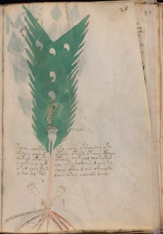

# Voynich Speculative Herbal Ferment Recipe — f38r

IMPORTANT: this is NOT a real or validated translation of the Voynich Manuscript. It is a speculative/procedural model that interprets EVA using a user-defined grammar to generate experimental recipes using safe, known edible substitutes.

This file is generated automatically from IVTFF/EVA transliteration plus a user-defined procedural grammar.



## Page / Folio
- currier: A
- folio: f38r
- page_number: 73
- section: herbal

## EVA Text (Transliteration)
```text
tolor chockhy oky choiin okshol oly oky
okshey chodys ytoiin otaiin otaiin cthar
qokor okaiin otaiin qo kchol chokokor
ychok chey chckh chy chk[o:y] r odaiin d aiin sy
o kor chey kain chor ctho dain ckholdy
ysho sho kos daiin okoy chochor daiin
```

## Domain Context (Heuristic; Not a Translation)

This section summarizes recurring **basewords** in this IVTFF domain and shows simple substring evidence that the token markers used by the procedural grammar occur inside frequent words.

Any Italian anagram / English gloss is a best-effort lexicon match, not a decipherment.


### Associated basewords (non-generic; top by frequency in this domain)
- `daiin` (count=461) → Italian anagram `piani`; English: plans (arrangements)
- `okaiin` (count=59) → Italian anagram `coniai`; English: [n/a]
- `chaiin` (count=39) → Italian anagram `acini`; English: [n/a]
- `saiin` (count=37) → Italian anagram `asini`; English: [n/a]
- `qokaiin` (count=34) → Italian anagram `ciancio`; English: [n/a]
- `qokar` (count=29) → Italian anagram `carco`; English: [n/a]
- `odaiin` (count=27) → Italian anagram `inopia`; English: poverty
- `otchol` (count=25) → Italian anagram `colto`; English: cultivated
- `kaiin` (count=24) → Italian anagram `acini`; English: [n/a]
- `chodaiin` (count=24) → Italian anagram `apocini`; English: [n/a]
- `qotol` (count=20) → Italian anagram `colto`; English: cultivated
- `okain` (count=19) → Italian anagram `acino`; English: a berry
- `qotor` (count=18) → Italian anagram `corto`; English: short
- `ykaiin` (count=16) → Italian anagram `acini`; English: [n/a]
- `qodaiin` (count=15) → Italian anagram `apocini`; English: [n/a]

### Marker evidence (substring in frequent basewords)
- `qo`: 57 basewords; examples: `qotchy`, `qokchy`, `qokedy`, `qokaiin`, `qoky`, `qokol`
- `q`: 58 basewords; examples: `qotchy`, `qokchy`, `qokedy`, `qokaiin`, `qoky`, `qokol`
- `o`: 252 basewords; examples: `chol`, `o`, `chor`, `or`, `shol`, `ol`
- `k`: 142 basewords; examples: `okaiin`, `oky`, `chckhy`, `qokchy`, `qokedy`, `okal`
- `t`: 102 basewords; examples: `cthy`, `oty`, `qotchy`, `cthol`, `cthor`, `otaiin`
- `p`: 15 basewords; examples: `cphy`, `ypchedy`, `opchy`, `opchey`, `pchor`, `qopchy`
- `ch`: 138 basewords; examples: `chol`, `chor`, `chy`, `chey`, `chedy`, `chdy`
- `sh`: 46 basewords; examples: `shol`, `sho`, `shy`, `shor`, `shey`, `shedy`
- `f`: 1 basewords; examples: `f`
- `cth`: 17 basewords; examples: `cthy`, `cthol`, `cthor`, `cthey`, `chcthy`, `ctho`
- `ckh`: 15 basewords; examples: `chckhy`, `ckhy`, `ckhol`, `ckhey`, `checkhy`, `shckhy`
- `cph`: 2 basewords; examples: `cphy`, `cphol`
- `dy`: 78 basewords; examples: `dy`, `chedy`, `chdy`, `chody`, `qokedy`, `shedy`
- `iin`: 39 basewords; examples: `daiin`, `aiin`, `okaiin`, `chaiin`, `saiin`, `qokaiin`
- `aiin`: 32 basewords; examples: `daiin`, `aiin`, `okaiin`, `chaiin`, `saiin`, `qokaiin`

## Recipes Index (This Page)
- [f38r.1,@P0](#f38r-1-f38r-1-p0)
- [f38r.2,+P0](#f38r-2-f38r-2-p0)
- [f38r.3,+P0](#f38r-3-f38r-3-p0)
- [f38r.4,+P0](#f38r-4-f38r-4-p0)
- [f38r.5,+P0](#f38r-5-f38r-5-p0)
- [f38r.6,+P0](#f38r-6-f38r-6-p0)

## Line Glosses (Procedural Gloss Only; Not a Translation)

<a id="f38r-1-f38r-1-p0"></a>

### f38r.1,@P0

EVA: tolor chockhy oky choiin okshol oly oky

Direct Gloss (Procedural, Not a Real Translation):
- tolor: apply heat/cooking → mix / transfer
- chockhy: add main plant (safe substitute) → mix / transfer → add complex herbal compound (safe blend)
- oky: add fermentable sugars → mix / transfer
- choiin: add main plant (safe substitute) → mix / transfer → duration level 2 → state: cooling/rest → medium fermentation phase
- okshol: add fermentable sugars → add secondary herb (safe substitute) → mix / transfer
- oly: mix / transfer
- oky: add fermentable sugars → mix / transfer

<a id="f38r-2-f38r-2-p0"></a>

### f38r.2,+P0

EVA: okshey chodys ytoiin otaiin otaiin cthar

Direct Gloss (Procedural, Not a Real Translation):
- okshey: add fermentable sugars → add secondary herb (safe substitute) → mix / transfer → duration level 1 → state: active extraction
- chodys: add main plant (safe substitute) → mix / transfer → start fermentation (yeast)
- ytoiin: apply heat/cooking → mix / transfer → duration level 2 → state: cooling/rest → medium fermentation phase
- otaiin: apply heat/cooking → mix / transfer → duration level 1 → state: fermentation start → long fermentation / aging phase
- otaiin: apply heat/cooking → mix / transfer → duration level 1 → state: fermentation start → long fermentation / aging phase
- cthar: add complex herbal compound (safe blend) → duration level 1 → state: fermentation start

<a id="f38r-3-f38r-3-p0"></a>

### f38r.3,+P0

EVA: qokor okaiin otaiin qo kchol chokokor

Direct Gloss (Procedural, Not a Real Translation):
- qokor: prepare liquid base → add fermentable sugars → mix / transfer
- okaiin: add fermentable sugars → mix / transfer → duration level 1 → state: fermentation start → long fermentation / aging phase
- otaiin: apply heat/cooking → mix / transfer → duration level 1 → state: fermentation start → long fermentation / aging phase
- qo: prepare liquid base
- kchol: add fermentable sugars → add main plant (safe substitute) → mix / transfer
- chokokor: add fermentable sugars → add main plant (safe substitute) → mix / transfer

<a id="f38r-4-f38r-4-p0"></a>

### f38r.4,+P0

EVA: ychok chey chckh chy chk[o:y] r odaiin d aiin sy

Direct Gloss (Procedural, Not a Real Translation):
- ychok: add fermentable sugars → add main plant (safe substitute) → mix / transfer
- chey: add main plant (safe substitute) → duration level 1 → state: active extraction
- chckh: add main plant (safe substitute) → add complex herbal compound (safe blend)
- chy: add main plant (safe substitute)
- chk: add fermentable sugars → add main plant (safe substitute)
- o: mix / transfer
- y: [unparsed]
- r: [unparsed]
- odaiin: mix / transfer → start fermentation (yeast) → duration level 1 → state: fermentation start → long fermentation / aging phase
- d: start fermentation (yeast)
- aiin: duration level 1 → state: fermentation start → long fermentation / aging phase
- sy: [unparsed]

<a id="f38r-5-f38r-5-p0"></a>

### f38r.5,+P0

EVA: o kor chey kain chor ctho dain ckholdy

Direct Gloss (Procedural, Not a Real Translation):
- o: mix / transfer
- kor: add fermentable sugars → mix / transfer
- chey: add main plant (safe substitute) → duration level 1 → state: active extraction
- kain: add fermentable sugars → duration level 1 → state: fermentation start
- chor: add main plant (safe substitute) → mix / transfer
- ctho: mix / transfer → add complex herbal compound (safe blend)
- dain: start fermentation (yeast) → duration level 1 → state: fermentation start
- ckholdy: mix / transfer → start fermentation (yeast) → add complex herbal compound (safe blend)

<a id="f38r-6-f38r-6-p0"></a>

### f38r.6,+P0

EVA: ysho sho kos daiin okoy chochor daiin

Direct Gloss (Procedural, Not a Real Translation):
- ysho: add secondary herb (safe substitute) → mix / transfer
- sho: add secondary herb (safe substitute) → mix / transfer
- kos: add fermentable sugars → mix / transfer
- daiin: start fermentation (yeast) → duration level 1 → state: fermentation start → long fermentation / aging phase
- okoy: add fermentable sugars → mix / transfer
- chochor: add main plant (safe substitute) → mix / transfer
- daiin: start fermentation (yeast) → duration level 1 → state: fermentation start → long fermentation / aging phase
