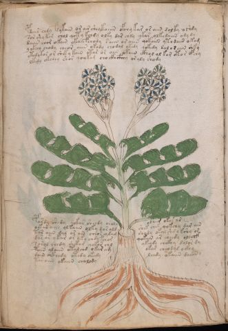

# Voynich Speculative Procedural Protocol — f39v

IMPORTANT: this is NOT a real or validated translation of the Voynich Manuscript. It is a speculative/procedural model that interprets EVA using a user-defined grammar to generate experimental recipes using safe, known edible substitutes.

This file is generated automatically from IVTFF/EVA transliteration plus a user-defined procedural grammar.



## Page / Folio
- currier: B
- folio: f39v
- page_number: 76
- section: herbal

## EVA Text (Transliteration)
```text
pdair chdy fdykain or air sheykaiiin ofchy kar or aiin dolky o[sh:i'h]dy
sor shy kar chol qoty kchdy olky dar chdy ykar olkedaiin ody dy
daiin chor okain okaii fchody saiin or aiin qokaiin ytodaiin okam
y okeey chody cheor aiin okody chodal ykedy qokedy dal o [d:?] aiin shky
ytedykor or sheky kain otar or aiin okaiin ckhol ol kor oto r ofchy
lkedy okchey shor qoykam cho ckhcfhhy or aly shody
pardy shedy qokar sheedy oraly olaiir okar ar
oekar aiin olkaiin olky dar ald shek chek qokchy dar ain
tar aiin dal ar ain cheor ydam shody okal shd y kshy or
dar ar ykar or yky chdy fchor qokain ar sheedy olchef
sarol chedy shekam q[o:e]kar chl ykeedy chckhy dalor dy
paiin alaiin otal chd okar am okar cheodal ockhy
dain ockhedy otedy okedy lchdy okaiin daiiin y
tar aiin okaiin cholody
```

## Domain Context (Heuristic; Not a Translation)

This section summarizes recurring **basewords** in this IVTFF domain and shows simple substring evidence that the token markers used by the procedural grammar occur inside frequent words.

Any Italian anagram / English gloss is a best-effort lexicon match, not a decipherment.


### Associated basewords (non-generic; top by frequency in this domain)
- `daiin` (count=461) → Italian anagram `piani`; English: plans (arrangements)
- `okaiin` (count=59) → Italian anagram `coniai`; English: [n/a]
- `chaiin` (count=39) → Italian anagram `acini`; English: [n/a]
- `saiin` (count=37) → Italian anagram `asini`; English: [n/a]
- `qokaiin` (count=34) → Italian anagram `ciancio`; English: [n/a]
- `qokar` (count=29) → Italian anagram `carco`; English: [n/a]
- `odaiin` (count=27) → Italian anagram `inopia`; English: poverty
- `otchol` (count=25) → Italian anagram `colto`; English: cultivated
- `kaiin` (count=24) → Italian anagram `acini`; English: [n/a]
- `chodaiin` (count=24) → Italian anagram `apocini`; English: [n/a]
- `qotol` (count=20) → Italian anagram `colto`; English: cultivated
- `okain` (count=19) → Italian anagram `acino`; English: a berry
- `qotor` (count=18) → Italian anagram `corto`; English: short
- `ykaiin` (count=16) → Italian anagram `acini`; English: [n/a]
- `qodaiin` (count=15) → Italian anagram `apocini`; English: [n/a]

### Marker evidence (substring in frequent basewords)
- `qo`: 57 basewords; examples: `qotchy`, `qokchy`, `qokedy`, `qokaiin`, `qoky`, `qokol`
- `q`: 58 basewords; examples: `qotchy`, `qokchy`, `qokedy`, `qokaiin`, `qoky`, `qokol`
- `o`: 252 basewords; examples: `chol`, `o`, `chor`, `or`, `shol`, `ol`
- `k`: 142 basewords; examples: `okaiin`, `oky`, `chckhy`, `qokchy`, `qokedy`, `okal`
- `t`: 102 basewords; examples: `cthy`, `oty`, `qotchy`, `cthol`, `cthor`, `otaiin`
- `p`: 15 basewords; examples: `cphy`, `ypchedy`, `opchy`, `opchey`, `pchor`, `qopchy`
- `ch`: 138 basewords; examples: `chol`, `chor`, `chy`, `chey`, `chedy`, `chdy`
- `sh`: 46 basewords; examples: `shol`, `sho`, `shy`, `shor`, `shey`, `shedy`
- `f`: 1 basewords; examples: `f`
- `cth`: 17 basewords; examples: `cthy`, `cthol`, `cthor`, `cthey`, `chcthy`, `ctho`
- `ckh`: 15 basewords; examples: `chckhy`, `ckhy`, `ckhol`, `ckhey`, `checkhy`, `shckhy`
- `cph`: 2 basewords; examples: `cphy`, `cphol`
- `dy`: 78 basewords; examples: `dy`, `chedy`, `chdy`, `chody`, `qokedy`, `shedy`
- `iin`: 39 basewords; examples: `daiin`, `aiin`, `okaiin`, `chaiin`, `saiin`, `qokaiin`
- `aiin`: 32 basewords; examples: `daiin`, `aiin`, `okaiin`, `chaiin`, `saiin`, `qokaiin`

## Recipes Index (This Page)
- [f39v.1,@P0](#f39v-1-f39v-1-p0)
- [f39v.2,+P0](#f39v-2-f39v-2-p0)
- [f39v.3,+P0](#f39v-3-f39v-3-p0)
- [f39v.4,+P0](#f39v-4-f39v-4-p0)
- [f39v.5,+P0](#f39v-5-f39v-5-p0)
- [f39v.6,+P0](#f39v-6-f39v-6-p0)
- [f39v.7,+P0](#f39v-7-f39v-7-p0)
- [f39v.8,+P0](#f39v-8-f39v-8-p0)
- [f39v.9,+P0](#f39v-9-f39v-9-p0)
- [f39v.10,+P0](#f39v-10-f39v-10-p0)
- [f39v.11,+P0](#f39v-11-f39v-11-p0)
- [f39v.12,+P0](#f39v-12-f39v-12-p0)
- [f39v.13,+P0](#f39v-13-f39v-13-p0)
- [f39v.14,+P0](#f39v-14-f39v-14-p0)

## Line Glosses (Procedural Gloss Only; Not a Translation)

<a id="f39v-1-f39v-1-p0"></a>

### f39v.1,@P0

EVA: pdair chdy fdykain or air sheykaiiin ofchy kar or aiin dolky o[sh:i'h]dy

Direct Gloss (Procedural, Not a Real Translation):
- pdair: add starter / activate → duration level 1 → state: phase transition/start
- chdy: add main plant (safe substitute) → add starter / activate
- fdykain: add fermentable sugars → add aroma modifier → add starter / activate → duration level 1 → state: phase transition/start
- or: mix / transfer
- air: duration level 1 → state: phase transition/start
- sheykaiiin: add fermentable sugars → add secondary herb (safe substitute) → duration level 1 → state: active extraction → medium phase
- ofchy: add main plant (safe substitute) → add aroma modifier → mix / transfer
- kar: add fermentable sugars → duration level 1 → state: phase transition/start
- or: mix / transfer
- aiin: duration level 1 → state: phase transition/start → long phase
- dolky: add fermentable sugars → mix / transfer → add starter / activate
- o: mix / transfer
- sh: add secondary herb (safe substitute)
- i: duration level 1 → state: cooling/rest
- h: unmodeled token(s) present: h
- dy: add starter / activate

<a id="f39v-2-f39v-2-p0"></a>

### f39v.2,+P0

EVA: sor shy kar chol qoty kchdy olky dar chdy ykar olkedaiin ody dy

Direct Gloss (Procedural, Not a Real Translation):
- sor: mix / transfer
- shy: add secondary herb (safe substitute)
- kar: add fermentable sugars → duration level 1 → state: phase transition/start
- chol: add main plant (safe substitute) → mix / transfer
- qoty: prepare liquid base → apply heat/cooking
- kchdy: add fermentable sugars → add main plant (safe substitute) → add starter / activate
- olky: add fermentable sugars → mix / transfer
- dar: add starter / activate → duration level 1 → state: phase transition/start
- chdy: add main plant (safe substitute) → add starter / activate
- ykar: add fermentable sugars → duration level 1 → state: phase transition/start
- olkedaiin: add fermentable sugars → mix / transfer → add starter / activate → duration level 1 → state: active extraction → long phase
- ody: mix / transfer → add starter / activate
- dy: add starter / activate

<a id="f39v-3-f39v-3-p0"></a>

### f39v.3,+P0

EVA: daiin chor okain okaii fchody saiin or aiin qokaiin ytodaiin okam

Direct Gloss (Procedural, Not a Real Translation):
- daiin: add starter / activate → duration level 1 → state: phase transition/start → long phase
- chor: add main plant (safe substitute) → mix / transfer
- okain: add fermentable sugars → mix / transfer → duration level 1 → state: phase transition/start
- okaii: add fermentable sugars → mix / transfer → duration level 1 → state: phase transition/start
- fchody: add main plant (safe substitute) → add aroma modifier → mix / transfer → add starter / activate
- saiin: duration level 1 → state: phase transition/start → long phase
- or: mix / transfer
- aiin: duration level 1 → state: phase transition/start → long phase
- qokaiin: prepare liquid base → add fermentable sugars → duration level 1 → state: phase transition/start → long phase
- ytodaiin: apply heat/cooking → mix / transfer → add starter / activate → duration level 1 → state: phase transition/start → long phase
- okam: add fermentable sugars → mix / transfer → duration level 1 → state: phase transition/start

<a id="f39v-4-f39v-4-p0"></a>

### f39v.4,+P0

EVA: y okeey chody cheor aiin okody chodal ykedy qokedy dal o [d:?] aiin shky

Direct Gloss (Procedural, Not a Real Translation):
- y: [unparsed]
- okeey: add fermentable sugars → mix / transfer → duration level 2 → state: active extraction
- chody: add main plant (safe substitute) → mix / transfer → add starter / activate
- cheor: add main plant (safe substitute) → mix / transfer → duration level 1 → state: active extraction
- aiin: duration level 1 → state: phase transition/start → long phase
- okody: add fermentable sugars → mix / transfer → add starter / activate
- chodal: add main plant (safe substitute) → mix / transfer → add starter / activate → duration level 1 → state: phase transition/start
- ykedy: add fermentable sugars → add starter / activate → duration level 1 → state: active extraction
- qokedy: prepare liquid base → add fermentable sugars → add starter / activate → duration level 1 → state: active extraction
- dal: add starter / activate → duration level 1 → state: phase transition/start
- o: mix / transfer
- d: add starter / activate
- aiin: duration level 1 → state: phase transition/start → long phase
- shky: add fermentable sugars → add secondary herb (safe substitute)

<a id="f39v-5-f39v-5-p0"></a>

### f39v.5,+P0

EVA: ytedykor or sheky kain otar or aiin okaiin ckhol ol kor oto r ofchy

Direct Gloss (Procedural, Not a Real Translation):
- ytedykor: add fermentable sugars → apply heat/cooking → mix / transfer → add starter / activate → duration level 1 → state: active extraction
- or: mix / transfer
- sheky: add fermentable sugars → add secondary herb (safe substitute) → duration level 1 → state: active extraction
- kain: add fermentable sugars → duration level 1 → state: phase transition/start
- otar: apply heat/cooking → mix / transfer → duration level 1 → state: phase transition/start
- or: mix / transfer
- aiin: duration level 1 → state: phase transition/start → long phase
- okaiin: add fermentable sugars → mix / transfer → duration level 1 → state: phase transition/start → long phase
- ckhol: mix / transfer → add complex herbal compound (safe blend)
- ol: mix / transfer
- kor: add fermentable sugars → mix / transfer
- oto: apply heat/cooking → mix / transfer
- r: [unparsed]
- ofchy: add main plant (safe substitute) → add aroma modifier → mix / transfer

<a id="f39v-6-f39v-6-p0"></a>

### f39v.6,+P0

EVA: lkedy okchey shor qoykam cho ckhcfhhy or aly shody

Direct Gloss (Procedural, Not a Real Translation):
- lkedy: add fermentable sugars → add starter / activate → duration level 1 → state: active extraction
- okchey: add fermentable sugars → add main plant (safe substitute) → mix / transfer → duration level 1 → state: active extraction
- shor: add secondary herb (safe substitute) → mix / transfer
- qoykam: prepare liquid base → add fermentable sugars → duration level 1 → state: phase transition/start
- cho: add main plant (safe substitute) → mix / transfer
- ckhcfhhy: add complex herbal compound (safe blend) → unmodeled token(s) present: h
- or: mix / transfer
- aly: duration level 1 → state: phase transition/start
- shody: add secondary herb (safe substitute) → mix / transfer → add starter / activate

<a id="f39v-7-f39v-7-p0"></a>

### f39v.7,+P0

EVA: pardy shedy qokar sheedy oraly olaiir okar ar

Direct Gloss (Procedural, Not a Real Translation):
- pardy: add starter / activate → duration level 1 → state: phase transition/start
- shedy: add secondary herb (safe substitute) → add starter / activate → duration level 1 → state: active extraction
- qokar: prepare liquid base → add fermentable sugars → duration level 1 → state: phase transition/start
- sheedy: add secondary herb (safe substitute) → add starter / activate → duration level 2 → state: active extraction
- oraly: mix / transfer → duration level 1 → state: phase transition/start
- olaiir: mix / transfer → duration level 1 → state: phase transition/start
- okar: add fermentable sugars → mix / transfer → duration level 1 → state: phase transition/start
- ar: duration level 1 → state: phase transition/start

<a id="f39v-8-f39v-8-p0"></a>

### f39v.8,+P0

EVA: oekar aiin olkaiin olky dar ald shek chek qokchy dar ain

Direct Gloss (Procedural, Not a Real Translation):
- oekar: add fermentable sugars → mix / transfer → duration level 1 → state: active extraction
- aiin: duration level 1 → state: phase transition/start → long phase
- olkaiin: add fermentable sugars → mix / transfer → duration level 1 → state: phase transition/start → long phase
- olky: add fermentable sugars → mix / transfer
- dar: add starter / activate → duration level 1 → state: phase transition/start
- ald: add starter / activate → duration level 1 → state: phase transition/start
- shek: add fermentable sugars → add secondary herb (safe substitute) → duration level 1 → state: active extraction
- chek: add fermentable sugars → add main plant (safe substitute) → duration level 1 → state: active extraction
- qokchy: prepare liquid base → add fermentable sugars → add main plant (safe substitute)
- dar: add starter / activate → duration level 1 → state: phase transition/start
- ain: duration level 1 → state: phase transition/start

<a id="f39v-9-f39v-9-p0"></a>

### f39v.9,+P0

EVA: tar aiin dal ar ain cheor ydam shody okal shd y kshy or

Direct Gloss (Procedural, Not a Real Translation):
- tar: apply heat/cooking → duration level 1 → state: phase transition/start
- aiin: duration level 1 → state: phase transition/start → long phase
- dal: add starter / activate → duration level 1 → state: phase transition/start
- ar: duration level 1 → state: phase transition/start
- ain: duration level 1 → state: phase transition/start
- cheor: add main plant (safe substitute) → mix / transfer → duration level 1 → state: active extraction
- ydam: add starter / activate → duration level 1 → state: phase transition/start
- shody: add secondary herb (safe substitute) → mix / transfer → add starter / activate
- okal: add fermentable sugars → mix / transfer → duration level 1 → state: phase transition/start
- shd: add secondary herb (safe substitute) → add starter / activate
- y: [unparsed]
- kshy: add fermentable sugars → add secondary herb (safe substitute)
- or: mix / transfer

<a id="f39v-10-f39v-10-p0"></a>

### f39v.10,+P0

EVA: dar ar ykar or yky chdy fchor qokain ar sheedy olchef

Direct Gloss (Procedural, Not a Real Translation):
- dar: add starter / activate → duration level 1 → state: phase transition/start
- ar: duration level 1 → state: phase transition/start
- ykar: add fermentable sugars → duration level 1 → state: phase transition/start
- or: mix / transfer
- yky: add fermentable sugars
- chdy: add main plant (safe substitute) → add starter / activate
- fchor: add main plant (safe substitute) → add aroma modifier → mix / transfer
- qokain: prepare liquid base → add fermentable sugars → duration level 1 → state: phase transition/start
- ar: duration level 1 → state: phase transition/start
- sheedy: add secondary herb (safe substitute) → add starter / activate → duration level 2 → state: active extraction
- olchef: add main plant (safe substitute) → add aroma modifier → mix / transfer → duration level 1 → state: active extraction

<a id="f39v-11-f39v-11-p0"></a>

### f39v.11,+P0

EVA: sarol chedy shekam q[o:e]kar chl ykeedy chckhy dalor dy

Direct Gloss (Procedural, Not a Real Translation):
- sarol: mix / transfer → duration level 1 → state: phase transition/start
- chedy: add main plant (safe substitute) → add starter / activate → duration level 1 → state: active extraction
- shekam: add fermentable sugars → add secondary herb (safe substitute) → duration level 1 → state: active extraction
- q: prepare base (generic)
- o: mix / transfer
- e: duration level 1 → state: active extraction
- kar: add fermentable sugars → duration level 1 → state: phase transition/start
- chl: add main plant (safe substitute)
- ykeedy: add fermentable sugars → add starter / activate → duration level 2 → state: active extraction
- chckhy: add main plant (safe substitute) → add complex herbal compound (safe blend)
- dalor: mix / transfer → add starter / activate → duration level 1 → state: phase transition/start
- dy: add starter / activate

<a id="f39v-12-f39v-12-p0"></a>

### f39v.12,+P0

EVA: paiin alaiin otal chd okar am okar cheodal ockhy

Direct Gloss (Procedural, Not a Real Translation):
- paiin: add starter / activate → duration level 1 → state: phase transition/start → long phase
- alaiin: duration level 1 → state: phase transition/start → long phase
- otal: apply heat/cooking → mix / transfer → duration level 1 → state: phase transition/start
- chd: add main plant (safe substitute) → add starter / activate
- okar: add fermentable sugars → mix / transfer → duration level 1 → state: phase transition/start
- am: duration level 1 → state: phase transition/start
- okar: add fermentable sugars → mix / transfer → duration level 1 → state: phase transition/start
- cheodal: add main plant (safe substitute) → mix / transfer → add starter / activate → duration level 1 → state: active extraction
- ockhy: mix / transfer → add complex herbal compound (safe blend)

<a id="f39v-13-f39v-13-p0"></a>

### f39v.13,+P0

EVA: dain ockhedy otedy okedy lchdy okaiin daiiin y

Direct Gloss (Procedural, Not a Real Translation):
- dain: add starter / activate → duration level 1 → state: phase transition/start
- ockhedy: mix / transfer → add starter / activate → add complex herbal compound (safe blend) → duration level 1 → state: active extraction
- otedy: apply heat/cooking → mix / transfer → add starter / activate → duration level 1 → state: active extraction
- okedy: add fermentable sugars → mix / transfer → add starter / activate → duration level 1 → state: active extraction
- lchdy: add main plant (safe substitute) → add starter / activate
- okaiin: add fermentable sugars → mix / transfer → duration level 1 → state: phase transition/start → long phase
- daiiin: add starter / activate → duration level 1 → state: phase transition/start → medium phase
- y: [unparsed]

<a id="f39v-14-f39v-14-p0"></a>

### f39v.14,+P0

EVA: tar aiin okaiin cholody

Direct Gloss (Procedural, Not a Real Translation):
- tar: apply heat/cooking → duration level 1 → state: phase transition/start
- aiin: duration level 1 → state: phase transition/start → long phase
- okaiin: add fermentable sugars → mix / transfer → duration level 1 → state: phase transition/start → long phase
- cholody: add main plant (safe substitute) → mix / transfer → add starter / activate
