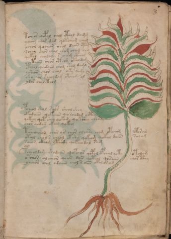

# Voynich Speculative Procedural Protocol — f3r

IMPORTANT: this is NOT a real or validated translation of the Voynich Manuscript. It is a speculative/procedural model that interprets EVA using a user-defined grammar to generate experimental recipes using safe, known edible substitutes.

This file is generated automatically from IVTFF/EVA transliteration plus a user-defined procedural grammar.



## Page / Folio
- currier: A
- folio: f3r
- page_number: 5
- section: herbal

## EVA Text (Transliteration)
```text
tsheos qopal chol cthol daimg
ycheor chor dam qotcham cham
ochor qocheor chol daiin cthy
schey chor chal chag cham cho
qokol chololy s cham cthol
ychtaiin chor cthom otaldam
otchol qodaiin chom shom damo
ysheor chor chol oky dago
sho vor sheoldam otchody ol
ydar cholcthom
pcheol shol sols sheol shey
okadaiin qokchor qo schodam octhy
qokeey qot shey qokody qokshey cheody
chor qodair okeey qokeey
tsheoarom shor or chor olchsy chom otchom oporar
oteol chol s cheol ekshy qokeom qokol daiin soleeg
soeom okeom yteody qokeeodal sam
pcheoldom shodaiin qopchor qopol opchol qoty otolom
otchor ol cheor qoeor dair qoteol qosaiin chor cthy
ycheor chol odaiin chol s aiin okol or am
```

## Domain Context (Heuristic; Not a Translation)

This section summarizes recurring **basewords** in this IVTFF domain and shows simple substring evidence that the token markers used by the procedural grammar occur inside frequent words.

Any Italian anagram / English gloss is a best-effort lexicon match, not a decipherment.


### Associated basewords (non-generic; top by frequency in this domain)
- `daiin` (count=461) → Italian anagram `piani`; English: plans (arrangements)
- `okaiin` (count=59) → Italian anagram `coniai`; English: [n/a]
- `chaiin` (count=39) → Italian anagram `acini`; English: [n/a]
- `saiin` (count=37) → Italian anagram `asini`; English: [n/a]
- `qokaiin` (count=34) → Italian anagram `ciancio`; English: [n/a]
- `qokar` (count=29) → Italian anagram `carco`; English: [n/a]
- `odaiin` (count=27) → Italian anagram `inopia`; English: poverty
- `otchol` (count=25) → Italian anagram `colto`; English: cultivated
- `kaiin` (count=24) → Italian anagram `acini`; English: [n/a]
- `chodaiin` (count=24) → Italian anagram `apocini`; English: [n/a]
- `qotol` (count=20) → Italian anagram `colto`; English: cultivated
- `okain` (count=19) → Italian anagram `acino`; English: a berry
- `qotor` (count=18) → Italian anagram `corto`; English: short
- `ykaiin` (count=16) → Italian anagram `acini`; English: [n/a]
- `qodaiin` (count=15) → Italian anagram `apocini`; English: [n/a]

### Marker evidence (substring in frequent basewords)
- `qo`: 57 basewords; examples: `qotchy`, `qokchy`, `qokedy`, `qokaiin`, `qoky`, `qokol`
- `q`: 58 basewords; examples: `qotchy`, `qokchy`, `qokedy`, `qokaiin`, `qoky`, `qokol`
- `o`: 252 basewords; examples: `chol`, `o`, `chor`, `or`, `shol`, `ol`
- `k`: 142 basewords; examples: `okaiin`, `oky`, `chckhy`, `qokchy`, `qokedy`, `okal`
- `t`: 102 basewords; examples: `cthy`, `oty`, `qotchy`, `cthol`, `cthor`, `otaiin`
- `p`: 15 basewords; examples: `cphy`, `ypchedy`, `opchy`, `opchey`, `pchor`, `qopchy`
- `ch`: 138 basewords; examples: `chol`, `chor`, `chy`, `chey`, `chedy`, `chdy`
- `sh`: 46 basewords; examples: `shol`, `sho`, `shy`, `shor`, `shey`, `shedy`
- `f`: 1 basewords; examples: `f`
- `cth`: 17 basewords; examples: `cthy`, `cthol`, `cthor`, `cthey`, `chcthy`, `ctho`
- `ckh`: 15 basewords; examples: `chckhy`, `ckhy`, `ckhol`, `ckhey`, `checkhy`, `shckhy`
- `cph`: 2 basewords; examples: `cphy`, `cphol`
- `dy`: 78 basewords; examples: `dy`, `chedy`, `chdy`, `chody`, `qokedy`, `shedy`
- `iin`: 39 basewords; examples: `daiin`, `aiin`, `okaiin`, `chaiin`, `saiin`, `qokaiin`
- `aiin`: 32 basewords; examples: `daiin`, `aiin`, `okaiin`, `chaiin`, `saiin`, `qokaiin`

## Recipes Index (This Page)
- [f3r.1,@P0](#f3r-1-f3r-1-p0)
- [f3r.2,+P0](#f3r-2-f3r-2-p0)
- [f3r.3,+P0](#f3r-3-f3r-3-p0)
- [f3r.4,+P0](#f3r-4-f3r-4-p0)
- [f3r.5,+P0](#f3r-5-f3r-5-p0)
- [f3r.6,+P0](#f3r-6-f3r-6-p0)
- [f3r.7,+P0](#f3r-7-f3r-7-p0)
- [f3r.8,+P0](#f3r-8-f3r-8-p0)
- [f3r.9,+P0](#f3r-9-f3r-9-p0)
- [f3r.10,+P0](#f3r-10-f3r-10-p0)
- [f3r.11,+P0](#f3r-11-f3r-11-p0)
- [f3r.12,+P0](#f3r-12-f3r-12-p0)
- [f3r.13,+P0](#f3r-13-f3r-13-p0)
- [f3r.14,+P0](#f3r-14-f3r-14-p0)
- [f3r.15,+P0](#f3r-15-f3r-15-p0)
- [f3r.16,+P0](#f3r-16-f3r-16-p0)
- [f3r.17,+P0](#f3r-17-f3r-17-p0)
- [f3r.18,+P0](#f3r-18-f3r-18-p0)
- [f3r.19,+P0](#f3r-19-f3r-19-p0)
- [f3r.20,+P0](#f3r-20-f3r-20-p0)

## Line Glosses (Procedural Gloss Only; Not a Translation)

<a id="f3r-1-f3r-1-p0"></a>

### f3r.1,@P0

EVA: tsheos qopal chol cthol daimg

Direct Gloss (Procedural, Not a Real Translation):
- tsheos: tokens: t sh e o s → connectors: s → vowel_run: e (level 1; class e)
- qopal: tokens: qo p a l → connectors: l → vowel_run: a (level 1; class a)
- chol: tokens: ch o l → connectors: l
- cthol: tokens: cth o l → connectors: l
- daimg: tokens: p a i m g → connectors: m → vowel_run: a (level 1; class a)

<a id="f3r-2-f3r-2-p0"></a>

### f3r.2,+P0

EVA: ycheor chor dam qotcham cham

Direct Gloss (Procedural, Not a Real Translation):
- ycheor: tokens: ch e o r → connectors: r → vowel_run: e (level 1; class e)
- chor: tokens: ch o r → connectors: r
- dam: tokens: p a m → connectors: m → vowel_run: a (level 1; class a)
- qotcham: tokens: qo t ch a m → connectors: m → vowel_run: a (level 1; class a)
- cham: tokens: ch a m → connectors: m → vowel_run: a (level 1; class a)

<a id="f3r-3-f3r-3-p0"></a>

### f3r.3,+P0

EVA: ochor qocheor chol daiin cthy

Direct Gloss (Procedural, Not a Real Translation):
- ochor: tokens: o ch o r → connectors: r
- qocheor: tokens: qo ch e o r → connectors: r → vowel_run: e (level 1; class e)
- chol: tokens: ch o l → connectors: l
- daiin: tokens: p aiin → vowel_run: a (level 1; class a) → suffix: aiin (lexicon-context: `daiin` → `piani`; plans (arrangements))
- cthy: tokens: cth

<a id="f3r-4-f3r-4-p0"></a>

### f3r.4,+P0

EVA: schey chor chal chag cham cho

Direct Gloss (Procedural, Not a Real Translation):
- schey: tokens: s ch e → connectors: s → vowel_run: e (level 1; class e)
- chor: tokens: ch o r → connectors: r
- chal: tokens: ch a l → connectors: l → vowel_run: a (level 1; class a)
- chag: tokens: ch a g → vowel_run: a (level 1; class a)
- cham: tokens: ch a m → connectors: m → vowel_run: a (level 1; class a)
- cho: tokens: ch o

<a id="f3r-5-f3r-5-p0"></a>

### f3r.5,+P0

EVA: qokol chololy s cham cthol

Direct Gloss (Procedural, Not a Real Translation):
- qokol: tokens: qo k o l → connectors: l
- chololy: tokens: ch o l o l → connectors: l l
- s: tokens: s → connectors: s
- cham: tokens: ch a m → connectors: m → vowel_run: a (level 1; class a)
- cthol: tokens: cth o l → connectors: l

<a id="f3r-6-f3r-6-p0"></a>

### f3r.6,+P0

EVA: ychtaiin chor cthom otaldam

Direct Gloss (Procedural, Not a Real Translation):
- ychtaiin: tokens: ch t aiin → vowel_run: a (level 1; class a) → suffix: aiin
- chor: tokens: ch o r → connectors: r
- cthom: tokens: cth o m → connectors: m
- otaldam: tokens: o t a l p a m → connectors: l m → vowel_run: a (level 1; class a)

<a id="f3r-7-f3r-7-p0"></a>

### f3r.7,+P0

EVA: otchol qodaiin chom shom damo

Direct Gloss (Procedural, Not a Real Translation):
- otchol: tokens: o t ch o l → connectors: l (lexicon-context: `otchol` → `colto`; cultivated)
- qodaiin: tokens: qo p aiin → vowel_run: a (level 1; class a) → suffix: aiin (lexicon-context: `qodaiin` → `apocini`; [n/a])
- chom: tokens: ch o m → connectors: m
- shom: tokens: sh o m → connectors: m
- damo: tokens: p a m o → connectors: m → vowel_run: a (level 1; class a)

<a id="f3r-8-f3r-8-p0"></a>

### f3r.8,+P0

EVA: ysheor chor chol oky dago

Direct Gloss (Procedural, Not a Real Translation):
- ysheor: tokens: sh e o r → connectors: r → vowel_run: e (level 1; class e)
- chor: tokens: ch o r → connectors: r
- chol: tokens: ch o l → connectors: l
- oky: tokens: o k
- dago: tokens: p a g o → vowel_run: a (level 1; class a)

<a id="f3r-9-f3r-9-p0"></a>

### f3r.9,+P0

EVA: sho vor sheoldam otchody ol

Direct Gloss (Procedural, Not a Real Translation):
- sho: tokens: sh o
- vor: tokens: v o r → connectors: r
- sheoldam: tokens: sh e o l p a m → connectors: l m → vowel_run: e (level 1; class e)
- otchody: tokens: o t ch o p
- ol: tokens: o l → connectors: l

<a id="f3r-10-f3r-10-p0"></a>

### f3r.10,+P0

EVA: ydar cholcthom

Direct Gloss (Procedural, Not a Real Translation):
- ydar: tokens: p a r → connectors: r → vowel_run: a (level 1; class a)
- cholcthom: tokens: ch o l cth o m → connectors: l m

<a id="f3r-11-f3r-11-p0"></a>

### f3r.11,+P0

EVA: pcheol shol sols sheol shey

Direct Gloss (Procedural, Not a Real Translation):
- pcheol: tokens: p ch e o l → connectors: l → vowel_run: e (level 1; class e)
- shol: tokens: sh o l → connectors: l
- sols: tokens: s o l s → connectors: s l s
- sheol: tokens: sh e o l → connectors: l → vowel_run: e (level 1; class e)
- shey: tokens: sh e → vowel_run: e (level 1; class e)

<a id="f3r-12-f3r-12-p0"></a>

### f3r.12,+P0

EVA: okadaiin qokchor qo schodam octhy

Direct Gloss (Procedural, Not a Real Translation):
- okadaiin: tokens: o k a p aiin → vowel_run: a (level 1; class a) → suffix: aiin (lexicon-context: `daiin` → `piani`; plans (arrangements))
- qokchor: tokens: qo k ch o r → connectors: r (lexicon-context: `okchor` → `corco`; [n/a])
- qo: tokens: qo
- schodam: tokens: s ch o p a m → connectors: s m → vowel_run: a (level 1; class a)
- octhy: tokens: o cth

<a id="f3r-13-f3r-13-p0"></a>

### f3r.13,+P0

EVA: qokeey qot shey qokody qokshey cheody

Direct Gloss (Procedural, Not a Real Translation):
- qokeey: tokens: qo k ee → vowel_run: ee (level 2; class e)
- qot: tokens: qo t
- shey: tokens: sh e → vowel_run: e (level 1; class e)
- qokody: tokens: qo k o p
- qokshey: tokens: qo k sh e → vowel_run: e (level 1; class e)
- cheody: tokens: ch e o p → vowel_run: e (level 1; class e)

<a id="f3r-14-f3r-14-p0"></a>

### f3r.14,+P0

EVA: chor qodair okeey qokeey

Direct Gloss (Procedural, Not a Real Translation):
- chor: tokens: ch o r → connectors: r
- qodair: tokens: qo p a i r → connectors: r → vowel_run: a (level 1; class a)
- okeey: tokens: o k ee → vowel_run: ee (level 2; class e)
- qokeey: tokens: qo k ee → vowel_run: ee (level 2; class e)

<a id="f3r-15-f3r-15-p0"></a>

### f3r.15,+P0

EVA: tsheoarom shor or chor olchsy chom otchom oporar

Direct Gloss (Procedural, Not a Real Translation):
- tsheoarom: tokens: t sh e o a r o m → connectors: r m → vowel_run: e (level 1; class e)
- shor: tokens: sh o r → connectors: r
- or: tokens: o r → connectors: r
- chor: tokens: ch o r → connectors: r
- olchsy: tokens: o l ch s → connectors: l s
- chom: tokens: ch o m → connectors: m
- otchom: tokens: o t ch o m → connectors: m
- oporar: tokens: o p o r a r → connectors: r r → vowel_run: a (level 1; class a)

<a id="f3r-16-f3r-16-p0"></a>

### f3r.16,+P0

EVA: oteol chol s cheol ekshy qokeom qokol daiin soleeg

Direct Gloss (Procedural, Not a Real Translation):
- oteol: tokens: o t e o l → connectors: l → vowel_run: e (level 1; class e)
- chol: tokens: ch o l → connectors: l
- s: tokens: s → connectors: s
- cheol: tokens: ch e o l → connectors: l → vowel_run: e (level 1; class e)
- ekshy: tokens: e k sh → vowel_run: e (level 1; class e)
- qokeom: tokens: qo k e o m → connectors: m → vowel_run: e (level 1; class e)
- qokol: tokens: qo k o l → connectors: l
- daiin: tokens: p aiin → vowel_run: a (level 1; class a) → suffix: aiin (lexicon-context: `daiin` → `piani`; plans (arrangements))
- soleeg: tokens: s o l ee g → connectors: s l → vowel_run: ee (level 2; class e)

<a id="f3r-17-f3r-17-p0"></a>

### f3r.17,+P0

EVA: soeom okeom yteody qokeeodal sam

Direct Gloss (Procedural, Not a Real Translation):
- soeom: tokens: s o e o m → connectors: s m → vowel_run: e (level 1; class e)
- okeom: tokens: o k e o m → connectors: m → vowel_run: e (level 1; class e)
- yteody: tokens: t e o p → vowel_run: e (level 1; class e)
- qokeeodal: tokens: qo k ee o p a l → connectors: l → vowel_run: ee (level 2; class e)
- sam: tokens: s a m → connectors: s m → vowel_run: a (level 1; class a)

<a id="f3r-18-f3r-18-p0"></a>

### f3r.18,+P0

EVA: pcheoldom shodaiin qopchor qopol opchol qoty otolom

Direct Gloss (Procedural, Not a Real Translation):
- pcheoldom: tokens: p ch e o l p o m → connectors: l m → vowel_run: e (level 1; class e)
- shodaiin: tokens: sh o p aiin → vowel_run: a (level 1; class a) → suffix: aiin (lexicon-context: `shodaiin` → `sinopia`; [n/a])
- qopchor: tokens: qo p ch o r → connectors: r
- qopol: tokens: qo p o l → connectors: l
- opchol: tokens: o p ch o l → connectors: l
- qoty: tokens: qo t
- otolom: tokens: o t o l o m → connectors: l m

<a id="f3r-19-f3r-19-p0"></a>

### f3r.19,+P0

EVA: otchor ol cheor qoeor dair qoteol qosaiin chor cthy

Direct Gloss (Procedural, Not a Real Translation):
- otchor: tokens: o t ch o r → connectors: r (lexicon-context: `otchor` → `corto`; short)
- ol: tokens: o l → connectors: l
- cheor: tokens: ch e o r → connectors: r → vowel_run: e (level 1; class e)
- qoeor: tokens: qo e o r → connectors: r → vowel_run: e (level 1; class e)
- dair: tokens: p a i r → connectors: r → vowel_run: a (level 1; class a)
- qoteol: tokens: qo t e o l → connectors: l → vowel_run: e (level 1; class e)
- qosaiin: tokens: qo s aiin → connectors: s → vowel_run: a (level 1; class a) → suffix: aiin (lexicon-context: `saiin` → `asini`; [n/a])
- chor: tokens: ch o r → connectors: r
- cthy: tokens: cth

<a id="f3r-20-f3r-20-p0"></a>

### f3r.20,+P0

EVA: ycheor chol odaiin chol s aiin okol or am

Direct Gloss (Procedural, Not a Real Translation):
- ycheor: tokens: ch e o r → connectors: r → vowel_run: e (level 1; class e)
- chol: tokens: ch o l → connectors: l
- odaiin: tokens: o p aiin → vowel_run: a (level 1; class a) → suffix: aiin (lexicon-context: `odaiin` → `inopia`; poverty)
- chol: tokens: ch o l → connectors: l
- s: tokens: s → connectors: s
- aiin: tokens: aiin → vowel_run: a (level 1; class a) → suffix: aiin
- okol: tokens: o k o l → connectors: l
- or: tokens: o r → connectors: r
- am: tokens: a m → connectors: m → vowel_run: a (level 1; class a)
