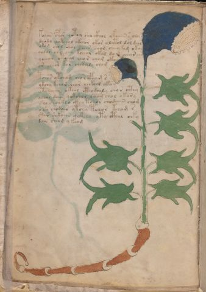

# Voynich Speculative Procedural Protocol — f3v

IMPORTANT: this is NOT a real or validated translation of the Voynich Manuscript. It is a speculative/procedural model that interprets EVA using a user-defined grammar to generate experimental recipes using safe, known edible substitutes.

This file is generated automatically from IVTFF/EVA transliteration plus a user-defined procedural grammar.



## Page / Folio
- currier: A
- folio: f3v
- page_number: 6
- section: herbal

## EVA Text (Transliteration)
```text
koaiin cphor qotoy sha ckhol ykoaiin s oly
daiidy qoteeol okeeor okor olytol dol dar
okom chol shol seees chom cheeykam okai
qodar ees eey kcheol okal do r chear een
ychear otchal cho r char ckh[a:y]
or cheor kor chodaly chom
tchor otcham chor cfham s
ykchy kchom chor chckhol oka
ytcheear okeol cthodoaly chor cthy
ochos daiin qokshol daiim chol okary
sho shockho ckhy tchor chodaiin chom
osh chodair ytchy tchor kcham s
shar shkaiin qokchy yty cthal chky
dain sheam y keam
```

## Domain Context (Heuristic; Not a Translation)

This section summarizes recurring **basewords** in this IVTFF domain and shows simple substring evidence that the token markers used by the procedural grammar occur inside frequent words.

Any Italian anagram / English gloss is a best-effort lexicon match, not a decipherment.


### Associated basewords (non-generic; top by frequency in this domain)
- `daiin` (count=461) → Italian anagram `piani`; English: plans (arrangements)
- `okaiin` (count=59) → Italian anagram `coniai`; English: [n/a]
- `chaiin` (count=39) → Italian anagram `acini`; English: [n/a]
- `saiin` (count=37) → Italian anagram `asini`; English: [n/a]
- `qokaiin` (count=34) → Italian anagram `ciancio`; English: [n/a]
- `qokar` (count=29) → Italian anagram `carco`; English: [n/a]
- `odaiin` (count=27) → Italian anagram `inopia`; English: poverty
- `otchol` (count=25) → Italian anagram `colto`; English: cultivated
- `kaiin` (count=24) → Italian anagram `acini`; English: [n/a]
- `chodaiin` (count=24) → Italian anagram `apocini`; English: [n/a]
- `qotol` (count=20) → Italian anagram `colto`; English: cultivated
- `okain` (count=19) → Italian anagram `acino`; English: a berry
- `qotor` (count=18) → Italian anagram `corto`; English: short
- `ykaiin` (count=16) → Italian anagram `acini`; English: [n/a]
- `qodaiin` (count=15) → Italian anagram `apocini`; English: [n/a]

### Marker evidence (substring in frequent basewords)
- `qo`: 57 basewords; examples: `qotchy`, `qokchy`, `qokedy`, `qokaiin`, `qoky`, `qokol`
- `q`: 58 basewords; examples: `qotchy`, `qokchy`, `qokedy`, `qokaiin`, `qoky`, `qokol`
- `o`: 252 basewords; examples: `chol`, `o`, `chor`, `or`, `shol`, `ol`
- `k`: 142 basewords; examples: `okaiin`, `oky`, `chckhy`, `qokchy`, `qokedy`, `okal`
- `t`: 102 basewords; examples: `cthy`, `oty`, `qotchy`, `cthol`, `cthor`, `otaiin`
- `p`: 15 basewords; examples: `cphy`, `ypchedy`, `opchy`, `opchey`, `pchor`, `qopchy`
- `ch`: 138 basewords; examples: `chol`, `chor`, `chy`, `chey`, `chedy`, `chdy`
- `sh`: 46 basewords; examples: `shol`, `sho`, `shy`, `shor`, `shey`, `shedy`
- `f`: 1 basewords; examples: `f`
- `cth`: 17 basewords; examples: `cthy`, `cthol`, `cthor`, `cthey`, `chcthy`, `ctho`
- `ckh`: 15 basewords; examples: `chckhy`, `ckhy`, `ckhol`, `ckhey`, `checkhy`, `shckhy`
- `cph`: 2 basewords; examples: `cphy`, `cphol`
- `dy`: 78 basewords; examples: `dy`, `chedy`, `chdy`, `chody`, `qokedy`, `shedy`
- `iin`: 39 basewords; examples: `daiin`, `aiin`, `okaiin`, `chaiin`, `saiin`, `qokaiin`
- `aiin`: 32 basewords; examples: `daiin`, `aiin`, `okaiin`, `chaiin`, `saiin`, `qokaiin`

## Recipes Index (This Page)
- [f3v.1,@P0](#f3v-1-f3v-1-p0)
- [f3v.2,+P0](#f3v-2-f3v-2-p0)
- [f3v.3,+P0](#f3v-3-f3v-3-p0)
- [f3v.4,+P0](#f3v-4-f3v-4-p0)
- [f3v.5,+P0](#f3v-5-f3v-5-p0)
- [f3v.6,+P0](#f3v-6-f3v-6-p0)
- [f3v.7,+P0](#f3v-7-f3v-7-p0)
- [f3v.8,+P0](#f3v-8-f3v-8-p0)
- [f3v.9,+P0](#f3v-9-f3v-9-p0)
- [f3v.10,+P0](#f3v-10-f3v-10-p0)
- [f3v.11,+P0](#f3v-11-f3v-11-p0)
- [f3v.12,+P0](#f3v-12-f3v-12-p0)
- [f3v.13,+P0](#f3v-13-f3v-13-p0)
- [f3v.14,+P0](#f3v-14-f3v-14-p0)

## Line Glosses (Procedural Gloss Only; Not a Translation)

<a id="f3v-1-f3v-1-p0"></a>

### f3v.1,@P0

EVA: koaiin cphor qotoy sha ckhol ykoaiin s oly

Direct Gloss (Procedural, Not a Real Translation):
- koaiin: add fermentable sugars → mix / transfer → duration level 1 → state: phase transition/start → long phase
- cphor: mix / transfer → add complex herbal compound (safe blend)
- qotoy: prepare liquid base → apply heat/cooking → mix / transfer
- sha: add secondary herb (safe substitute) → duration level 1 → state: phase transition/start
- ckhol: mix / transfer → add complex herbal compound (safe blend)
- ykoaiin: add fermentable sugars → mix / transfer → duration level 1 → state: phase transition/start → long phase
- s: [unparsed]
- oly: mix / transfer

<a id="f3v-2-f3v-2-p0"></a>

### f3v.2,+P0

EVA: daiidy qoteeol okeeor okor olytol dol dar

Direct Gloss (Procedural, Not a Real Translation):
- daiidy: add starter / activate → duration level 1 → state: phase transition/start
- qoteeol: prepare liquid base → apply heat/cooking → mix / transfer → duration level 2 → state: active extraction
- okeeor: add fermentable sugars → mix / transfer → duration level 2 → state: active extraction
- okor: add fermentable sugars → mix / transfer
- olytol: apply heat/cooking → mix / transfer
- dol: mix / transfer → add starter / activate
- dar: add starter / activate → duration level 1 → state: phase transition/start

<a id="f3v-3-f3v-3-p0"></a>

### f3v.3,+P0

EVA: okom chol shol seees chom cheeykam okai

Direct Gloss (Procedural, Not a Real Translation):
- okom: add fermentable sugars → mix / transfer
- chol: add main plant (safe substitute) → mix / transfer
- shol: add secondary herb (safe substitute) → mix / transfer
- seees: duration level 3 → state: active extraction
- chom: add main plant (safe substitute) → mix / transfer
- cheeykam: add fermentable sugars → add main plant (safe substitute) → duration level 2 → state: active extraction
- okai: add fermentable sugars → mix / transfer → duration level 1 → state: phase transition/start

<a id="f3v-4-f3v-4-p0"></a>

### f3v.4,+P0

EVA: qodar ees eey kcheol okal do r chear een

Direct Gloss (Procedural, Not a Real Translation):
- qodar: prepare liquid base → add starter / activate → duration level 1 → state: phase transition/start
- ees: duration level 2 → state: active extraction
- eey: duration level 2 → state: active extraction
- kcheol: add fermentable sugars → add main plant (safe substitute) → mix / transfer → duration level 1 → state: active extraction
- okal: add fermentable sugars → mix / transfer → duration level 1 → state: phase transition/start
- do: mix / transfer → add starter / activate
- r: [unparsed]
- chear: add main plant (safe substitute) → duration level 1 → state: active extraction
- een: duration level 2 → state: active extraction

<a id="f3v-5-f3v-5-p0"></a>

### f3v.5,+P0

EVA: ychear otchal cho r char ckh[a:y]

Direct Gloss (Procedural, Not a Real Translation):
- ychear: add main plant (safe substitute) → duration level 1 → state: active extraction
- otchal: apply heat/cooking → add main plant (safe substitute) → mix / transfer → duration level 1 → state: phase transition/start
- cho: add main plant (safe substitute) → mix / transfer
- r: [unparsed]
- char: add main plant (safe substitute) → duration level 1 → state: phase transition/start
- ckh: add complex herbal compound (safe blend)
- a: duration level 1 → state: phase transition/start
- y: [unparsed]

<a id="f3v-6-f3v-6-p0"></a>

### f3v.6,+P0

EVA: or cheor kor chodaly chom

Direct Gloss (Procedural, Not a Real Translation):
- or: mix / transfer
- cheor: add main plant (safe substitute) → mix / transfer → duration level 1 → state: active extraction
- kor: add fermentable sugars → mix / transfer
- chodaly: add main plant (safe substitute) → mix / transfer → add starter / activate → duration level 1 → state: phase transition/start
- chom: add main plant (safe substitute) → mix / transfer

<a id="f3v-7-f3v-7-p0"></a>

### f3v.7,+P0

EVA: tchor otcham chor cfham s

Direct Gloss (Procedural, Not a Real Translation):
- tchor: apply heat/cooking → add main plant (safe substitute) → mix / transfer
- otcham: apply heat/cooking → add main plant (safe substitute) → mix / transfer → duration level 1 → state: phase transition/start
- chor: add main plant (safe substitute) → mix / transfer
- cfham: add complex herbal compound (safe blend) → duration level 1 → state: phase transition/start
- s: [unparsed]

<a id="f3v-8-f3v-8-p0"></a>

### f3v.8,+P0

EVA: ykchy kchom chor chckhol oka

Direct Gloss (Procedural, Not a Real Translation):
- ykchy: add fermentable sugars → add main plant (safe substitute)
- kchom: add fermentable sugars → add main plant (safe substitute) → mix / transfer
- chor: add main plant (safe substitute) → mix / transfer
- chckhol: add main plant (safe substitute) → mix / transfer → add complex herbal compound (safe blend)
- oka: add fermentable sugars → mix / transfer → duration level 1 → state: phase transition/start

<a id="f3v-9-f3v-9-p0"></a>

### f3v.9,+P0

EVA: ytcheear okeol cthodoaly chor cthy

Direct Gloss (Procedural, Not a Real Translation):
- ytcheear: apply heat/cooking → add main plant (safe substitute) → duration level 2 → state: active extraction
- okeol: add fermentable sugars → mix / transfer → duration level 1 → state: active extraction
- cthodoaly: mix / transfer → add starter / activate → add complex herbal compound (safe blend) → duration level 1 → state: phase transition/start
- chor: add main plant (safe substitute) → mix / transfer
- cthy: add complex herbal compound (safe blend)

<a id="f3v-10-f3v-10-p0"></a>

### f3v.10,+P0

EVA: ochos daiin qokshol daiim chol okary

Direct Gloss (Procedural, Not a Real Translation):
- ochos: add main plant (safe substitute) → mix / transfer
- daiin: add starter / activate → duration level 1 → state: phase transition/start → long phase
- qokshol: prepare liquid base → add fermentable sugars → add secondary herb (safe substitute) → mix / transfer
- daiim: add starter / activate → duration level 1 → state: phase transition/start
- chol: add main plant (safe substitute) → mix / transfer
- okary: add fermentable sugars → mix / transfer → duration level 1 → state: phase transition/start

<a id="f3v-11-f3v-11-p0"></a>

### f3v.11,+P0

EVA: sho shockho ckhy tchor chodaiin chom

Direct Gloss (Procedural, Not a Real Translation):
- sho: add secondary herb (safe substitute) → mix / transfer
- shockho: add secondary herb (safe substitute) → mix / transfer → add complex herbal compound (safe blend)
- ckhy: add complex herbal compound (safe blend)
- tchor: apply heat/cooking → add main plant (safe substitute) → mix / transfer
- chodaiin: add main plant (safe substitute) → mix / transfer → add starter / activate → duration level 1 → state: phase transition/start → long phase
- chom: add main plant (safe substitute) → mix / transfer

<a id="f3v-12-f3v-12-p0"></a>

### f3v.12,+P0

EVA: osh chodair ytchy tchor kcham s

Direct Gloss (Procedural, Not a Real Translation):
- osh: add secondary herb (safe substitute) → mix / transfer
- chodair: add main plant (safe substitute) → mix / transfer → add starter / activate → duration level 1 → state: phase transition/start
- ytchy: apply heat/cooking → add main plant (safe substitute)
- tchor: apply heat/cooking → add main plant (safe substitute) → mix / transfer
- kcham: add fermentable sugars → add main plant (safe substitute) → duration level 1 → state: phase transition/start
- s: [unparsed]

<a id="f3v-13-f3v-13-p0"></a>

### f3v.13,+P0

EVA: shar shkaiin qokchy yty cthal chky

Direct Gloss (Procedural, Not a Real Translation):
- shar: add secondary herb (safe substitute) → duration level 1 → state: phase transition/start
- shkaiin: add fermentable sugars → add secondary herb (safe substitute) → duration level 1 → state: phase transition/start → long phase
- qokchy: prepare liquid base → add fermentable sugars → add main plant (safe substitute)
- yty: apply heat/cooking
- cthal: add complex herbal compound (safe blend) → duration level 1 → state: phase transition/start
- chky: add fermentable sugars → add main plant (safe substitute)

<a id="f3v-14-f3v-14-p0"></a>

### f3v.14,+P0

EVA: dain sheam y keam

Direct Gloss (Procedural, Not a Real Translation):
- dain: add starter / activate → duration level 1 → state: phase transition/start
- sheam: add secondary herb (safe substitute) → duration level 1 → state: active extraction
- y: [unparsed]
- keam: add fermentable sugars → duration level 1 → state: active extraction
