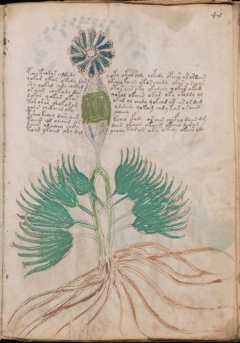

# Voynich Speculative Procedural Protocol — f40r

IMPORTANT: this is NOT a real or validated translation of the Voynich Manuscript. It is a speculative/procedural model that interprets EVA using a user-defined grammar to generate experimental recipes using safe, known edible substitutes.

This file is generated automatically from IVTFF/EVA transliteration plus a user-defined procedural grammar.



## Page / Folio
- currier: B
- folio: f40r
- page_number: 77
- section: herbal

## EVA Text (Transliteration)
```text
pchey k eodar aldydy qoky okal shdy olkedy opches ar ordaiin
qokar okar okedy dar ykchey kaiin ok[a:o]s chedy okar a ralos
shy qokal chdy chckhd otor aiir o ky okolchy qokar okam
or aiin chekody dar qokol okaiin okar oky okoldy ol
lokar qokar okar okol ol chedy qokchd ar ar or da[g:m]
tor or ar shok or am o lshedy qokam chdy kar oraiin
yaiin chekaiin oky ycheey
ksheo keeey dar ai[g:m] kcheo cfhdy or ain chefal daiin dg
taiin ol olaiin or dain okaiin okaiin okaiin daram
saiin olcheey chdy ychey ka@154;ar oky ykedy okair ody
toar ykaiin ory dal
```

## Domain Context (Heuristic; Not a Translation)

This section summarizes recurring **basewords** in this IVTFF domain and shows simple substring evidence that the token markers used by the procedural grammar occur inside frequent words.

Any Italian anagram / English gloss is a best-effort lexicon match, not a decipherment.


### Associated basewords (non-generic; top by frequency in this domain)
- `daiin` (count=461) → Italian anagram `piani`; English: plans (arrangements)
- `okaiin` (count=59) → Italian anagram `coniai`; English: [n/a]
- `chaiin` (count=39) → Italian anagram `acini`; English: [n/a]
- `saiin` (count=37) → Italian anagram `asini`; English: [n/a]
- `qokaiin` (count=34) → Italian anagram `ciancio`; English: [n/a]
- `qokar` (count=29) → Italian anagram `carco`; English: [n/a]
- `odaiin` (count=27) → Italian anagram `inopia`; English: poverty
- `otchol` (count=25) → Italian anagram `colto`; English: cultivated
- `kaiin` (count=24) → Italian anagram `acini`; English: [n/a]
- `chodaiin` (count=24) → Italian anagram `apocini`; English: [n/a]
- `qotol` (count=20) → Italian anagram `colto`; English: cultivated
- `okain` (count=19) → Italian anagram `acino`; English: a berry
- `qotor` (count=18) → Italian anagram `corto`; English: short
- `ykaiin` (count=16) → Italian anagram `acini`; English: [n/a]
- `qodaiin` (count=15) → Italian anagram `apocini`; English: [n/a]

### Marker evidence (substring in frequent basewords)
- `qo`: 57 basewords; examples: `qotchy`, `qokchy`, `qokedy`, `qokaiin`, `qoky`, `qokol`
- `q`: 58 basewords; examples: `qotchy`, `qokchy`, `qokedy`, `qokaiin`, `qoky`, `qokol`
- `o`: 252 basewords; examples: `chol`, `o`, `chor`, `or`, `shol`, `ol`
- `k`: 142 basewords; examples: `okaiin`, `oky`, `chckhy`, `qokchy`, `qokedy`, `okal`
- `t`: 102 basewords; examples: `cthy`, `oty`, `qotchy`, `cthol`, `cthor`, `otaiin`
- `p`: 15 basewords; examples: `cphy`, `ypchedy`, `opchy`, `opchey`, `pchor`, `qopchy`
- `ch`: 138 basewords; examples: `chol`, `chor`, `chy`, `chey`, `chedy`, `chdy`
- `sh`: 46 basewords; examples: `shol`, `sho`, `shy`, `shor`, `shey`, `shedy`
- `f`: 1 basewords; examples: `f`
- `cth`: 17 basewords; examples: `cthy`, `cthol`, `cthor`, `cthey`, `chcthy`, `ctho`
- `ckh`: 15 basewords; examples: `chckhy`, `ckhy`, `ckhol`, `ckhey`, `checkhy`, `shckhy`
- `cph`: 2 basewords; examples: `cphy`, `cphol`
- `dy`: 78 basewords; examples: `dy`, `chedy`, `chdy`, `chody`, `qokedy`, `shedy`
- `iin`: 39 basewords; examples: `daiin`, `aiin`, `okaiin`, `chaiin`, `saiin`, `qokaiin`
- `aiin`: 32 basewords; examples: `daiin`, `aiin`, `okaiin`, `chaiin`, `saiin`, `qokaiin`

## Recipes Index (This Page)
- [f40r.1,@P0](#f40r-1-f40r-1-p0)
- [f40r.2,+P0](#f40r-2-f40r-2-p0)
- [f40r.3,+P0](#f40r-3-f40r-3-p0)
- [f40r.4,+P0](#f40r-4-f40r-4-p0)
- [f40r.5,+P0](#f40r-5-f40r-5-p0)
- [f40r.6,+P0](#f40r-6-f40r-6-p0)
- [f40r.7,+P0](#f40r-7-f40r-7-p0)
- [f40r.8,+P0](#f40r-8-f40r-8-p0)
- [f40r.9,+P0](#f40r-9-f40r-9-p0)
- [f40r.10,+P0](#f40r-10-f40r-10-p0)
- [f40r.11,+P0](#f40r-11-f40r-11-p0)

## Line Glosses (Procedural Gloss Only; Not a Translation)

<a id="f40r-1-f40r-1-p0"></a>

### f40r.1,@P0

EVA: pchey k eodar aldydy qoky okal shdy olkedy opches ar ordaiin

Direct Gloss (Procedural, Not a Real Translation):
- pchey: add main plant (safe substitute) → add starter / activate → duration level 1 → state: active extraction
- k: add fermentable sugars
- eodar: mix / transfer → add starter / activate → duration level 1 → state: active extraction
- aldydy: add starter / activate → duration level 1 → state: phase transition/start
- qoky: prepare liquid base → add fermentable sugars
- okal: add fermentable sugars → mix / transfer → duration level 1 → state: phase transition/start
- shdy: add secondary herb (safe substitute) → add starter / activate
- olkedy: add fermentable sugars → mix / transfer → add starter / activate → duration level 1 → state: active extraction
- opches: add main plant (safe substitute) → mix / transfer → add starter / activate → duration level 1 → state: active extraction
- ar: duration level 1 → state: phase transition/start
- ordaiin: mix / transfer → add starter / activate → duration level 1 → state: phase transition/start → long phase

<a id="f40r-2-f40r-2-p0"></a>

### f40r.2,+P0

EVA: qokar okar okedy dar ykchey kaiin ok[a:o]s chedy okar a ralos

Direct Gloss (Procedural, Not a Real Translation):
- qokar: prepare liquid base → add fermentable sugars → duration level 1 → state: phase transition/start
- okar: add fermentable sugars → mix / transfer → duration level 1 → state: phase transition/start
- okedy: add fermentable sugars → mix / transfer → add starter / activate → duration level 1 → state: active extraction
- dar: add starter / activate → duration level 1 → state: phase transition/start
- ykchey: add fermentable sugars → add main plant (safe substitute) → duration level 1 → state: active extraction
- kaiin: add fermentable sugars → duration level 1 → state: phase transition/start → long phase
- ok: add fermentable sugars → mix / transfer
- a: duration level 1 → state: phase transition/start
- o: mix / transfer
- s: [unparsed]
- chedy: add main plant (safe substitute) → add starter / activate → duration level 1 → state: active extraction
- okar: add fermentable sugars → mix / transfer → duration level 1 → state: phase transition/start
- a: duration level 1 → state: phase transition/start
- ralos: mix / transfer → duration level 1 → state: phase transition/start

<a id="f40r-3-f40r-3-p0"></a>

### f40r.3,+P0

EVA: shy qokal chdy chckhd otor aiir o ky okolchy qokar okam

Direct Gloss (Procedural, Not a Real Translation):
- shy: add secondary herb (safe substitute)
- qokal: prepare liquid base → add fermentable sugars → duration level 1 → state: phase transition/start
- chdy: add main plant (safe substitute) → add starter / activate
- chckhd: add main plant (safe substitute) → add starter / activate → add complex herbal compound (safe blend)
- otor: apply heat/cooking → mix / transfer
- aiir: duration level 1 → state: phase transition/start
- o: mix / transfer
- ky: add fermentable sugars
- okolchy: add fermentable sugars → add main plant (safe substitute) → mix / transfer
- qokar: prepare liquid base → add fermentable sugars → duration level 1 → state: phase transition/start
- okam: add fermentable sugars → mix / transfer → duration level 1 → state: phase transition/start

<a id="f40r-4-f40r-4-p0"></a>

### f40r.4,+P0

EVA: or aiin chekody dar qokol okaiin okar oky okoldy ol

Direct Gloss (Procedural, Not a Real Translation):
- or: mix / transfer
- aiin: duration level 1 → state: phase transition/start → long phase
- chekody: add fermentable sugars → add main plant (safe substitute) → mix / transfer → add starter / activate → duration level 1 → state: active extraction
- dar: add starter / activate → duration level 1 → state: phase transition/start
- qokol: prepare liquid base → add fermentable sugars → mix / transfer
- okaiin: add fermentable sugars → mix / transfer → duration level 1 → state: phase transition/start → long phase
- okar: add fermentable sugars → mix / transfer → duration level 1 → state: phase transition/start
- oky: add fermentable sugars → mix / transfer
- okoldy: add fermentable sugars → mix / transfer → add starter / activate
- ol: mix / transfer

<a id="f40r-5-f40r-5-p0"></a>

### f40r.5,+P0

EVA: lokar qokar okar okol ol chedy qokchd ar ar or da[g:m]

Direct Gloss (Procedural, Not a Real Translation):
- lokar: add fermentable sugars → mix / transfer → duration level 1 → state: phase transition/start
- qokar: prepare liquid base → add fermentable sugars → duration level 1 → state: phase transition/start
- okar: add fermentable sugars → mix / transfer → duration level 1 → state: phase transition/start
- okol: add fermentable sugars → mix / transfer
- ol: mix / transfer
- chedy: add main plant (safe substitute) → add starter / activate → duration level 1 → state: active extraction
- qokchd: prepare liquid base → add fermentable sugars → add main plant (safe substitute) → add starter / activate
- ar: duration level 1 → state: phase transition/start
- ar: duration level 1 → state: phase transition/start
- or: mix / transfer
- da: add starter / activate → duration level 1 → state: phase transition/start
- g: [unparsed]
- m: [unparsed]

<a id="f40r-6-f40r-6-p0"></a>

### f40r.6,+P0

EVA: tor or ar shok or am o lshedy qokam chdy kar oraiin

Direct Gloss (Procedural, Not a Real Translation):
- tor: apply heat/cooking → mix / transfer
- or: mix / transfer
- ar: duration level 1 → state: phase transition/start
- shok: add fermentable sugars → add secondary herb (safe substitute) → mix / transfer
- or: mix / transfer
- am: duration level 1 → state: phase transition/start
- o: mix / transfer
- lshedy: add secondary herb (safe substitute) → add starter / activate → duration level 1 → state: active extraction
- qokam: prepare liquid base → add fermentable sugars → duration level 1 → state: phase transition/start
- chdy: add main plant (safe substitute) → add starter / activate
- kar: add fermentable sugars → duration level 1 → state: phase transition/start
- oraiin: mix / transfer → duration level 1 → state: phase transition/start → long phase

<a id="f40r-7-f40r-7-p0"></a>

### f40r.7,+P0

EVA: yaiin chekaiin oky ycheey

Direct Gloss (Procedural, Not a Real Translation):
- yaiin: duration level 1 → state: phase transition/start → long phase
- chekaiin: add fermentable sugars → add main plant (safe substitute) → duration level 1 → state: active extraction → long phase
- oky: add fermentable sugars → mix / transfer
- ycheey: add main plant (safe substitute) → duration level 2 → state: active extraction

<a id="f40r-8-f40r-8-p0"></a>

### f40r.8,+P0

EVA: ksheo keeey dar ai[g:m] kcheo cfhdy or ain chefal daiin dg

Direct Gloss (Procedural, Not a Real Translation):
- ksheo: add fermentable sugars → add secondary herb (safe substitute) → mix / transfer → duration level 1 → state: active extraction
- keeey: add fermentable sugars → duration level 3 → state: active extraction
- dar: add starter / activate → duration level 1 → state: phase transition/start
- ai: duration level 1 → state: phase transition/start
- g: [unparsed]
- m: [unparsed]
- kcheo: add fermentable sugars → add main plant (safe substitute) → mix / transfer → duration level 1 → state: active extraction
- cfhdy: add starter / activate → add complex herbal compound (safe blend)
- or: mix / transfer
- ain: duration level 1 → state: phase transition/start
- chefal: add main plant (safe substitute) → add aroma modifier → duration level 1 → state: active extraction
- daiin: add starter / activate → duration level 1 → state: phase transition/start → long phase
- dg: add starter / activate

<a id="f40r-9-f40r-9-p0"></a>

### f40r.9,+P0

EVA: taiin ol olaiin or dain okaiin okaiin okaiin daram

Direct Gloss (Procedural, Not a Real Translation):
- taiin: apply heat/cooking → duration level 1 → state: phase transition/start → long phase
- ol: mix / transfer
- olaiin: mix / transfer → duration level 1 → state: phase transition/start → long phase
- or: mix / transfer
- dain: add starter / activate → duration level 1 → state: phase transition/start
- okaiin: add fermentable sugars → mix / transfer → duration level 1 → state: phase transition/start → long phase
- okaiin: add fermentable sugars → mix / transfer → duration level 1 → state: phase transition/start → long phase
- okaiin: add fermentable sugars → mix / transfer → duration level 1 → state: phase transition/start → long phase
- daram: add starter / activate → duration level 1 → state: phase transition/start

<a id="f40r-10-f40r-10-p0"></a>

### f40r.10,+P0

EVA: saiin olcheey chdy ychey ka@154;ar oky ykedy okair ody

Direct Gloss (Procedural, Not a Real Translation):
- saiin: duration level 1 → state: phase transition/start → long phase
- olcheey: add main plant (safe substitute) → mix / transfer → duration level 2 → state: active extraction
- chdy: add main plant (safe substitute) → add starter / activate
- ychey: add main plant (safe substitute) → duration level 1 → state: active extraction
- ka: add fermentable sugars → duration level 1 → state: phase transition/start
- ar: duration level 1 → state: phase transition/start
- oky: add fermentable sugars → mix / transfer
- ykedy: add fermentable sugars → add starter / activate → duration level 1 → state: active extraction
- okair: add fermentable sugars → mix / transfer → duration level 1 → state: phase transition/start
- ody: mix / transfer → add starter / activate

<a id="f40r-11-f40r-11-p0"></a>

### f40r.11,+P0

EVA: toar ykaiin ory dal

Direct Gloss (Procedural, Not a Real Translation):
- toar: apply heat/cooking → mix / transfer → duration level 1 → state: phase transition/start
- ykaiin: add fermentable sugars → duration level 1 → state: phase transition/start → long phase
- ory: mix / transfer
- dal: add starter / activate → duration level 1 → state: phase transition/start
