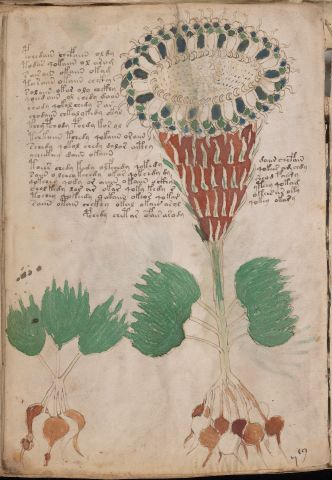

# Voynich Speculative Procedural Protocol — f40v

IMPORTANT: this is NOT a real or validated translation of the Voynich Manuscript. It is a speculative/procedural model that interprets EVA using a user-defined grammar to generate experimental recipes using safe, known edible substitutes.

This file is generated automatically from IVTFF/EVA transliteration plus a user-defined procedural grammar.



## Page / Folio
- currier: B
- folio: f40v
- page_number: 78
- section: herbal

## EVA Text (Transliteration)
```text
pchedain chefaiin oldy
todar qokaiin ol ara[g:m]
s air ain okaiin okam
taraiin okaiin chckhy
solaiin okar oly chckhy
qoeedaiin ol chedy daiin
shody qokol chedy s ar
chodaiin chkalykedy okal
tchy pchody pchdy kor ol
tchkaiin tchedy qokaiin oraiin
schedy qokol chedy dalor aithy
ycheekeey daiin okaiin
toees chedy kedy olfchedy qokedy daiin chefain
saiin o lchey kchedy okar qokchdy dy qokees am chdy
qokchey qody or aiiin o kaiin o ckhy sheod faimy
shol kedy lor ar okar qoky kedy r yteey qokam
tochey qokeedy qokaiin okeos qokar okees ar o[k:?]y
saiin otain chckhy okal okair arol qokey okary
pchedy chetar ofair arody
```

## Domain Context (Heuristic; Not a Translation)

This section summarizes recurring **basewords** in this IVTFF domain and shows simple substring evidence that the token markers used by the procedural grammar occur inside frequent words.

Any Italian anagram / English gloss is a best-effort lexicon match, not a decipherment.


### Associated basewords (non-generic; top by frequency in this domain)
- `daiin` (count=461) → Italian anagram `piani`; English: plans (arrangements)
- `okaiin` (count=59) → Italian anagram `coniai`; English: [n/a]
- `chaiin` (count=39) → Italian anagram `acini`; English: [n/a]
- `saiin` (count=37) → Italian anagram `asini`; English: [n/a]
- `qokaiin` (count=34) → Italian anagram `ciancio`; English: [n/a]
- `qokar` (count=29) → Italian anagram `carco`; English: [n/a]
- `odaiin` (count=27) → Italian anagram `inopia`; English: poverty
- `otchol` (count=25) → Italian anagram `colto`; English: cultivated
- `kaiin` (count=24) → Italian anagram `acini`; English: [n/a]
- `chodaiin` (count=24) → Italian anagram `apocini`; English: [n/a]
- `qotol` (count=20) → Italian anagram `colto`; English: cultivated
- `okain` (count=19) → Italian anagram `acino`; English: a berry
- `qotor` (count=18) → Italian anagram `corto`; English: short
- `ykaiin` (count=16) → Italian anagram `acini`; English: [n/a]
- `qodaiin` (count=15) → Italian anagram `apocini`; English: [n/a]

### Marker evidence (substring in frequent basewords)
- `qo`: 57 basewords; examples: `qotchy`, `qokchy`, `qokedy`, `qokaiin`, `qoky`, `qokol`
- `q`: 58 basewords; examples: `qotchy`, `qokchy`, `qokedy`, `qokaiin`, `qoky`, `qokol`
- `o`: 252 basewords; examples: `chol`, `o`, `chor`, `or`, `shol`, `ol`
- `k`: 142 basewords; examples: `okaiin`, `oky`, `chckhy`, `qokchy`, `qokedy`, `okal`
- `t`: 102 basewords; examples: `cthy`, `oty`, `qotchy`, `cthol`, `cthor`, `otaiin`
- `p`: 15 basewords; examples: `cphy`, `ypchedy`, `opchy`, `opchey`, `pchor`, `qopchy`
- `ch`: 138 basewords; examples: `chol`, `chor`, `chy`, `chey`, `chedy`, `chdy`
- `sh`: 46 basewords; examples: `shol`, `sho`, `shy`, `shor`, `shey`, `shedy`
- `f`: 1 basewords; examples: `f`
- `cth`: 17 basewords; examples: `cthy`, `cthol`, `cthor`, `cthey`, `chcthy`, `ctho`
- `ckh`: 15 basewords; examples: `chckhy`, `ckhy`, `ckhol`, `ckhey`, `checkhy`, `shckhy`
- `cph`: 2 basewords; examples: `cphy`, `cphol`
- `dy`: 78 basewords; examples: `dy`, `chedy`, `chdy`, `chody`, `qokedy`, `shedy`
- `iin`: 39 basewords; examples: `daiin`, `aiin`, `okaiin`, `chaiin`, `saiin`, `qokaiin`
- `aiin`: 32 basewords; examples: `daiin`, `aiin`, `okaiin`, `chaiin`, `saiin`, `qokaiin`

## Recipes Index (This Page)
- [f40v.1,@P0](#f40v-1-f40v-1-p0)
- [f40v.2,+P0](#f40v-2-f40v-2-p0)
- [f40v.3,+P0](#f40v-3-f40v-3-p0)
- [f40v.4,+P0](#f40v-4-f40v-4-p0)
- [f40v.5,+P0](#f40v-5-f40v-5-p0)
- [f40v.6,+P0](#f40v-6-f40v-6-p0)
- [f40v.7,+P0](#f40v-7-f40v-7-p0)
- [f40v.8,+P0](#f40v-8-f40v-8-p0)
- [f40v.9,+P0](#f40v-9-f40v-9-p0)
- [f40v.10,+P0](#f40v-10-f40v-10-p0)
- [f40v.11,+P0](#f40v-11-f40v-11-p0)
- [f40v.12,+P0](#f40v-12-f40v-12-p0)
- [f40v.13,+P0](#f40v-13-f40v-13-p0)
- [f40v.14,+P0](#f40v-14-f40v-14-p0)
- [f40v.15,+P0](#f40v-15-f40v-15-p0)
- [f40v.16,+P0](#f40v-16-f40v-16-p0)
- [f40v.17,+P0](#f40v-17-f40v-17-p0)
- [f40v.18,+P0](#f40v-18-f40v-18-p0)
- [f40v.19,+Pc](#f40v-19-f40v-19-pc)

## Line Glosses (Procedural Gloss Only; Not a Translation)

<a id="f40v-1-f40v-1-p0"></a>

### f40v.1,@P0

EVA: pchedain chefaiin oldy

Direct Gloss (Procedural, Not a Real Translation):
- pchedain: add main plant (safe substitute) → add starter / activate → duration level 1 → state: active extraction
- chefaiin: add main plant (safe substitute) → add aroma modifier → duration level 1 → state: active extraction → long phase
- oldy: mix / transfer → add starter / activate

<a id="f40v-2-f40v-2-p0"></a>

### f40v.2,+P0

EVA: todar qokaiin ol ara[g:m]

Direct Gloss (Procedural, Not a Real Translation):
- todar: apply heat/cooking → mix / transfer → add starter / activate → duration level 1 → state: phase transition/start
- qokaiin: prepare liquid base → add fermentable sugars → duration level 1 → state: phase transition/start → long phase
- ol: mix / transfer
- ara: duration level 1 → state: phase transition/start
- g: [unparsed]
- m: [unparsed]

<a id="f40v-3-f40v-3-p0"></a>

### f40v.3,+P0

EVA: s air ain okaiin okam

Direct Gloss (Procedural, Not a Real Translation):
- s: [unparsed]
- air: duration level 1 → state: phase transition/start
- ain: duration level 1 → state: phase transition/start
- okaiin: add fermentable sugars → mix / transfer → duration level 1 → state: phase transition/start → long phase
- okam: add fermentable sugars → mix / transfer → duration level 1 → state: phase transition/start

<a id="f40v-4-f40v-4-p0"></a>

### f40v.4,+P0

EVA: taraiin okaiin chckhy

Direct Gloss (Procedural, Not a Real Translation):
- taraiin: apply heat/cooking → duration level 1 → state: phase transition/start → long phase
- okaiin: add fermentable sugars → mix / transfer → duration level 1 → state: phase transition/start → long phase
- chckhy: add main plant (safe substitute) → add complex herbal compound (safe blend)

<a id="f40v-5-f40v-5-p0"></a>

### f40v.5,+P0

EVA: solaiin okar oly chckhy

Direct Gloss (Procedural, Not a Real Translation):
- solaiin: mix / transfer → duration level 1 → state: phase transition/start → long phase
- okar: add fermentable sugars → mix / transfer → duration level 1 → state: phase transition/start
- oly: mix / transfer
- chckhy: add main plant (safe substitute) → add complex herbal compound (safe blend)

<a id="f40v-6-f40v-6-p0"></a>

### f40v.6,+P0

EVA: qoeedaiin ol chedy daiin

Direct Gloss (Procedural, Not a Real Translation):
- qoeedaiin: prepare liquid base → add starter / activate → duration level 2 → state: active extraction → long phase
- ol: mix / transfer
- chedy: add main plant (safe substitute) → add starter / activate → duration level 1 → state: active extraction
- daiin: add starter / activate → duration level 1 → state: phase transition/start → long phase

<a id="f40v-7-f40v-7-p0"></a>

### f40v.7,+P0

EVA: shody qokol chedy s ar

Direct Gloss (Procedural, Not a Real Translation):
- shody: add secondary herb (safe substitute) → mix / transfer → add starter / activate
- qokol: prepare liquid base → add fermentable sugars → mix / transfer
- chedy: add main plant (safe substitute) → add starter / activate → duration level 1 → state: active extraction
- s: [unparsed]
- ar: duration level 1 → state: phase transition/start

<a id="f40v-8-f40v-8-p0"></a>

### f40v.8,+P0

EVA: chodaiin chkalykedy okal

Direct Gloss (Procedural, Not a Real Translation):
- chodaiin: add main plant (safe substitute) → mix / transfer → add starter / activate → duration level 1 → state: phase transition/start → long phase
- chkalykedy: add fermentable sugars → add main plant (safe substitute) → add starter / activate → duration level 1 → state: phase transition/start
- okal: add fermentable sugars → mix / transfer → duration level 1 → state: phase transition/start

<a id="f40v-9-f40v-9-p0"></a>

### f40v.9,+P0

EVA: tchy pchody pchdy kor ol

Direct Gloss (Procedural, Not a Real Translation):
- tchy: apply heat/cooking → add main plant (safe substitute)
- pchody: add main plant (safe substitute) → mix / transfer → add starter / activate
- pchdy: add main plant (safe substitute) → add starter / activate
- kor: add fermentable sugars → mix / transfer
- ol: mix / transfer

<a id="f40v-10-f40v-10-p0"></a>

### f40v.10,+P0

EVA: tchkaiin tchedy qokaiin oraiin

Direct Gloss (Procedural, Not a Real Translation):
- tchkaiin: add fermentable sugars → apply heat/cooking → add main plant (safe substitute) → duration level 1 → state: phase transition/start → long phase
- tchedy: apply heat/cooking → add main plant (safe substitute) → add starter / activate → duration level 1 → state: active extraction
- qokaiin: prepare liquid base → add fermentable sugars → duration level 1 → state: phase transition/start → long phase
- oraiin: mix / transfer → duration level 1 → state: phase transition/start → long phase

<a id="f40v-11-f40v-11-p0"></a>

### f40v.11,+P0

EVA: schedy qokol chedy dalor aithy

Direct Gloss (Procedural, Not a Real Translation):
- schedy: add main plant (safe substitute) → add starter / activate → duration level 1 → state: active extraction
- qokol: prepare liquid base → add fermentable sugars → mix / transfer
- chedy: add main plant (safe substitute) → add starter / activate → duration level 1 → state: active extraction
- dalor: mix / transfer → add starter / activate → duration level 1 → state: phase transition/start
- aithy: apply heat/cooking → duration level 1 → state: phase transition/start → unmodeled token(s) present: h

<a id="f40v-12-f40v-12-p0"></a>

### f40v.12,+P0

EVA: ycheekeey daiin okaiin

Direct Gloss (Procedural, Not a Real Translation):
- ycheekeey: add fermentable sugars → add main plant (safe substitute) → duration level 2 → state: active extraction
- daiin: add starter / activate → duration level 1 → state: phase transition/start → long phase
- okaiin: add fermentable sugars → mix / transfer → duration level 1 → state: phase transition/start → long phase

<a id="f40v-13-f40v-13-p0"></a>

### f40v.13,+P0

EVA: toees chedy kedy olfchedy qokedy daiin chefain

Direct Gloss (Procedural, Not a Real Translation):
- toees: apply heat/cooking → mix / transfer → duration level 2 → state: active extraction
- chedy: add main plant (safe substitute) → add starter / activate → duration level 1 → state: active extraction
- kedy: add fermentable sugars → add starter / activate → duration level 1 → state: active extraction
- olfchedy: add main plant (safe substitute) → add aroma modifier → mix / transfer → add starter / activate → duration level 1 → state: active extraction
- qokedy: prepare liquid base → add fermentable sugars → add starter / activate → duration level 1 → state: active extraction
- daiin: add starter / activate → duration level 1 → state: phase transition/start → long phase
- chefain: add main plant (safe substitute) → add aroma modifier → duration level 1 → state: active extraction

<a id="f40v-14-f40v-14-p0"></a>

### f40v.14,+P0

EVA: saiin o lchey kchedy okar qokchdy dy qokees am chdy

Direct Gloss (Procedural, Not a Real Translation):
- saiin: duration level 1 → state: phase transition/start → long phase
- o: mix / transfer
- lchey: add main plant (safe substitute) → duration level 1 → state: active extraction
- kchedy: add fermentable sugars → add main plant (safe substitute) → add starter / activate → duration level 1 → state: active extraction
- okar: add fermentable sugars → mix / transfer → duration level 1 → state: phase transition/start
- qokchdy: prepare liquid base → add fermentable sugars → add main plant (safe substitute) → add starter / activate
- dy: add starter / activate
- qokees: prepare liquid base → add fermentable sugars → duration level 2 → state: active extraction
- am: duration level 1 → state: phase transition/start
- chdy: add main plant (safe substitute) → add starter / activate

<a id="f40v-15-f40v-15-p0"></a>

### f40v.15,+P0

EVA: qokchey qody or aiiin o kaiin o ckhy sheod faimy

Direct Gloss (Procedural, Not a Real Translation):
- qokchey: prepare liquid base → add fermentable sugars → add main plant (safe substitute) → duration level 1 → state: active extraction
- qody: prepare liquid base → add starter / activate
- or: mix / transfer
- aiiin: duration level 1 → state: phase transition/start → medium phase
- o: mix / transfer
- kaiin: add fermentable sugars → duration level 1 → state: phase transition/start → long phase
- o: mix / transfer
- ckhy: add complex herbal compound (safe blend)
- sheod: add secondary herb (safe substitute) → mix / transfer → add starter / activate → duration level 1 → state: active extraction
- faimy: add aroma modifier → duration level 1 → state: phase transition/start

<a id="f40v-16-f40v-16-p0"></a>

### f40v.16,+P0

EVA: shol kedy lor ar okar qoky kedy r yteey qokam

Direct Gloss (Procedural, Not a Real Translation):
- shol: add secondary herb (safe substitute) → mix / transfer
- kedy: add fermentable sugars → add starter / activate → duration level 1 → state: active extraction
- lor: mix / transfer
- ar: duration level 1 → state: phase transition/start
- okar: add fermentable sugars → mix / transfer → duration level 1 → state: phase transition/start
- qoky: prepare liquid base → add fermentable sugars
- kedy: add fermentable sugars → add starter / activate → duration level 1 → state: active extraction
- r: [unparsed]
- yteey: apply heat/cooking → duration level 2 → state: active extraction
- qokam: prepare liquid base → add fermentable sugars → duration level 1 → state: phase transition/start

<a id="f40v-17-f40v-17-p0"></a>

### f40v.17,+P0

EVA: tochey qokeedy qokaiin okeos qokar okees ar o[k:?]y

Direct Gloss (Procedural, Not a Real Translation):
- tochey: apply heat/cooking → add main plant (safe substitute) → mix / transfer → duration level 1 → state: active extraction
- qokeedy: prepare liquid base → add fermentable sugars → add starter / activate → duration level 2 → state: active extraction
- qokaiin: prepare liquid base → add fermentable sugars → duration level 1 → state: phase transition/start → long phase
- okeos: add fermentable sugars → mix / transfer → duration level 1 → state: active extraction
- qokar: prepare liquid base → add fermentable sugars → duration level 1 → state: phase transition/start
- okees: add fermentable sugars → mix / transfer → duration level 2 → state: active extraction
- ar: duration level 1 → state: phase transition/start
- o: mix / transfer
- k: add fermentable sugars
- y: [unparsed]

<a id="f40v-18-f40v-18-p0"></a>

### f40v.18,+P0

EVA: saiin otain chckhy okal okair arol qokey okary

Direct Gloss (Procedural, Not a Real Translation):
- saiin: duration level 1 → state: phase transition/start → long phase
- otain: apply heat/cooking → mix / transfer → duration level 1 → state: phase transition/start
- chckhy: add main plant (safe substitute) → add complex herbal compound (safe blend)
- okal: add fermentable sugars → mix / transfer → duration level 1 → state: phase transition/start
- okair: add fermentable sugars → mix / transfer → duration level 1 → state: phase transition/start
- arol: mix / transfer → duration level 1 → state: phase transition/start
- qokey: prepare liquid base → add fermentable sugars → duration level 1 → state: active extraction
- okary: add fermentable sugars → mix / transfer → duration level 1 → state: phase transition/start

<a id="f40v-19-f40v-19-pc"></a>

### f40v.19,+Pc

EVA: pchedy chetar ofair arody

Direct Gloss (Procedural, Not a Real Translation):
- pchedy: add main plant (safe substitute) → add starter / activate → duration level 1 → state: active extraction
- chetar: apply heat/cooking → add main plant (safe substitute) → duration level 1 → state: active extraction
- ofair: add aroma modifier → mix / transfer → duration level 1 → state: phase transition/start
- arody: mix / transfer → add starter / activate → duration level 1 → state: phase transition/start
