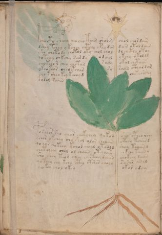

# Voynich Speculative Herbal Ferment Recipe — f42v

IMPORTANT: this is NOT a real or validated translation of the Voynich Manuscript. It is a speculative/procedural model that interprets EVA using a user-defined grammar to generate experimental recipes using safe, known edible substitutes.

This file is generated automatically from IVTFF/EVA transliteration plus a user-defined procedural grammar.



## Page / Folio
- currier: A
- folio: f42v
- page_number: 82
- section: herbal

## EVA Text (Transliteration)
```text
@156;cho cto sheey qocho taiin shols chol chor dain
dshey tchey y kchey chtchy c@245;hy dan dain otol daiin
sho chotody chotol oky chol chol dl chcthy otoy
qotchy chkchy sar dy odaiil ykchy o kol dg
chokeeo r chey chetan s ary okol chetaiin
okeokear cheotchar sy saiin cthar d am
chok sheo key keeeyd chekeesshy
sodal saiin
posheor sho char chekchey qokod sho cpheo rchy
schor okchey chy shol olor cheaiin ctchy tcheeb d
qo aiin qokeey kchol cheal o t eold shey teaiin d
ch[o:a]tcheey chol ol chaiin oteeaiin chkchy taiin y
sho chey teor shey checthhy daiin chokeey daiin
qoteey chy kchy cthy ctsees choly sarar aral
chokey chol okey
okor odeey
```

## Recipes Index (This Page)
- [f42v.1,@P0](#f42v-1-f42v-1-p0)
- [f42v.2,+P0](#f42v-2-f42v-2-p0)
- [f42v.3,+P0](#f42v-3-f42v-3-p0)
- [f42v.4,+P0](#f42v-4-f42v-4-p0)
- [f42v.5,+P0](#f42v-5-f42v-5-p0)
- [f42v.6,+P0](#f42v-6-f42v-6-p0)
- [f42v.7,+P0](#f42v-7-f42v-7-p0)
- [f42v.8,+P0](#f42v-8-f42v-8-p0)
- [f42v.9,+P0](#f42v-9-f42v-9-p0)
- [f42v.10,+P0](#f42v-10-f42v-10-p0)
- [f42v.11,+P0](#f42v-11-f42v-11-p0)
- [f42v.12,+P0](#f42v-12-f42v-12-p0)
- [f42v.13,+P0](#f42v-13-f42v-13-p0)
- [f42v.14,+P0](#f42v-14-f42v-14-p0)
- [f42v.15,+P0](#f42v-15-f42v-15-p0)
- [f42v.16,=Pt](#f42v-16-f42v-16-pt)

## Line Glosses (Procedural Gloss Only; Not a Translation)

<a id="f42v-1-f42v-1-p0"></a>

### f42v.1,@P0

EVA: @156;cho cto sheey qocho taiin shols chol chor dain

Direct Gloss (Procedural, Not a Real Translation):
- cho: add main plant (safe substitute) → mix / transfer
- cto: apply heat/cooking → mix / transfer
- sheey: add secondary herb (safe substitute) → duration level 2 → state: active extraction
- qocho: prepare liquid base → add main plant (safe substitute) → mix / transfer
- taiin: apply heat/cooking → duration level 1 → state: fermentation start → long fermentation / aging phase
- shols: add secondary herb (safe substitute) → mix / transfer
- chol: add main plant (safe substitute) → mix / transfer
- chor: add main plant (safe substitute) → mix / transfer
- dain: start fermentation (yeast) → duration level 1 → state: fermentation start

<a id="f42v-2-f42v-2-p0"></a>

### f42v.2,+P0

EVA: dshey tchey y kchey chtchy c@245;hy dan dain otol daiin

Direct Gloss (Procedural, Not a Real Translation):
- dshey: add secondary herb (safe substitute) → start fermentation (yeast) → duration level 1 → state: active extraction
- tchey: apply heat/cooking → add main plant (safe substitute) → duration level 1 → state: active extraction
- y: [unparsed]
- kchey: add fermentable sugars → add main plant (safe substitute) → duration level 1 → state: active extraction
- chtchy: apply heat/cooking → add main plant (safe substitute)
- c: [unparsed]
- hy: [unparsed]
- dan: start fermentation (yeast) → duration level 1 → state: fermentation start
- dain: start fermentation (yeast) → duration level 1 → state: fermentation start
- otol: apply heat/cooking → mix / transfer
- daiin: start fermentation (yeast) → duration level 1 → state: fermentation start → long fermentation / aging phase

<a id="f42v-3-f42v-3-p0"></a>

### f42v.3,+P0

EVA: sho chotody chotol oky chol chol dl chcthy otoy

Direct Gloss (Procedural, Not a Real Translation):
- sho: add secondary herb (safe substitute) → mix / transfer
- chotody: apply heat/cooking → add main plant (safe substitute) → mix / transfer → start fermentation (yeast)
- chotol: apply heat/cooking → add main plant (safe substitute) → mix / transfer
- oky: add fermentable sugars → mix / transfer
- chol: add main plant (safe substitute) → mix / transfer
- chol: add main plant (safe substitute) → mix / transfer
- dl: start fermentation (yeast)
- chcthy: add main plant (safe substitute) → add complex herbal compound (safe blend)
- otoy: apply heat/cooking → mix / transfer

<a id="f42v-4-f42v-4-p0"></a>

### f42v.4,+P0

EVA: qotchy chkchy sar dy odaiil ykchy o kol dg

Direct Gloss (Procedural, Not a Real Translation):
- qotchy: prepare liquid base → apply heat/cooking → add main plant (safe substitute)
- chkchy: add fermentable sugars → add main plant (safe substitute)
- sar: duration level 1 → state: fermentation start
- dy: start fermentation (yeast)
- odaiil: mix / transfer → start fermentation (yeast) → duration level 1 → state: fermentation start
- ykchy: add fermentable sugars → add main plant (safe substitute)
- o: mix / transfer
- kol: add fermentable sugars → mix / transfer
- dg: start fermentation (yeast)

<a id="f42v-5-f42v-5-p0"></a>

### f42v.5,+P0

EVA: chokeeo r chey chetan s ary okol chetaiin

Direct Gloss (Procedural, Not a Real Translation):
- chokeeo: add fermentable sugars → add main plant (safe substitute) → mix / transfer → duration level 2 → state: active extraction
- r: [unparsed]
- chey: add main plant (safe substitute) → duration level 1 → state: active extraction
- chetan: apply heat/cooking → add main plant (safe substitute) → duration level 1 → state: active extraction
- s: [unparsed]
- ary: duration level 1 → state: fermentation start
- okol: add fermentable sugars → mix / transfer
- chetaiin: apply heat/cooking → add main plant (safe substitute) → duration level 1 → state: active extraction → long fermentation / aging phase

<a id="f42v-6-f42v-6-p0"></a>

### f42v.6,+P0

EVA: okeokear cheotchar sy saiin cthar d am

Direct Gloss (Procedural, Not a Real Translation):
- okeokear: add fermentable sugars → mix / transfer → duration level 1 → state: active extraction
- cheotchar: apply heat/cooking → add main plant (safe substitute) → mix / transfer → duration level 1 → state: active extraction
- sy: [unparsed]
- saiin: duration level 1 → state: fermentation start → long fermentation / aging phase
- cthar: add complex herbal compound (safe blend) → duration level 1 → state: fermentation start
- d: start fermentation (yeast)
- am: duration level 1 → state: fermentation start

<a id="f42v-7-f42v-7-p0"></a>

### f42v.7,+P0

EVA: chok sheo key keeeyd chekeesshy

Direct Gloss (Procedural, Not a Real Translation):
- chok: add fermentable sugars → add main plant (safe substitute) → mix / transfer
- sheo: add secondary herb (safe substitute) → mix / transfer → duration level 1 → state: active extraction
- key: add fermentable sugars → duration level 1 → state: active extraction
- keeeyd: add fermentable sugars → start fermentation (yeast) → duration level 3 → state: active extraction
- chekeesshy: add fermentable sugars → add main plant (safe substitute) → add secondary herb (safe substitute) → duration level 1 → state: active extraction

<a id="f42v-8-f42v-8-p0"></a>

### f42v.8,+P0

EVA: sodal saiin

Direct Gloss (Procedural, Not a Real Translation):
- sodal: mix / transfer → start fermentation (yeast) → duration level 1 → state: fermentation start
- saiin: duration level 1 → state: fermentation start → long fermentation / aging phase

<a id="f42v-9-f42v-9-p0"></a>

### f42v.9,+P0

EVA: posheor sho char chekchey qokod sho cpheo rchy

Direct Gloss (Procedural, Not a Real Translation):
- posheor: add secondary herb (safe substitute) → mix / transfer → start fermentation (yeast) → duration level 1 → state: active extraction
- sho: add secondary herb (safe substitute) → mix / transfer
- char: add main plant (safe substitute) → duration level 1 → state: fermentation start
- chekchey: add fermentable sugars → add main plant (safe substitute) → duration level 1 → state: active extraction
- qokod: prepare liquid base → add fermentable sugars → mix / transfer → start fermentation (yeast)
- sho: add secondary herb (safe substitute) → mix / transfer
- cpheo: mix / transfer → add complex herbal compound (safe blend) → duration level 1 → state: active extraction
- rchy: add main plant (safe substitute)

<a id="f42v-10-f42v-10-p0"></a>

### f42v.10,+P0

EVA: schor okchey chy shol olor cheaiin ctchy tcheeb d

Direct Gloss (Procedural, Not a Real Translation):
- schor: add main plant (safe substitute) → mix / transfer
- okchey: add fermentable sugars → add main plant (safe substitute) → mix / transfer → duration level 1 → state: active extraction
- chy: add main plant (safe substitute)
- shol: add secondary herb (safe substitute) → mix / transfer
- olor: mix / transfer
- cheaiin: add main plant (safe substitute) → duration level 1 → state: active extraction → long fermentation / aging phase
- ctchy: apply heat/cooking → add main plant (safe substitute)
- tcheeb: apply heat/cooking → add main plant (safe substitute) → duration level 2 → state: active extraction
- d: start fermentation (yeast)

<a id="f42v-11-f42v-11-p0"></a>

### f42v.11,+P0

EVA: qo aiin qokeey kchol cheal o t eold shey teaiin d

Direct Gloss (Procedural, Not a Real Translation):
- qo: prepare liquid base
- aiin: duration level 1 → state: fermentation start → long fermentation / aging phase
- qokeey: prepare liquid base → add fermentable sugars → duration level 2 → state: active extraction
- kchol: add fermentable sugars → add main plant (safe substitute) → mix / transfer
- cheal: add main plant (safe substitute) → duration level 1 → state: active extraction
- o: mix / transfer
- t: apply heat/cooking
- eold: mix / transfer → start fermentation (yeast) → duration level 1 → state: active extraction
- shey: add secondary herb (safe substitute) → duration level 1 → state: active extraction
- teaiin: apply heat/cooking → duration level 1 → state: active extraction → long fermentation / aging phase
- d: start fermentation (yeast)

<a id="f42v-12-f42v-12-p0"></a>

### f42v.12,+P0

EVA: ch[o:a]tcheey chol ol chaiin oteeaiin chkchy taiin y

Direct Gloss (Procedural, Not a Real Translation):
- ch: add main plant (safe substitute)
- o: mix / transfer
- a: duration level 1 → state: fermentation start
- tcheey: apply heat/cooking → add main plant (safe substitute) → duration level 2 → state: active extraction
- chol: add main plant (safe substitute) → mix / transfer
- ol: mix / transfer
- chaiin: add main plant (safe substitute) → duration level 1 → state: fermentation start → long fermentation / aging phase
- oteeaiin: apply heat/cooking → mix / transfer → duration level 2 → state: active extraction → long fermentation / aging phase
- chkchy: add fermentable sugars → add main plant (safe substitute)
- taiin: apply heat/cooking → duration level 1 → state: fermentation start → long fermentation / aging phase
- y: [unparsed]

<a id="f42v-13-f42v-13-p0"></a>

### f42v.13,+P0

EVA: sho chey teor shey checthhy daiin chokeey daiin

Direct Gloss (Procedural, Not a Real Translation):
- sho: add secondary herb (safe substitute) → mix / transfer
- chey: add main plant (safe substitute) → duration level 1 → state: active extraction
- teor: apply heat/cooking → mix / transfer → duration level 1 → state: active extraction
- shey: add secondary herb (safe substitute) → duration level 1 → state: active extraction
- checthhy: add main plant (safe substitute) → add complex herbal compound (safe blend) → duration level 1 → state: active extraction
- daiin: start fermentation (yeast) → duration level 1 → state: fermentation start → long fermentation / aging phase
- chokeey: add fermentable sugars → add main plant (safe substitute) → mix / transfer → duration level 2 → state: active extraction
- daiin: start fermentation (yeast) → duration level 1 → state: fermentation start → long fermentation / aging phase

<a id="f42v-14-f42v-14-p0"></a>

### f42v.14,+P0

EVA: qoteey chy kchy cthy ctsees choly sarar aral

Direct Gloss (Procedural, Not a Real Translation):
- qoteey: prepare liquid base → apply heat/cooking → duration level 2 → state: active extraction
- chy: add main plant (safe substitute)
- kchy: add fermentable sugars → add main plant (safe substitute)
- cthy: add complex herbal compound (safe blend)
- ctsees: apply heat/cooking → duration level 2 → state: active extraction
- choly: add main plant (safe substitute) → mix / transfer
- sarar: duration level 1 → state: fermentation start
- aral: duration level 1 → state: fermentation start

<a id="f42v-15-f42v-15-p0"></a>

### f42v.15,+P0

EVA: chokey chol okey

Direct Gloss (Procedural, Not a Real Translation):
- chokey: add fermentable sugars → add main plant (safe substitute) → mix / transfer → duration level 1 → state: active extraction
- chol: add main plant (safe substitute) → mix / transfer
- okey: add fermentable sugars → mix / transfer → duration level 1 → state: active extraction

<a id="f42v-16-f42v-16-pt"></a>

### f42v.16,=Pt

EVA: okor odeey

Direct Gloss (Procedural, Not a Real Translation):
- okor: add fermentable sugars → mix / transfer
- odeey: mix / transfer → start fermentation (yeast) → duration level 2 → state: active extraction
