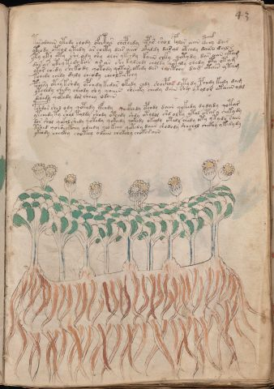

# Voynich Speculative Procedural Protocol — f43r

IMPORTANT: this is NOT a real or validated translation of the Voynich Manuscript. It is a speculative/procedural model that interprets EVA using a user-defined grammar to generate experimental recipes using safe, known edible substitutes.

This file is generated automatically from IVTFF/EVA transliteration plus a user-defined procedural grammar.



## Page / Folio
- currier: B
- folio: f43r
- page_number: 83
- section: herbal

## EVA Text (Transliteration)
```text
tarodaiin ytedy eeody ofchtar chcphedy ypar shol folor aiin cphey dar
yteody oteol ytedy ar chety dar aiir okaldy daral otchdy daiin dals
yty yty oty she ody shy olor yteedy kaiin chky qotydy dar aiin ykam
das ar ytey tedy kar arar she kalchdy cholky qotaly chedy oty otam
ykar ch[e:i]dy shekody qotody qotar okedy dar choetchy dam otain y tam
kchedy chedy daly cheody cheolkeepchy
pshesy otey kshdy opchdy kedar okedy chdy shocphhy dyty dy pchdy kedy dam
ytchedy chedy cheody shy qoiiin sheeeky chedy dain shy ykolor [o:a]taiin old
dshedy qotedy dor cheey odain
pshdar shed ody qotedy yfchdy qockhhdy opchdy daiin qokedy dydydy qotar
ytchedy ty shol t[o:a]ldy shody oteedy shdy otolol shd olky ytol otary cheky dy
dor shol qokol shedy qotedy qokeedy qokody okeedy otedy shedy oty yty dy saiin
tshed qosheckhey odeeedy qeokeey qotedy daiin shodody shochol chckhy y kedydy
ykeody checkhy choteey odain chckhhhy chokoraiin
```

## Domain Context (Heuristic; Not a Translation)

This section summarizes recurring **basewords** in this IVTFF domain and shows simple substring evidence that the token markers used by the procedural grammar occur inside frequent words.

Any Italian anagram / English gloss is a best-effort lexicon match, not a decipherment.


### Associated basewords (non-generic; top by frequency in this domain)
- `daiin` (count=461) → Italian anagram `piani`; English: plans (arrangements)
- `okaiin` (count=59) → Italian anagram `coniai`; English: [n/a]
- `chaiin` (count=39) → Italian anagram `acini`; English: [n/a]
- `saiin` (count=37) → Italian anagram `asini`; English: [n/a]
- `qokaiin` (count=34) → Italian anagram `ciancio`; English: [n/a]
- `qokar` (count=29) → Italian anagram `carco`; English: [n/a]
- `odaiin` (count=27) → Italian anagram `inopia`; English: poverty
- `otchol` (count=25) → Italian anagram `colto`; English: cultivated
- `kaiin` (count=24) → Italian anagram `acini`; English: [n/a]
- `chodaiin` (count=24) → Italian anagram `apocini`; English: [n/a]
- `qotol` (count=20) → Italian anagram `colto`; English: cultivated
- `okain` (count=19) → Italian anagram `acino`; English: a berry
- `qotor` (count=18) → Italian anagram `corto`; English: short
- `ykaiin` (count=16) → Italian anagram `acini`; English: [n/a]
- `qodaiin` (count=15) → Italian anagram `apocini`; English: [n/a]

### Marker evidence (substring in frequent basewords)
- `qo`: 57 basewords; examples: `qotchy`, `qokchy`, `qokedy`, `qokaiin`, `qoky`, `qokol`
- `q`: 58 basewords; examples: `qotchy`, `qokchy`, `qokedy`, `qokaiin`, `qoky`, `qokol`
- `o`: 252 basewords; examples: `chol`, `o`, `chor`, `or`, `shol`, `ol`
- `k`: 142 basewords; examples: `okaiin`, `oky`, `chckhy`, `qokchy`, `qokedy`, `okal`
- `t`: 102 basewords; examples: `cthy`, `oty`, `qotchy`, `cthol`, `cthor`, `otaiin`
- `p`: 15 basewords; examples: `cphy`, `ypchedy`, `opchy`, `opchey`, `pchor`, `qopchy`
- `ch`: 138 basewords; examples: `chol`, `chor`, `chy`, `chey`, `chedy`, `chdy`
- `sh`: 46 basewords; examples: `shol`, `sho`, `shy`, `shor`, `shey`, `shedy`
- `f`: 1 basewords; examples: `f`
- `cth`: 17 basewords; examples: `cthy`, `cthol`, `cthor`, `cthey`, `chcthy`, `ctho`
- `ckh`: 15 basewords; examples: `chckhy`, `ckhy`, `ckhol`, `ckhey`, `checkhy`, `shckhy`
- `cph`: 2 basewords; examples: `cphy`, `cphol`
- `dy`: 78 basewords; examples: `dy`, `chedy`, `chdy`, `chody`, `qokedy`, `shedy`
- `iin`: 39 basewords; examples: `daiin`, `aiin`, `okaiin`, `chaiin`, `saiin`, `qokaiin`
- `aiin`: 32 basewords; examples: `daiin`, `aiin`, `okaiin`, `chaiin`, `saiin`, `qokaiin`

## Recipes Index (This Page)
- [f43r.1,@P0](#f43r-1-f43r-1-p0)
- [f43r.2,+P0](#f43r-2-f43r-2-p0)
- [f43r.3,+P0](#f43r-3-f43r-3-p0)
- [f43r.4,+P0](#f43r-4-f43r-4-p0)
- [f43r.5,+P0](#f43r-5-f43r-5-p0)
- [f43r.6,+P0](#f43r-6-f43r-6-p0)
- [f43r.7,+P0](#f43r-7-f43r-7-p0)
- [f43r.8,+P0](#f43r-8-f43r-8-p0)
- [f43r.9,+P0](#f43r-9-f43r-9-p0)
- [f43r.10,+P0](#f43r-10-f43r-10-p0)
- [f43r.11,+P0](#f43r-11-f43r-11-p0)
- [f43r.12,+P0](#f43r-12-f43r-12-p0)
- [f43r.13,+P0](#f43r-13-f43r-13-p0)
- [f43r.14,+P0](#f43r-14-f43r-14-p0)

## Line Glosses (Procedural Gloss Only; Not a Translation)

<a id="f43r-1-f43r-1-p0"></a>

### f43r.1,@P0

EVA: tarodaiin ytedy eeody ofchtar chcphedy ypar shol folor aiin cphey dar

Direct Gloss (Procedural, Not a Real Translation):
- tarodaiin: tokens: t a r o p aiin → connectors: r → vowel_run: a (level 1; class a) → suffix: aiin
- ytedy: tokens: t e p → vowel_run: e (level 1; class e)
- eeody: tokens: ee o p → vowel_run: ee (level 2; class e)
- ofchtar: tokens: o f ch t a r → connectors: r → vowel_run: a (level 1; class a)
- chcphedy: tokens: ch cph e p → vowel_run: e (level 1; class e)
- ypar: tokens: p a r → connectors: r → vowel_run: a (level 1; class a)
- shol: tokens: sh o l → connectors: l
- folor: tokens: f o l o r → connectors: l r
- aiin: tokens: aiin → vowel_run: a (level 1; class a) → suffix: aiin
- cphey: tokens: cph e → vowel_run: e (level 1; class e)
- dar: tokens: p a r → connectors: r → vowel_run: a (level 1; class a)

<a id="f43r-2-f43r-2-p0"></a>

### f43r.2,+P0

EVA: yteody oteol ytedy ar chety dar aiir okaldy daral otchdy daiin dals

Direct Gloss (Procedural, Not a Real Translation):
- yteody: tokens: t e o p → vowel_run: e (level 1; class e)
- oteol: tokens: o t e o l → connectors: l → vowel_run: e (level 1; class e)
- ytedy: tokens: t e p → vowel_run: e (level 1; class e)
- ar: tokens: a r → connectors: r → vowel_run: a (level 1; class a)
- chety: tokens: ch e t → vowel_run: e (level 1; class e)
- dar: tokens: p a r → connectors: r → vowel_run: a (level 1; class a)
- aiir: tokens: a ii r → connectors: r → vowel_run: a (level 1; class a)
- okaldy: tokens: o k a l p → connectors: l → vowel_run: a (level 1; class a)
- daral: tokens: p a r a l → connectors: r l → vowel_run: a (level 1; class a)
- otchdy: tokens: o t ch p
- daiin: tokens: p aiin → vowel_run: a (level 1; class a) → suffix: aiin
- dals: tokens: p a l s → connectors: l s → vowel_run: a (level 1; class a)

<a id="f43r-3-f43r-3-p0"></a>

### f43r.3,+P0

EVA: yty yty oty she ody shy olor yteedy kaiin chky qotydy dar aiin ykam

Direct Gloss (Procedural, Not a Real Translation):
- yty: tokens: t
- yty: tokens: t
- oty: tokens: o t
- she: tokens: sh e → vowel_run: e (level 1; class e)
- ody: tokens: o p
- shy: tokens: sh
- olor: tokens: o l o r → connectors: l r
- yteedy: tokens: t ee p → vowel_run: ee (level 2; class e)
- kaiin: tokens: k aiin → vowel_run: a (level 1; class a) → suffix: aiin
- chky: tokens: ch k
- qotydy: tokens: qo t p
- dar: tokens: p a r → connectors: r → vowel_run: a (level 1; class a)
- aiin: tokens: aiin → vowel_run: a (level 1; class a) → suffix: aiin
- ykam: tokens: k a m → connectors: m → vowel_run: a (level 1; class a)

<a id="f43r-4-f43r-4-p0"></a>

### f43r.4,+P0

EVA: das ar ytey tedy kar arar she kalchdy cholky qotaly chedy oty otam

Direct Gloss (Procedural, Not a Real Translation):
- das: tokens: p a s → connectors: s → vowel_run: a (level 1; class a)
- ar: tokens: a r → connectors: r → vowel_run: a (level 1; class a)
- ytey: tokens: t e → vowel_run: e (level 1; class e)
- tedy: tokens: t e p → vowel_run: e (level 1; class e)
- kar: tokens: k a r → connectors: r → vowel_run: a (level 1; class a)
- arar: tokens: a r a r → connectors: r r → vowel_run: a (level 1; class a)
- she: tokens: sh e → vowel_run: e (level 1; class e)
- kalchdy: tokens: k a l ch p → connectors: l → vowel_run: a (level 1; class a)
- cholky: tokens: ch o l k → connectors: l
- qotaly: tokens: qo t a l → connectors: l → vowel_run: a (level 1; class a)
- chedy: tokens: ch e p → vowel_run: e (level 1; class e)
- oty: tokens: o t
- otam: tokens: o t a m → connectors: m → vowel_run: a (level 1; class a)

<a id="f43r-5-f43r-5-p0"></a>

### f43r.5,+P0

EVA: ykar ch[e:i]dy shekody qotody qotar okedy dar choetchy dam otain y tam

Direct Gloss (Procedural, Not a Real Translation):
- ykar: tokens: k a r → connectors: r → vowel_run: a (level 1; class a)
- ch: tokens: ch
- e: tokens: e → vowel_run: e (level 1; class e)
- i: tokens: i → vowel_run: i (level 1; class i)
- dy: tokens: p
- shekody: tokens: sh e k o p → vowel_run: e (level 1; class e)
- qotody: tokens: qo t o p
- qotar: tokens: qo t a r → connectors: r → vowel_run: a (level 1; class a)
- okedy: tokens: o k e p → vowel_run: e (level 1; class e)
- dar: tokens: p a r → connectors: r → vowel_run: a (level 1; class a)
- choetchy: tokens: ch o e t ch → vowel_run: e (level 1; class e)
- dam: tokens: p a m → connectors: m → vowel_run: a (level 1; class a)
- otain: tokens: o t a i n → connectors: n → vowel_run: a (level 1; class a)
- y: [unparsed]
- tam: tokens: t a m → connectors: m → vowel_run: a (level 1; class a)

<a id="f43r-6-f43r-6-p0"></a>

### f43r.6,+P0

EVA: kchedy chedy daly cheody cheolkeepchy

Direct Gloss (Procedural, Not a Real Translation):
- kchedy: tokens: k ch e p → vowel_run: e (level 1; class e)
- chedy: tokens: ch e p → vowel_run: e (level 1; class e)
- daly: tokens: p a l → connectors: l → vowel_run: a (level 1; class a)
- cheody: tokens: ch e o p → vowel_run: e (level 1; class e)
- cheolkeepchy: tokens: ch e o l k ee p ch → connectors: l → vowel_run: e (level 1; class e)

<a id="f43r-7-f43r-7-p0"></a>

### f43r.7,+P0

EVA: pshesy otey kshdy opchdy kedar okedy chdy shocphhy dyty dy pchdy kedy dam

Direct Gloss (Procedural, Not a Real Translation):
- pshesy: tokens: p sh e s → connectors: s → vowel_run: e (level 1; class e)
- otey: tokens: o t e → vowel_run: e (level 1; class e)
- kshdy: tokens: k sh p
- opchdy: tokens: o p ch p
- kedar: tokens: k e p a r → connectors: r → vowel_run: e (level 1; class e)
- okedy: tokens: o k e p → vowel_run: e (level 1; class e)
- chdy: tokens: ch p
- shocphhy: tokens: sh o cph h → unmodeled_tokens: h
- dyty: tokens: p t
- dy: tokens: p
- pchdy: tokens: p ch p
- kedy: tokens: k e p → vowel_run: e (level 1; class e)
- dam: tokens: p a m → connectors: m → vowel_run: a (level 1; class a)

<a id="f43r-8-f43r-8-p0"></a>

### f43r.8,+P0

EVA: ytchedy chedy cheody shy qoiiin sheeeky chedy dain shy ykolor [o:a]taiin old

Direct Gloss (Procedural, Not a Real Translation):
- ytchedy: tokens: t ch e p → vowel_run: e (level 1; class e)
- chedy: tokens: ch e p → vowel_run: e (level 1; class e)
- cheody: tokens: ch e o p → vowel_run: e (level 1; class e)
- shy: tokens: sh
- qoiiin: tokens: qo iii n → connectors: n → vowel_run: iii (level 3; class i) → suffix: iin
- sheeeky: tokens: sh eee k → vowel_run: eee (level 3; class e)
- chedy: tokens: ch e p → vowel_run: e (level 1; class e)
- dain: tokens: p a i n → connectors: n → vowel_run: a (level 1; class a)
- shy: tokens: sh
- ykolor: tokens: k o l o r → connectors: l r
- o: tokens: o
- a: tokens: a → vowel_run: a (level 1; class a)
- taiin: tokens: t aiin → vowel_run: a (level 1; class a) → suffix: aiin
- old: tokens: o l p → connectors: l

<a id="f43r-9-f43r-9-p0"></a>

### f43r.9,+P0

EVA: dshedy qotedy dor cheey odain

Direct Gloss (Procedural, Not a Real Translation):
- dshedy: tokens: p sh e p → vowel_run: e (level 1; class e)
- qotedy: tokens: qo t e p → vowel_run: e (level 1; class e)
- dor: tokens: p o r → connectors: r
- cheey: tokens: ch ee → vowel_run: ee (level 2; class e)
- odain: tokens: o p a i n → connectors: n → vowel_run: a (level 1; class a)

<a id="f43r-10-f43r-10-p0"></a>

### f43r.10,+P0

EVA: pshdar shed ody qotedy yfchdy qockhhdy opchdy daiin qokedy dydydy qotar

Direct Gloss (Procedural, Not a Real Translation):
- pshdar: tokens: p sh p a r → connectors: r → vowel_run: a (level 1; class a)
- shed: tokens: sh e p → vowel_run: e (level 1; class e)
- ody: tokens: o p
- qotedy: tokens: qo t e p → vowel_run: e (level 1; class e)
- yfchdy: tokens: f ch p
- qockhhdy: tokens: qo ckh h p → unmodeled_tokens: h
- opchdy: tokens: o p ch p
- daiin: tokens: p aiin → vowel_run: a (level 1; class a) → suffix: aiin
- qokedy: tokens: qo k e p → vowel_run: e (level 1; class e)
- dydydy: tokens: p p p
- qotar: tokens: qo t a r → connectors: r → vowel_run: a (level 1; class a)

<a id="f43r-11-f43r-11-p0"></a>

### f43r.11,+P0

EVA: ytchedy ty shol t[o:a]ldy shody oteedy shdy otolol shd olky ytol otary cheky dy

Direct Gloss (Procedural, Not a Real Translation):
- ytchedy: tokens: t ch e p → vowel_run: e (level 1; class e)
- ty: tokens: t
- shol: tokens: sh o l → connectors: l
- t: tokens: t
- o: tokens: o
- a: tokens: a → vowel_run: a (level 1; class a)
- ldy: tokens: l p → connectors: l
- shody: tokens: sh o p
- oteedy: tokens: o t ee p → vowel_run: ee (level 2; class e)
- shdy: tokens: sh p
- otolol: tokens: o t o l o l → connectors: l l
- shd: tokens: sh p
- olky: tokens: o l k → connectors: l
- ytol: tokens: t o l → connectors: l
- otary: tokens: o t a r → connectors: r → vowel_run: a (level 1; class a)
- cheky: tokens: ch e k → vowel_run: e (level 1; class e)
- dy: tokens: p

<a id="f43r-12-f43r-12-p0"></a>

### f43r.12,+P0

EVA: dor shol qokol shedy qotedy qokeedy qokody okeedy otedy shedy oty yty dy saiin

Direct Gloss (Procedural, Not a Real Translation):
- dor: tokens: p o r → connectors: r
- shol: tokens: sh o l → connectors: l
- qokol: tokens: qo k o l → connectors: l
- shedy: tokens: sh e p → vowel_run: e (level 1; class e)
- qotedy: tokens: qo t e p → vowel_run: e (level 1; class e)
- qokeedy: tokens: qo k ee p → vowel_run: ee (level 2; class e)
- qokody: tokens: qo k o p
- okeedy: tokens: o k ee p → vowel_run: ee (level 2; class e)
- otedy: tokens: o t e p → vowel_run: e (level 1; class e)
- shedy: tokens: sh e p → vowel_run: e (level 1; class e)
- oty: tokens: o t
- yty: tokens: t
- dy: tokens: p
- saiin: tokens: s aiin → connectors: s → vowel_run: a (level 1; class a) → suffix: aiin

<a id="f43r-13-f43r-13-p0"></a>

### f43r.13,+P0

EVA: tshed qosheckhey odeeedy qeokeey qotedy daiin shodody shochol chckhy y kedydy

Direct Gloss (Procedural, Not a Real Translation):
- tshed: tokens: t sh e p → vowel_run: e (level 1; class e)
- qosheckhey: tokens: qo sh e ckh e → vowel_run: e (level 1; class e)
- odeeedy: tokens: o p eee p → vowel_run: eee (level 3; class e)
- qeokeey: tokens: q e o k ee → vowel_run: e (level 1; class e)
- qotedy: tokens: qo t e p → vowel_run: e (level 1; class e)
- daiin: tokens: p aiin → vowel_run: a (level 1; class a) → suffix: aiin
- shodody: tokens: sh o p o p
- shochol: tokens: sh o ch o l → connectors: l
- chckhy: tokens: ch ckh
- y: [unparsed]
- kedydy: tokens: k e p p → vowel_run: e (level 1; class e)

<a id="f43r-14-f43r-14-p0"></a>

### f43r.14,+P0

EVA: ykeody checkhy choteey odain chckhhhy chokoraiin

Direct Gloss (Procedural, Not a Real Translation):
- ykeody: tokens: k e o p → vowel_run: e (level 1; class e)
- checkhy: tokens: ch e ckh → vowel_run: e (level 1; class e)
- choteey: tokens: ch o t ee → vowel_run: ee (level 2; class e)
- odain: tokens: o p a i n → connectors: n → vowel_run: a (level 1; class a)
- chckhhhy: tokens: ch ckh h h → unmodeled_tokens: h
- chokoraiin: tokens: ch o k o r aiin → connectors: r → vowel_run: a (level 1; class a) → suffix: aiin
