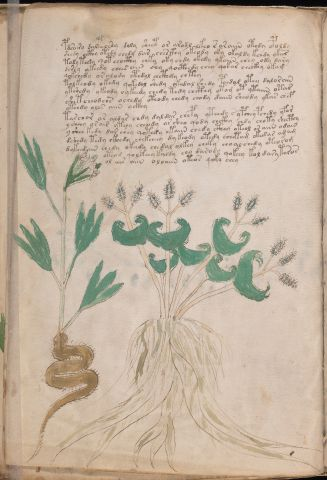

# Voynich Speculative Procedural Protocol — f43v

IMPORTANT: this is NOT a real or validated translation of the Voynich Manuscript. It is a speculative/procedural model that interprets EVA using a user-defined grammar to generate experimental recipes using safe, known edible substitutes.

This file is generated automatically from IVTFF/EVA transliteration plus a user-defined procedural grammar.



## Page / Folio
- currier: B
- folio: f43v
- page_number: 84
- section: herbal

## EVA Text (Transliteration)
```text
pdsairy dalteoshy d[o:a]ly sheet or arodl lkeo r araiin otedy opolde
shedy octhy otedy chedy dar cheskhy okeody oky okaldy kchdy okar
tody teedy qot chocthy chky oky chdy okedy ykaiin chey ody dary
dch'hey ykeedy chees ain shy qocthedy chey qokar checkhy okam
qokchedy oralody otedol chcthdy chtey
tolkchdy okedy qoked[a:o]l shedy okedal shedy pchdol otey dalorain
ytshedy ykeody oykeedy chedy tedy chcthy otam ot ytaiin otas
shetcheodchs ochedy oteody chedy chody daiin sheody ykar chef
yt[ch:ee]dy olos aiin ockhy
tarchor ar aldar chdy daldar chepy yteedy s ypchey pchedy yfor
ysheey or air yteey cheody ar sheo qody chckhy chdy choty shecthy
yshee kedy dar chey qotedy etaiin chedy cthey oteol or aiin odain
dshedy tedy ckhedy chekcheey dy keody otedy cheetam okedar amam
dykeedain chedy okeedy chedal olkey cheky cho[a:y]l chedy oteorom
oteod qolkeey kaldy chy darod[y:?] qokeey kol dary taros
ol eees aiin oloaiin oteos qoky chey
```

## Domain Context (Heuristic; Not a Translation)

This section summarizes recurring **basewords** in this IVTFF domain and shows simple substring evidence that the token markers used by the procedural grammar occur inside frequent words.

Any Italian anagram / English gloss is a best-effort lexicon match, not a decipherment.


### Associated basewords (non-generic; top by frequency in this domain)
- `paiin` (count=477) → Italian anagram `piani`; English: plans (arrangements)
- `okaiin` (count=59) → Italian anagram `coniai`; English: [n/a]
- `qokep` (count=41) → Italian anagram `pecco`; English: [n/a]
- `saiin` (count=40) → Italian anagram `asini`; English: [n/a]
- `kaiin` (count=40) → Italian anagram `acini`; English: [n/a]
- `chaiin` (count=39) → Italian anagram `acini`; English: [n/a]
- `qokaiin` (count=34) → Italian anagram `ciancio`; English: [n/a]
- `qokar` (count=29) → Italian anagram `carco`; English: [n/a]
- `opaiin` (count=29) → Italian anagram `inopia`; English: poverty
- `otchol` (count=25) → Italian anagram `colto`; English: cultivated
- `chopaiin` (count=24) → Italian anagram `apocini`; English: [n/a]
- `qotol` (count=20) → Italian anagram `colto`; English: cultivated
- `okain` (count=19) → Italian anagram `acino`; English: a berry
- `qotor` (count=18) → Italian anagram `corto`; English: short
- `qopaiin` (count=15) → Italian anagram `apocini`; English: [n/a]

### Marker evidence (substring in frequent basewords)
- `qo`: 58 basewords; examples: `qotch`, `qok`, `qot`, `qokch`, `qokep`, `qokaiin`
- `q`: 59 basewords; examples: `qotch`, `qok`, `qot`, `qokch`, `qokep`, `qokaiin`
- `o`: 274 basewords; examples: `chol`, `o`, `chor`, `or`, `shol`, `ol`
- `k`: 146 basewords; examples: `ok`, `k`, `okaiin`, `kch`, `chckh`, `qok`
- `t`: 101 basewords; examples: `cth`, `ot`, `t`, `qotch`, `cthol`, `qot`
- `p`: 152 basewords; examples: `paiin`, `p`, `par`, `pain`, `pal`, `chep`
- `ch`: 145 basewords; examples: `chol`, `chor`, `ch`, `che`, `chep`, `cho`
- `sh`: 51 basewords; examples: `shol`, `sh`, `sho`, `shor`, `she`, `shep`
- `f`: 2 basewords; examples: `fchep`, `f`
- `cth`: 18 basewords; examples: `cth`, `cthol`, `cthor`, `cthe`, `chcth`, `ctho`
- `ckh`: 18 basewords; examples: `chckh`, `ckh`, `ckhe`, `ckhol`, `shckh`, `checkh`
- `cph`: 3 basewords; examples: `cph`, `cphol`, `cphe`
- `iin`: 39 basewords; examples: `paiin`, `aiin`, `okaiin`, `saiin`, `kaiin`, `chaiin`
- `aiin`: 31 basewords; examples: `paiin`, `aiin`, `okaiin`, `saiin`, `kaiin`, `chaiin`

## Recipes Index (This Page)
- [f43v.1,@P0](#f43v-1-f43v-1-p0)
- [f43v.2,+P0](#f43v-2-f43v-2-p0)
- [f43v.3,+P0](#f43v-3-f43v-3-p0)
- [f43v.4,+P0](#f43v-4-f43v-4-p0)
- [f43v.5,+P0](#f43v-5-f43v-5-p0)
- [f43v.6,+P0](#f43v-6-f43v-6-p0)
- [f43v.7,+P0](#f43v-7-f43v-7-p0)
- [f43v.8,+P0](#f43v-8-f43v-8-p0)
- [f43v.9,+P0](#f43v-9-f43v-9-p0)
- [f43v.10,+P0](#f43v-10-f43v-10-p0)
- [f43v.11,+P0](#f43v-11-f43v-11-p0)
- [f43v.12,+P0](#f43v-12-f43v-12-p0)
- [f43v.13,+P0](#f43v-13-f43v-13-p0)
- [f43v.14,+P0](#f43v-14-f43v-14-p0)
- [f43v.15,+P0](#f43v-15-f43v-15-p0)
- [f43v.16,+P0](#f43v-16-f43v-16-p0)

## Line Glosses (Procedural Gloss Only; Not a Translation)

<a id="f43v-1-f43v-1-p0"></a>

### f43v.1,@P0

EVA: pdsairy dalteoshy d[o:a]ly sheet or arodl lkeo r araiin otedy opolde

Direct Gloss (Procedural, Not a Real Translation):
- pdsairy: tokens: p p s a i r → connectors: s r → vowel_run: a (level 1; class a)
- dalteoshy: tokens: p a l t e o sh → connectors: l → vowel_run: a (level 1; class a)
- d: tokens: p
- o: tokens: o
- a: tokens: a → vowel_run: a (level 1; class a)
- ly: tokens: l → connectors: l
- sheet: tokens: sh ee t → vowel_run: ee (level 2; class e)
- or: tokens: o r → connectors: r
- arodl: tokens: a r o p l → connectors: r l → vowel_run: a (level 1; class a)
- lkeo: tokens: l k e o → connectors: l → vowel_run: e (level 1; class e)
- r: tokens: r → connectors: r
- araiin: tokens: a r aiin → connectors: r → vowel_run: a (level 1; class a) → suffix: aiin
- otedy: tokens: o t e p → vowel_run: e (level 1; class e)
- opolde: tokens: o p o l p e → connectors: l → vowel_run: e (level 1; class e)

<a id="f43v-2-f43v-2-p0"></a>

### f43v.2,+P0

EVA: shedy octhy otedy chedy dar cheskhy okeody oky okaldy kchdy okar

Direct Gloss (Procedural, Not a Real Translation):
- shedy: tokens: sh e p → vowel_run: e (level 1; class e)
- octhy: tokens: o cth
- otedy: tokens: o t e p → vowel_run: e (level 1; class e)
- chedy: tokens: ch e p → vowel_run: e (level 1; class e)
- dar: tokens: p a r → connectors: r → vowel_run: a (level 1; class a)
- cheskhy: tokens: ch e s k h → connectors: s → vowel_run: e (level 1; class e) → unmodeled_tokens: h
- okeody: tokens: o k e o p → vowel_run: e (level 1; class e)
- oky: tokens: o k
- okaldy: tokens: o k a l p → connectors: l → vowel_run: a (level 1; class a)
- kchdy: tokens: k ch p
- okar: tokens: o k a r → connectors: r → vowel_run: a (level 1; class a)

<a id="f43v-3-f43v-3-p0"></a>

### f43v.3,+P0

EVA: tody teedy qot chocthy chky oky chdy okedy ykaiin chey ody dary

Direct Gloss (Procedural, Not a Real Translation):
- tody: tokens: t o p
- teedy: tokens: t ee p → vowel_run: ee (level 2; class e)
- qot: tokens: qo t
- chocthy: tokens: ch o cth
- chky: tokens: ch k
- oky: tokens: o k
- chdy: tokens: ch p
- okedy: tokens: o k e p → vowel_run: e (level 1; class e)
- ykaiin: tokens: k aiin → vowel_run: a (level 1; class a) → suffix: aiin
- chey: tokens: ch e → vowel_run: e (level 1; class e)
- ody: tokens: o p
- dary: tokens: p a r → connectors: r → vowel_run: a (level 1; class a)

<a id="f43v-4-f43v-4-p0"></a>

### f43v.4,+P0

EVA: dch'hey ykeedy chees ain shy qocthedy chey qokar checkhy okam

Direct Gloss (Procedural, Not a Real Translation):
- dch: tokens: p ch
- hey: tokens: h e → vowel_run: e (level 1; class e) → unmodeled_tokens: h
- ykeedy: tokens: k ee p → vowel_run: ee (level 2; class e)
- chees: tokens: ch ee s → connectors: s → vowel_run: ee (level 2; class e)
- ain: tokens: a i n → connectors: n → vowel_run: a (level 1; class a)
- shy: tokens: sh
- qocthedy: tokens: qo cth e p → vowel_run: e (level 1; class e)
- chey: tokens: ch e → vowel_run: e (level 1; class e)
- qokar: tokens: qo k a r → connectors: r → vowel_run: a (level 1; class a)
- checkhy: tokens: ch e ckh → vowel_run: e (level 1; class e)
- okam: tokens: o k a m → connectors: m → vowel_run: a (level 1; class a)

<a id="f43v-5-f43v-5-p0"></a>

### f43v.5,+P0

EVA: qokchedy oralody otedol chcthdy chtey

Direct Gloss (Procedural, Not a Real Translation):
- qokchedy: tokens: qo k ch e p → vowel_run: e (level 1; class e)
- oralody: tokens: o r a l o p → connectors: r l → vowel_run: a (level 1; class a)
- otedol: tokens: o t e p o l → connectors: l → vowel_run: e (level 1; class e)
- chcthdy: tokens: ch cth p
- chtey: tokens: ch t e → vowel_run: e (level 1; class e)

<a id="f43v-6-f43v-6-p0"></a>

### f43v.6,+P0

EVA: tolkchdy okedy qoked[a:o]l shedy okedal shedy pchdol otey dalorain

Direct Gloss (Procedural, Not a Real Translation):
- tolkchdy: tokens: t o l k ch p → connectors: l
- okedy: tokens: o k e p → vowel_run: e (level 1; class e)
- qoked: tokens: qo k e p → vowel_run: e (level 1; class e) (lexicon-context: `qokep` → `pecco`; [n/a])
- a: tokens: a → vowel_run: a (level 1; class a)
- o: tokens: o
- l: tokens: l → connectors: l
- shedy: tokens: sh e p → vowel_run: e (level 1; class e)
- okedal: tokens: o k e p a l → connectors: l → vowel_run: e (level 1; class e)
- shedy: tokens: sh e p → vowel_run: e (level 1; class e)
- pchdol: tokens: p ch p o l → connectors: l
- otey: tokens: o t e → vowel_run: e (level 1; class e)
- dalorain: tokens: p a l o r a i n → connectors: l r n → vowel_run: a (level 1; class a)

<a id="f43v-7-f43v-7-p0"></a>

### f43v.7,+P0

EVA: ytshedy ykeody oykeedy chedy tedy chcthy otam ot ytaiin otas

Direct Gloss (Procedural, Not a Real Translation):
- ytshedy: tokens: t sh e p → vowel_run: e (level 1; class e)
- ykeody: tokens: k e o p → vowel_run: e (level 1; class e)
- oykeedy: tokens: o k ee p → vowel_run: ee (level 2; class e)
- chedy: tokens: ch e p → vowel_run: e (level 1; class e)
- tedy: tokens: t e p → vowel_run: e (level 1; class e)
- chcthy: tokens: ch cth
- otam: tokens: o t a m → connectors: m → vowel_run: a (level 1; class a)
- ot: tokens: o t
- ytaiin: tokens: t aiin → vowel_run: a (level 1; class a) → suffix: aiin
- otas: tokens: o t a s → connectors: s → vowel_run: a (level 1; class a)

<a id="f43v-8-f43v-8-p0"></a>

### f43v.8,+P0

EVA: shetcheodchs ochedy oteody chedy chody daiin sheody ykar chef

Direct Gloss (Procedural, Not a Real Translation):
- shetcheodchs: tokens: sh e t ch e o p ch s → connectors: s → vowel_run: e (level 1; class e)
- ochedy: tokens: o ch e p → vowel_run: e (level 1; class e)
- oteody: tokens: o t e o p → vowel_run: e (level 1; class e)
- chedy: tokens: ch e p → vowel_run: e (level 1; class e)
- chody: tokens: ch o p
- daiin: tokens: p aiin → vowel_run: a (level 1; class a) → suffix: aiin (lexicon-context: `paiin` → `piani`; plans (arrangements))
- sheody: tokens: sh e o p → vowel_run: e (level 1; class e)
- ykar: tokens: k a r → connectors: r → vowel_run: a (level 1; class a)
- chef: tokens: ch e f → vowel_run: e (level 1; class e)

<a id="f43v-9-f43v-9-p0"></a>

### f43v.9,+P0

EVA: yt[ch:ee]dy olos aiin ockhy

Direct Gloss (Procedural, Not a Real Translation):
- yt: tokens: t
- ch: tokens: ch
- ee: tokens: ee → vowel_run: ee (level 2; class e)
- dy: tokens: p
- olos: tokens: o l o s → connectors: l s
- aiin: tokens: aiin → vowel_run: a (level 1; class a) → suffix: aiin
- ockhy: tokens: o ckh

<a id="f43v-10-f43v-10-p0"></a>

### f43v.10,+P0

EVA: tarchor ar aldar chdy daldar chepy yteedy s ypchey pchedy yfor

Direct Gloss (Procedural, Not a Real Translation):
- tarchor: tokens: t a r ch o r → connectors: r r → vowel_run: a (level 1; class a)
- ar: tokens: a r → connectors: r → vowel_run: a (level 1; class a)
- aldar: tokens: a l p a r → connectors: l r → vowel_run: a (level 1; class a)
- chdy: tokens: ch p
- daldar: tokens: p a l p a r → connectors: l r → vowel_run: a (level 1; class a)
- chepy: tokens: ch e p → vowel_run: e (level 1; class e)
- yteedy: tokens: t ee p → vowel_run: ee (level 2; class e)
- s: tokens: s → connectors: s
- ypchey: tokens: p ch e → vowel_run: e (level 1; class e)
- pchedy: tokens: p ch e p → vowel_run: e (level 1; class e)
- yfor: tokens: f o r → connectors: r

<a id="f43v-11-f43v-11-p0"></a>

### f43v.11,+P0

EVA: ysheey or air yteey cheody ar sheo qody chckhy chdy choty shecthy

Direct Gloss (Procedural, Not a Real Translation):
- ysheey: tokens: sh ee → vowel_run: ee (level 2; class e)
- or: tokens: o r → connectors: r
- air: tokens: a i r → connectors: r → vowel_run: a (level 1; class a)
- yteey: tokens: t ee → vowel_run: ee (level 2; class e)
- cheody: tokens: ch e o p → vowel_run: e (level 1; class e)
- ar: tokens: a r → connectors: r → vowel_run: a (level 1; class a)
- sheo: tokens: sh e o → vowel_run: e (level 1; class e)
- qody: tokens: qo p
- chckhy: tokens: ch ckh
- chdy: tokens: ch p
- choty: tokens: ch o t
- shecthy: tokens: sh e cth → vowel_run: e (level 1; class e)

<a id="f43v-12-f43v-12-p0"></a>

### f43v.12,+P0

EVA: yshee kedy dar chey qotedy etaiin chedy cthey oteol or aiin odain

Direct Gloss (Procedural, Not a Real Translation):
- yshee: tokens: sh ee → vowel_run: ee (level 2; class e)
- kedy: tokens: k e p → vowel_run: e (level 1; class e)
- dar: tokens: p a r → connectors: r → vowel_run: a (level 1; class a)
- chey: tokens: ch e → vowel_run: e (level 1; class e)
- qotedy: tokens: qo t e p → vowel_run: e (level 1; class e)
- etaiin: tokens: e t aiin → vowel_run: e (level 1; class e) → suffix: aiin
- chedy: tokens: ch e p → vowel_run: e (level 1; class e)
- cthey: tokens: cth e → vowel_run: e (level 1; class e)
- oteol: tokens: o t e o l → connectors: l → vowel_run: e (level 1; class e)
- or: tokens: o r → connectors: r
- aiin: tokens: aiin → vowel_run: a (level 1; class a) → suffix: aiin
- odain: tokens: o p a i n → connectors: n → vowel_run: a (level 1; class a)

<a id="f43v-13-f43v-13-p0"></a>

### f43v.13,+P0

EVA: dshedy tedy ckhedy chekcheey dy keody otedy cheetam okedar amam

Direct Gloss (Procedural, Not a Real Translation):
- dshedy: tokens: p sh e p → vowel_run: e (level 1; class e)
- tedy: tokens: t e p → vowel_run: e (level 1; class e)
- ckhedy: tokens: ckh e p → vowel_run: e (level 1; class e)
- chekcheey: tokens: ch e k ch ee → vowel_run: e (level 1; class e)
- dy: tokens: p
- keody: tokens: k e o p → vowel_run: e (level 1; class e)
- otedy: tokens: o t e p → vowel_run: e (level 1; class e)
- cheetam: tokens: ch ee t a m → connectors: m → vowel_run: ee (level 2; class e)
- okedar: tokens: o k e p a r → connectors: r → vowel_run: e (level 1; class e)
- amam: tokens: a m a m → connectors: m m → vowel_run: a (level 1; class a)

<a id="f43v-14-f43v-14-p0"></a>

### f43v.14,+P0

EVA: dykeedain chedy okeedy chedal olkey cheky cho[a:y]l chedy oteorom

Direct Gloss (Procedural, Not a Real Translation):
- dykeedain: tokens: p k ee p a i n → connectors: n → vowel_run: ee (level 2; class e)
- chedy: tokens: ch e p → vowel_run: e (level 1; class e)
- okeedy: tokens: o k ee p → vowel_run: ee (level 2; class e)
- chedal: tokens: ch e p a l → connectors: l → vowel_run: e (level 1; class e)
- olkey: tokens: o l k e → connectors: l → vowel_run: e (level 1; class e)
- cheky: tokens: ch e k → vowel_run: e (level 1; class e)
- cho: tokens: ch o
- a: tokens: a → vowel_run: a (level 1; class a)
- y: [unparsed]
- l: tokens: l → connectors: l
- chedy: tokens: ch e p → vowel_run: e (level 1; class e)
- oteorom: tokens: o t e o r o m → connectors: r m → vowel_run: e (level 1; class e)

<a id="f43v-15-f43v-15-p0"></a>

### f43v.15,+P0

EVA: oteod qolkeey kaldy chy darod[y:?] qokeey kol dary taros

Direct Gloss (Procedural, Not a Real Translation):
- oteod: tokens: o t e o p → vowel_run: e (level 1; class e)
- qolkeey: tokens: qo l k ee → connectors: l → vowel_run: ee (level 2; class e)
- kaldy: tokens: k a l p → connectors: l → vowel_run: a (level 1; class a)
- chy: tokens: ch
- darod: tokens: p a r o p → connectors: r → vowel_run: a (level 1; class a)
- y: [unparsed]
- qokeey: tokens: qo k ee → vowel_run: ee (level 2; class e)
- kol: tokens: k o l → connectors: l
- dary: tokens: p a r → connectors: r → vowel_run: a (level 1; class a)
- taros: tokens: t a r o s → connectors: r s → vowel_run: a (level 1; class a)

<a id="f43v-16-f43v-16-p0"></a>

### f43v.16,+P0

EVA: ol eees aiin oloaiin oteos qoky chey

Direct Gloss (Procedural, Not a Real Translation):
- ol: tokens: o l → connectors: l
- eees: tokens: eee s → connectors: s → vowel_run: eee (level 3; class e)
- aiin: tokens: aiin → vowel_run: a (level 1; class a) → suffix: aiin
- oloaiin: tokens: o l o aiin → connectors: l → vowel_run: a (level 1; class a) → suffix: aiin
- oteos: tokens: o t e o s → connectors: s → vowel_run: e (level 1; class e)
- qoky: tokens: qo k
- chey: tokens: ch e → vowel_run: e (level 1; class e)
