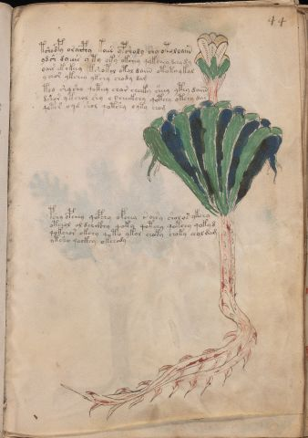

# Voynich Speculative Procedural Protocol — f44r

IMPORTANT: this is NOT a real or validated translation of the Voynich Manuscript. It is a speculative/procedural model that interprets EVA using a user-defined grammar to generate experimental recipes using safe, known edible substitutes.

This file is generated automatically from IVTFF/EVA transliteration plus a user-defined procedural grammar.



## Page / Folio
- folio: f44r
- page_number: 85
- section: herbal

## EVA Text (Transliteration)
```text
tshodpy oraiphy koees ypsholy shy otoloaiin
ydsh dyeees y ty oky okchey qykchey dchy dy
oair ekokeey kshotol otal daiin ototaykal
ychor ykchey ykchy chody dam
toy shysho qoteey char cheeky sheey ytey daiin
dshor y tchol shy o @190;cheekchy qotchy otchy dar
qotch' o[q:y]d shol qotshy oyty chom
pshy opchey qopchy ofchey roiry sholos ykchy
otchol ol dchckhy qoky qotchy qokchy qokyd
qokchor okchy qoto ykol choky choky chol dam
ytsho qockhy okchody
```

## Domain Context (Heuristic; Not a Translation)

This section summarizes recurring **basewords** in this IVTFF domain and shows simple substring evidence that the token markers used by the procedural grammar occur inside frequent words.

Any Italian anagram / English gloss is a best-effort lexicon match, not a decipherment.


### Associated basewords (non-generic; top by frequency in this domain)
- `daiin` (count=461) → Italian anagram `piani`; English: plans (arrangements)
- `okaiin` (count=59) → Italian anagram `coniai`; English: [n/a]
- `chaiin` (count=39) → Italian anagram `acini`; English: [n/a]
- `saiin` (count=37) → Italian anagram `asini`; English: [n/a]
- `qokaiin` (count=34) → Italian anagram `ciancio`; English: [n/a]
- `qokar` (count=29) → Italian anagram `carco`; English: [n/a]
- `odaiin` (count=27) → Italian anagram `inopia`; English: poverty
- `otchol` (count=25) → Italian anagram `colto`; English: cultivated
- `kaiin` (count=24) → Italian anagram `acini`; English: [n/a]
- `chodaiin` (count=24) → Italian anagram `apocini`; English: [n/a]
- `qotol` (count=20) → Italian anagram `colto`; English: cultivated
- `okain` (count=19) → Italian anagram `acino`; English: a berry
- `qotor` (count=18) → Italian anagram `corto`; English: short
- `ykaiin` (count=16) → Italian anagram `acini`; English: [n/a]
- `qodaiin` (count=15) → Italian anagram `apocini`; English: [n/a]

### Marker evidence (substring in frequent basewords)
- `qo`: 57 basewords; examples: `qotchy`, `qokchy`, `qokedy`, `qokaiin`, `qoky`, `qokol`
- `q`: 58 basewords; examples: `qotchy`, `qokchy`, `qokedy`, `qokaiin`, `qoky`, `qokol`
- `o`: 252 basewords; examples: `chol`, `o`, `chor`, `or`, `shol`, `ol`
- `k`: 142 basewords; examples: `okaiin`, `oky`, `chckhy`, `qokchy`, `qokedy`, `okal`
- `t`: 102 basewords; examples: `cthy`, `oty`, `qotchy`, `cthol`, `cthor`, `otaiin`
- `p`: 15 basewords; examples: `cphy`, `ypchedy`, `opchy`, `opchey`, `pchor`, `qopchy`
- `ch`: 138 basewords; examples: `chol`, `chor`, `chy`, `chey`, `chedy`, `chdy`
- `sh`: 46 basewords; examples: `shol`, `sho`, `shy`, `shor`, `shey`, `shedy`
- `f`: 1 basewords; examples: `f`
- `cth`: 17 basewords; examples: `cthy`, `cthol`, `cthor`, `cthey`, `chcthy`, `ctho`
- `ckh`: 15 basewords; examples: `chckhy`, `ckhy`, `ckhol`, `ckhey`, `checkhy`, `shckhy`
- `cph`: 2 basewords; examples: `cphy`, `cphol`
- `dy`: 78 basewords; examples: `dy`, `chedy`, `chdy`, `chody`, `qokedy`, `shedy`
- `iin`: 39 basewords; examples: `daiin`, `aiin`, `okaiin`, `chaiin`, `saiin`, `qokaiin`
- `aiin`: 32 basewords; examples: `daiin`, `aiin`, `okaiin`, `chaiin`, `saiin`, `qokaiin`

## Recipes Index (This Page)
- [f44r.1,@P0](#f44r-1-f44r-1-p0)
- [f44r.2,+P0](#f44r-2-f44r-2-p0)
- [f44r.3,+P0](#f44r-3-f44r-3-p0)
- [f44r.4,+P0](#f44r-4-f44r-4-p0)
- [f44r.5,+P0](#f44r-5-f44r-5-p0)
- [f44r.6,+P0](#f44r-6-f44r-6-p0)
- [f44r.7,+P0](#f44r-7-f44r-7-p0)
- [f44r.8,+P0](#f44r-8-f44r-8-p0)
- [f44r.9,+P0](#f44r-9-f44r-9-p0)
- [f44r.10,+P0](#f44r-10-f44r-10-p0)
- [f44r.11,+P0](#f44r-11-f44r-11-p0)

## Line Glosses (Procedural Gloss Only; Not a Translation)

<a id="f44r-1-f44r-1-p0"></a>

### f44r.1,@P0

EVA: tshodpy oraiphy koees ypsholy shy otoloaiin

Direct Gloss (Procedural, Not a Real Translation):
- tshodpy: apply heat/cooking → add secondary herb (safe substitute) → mix / transfer → add starter / activate
- oraiphy: mix / transfer → add starter / activate → duration level 1 → state: phase transition/start → unmodeled token(s) present: h
- koees: add fermentable sugars → mix / transfer → duration level 2 → state: active extraction
- ypsholy: add secondary herb (safe substitute) → mix / transfer → add starter / activate
- shy: add secondary herb (safe substitute)
- otoloaiin: apply heat/cooking → mix / transfer → duration level 1 → state: phase transition/start → long phase

<a id="f44r-2-f44r-2-p0"></a>

### f44r.2,+P0

EVA: ydsh dyeees y ty oky okchey qykchey dchy dy

Direct Gloss (Procedural, Not a Real Translation):
- ydsh: add secondary herb (safe substitute) → add starter / activate
- dyeees: add starter / activate → duration level 3 → state: active extraction
- y: [unparsed]
- ty: apply heat/cooking
- oky: add fermentable sugars → mix / transfer
- okchey: add fermentable sugars → add main plant (safe substitute) → mix / transfer → duration level 1 → state: active extraction
- qykchey: prepare base (generic) → add fermentable sugars → add main plant (safe substitute) → duration level 1 → state: active extraction
- dchy: add main plant (safe substitute) → add starter / activate
- dy: add starter / activate

<a id="f44r-3-f44r-3-p0"></a>

### f44r.3,+P0

EVA: oair ekokeey kshotol otal daiin ototaykal

Direct Gloss (Procedural, Not a Real Translation):
- oair: mix / transfer → duration level 1 → state: phase transition/start
- ekokeey: add fermentable sugars → mix / transfer → duration level 1 → state: active extraction
- kshotol: add fermentable sugars → apply heat/cooking → add secondary herb (safe substitute) → mix / transfer
- otal: apply heat/cooking → mix / transfer → duration level 1 → state: phase transition/start
- daiin: add starter / activate → duration level 1 → state: phase transition/start → long phase
- ototaykal: add fermentable sugars → apply heat/cooking → mix / transfer → duration level 1 → state: phase transition/start

<a id="f44r-4-f44r-4-p0"></a>

### f44r.4,+P0

EVA: ychor ykchey ykchy chody dam

Direct Gloss (Procedural, Not a Real Translation):
- ychor: add main plant (safe substitute) → mix / transfer
- ykchey: add fermentable sugars → add main plant (safe substitute) → duration level 1 → state: active extraction
- ykchy: add fermentable sugars → add main plant (safe substitute)
- chody: add main plant (safe substitute) → mix / transfer → add starter / activate
- dam: add starter / activate → duration level 1 → state: phase transition/start

<a id="f44r-5-f44r-5-p0"></a>

### f44r.5,+P0

EVA: toy shysho qoteey char cheeky sheey ytey daiin

Direct Gloss (Procedural, Not a Real Translation):
- toy: apply heat/cooking → mix / transfer
- shysho: add secondary herb (safe substitute) → mix / transfer
- qoteey: prepare liquid base → apply heat/cooking → duration level 2 → state: active extraction
- char: add main plant (safe substitute) → duration level 1 → state: phase transition/start
- cheeky: add fermentable sugars → add main plant (safe substitute) → duration level 2 → state: active extraction
- sheey: add secondary herb (safe substitute) → duration level 2 → state: active extraction
- ytey: apply heat/cooking → duration level 1 → state: active extraction
- daiin: add starter / activate → duration level 1 → state: phase transition/start → long phase

<a id="f44r-6-f44r-6-p0"></a>

### f44r.6,+P0

EVA: dshor y tchol shy o @190;cheekchy qotchy otchy dar

Direct Gloss (Procedural, Not a Real Translation):
- dshor: add secondary herb (safe substitute) → mix / transfer → add starter / activate
- y: [unparsed]
- tchol: apply heat/cooking → add main plant (safe substitute) → mix / transfer
- shy: add secondary herb (safe substitute)
- o: mix / transfer
- cheekchy: add fermentable sugars → add main plant (safe substitute) → duration level 2 → state: active extraction
- qotchy: prepare liquid base → apply heat/cooking → add main plant (safe substitute)
- otchy: apply heat/cooking → add main plant (safe substitute) → mix / transfer
- dar: add starter / activate → duration level 1 → state: phase transition/start

<a id="f44r-7-f44r-7-p0"></a>

### f44r.7,+P0

EVA: qotch' o[q:y]d shol qotshy oyty chom

Direct Gloss (Procedural, Not a Real Translation):
- qotch: prepare liquid base → apply heat/cooking → add main plant (safe substitute)
- o: mix / transfer
- q: prepare base (generic)
- y: [unparsed]
- d: add starter / activate
- shol: add secondary herb (safe substitute) → mix / transfer
- qotshy: prepare liquid base → apply heat/cooking → add secondary herb (safe substitute)
- oyty: apply heat/cooking → mix / transfer
- chom: add main plant (safe substitute) → mix / transfer

<a id="f44r-8-f44r-8-p0"></a>

### f44r.8,+P0

EVA: pshy opchey qopchy ofchey roiry sholos ykchy

Direct Gloss (Procedural, Not a Real Translation):
- pshy: add secondary herb (safe substitute) → add starter / activate
- opchey: add main plant (safe substitute) → mix / transfer → add starter / activate → duration level 1 → state: active extraction
- qopchy: prepare liquid base → add main plant (safe substitute) → add starter / activate
- ofchey: add main plant (safe substitute) → add aroma modifier → mix / transfer → duration level 1 → state: active extraction
- roiry: mix / transfer → duration level 1 → state: cooling/rest
- sholos: add secondary herb (safe substitute) → mix / transfer
- ykchy: add fermentable sugars → add main plant (safe substitute)

<a id="f44r-9-f44r-9-p0"></a>

### f44r.9,+P0

EVA: otchol ol dchckhy qoky qotchy qokchy qokyd

Direct Gloss (Procedural, Not a Real Translation):
- otchol: apply heat/cooking → add main plant (safe substitute) → mix / transfer
- ol: mix / transfer
- dchckhy: add main plant (safe substitute) → add starter / activate → add complex herbal compound (safe blend)
- qoky: prepare liquid base → add fermentable sugars
- qotchy: prepare liquid base → apply heat/cooking → add main plant (safe substitute)
- qokchy: prepare liquid base → add fermentable sugars → add main plant (safe substitute)
- qokyd: prepare liquid base → add fermentable sugars → add starter / activate

<a id="f44r-10-f44r-10-p0"></a>

### f44r.10,+P0

EVA: qokchor okchy qoto ykol choky choky chol dam

Direct Gloss (Procedural, Not a Real Translation):
- qokchor: prepare liquid base → add fermentable sugars → add main plant (safe substitute) → mix / transfer
- okchy: add fermentable sugars → add main plant (safe substitute) → mix / transfer
- qoto: prepare liquid base → apply heat/cooking → mix / transfer
- ykol: add fermentable sugars → mix / transfer
- choky: add fermentable sugars → add main plant (safe substitute) → mix / transfer
- choky: add fermentable sugars → add main plant (safe substitute) → mix / transfer
- chol: add main plant (safe substitute) → mix / transfer
- dam: add starter / activate → duration level 1 → state: phase transition/start

<a id="f44r-11-f44r-11-p0"></a>

### f44r.11,+P0

EVA: ytsho qockhy okchody

Direct Gloss (Procedural, Not a Real Translation):
- ytsho: apply heat/cooking → add secondary herb (safe substitute) → mix / transfer
- qockhy: prepare liquid base → add complex herbal compound (safe blend)
- okchody: add fermentable sugars → add main plant (safe substitute) → mix / transfer → add starter / activate
