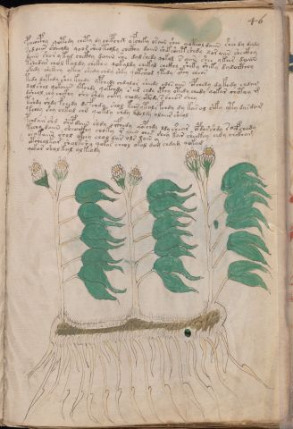

# Voynich Speculative Herbal Ferment Recipe — f46r

IMPORTANT: this is NOT a real or validated translation of the Voynich Manuscript. It is a speculative/procedural model that interprets EVA using a user-defined grammar to generate experimental recipes using safe, known edible substitutes.

This file is generated automatically from IVTFF/EVA transliteration plus a user-defined procedural grammar.



## Page / Folio
- folio: f46r
- page_number: 89
- section: herbal

## EVA Text (Transliteration)
```text
pcheocphy qotedy chety dy chepchx yfcheky o[s:r]aiin shee qoteol daiin shee dy daly
sodaiin sheeoly qoor sheo teoly chckhy daiin sh[ck:ek] sheet shedy xo[r:s] aiin sheckhy
daiin shor ykal che[kh:th]y daiin she dalshedy qokol s aiin shee ykar daiin
tshedar chol kaldy chckhy qokaldy chekal chckhy sheky sheky dalocthhy
okeedy shekeey ykey shedy chdy shky qotsheod ytedy ytey che[o:a]r
tedy d[y:o]tedy shee keedy ypchedy chdalor sheedy odo[s:r] aiin opchedy dykedy chdam
xol shol qokaiin ytchdy qokchdy s ar chdy cthy otedy chedy qokar chcthy m
dsheol chy chckhy shy shdy chky chody cthdy s cheos chey
tshdy shdy fchedy dyfchdy shol kees ytaly fchdy dy karal shky yty dardam
tchey shy chkal chd qokdy shdy adoldy olaiir sheol
pchdair shd shep daiin shdy oifhedy qopchdy ldy shear opdarshdy s @136;yfchedy
techy daiin sheockhy choky r aiin ches shey kar sheckhy chdy chckham
ar akaiin shol okeey chol dar ols lain y
otchealkar sholkshy qokar cheol okal dam chdam qokam
qokar shol kal [a:o]lkeody
```

## Recipes Index (This Page)
- [f46r.1,@P0](#f46r-1-f46r-1-p0)
- [f46r.2,+P0](#f46r-2-f46r-2-p0)
- [f46r.3,+P0](#f46r-3-f46r-3-p0)
- [f46r.4,+P0](#f46r-4-f46r-4-p0)
- [f46r.5,+P0](#f46r-5-f46r-5-p0)
- [f46r.6,+P0](#f46r-6-f46r-6-p0)
- [f46r.7,+P0](#f46r-7-f46r-7-p0)
- [f46r.8,+P0](#f46r-8-f46r-8-p0)
- [f46r.9,+P0](#f46r-9-f46r-9-p0)
- [f46r.10,+P0](#f46r-10-f46r-10-p0)
- [f46r.11,+P0](#f46r-11-f46r-11-p0)
- [f46r.12,+P0](#f46r-12-f46r-12-p0)
- [f46r.13,+P0](#f46r-13-f46r-13-p0)
- [f46r.14,+P0](#f46r-14-f46r-14-p0)
- [f46r.15,+P0](#f46r-15-f46r-15-p0)

## Line Glosses (Procedural Gloss Only; Not a Translation)

<a id="f46r-1-f46r-1-p0"></a>

### f46r.1,@P0

EVA: pcheocphy qotedy chety dy chepchx yfcheky o[s:r]aiin shee qoteol daiin shee dy daly

Direct Gloss (Procedural, Not a Real Translation):
- pcheocphy: add main plant (safe substitute) → mix / transfer → start fermentation (yeast) → add complex herbal compound (safe blend) → duration level 1 → state: active extraction
- qotedy: prepare liquid base → apply heat/cooking → start fermentation (yeast) → duration level 1 → state: active extraction
- chety: apply heat/cooking → add main plant (safe substitute) → duration level 1 → state: active extraction
- dy: start fermentation (yeast)
- chepchx: add main plant (safe substitute) → start fermentation (yeast) → duration level 1 → state: active extraction
- yfcheky: add fermentable sugars → add main plant (safe substitute) → add aroma modifier → duration level 1 → state: active extraction
- o: mix / transfer
- s: [unparsed]
- r: [unparsed]
- aiin: duration level 1 → state: fermentation start → long fermentation / aging phase
- shee: add secondary herb (safe substitute) → duration level 2 → state: active extraction
- qoteol: prepare liquid base → apply heat/cooking → mix / transfer → duration level 1 → state: active extraction
- daiin: start fermentation (yeast) → duration level 1 → state: fermentation start → long fermentation / aging phase
- shee: add secondary herb (safe substitute) → duration level 2 → state: active extraction
- dy: start fermentation (yeast)
- daly: start fermentation (yeast) → duration level 1 → state: fermentation start

<a id="f46r-2-f46r-2-p0"></a>

### f46r.2,+P0

EVA: sodaiin sheeoly qoor sheo teoly chckhy daiin sh[ck:ek] sheet shedy xo[r:s] aiin sheckhy

Direct Gloss (Procedural, Not a Real Translation):
- sodaiin: mix / transfer → start fermentation (yeast) → duration level 1 → state: fermentation start → long fermentation / aging phase
- sheeoly: add secondary herb (safe substitute) → mix / transfer → duration level 2 → state: active extraction
- qoor: prepare liquid base → mix / transfer
- sheo: add secondary herb (safe substitute) → mix / transfer → duration level 1 → state: active extraction
- teoly: apply heat/cooking → mix / transfer → duration level 1 → state: active extraction
- chckhy: add main plant (safe substitute) → add complex herbal compound (safe blend)
- daiin: start fermentation (yeast) → duration level 1 → state: fermentation start → long fermentation / aging phase
- sh: add secondary herb (safe substitute)
- ck: add fermentable sugars
- ek: add fermentable sugars → duration level 1 → state: active extraction
- sheet: apply heat/cooking → add secondary herb (safe substitute) → duration level 2 → state: active extraction
- shedy: add secondary herb (safe substitute) → start fermentation (yeast) → duration level 1 → state: active extraction
- xo: mix / transfer
- r: [unparsed]
- s: [unparsed]
- aiin: duration level 1 → state: fermentation start → long fermentation / aging phase
- sheckhy: add secondary herb (safe substitute) → add complex herbal compound (safe blend) → duration level 1 → state: active extraction

<a id="f46r-3-f46r-3-p0"></a>

### f46r.3,+P0

EVA: daiin shor ykal che[kh:th]y daiin she dalshedy qokol s aiin shee ykar daiin

Direct Gloss (Procedural, Not a Real Translation):
- daiin: start fermentation (yeast) → duration level 1 → state: fermentation start → long fermentation / aging phase
- shor: add secondary herb (safe substitute) → mix / transfer
- ykal: add fermentable sugars → duration level 1 → state: fermentation start
- che: add main plant (safe substitute) → duration level 1 → state: active extraction
- kh: add fermentable sugars
- th: apply heat/cooking
- y: [unparsed]
- daiin: start fermentation (yeast) → duration level 1 → state: fermentation start → long fermentation / aging phase
- she: add secondary herb (safe substitute) → duration level 1 → state: active extraction
- dalshedy: add secondary herb (safe substitute) → start fermentation (yeast) → duration level 1 → state: fermentation start
- qokol: prepare liquid base → add fermentable sugars → mix / transfer
- s: [unparsed]
- aiin: duration level 1 → state: fermentation start → long fermentation / aging phase
- shee: add secondary herb (safe substitute) → duration level 2 → state: active extraction
- ykar: add fermentable sugars → duration level 1 → state: fermentation start
- daiin: start fermentation (yeast) → duration level 1 → state: fermentation start → long fermentation / aging phase

<a id="f46r-4-f46r-4-p0"></a>

### f46r.4,+P0

EVA: tshedar chol kaldy chckhy qokaldy chekal chckhy sheky sheky dalocthhy

Direct Gloss (Procedural, Not a Real Translation):
- tshedar: apply heat/cooking → add secondary herb (safe substitute) → start fermentation (yeast) → duration level 1 → state: active extraction
- chol: add main plant (safe substitute) → mix / transfer
- kaldy: add fermentable sugars → start fermentation (yeast) → duration level 1 → state: fermentation start
- chckhy: add main plant (safe substitute) → add complex herbal compound (safe blend)
- qokaldy: prepare liquid base → add fermentable sugars → start fermentation (yeast) → duration level 1 → state: fermentation start
- chekal: add fermentable sugars → add main plant (safe substitute) → duration level 1 → state: active extraction
- chckhy: add main plant (safe substitute) → add complex herbal compound (safe blend)
- sheky: add fermentable sugars → add secondary herb (safe substitute) → duration level 1 → state: active extraction
- sheky: add fermentable sugars → add secondary herb (safe substitute) → duration level 1 → state: active extraction
- dalocthhy: mix / transfer → start fermentation (yeast) → add complex herbal compound (safe blend) → duration level 1 → state: fermentation start

<a id="f46r-5-f46r-5-p0"></a>

### f46r.5,+P0

EVA: okeedy shekeey ykey shedy chdy shky qotsheod ytedy ytey che[o:a]r

Direct Gloss (Procedural, Not a Real Translation):
- okeedy: add fermentable sugars → mix / transfer → start fermentation (yeast) → duration level 2 → state: active extraction
- shekeey: add fermentable sugars → add secondary herb (safe substitute) → duration level 1 → state: active extraction
- ykey: add fermentable sugars → duration level 1 → state: active extraction
- shedy: add secondary herb (safe substitute) → start fermentation (yeast) → duration level 1 → state: active extraction
- chdy: add main plant (safe substitute) → start fermentation (yeast)
- shky: add fermentable sugars → add secondary herb (safe substitute)
- qotsheod: prepare liquid base → apply heat/cooking → add secondary herb (safe substitute) → mix / transfer → start fermentation (yeast) → duration level 1 → state: active extraction
- ytedy: apply heat/cooking → start fermentation (yeast) → duration level 1 → state: active extraction
- ytey: apply heat/cooking → duration level 1 → state: active extraction
- che: add main plant (safe substitute) → duration level 1 → state: active extraction
- o: mix / transfer
- a: duration level 1 → state: fermentation start
- r: [unparsed]

<a id="f46r-6-f46r-6-p0"></a>

### f46r.6,+P0

EVA: tedy d[y:o]tedy shee keedy ypchedy chdalor sheedy odo[s:r] aiin opchedy dykedy chdam

Direct Gloss (Procedural, Not a Real Translation):
- tedy: apply heat/cooking → start fermentation (yeast) → duration level 1 → state: active extraction
- d: start fermentation (yeast)
- y: [unparsed]
- o: mix / transfer
- tedy: apply heat/cooking → start fermentation (yeast) → duration level 1 → state: active extraction
- shee: add secondary herb (safe substitute) → duration level 2 → state: active extraction
- keedy: add fermentable sugars → start fermentation (yeast) → duration level 2 → state: active extraction
- ypchedy: add main plant (safe substitute) → start fermentation (yeast) → duration level 1 → state: active extraction
- chdalor: add main plant (safe substitute) → mix / transfer → start fermentation (yeast) → duration level 1 → state: fermentation start
- sheedy: add secondary herb (safe substitute) → start fermentation (yeast) → duration level 2 → state: active extraction
- odo: mix / transfer → start fermentation (yeast)
- s: [unparsed]
- r: [unparsed]
- aiin: duration level 1 → state: fermentation start → long fermentation / aging phase
- opchedy: add main plant (safe substitute) → mix / transfer → start fermentation (yeast) → duration level 1 → state: active extraction
- dykedy: add fermentable sugars → start fermentation (yeast) → duration level 1 → state: active extraction
- chdam: add main plant (safe substitute) → start fermentation (yeast) → duration level 1 → state: fermentation start

<a id="f46r-7-f46r-7-p0"></a>

### f46r.7,+P0

EVA: xol shol qokaiin ytchdy qokchdy s ar chdy cthy otedy chedy qokar chcthy m

Direct Gloss (Procedural, Not a Real Translation):
- xol: mix / transfer
- shol: add secondary herb (safe substitute) → mix / transfer
- qokaiin: prepare liquid base → add fermentable sugars → duration level 1 → state: fermentation start → long fermentation / aging phase
- ytchdy: apply heat/cooking → add main plant (safe substitute) → start fermentation (yeast)
- qokchdy: prepare liquid base → add fermentable sugars → add main plant (safe substitute) → start fermentation (yeast)
- s: [unparsed]
- ar: duration level 1 → state: fermentation start
- chdy: add main plant (safe substitute) → start fermentation (yeast)
- cthy: add complex herbal compound (safe blend)
- otedy: apply heat/cooking → mix / transfer → start fermentation (yeast) → duration level 1 → state: active extraction
- chedy: add main plant (safe substitute) → start fermentation (yeast) → duration level 1 → state: active extraction
- qokar: prepare liquid base → add fermentable sugars → duration level 1 → state: fermentation start
- chcthy: add main plant (safe substitute) → add complex herbal compound (safe blend)
- m: [unparsed]

<a id="f46r-8-f46r-8-p0"></a>

### f46r.8,+P0

EVA: dsheol chy chckhy shy shdy chky chody cthdy s cheos chey

Direct Gloss (Procedural, Not a Real Translation):
- dsheol: add secondary herb (safe substitute) → mix / transfer → start fermentation (yeast) → duration level 1 → state: active extraction
- chy: add main plant (safe substitute)
- chckhy: add main plant (safe substitute) → add complex herbal compound (safe blend)
- shy: add secondary herb (safe substitute)
- shdy: add secondary herb (safe substitute) → start fermentation (yeast)
- chky: add fermentable sugars → add main plant (safe substitute)
- chody: add main plant (safe substitute) → mix / transfer → start fermentation (yeast)
- cthdy: start fermentation (yeast) → add complex herbal compound (safe blend)
- s: [unparsed]
- cheos: add main plant (safe substitute) → mix / transfer → duration level 1 → state: active extraction
- chey: add main plant (safe substitute) → duration level 1 → state: active extraction

<a id="f46r-9-f46r-9-p0"></a>

### f46r.9,+P0

EVA: tshdy shdy fchedy dyfchdy shol kees ytaly fchdy dy karal shky yty dardam

Direct Gloss (Procedural, Not a Real Translation):
- tshdy: apply heat/cooking → add secondary herb (safe substitute) → start fermentation (yeast)
- shdy: add secondary herb (safe substitute) → start fermentation (yeast)
- fchedy: add main plant (safe substitute) → add aroma modifier → start fermentation (yeast) → duration level 1 → state: active extraction
- dyfchdy: add main plant (safe substitute) → add aroma modifier → start fermentation (yeast)
- shol: add secondary herb (safe substitute) → mix / transfer
- kees: add fermentable sugars → duration level 2 → state: active extraction
- ytaly: apply heat/cooking → duration level 1 → state: fermentation start
- fchdy: add main plant (safe substitute) → add aroma modifier → start fermentation (yeast)
- dy: start fermentation (yeast)
- karal: add fermentable sugars → duration level 1 → state: fermentation start
- shky: add fermentable sugars → add secondary herb (safe substitute)
- yty: apply heat/cooking
- dardam: start fermentation (yeast) → duration level 1 → state: fermentation start

<a id="f46r-10-f46r-10-p0"></a>

### f46r.10,+P0

EVA: tchey shy chkal chd qokdy shdy adoldy olaiir sheol

Direct Gloss (Procedural, Not a Real Translation):
- tchey: apply heat/cooking → add main plant (safe substitute) → duration level 1 → state: active extraction
- shy: add secondary herb (safe substitute)
- chkal: add fermentable sugars → add main plant (safe substitute) → duration level 1 → state: fermentation start
- chd: add main plant (safe substitute) → start fermentation (yeast)
- qokdy: prepare liquid base → add fermentable sugars → start fermentation (yeast)
- shdy: add secondary herb (safe substitute) → start fermentation (yeast)
- adoldy: mix / transfer → start fermentation (yeast) → duration level 1 → state: fermentation start
- olaiir: mix / transfer → duration level 1 → state: fermentation start
- sheol: add secondary herb (safe substitute) → mix / transfer → duration level 1 → state: active extraction

<a id="f46r-11-f46r-11-p0"></a>

### f46r.11,+P0

EVA: pchdair shd shep daiin shdy oifhedy qopchdy ldy shear opdarshdy s @136;yfchedy

Direct Gloss (Procedural, Not a Real Translation):
- pchdair: add main plant (safe substitute) → start fermentation (yeast) → duration level 1 → state: fermentation start
- shd: add secondary herb (safe substitute) → start fermentation (yeast)
- shep: add secondary herb (safe substitute) → start fermentation (yeast) → duration level 1 → state: active extraction
- daiin: start fermentation (yeast) → duration level 1 → state: fermentation start → long fermentation / aging phase
- shdy: add secondary herb (safe substitute) → start fermentation (yeast)
- oifhedy: add aroma modifier → mix / transfer → start fermentation (yeast) → duration level 1 → state: cooling/rest
- qopchdy: prepare liquid base → add main plant (safe substitute) → start fermentation (yeast)
- ldy: start fermentation (yeast)
- shear: add secondary herb (safe substitute) → duration level 1 → state: active extraction
- opdarshdy: add secondary herb (safe substitute) → mix / transfer → start fermentation (yeast) → duration level 1 → state: fermentation start
- s: [unparsed]
- yfchedy: add main plant (safe substitute) → add aroma modifier → start fermentation (yeast) → duration level 1 → state: active extraction

<a id="f46r-12-f46r-12-p0"></a>

### f46r.12,+P0

EVA: techy daiin sheockhy choky r aiin ches shey kar sheckhy chdy chckham

Direct Gloss (Procedural, Not a Real Translation):
- techy: apply heat/cooking → add main plant (safe substitute) → duration level 1 → state: active extraction
- daiin: start fermentation (yeast) → duration level 1 → state: fermentation start → long fermentation / aging phase
- sheockhy: add secondary herb (safe substitute) → mix / transfer → add complex herbal compound (safe blend) → duration level 1 → state: active extraction
- choky: add fermentable sugars → add main plant (safe substitute) → mix / transfer
- r: [unparsed]
- aiin: duration level 1 → state: fermentation start → long fermentation / aging phase
- ches: add main plant (safe substitute) → duration level 1 → state: active extraction
- shey: add secondary herb (safe substitute) → duration level 1 → state: active extraction
- kar: add fermentable sugars → duration level 1 → state: fermentation start
- sheckhy: add secondary herb (safe substitute) → add complex herbal compound (safe blend) → duration level 1 → state: active extraction
- chdy: add main plant (safe substitute) → start fermentation (yeast)
- chckham: add main plant (safe substitute) → add complex herbal compound (safe blend) → duration level 1 → state: fermentation start

<a id="f46r-13-f46r-13-p0"></a>

### f46r.13,+P0

EVA: ar akaiin shol okeey chol dar ols lain y

Direct Gloss (Procedural, Not a Real Translation):
- ar: duration level 1 → state: fermentation start
- akaiin: add fermentable sugars → duration level 1 → state: fermentation start → long fermentation / aging phase
- shol: add secondary herb (safe substitute) → mix / transfer
- okeey: add fermentable sugars → mix / transfer → duration level 2 → state: active extraction
- chol: add main plant (safe substitute) → mix / transfer
- dar: start fermentation (yeast) → duration level 1 → state: fermentation start
- ols: mix / transfer
- lain: duration level 1 → state: fermentation start
- y: [unparsed]

<a id="f46r-14-f46r-14-p0"></a>

### f46r.14,+P0

EVA: otchealkar sholkshy qokar cheol okal dam chdam qokam

Direct Gloss (Procedural, Not a Real Translation):
- otchealkar: add fermentable sugars → apply heat/cooking → add main plant (safe substitute) → mix / transfer → duration level 1 → state: active extraction
- sholkshy: add fermentable sugars → add secondary herb (safe substitute) → mix / transfer
- qokar: prepare liquid base → add fermentable sugars → duration level 1 → state: fermentation start
- cheol: add main plant (safe substitute) → mix / transfer → duration level 1 → state: active extraction
- okal: add fermentable sugars → mix / transfer → duration level 1 → state: fermentation start
- dam: start fermentation (yeast) → duration level 1 → state: fermentation start
- chdam: add main plant (safe substitute) → start fermentation (yeast) → duration level 1 → state: fermentation start
- qokam: prepare liquid base → add fermentable sugars → duration level 1 → state: fermentation start

<a id="f46r-15-f46r-15-p0"></a>

### f46r.15,+P0

EVA: qokar shol kal [a:o]lkeody

Direct Gloss (Procedural, Not a Real Translation):
- qokar: prepare liquid base → add fermentable sugars → duration level 1 → state: fermentation start
- shol: add secondary herb (safe substitute) → mix / transfer
- kal: add fermentable sugars → duration level 1 → state: fermentation start
- a: duration level 1 → state: fermentation start
- o: mix / transfer
- lkeody: add fermentable sugars → mix / transfer → start fermentation (yeast) → duration level 1 → state: active extraction
