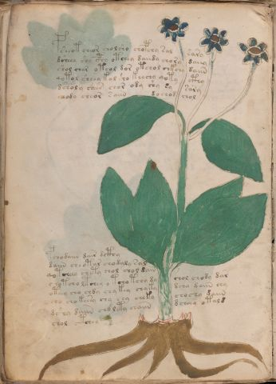

# Voynich Speculative Procedural Protocol — f47v

IMPORTANT: this is NOT a real or validated translation of the Voynich Manuscript. It is a speculative/procedural model that interprets EVA using a user-defined grammar to generate experimental recipes using safe, known edible substitutes.

This file is generated automatically from IVTFF/EVA transliteration plus a user-defined procedural grammar.



## Page / Folio
- folio: f47v
- page_number: 92
- section: herbal

## EVA Text (Transliteration)
```text
psheot cheor cholsho chopchy sal sary
dsheey shy cphy otchey daiidy chory daiiy
shol char oteol dor otchol chkchy daiin
qotol sheey kol sho keechy qoty cthy
dsholy shees chor ody shy sy sary
chody cheor saiin dochod chol
pchodaiin dair dcthy
daiin cheotar chodaly sal
qotcheey chety chol chol dain
chotcho ltchey [o:y] tcho tchy dy chol chody dar
ot[ee:a:ei]y cho chdy chy key chyky dchy daiin chy
ch[y:o] cho keesy chy chy cheky chochy daiin
dshy daiin chdlety chaiin dcheey otald
chol ctchey
```

## Domain Context (Heuristic; Not a Translation)

This section summarizes recurring **basewords** in this IVTFF domain and shows simple substring evidence that the token markers used by the procedural grammar occur inside frequent words.

Any Italian anagram / English gloss is a best-effort lexicon match, not a decipherment.


### Associated basewords (non-generic; top by frequency in this domain)
- `paiin` (count=477) → Italian anagram `piani`; English: plans (arrangements)
- `okaiin` (count=59) → Italian anagram `coniai`; English: [n/a]
- `qokep` (count=41) → Italian anagram `pecco`; English: [n/a]
- `saiin` (count=40) → Italian anagram `asini`; English: [n/a]
- `kaiin` (count=40) → Italian anagram `acini`; English: [n/a]
- `chaiin` (count=39) → Italian anagram `acini`; English: [n/a]
- `qokaiin` (count=34) → Italian anagram `ciancio`; English: [n/a]
- `qokar` (count=29) → Italian anagram `carco`; English: [n/a]
- `opaiin` (count=29) → Italian anagram `inopia`; English: poverty
- `otchol` (count=25) → Italian anagram `colto`; English: cultivated
- `chopaiin` (count=24) → Italian anagram `apocini`; English: [n/a]
- `qotol` (count=20) → Italian anagram `colto`; English: cultivated
- `okain` (count=19) → Italian anagram `acino`; English: a berry
- `qotor` (count=18) → Italian anagram `corto`; English: short
- `qopaiin` (count=15) → Italian anagram `apocini`; English: [n/a]

### Marker evidence (substring in frequent basewords)
- `qo`: 58 basewords; examples: `qotch`, `qok`, `qot`, `qokch`, `qokep`, `qokaiin`
- `q`: 59 basewords; examples: `qotch`, `qok`, `qot`, `qokch`, `qokep`, `qokaiin`
- `o`: 274 basewords; examples: `chol`, `o`, `chor`, `or`, `shol`, `ol`
- `k`: 146 basewords; examples: `ok`, `k`, `okaiin`, `kch`, `chckh`, `qok`
- `t`: 101 basewords; examples: `cth`, `ot`, `t`, `qotch`, `cthol`, `qot`
- `p`: 152 basewords; examples: `paiin`, `p`, `par`, `pain`, `pal`, `chep`
- `ch`: 145 basewords; examples: `chol`, `chor`, `ch`, `che`, `chep`, `cho`
- `sh`: 51 basewords; examples: `shol`, `sh`, `sho`, `shor`, `she`, `shep`
- `f`: 2 basewords; examples: `fchep`, `f`
- `cth`: 18 basewords; examples: `cth`, `cthol`, `cthor`, `cthe`, `chcth`, `ctho`
- `ckh`: 18 basewords; examples: `chckh`, `ckh`, `ckhe`, `ckhol`, `shckh`, `checkh`
- `cph`: 3 basewords; examples: `cph`, `cphol`, `cphe`
- `iin`: 39 basewords; examples: `paiin`, `aiin`, `okaiin`, `saiin`, `kaiin`, `chaiin`
- `aiin`: 31 basewords; examples: `paiin`, `aiin`, `okaiin`, `saiin`, `kaiin`, `chaiin`

## Recipes Index (This Page)
- [f47v.1,@P0](#f47v-1-f47v-1-p0)
- [f47v.2,+P0](#f47v-2-f47v-2-p0)
- [f47v.3,+P0](#f47v-3-f47v-3-p0)
- [f47v.4,+P0](#f47v-4-f47v-4-p0)
- [f47v.5,+P0](#f47v-5-f47v-5-p0)
- [f47v.6,+P0](#f47v-6-f47v-6-p0)
- [f47v.7,+P0](#f47v-7-f47v-7-p0)
- [f47v.8,+P0](#f47v-8-f47v-8-p0)
- [f47v.9,+P0](#f47v-9-f47v-9-p0)
- [f47v.10,+P0](#f47v-10-f47v-10-p0)
- [f47v.11,+P0](#f47v-11-f47v-11-p0)
- [f47v.12,+P0](#f47v-12-f47v-12-p0)
- [f47v.13,+P0](#f47v-13-f47v-13-p0)
- [f47v.14,+P0](#f47v-14-f47v-14-p0)

## Line Glosses (Procedural Gloss Only; Not a Translation)

<a id="f47v-1-f47v-1-p0"></a>

### f47v.1,@P0

EVA: psheot cheor cholsho chopchy sal sary

Direct Gloss (Procedural, Not a Real Translation):
- psheot: tokens: p sh e o t → vowel_run: e (level 1; class e)
- cheor: tokens: ch e o r → connectors: r → vowel_run: e (level 1; class e)
- cholsho: tokens: ch o l sh o → connectors: l
- chopchy: tokens: ch o p ch
- sal: tokens: s a l → connectors: s l → vowel_run: a (level 1; class a)
- sary: tokens: s a r → connectors: s r → vowel_run: a (level 1; class a)

<a id="f47v-2-f47v-2-p0"></a>

### f47v.2,+P0

EVA: dsheey shy cphy otchey daiidy chory daiiy

Direct Gloss (Procedural, Not a Real Translation):
- dsheey: tokens: p sh ee → vowel_run: ee (level 2; class e)
- shy: tokens: sh
- cphy: tokens: cph
- otchey: tokens: o t ch e → vowel_run: e (level 1; class e)
- daiidy: tokens: p a ii p → vowel_run: a (level 1; class a)
- chory: tokens: ch o r → connectors: r
- daiiy: tokens: p a ii → vowel_run: a (level 1; class a)

<a id="f47v-3-f47v-3-p0"></a>

### f47v.3,+P0

EVA: shol char oteol dor otchol chkchy daiin

Direct Gloss (Procedural, Not a Real Translation):
- shol: tokens: sh o l → connectors: l
- char: tokens: ch a r → connectors: r → vowel_run: a (level 1; class a)
- oteol: tokens: o t e o l → connectors: l → vowel_run: e (level 1; class e)
- dor: tokens: p o r → connectors: r
- otchol: tokens: o t ch o l → connectors: l (lexicon-context: `otchol` → `colto`; cultivated)
- chkchy: tokens: ch k ch
- daiin: tokens: p aiin → vowel_run: a (level 1; class a) → suffix: aiin (lexicon-context: `paiin` → `piani`; plans (arrangements))

<a id="f47v-4-f47v-4-p0"></a>

### f47v.4,+P0

EVA: qotol sheey kol sho keechy qoty cthy

Direct Gloss (Procedural, Not a Real Translation):
- qotol: tokens: qo t o l → connectors: l (lexicon-context: `qotol` → `colto`; cultivated)
- sheey: tokens: sh ee → vowel_run: ee (level 2; class e)
- kol: tokens: k o l → connectors: l
- sho: tokens: sh o
- keechy: tokens: k ee ch → vowel_run: ee (level 2; class e)
- qoty: tokens: qo t
- cthy: tokens: cth

<a id="f47v-5-f47v-5-p0"></a>

### f47v.5,+P0

EVA: dsholy shees chor ody shy sy sary

Direct Gloss (Procedural, Not a Real Translation):
- dsholy: tokens: p sh o l → connectors: l
- shees: tokens: sh ee s → connectors: s → vowel_run: ee (level 2; class e)
- chor: tokens: ch o r → connectors: r
- ody: tokens: o p
- shy: tokens: sh
- sy: tokens: s → connectors: s
- sary: tokens: s a r → connectors: s r → vowel_run: a (level 1; class a)

<a id="f47v-6-f47v-6-p0"></a>

### f47v.6,+P0

EVA: chody cheor saiin dochod chol

Direct Gloss (Procedural, Not a Real Translation):
- chody: tokens: ch o p
- cheor: tokens: ch e o r → connectors: r → vowel_run: e (level 1; class e)
- saiin: tokens: s aiin → connectors: s → vowel_run: a (level 1; class a) → suffix: aiin (lexicon-context: `saiin` → `asini`; [n/a])
- dochod: tokens: p o ch o p
- chol: tokens: ch o l → connectors: l

<a id="f47v-7-f47v-7-p0"></a>

### f47v.7,+P0

EVA: pchodaiin dair dcthy

Direct Gloss (Procedural, Not a Real Translation):
- pchodaiin: tokens: p ch o p aiin → vowel_run: a (level 1; class a) → suffix: aiin
- dair: tokens: p a i r → connectors: r → vowel_run: a (level 1; class a)
- dcthy: tokens: p cth

<a id="f47v-8-f47v-8-p0"></a>

### f47v.8,+P0

EVA: daiin cheotar chodaly sal

Direct Gloss (Procedural, Not a Real Translation):
- daiin: tokens: p aiin → vowel_run: a (level 1; class a) → suffix: aiin (lexicon-context: `paiin` → `piani`; plans (arrangements))
- cheotar: tokens: ch e o t a r → connectors: r → vowel_run: e (level 1; class e)
- chodaly: tokens: ch o p a l → connectors: l → vowel_run: a (level 1; class a)
- sal: tokens: s a l → connectors: s l → vowel_run: a (level 1; class a)

<a id="f47v-9-f47v-9-p0"></a>

### f47v.9,+P0

EVA: qotcheey chety chol chol dain

Direct Gloss (Procedural, Not a Real Translation):
- qotcheey: tokens: qo t ch ee → vowel_run: ee (level 2; class e)
- chety: tokens: ch e t → vowel_run: e (level 1; class e)
- chol: tokens: ch o l → connectors: l
- chol: tokens: ch o l → connectors: l
- dain: tokens: p a i n → connectors: n → vowel_run: a (level 1; class a)

<a id="f47v-10-f47v-10-p0"></a>

### f47v.10,+P0

EVA: chotcho ltchey [o:y] tcho tchy dy chol chody dar

Direct Gloss (Procedural, Not a Real Translation):
- chotcho: tokens: ch o t ch o
- ltchey: tokens: l t ch e → connectors: l → vowel_run: e (level 1; class e)
- o: tokens: o
- y: [unparsed]
- tcho: tokens: t ch o
- tchy: tokens: t ch
- dy: tokens: p
- chol: tokens: ch o l → connectors: l
- chody: tokens: ch o p
- dar: tokens: p a r → connectors: r → vowel_run: a (level 1; class a)

<a id="f47v-11-f47v-11-p0"></a>

### f47v.11,+P0

EVA: ot[ee:a:ei]y cho chdy chy key chyky dchy daiin chy

Direct Gloss (Procedural, Not a Real Translation):
- ot: tokens: o t
- ee: tokens: ee → vowel_run: ee (level 2; class e)
- a: tokens: a → vowel_run: a (level 1; class a)
- ei: tokens: e i → vowel_run: e (level 1; class e)
- y: [unparsed]
- cho: tokens: ch o
- chdy: tokens: ch p
- chy: tokens: ch
- key: tokens: k e → vowel_run: e (level 1; class e)
- chyky: tokens: ch k
- dchy: tokens: p ch
- daiin: tokens: p aiin → vowel_run: a (level 1; class a) → suffix: aiin (lexicon-context: `paiin` → `piani`; plans (arrangements))
- chy: tokens: ch

<a id="f47v-12-f47v-12-p0"></a>

### f47v.12,+P0

EVA: ch[y:o] cho keesy chy chy cheky chochy daiin

Direct Gloss (Procedural, Not a Real Translation):
- ch: tokens: ch
- y: [unparsed]
- o: tokens: o
- cho: tokens: ch o
- keesy: tokens: k ee s → connectors: s → vowel_run: ee (level 2; class e)
- chy: tokens: ch
- chy: tokens: ch
- cheky: tokens: ch e k → vowel_run: e (level 1; class e)
- chochy: tokens: ch o ch
- daiin: tokens: p aiin → vowel_run: a (level 1; class a) → suffix: aiin (lexicon-context: `paiin` → `piani`; plans (arrangements))

<a id="f47v-13-f47v-13-p0"></a>

### f47v.13,+P0

EVA: dshy daiin chdlety chaiin dcheey otald

Direct Gloss (Procedural, Not a Real Translation):
- dshy: tokens: p sh
- daiin: tokens: p aiin → vowel_run: a (level 1; class a) → suffix: aiin (lexicon-context: `paiin` → `piani`; plans (arrangements))
- chdlety: tokens: ch p l e t → connectors: l → vowel_run: e (level 1; class e)
- chaiin: tokens: ch aiin → vowel_run: a (level 1; class a) → suffix: aiin
- dcheey: tokens: p ch ee → vowel_run: ee (level 2; class e)
- otald: tokens: o t a l p → connectors: l → vowel_run: a (level 1; class a)

<a id="f47v-14-f47v-14-p0"></a>

### f47v.14,+P0

EVA: chol ctchey

Direct Gloss (Procedural, Not a Real Translation):
- chol: tokens: ch o l → connectors: l
- ctchey: tokens: c t ch e → vowel_run: e (level 1; class e)
