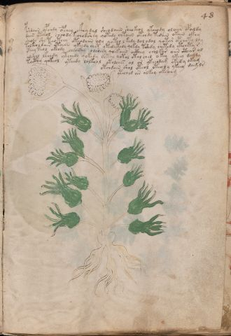

# Voynich Speculative Herbal Ferment Recipe — f48r

IMPORTANT: this is NOT a real or validated translation of the Voynich Manuscript. It is a speculative/procedural model that interprets EVA using a user-defined grammar to generate experimental recipes using safe, known edible substitutes.

This file is generated automatically from IVTFF/EVA transliteration plus a user-defined procedural grammar.



## Page / Folio
- folio: f48r
- page_number: 93
- section: herbal

## EVA Text (Transliteration)
```text
pshdaiin ypchdy opchey c@162;hy dal sheodaiin sheokeol ykeeody olaiin opaldy
daiin yteeol cheody kechodshey qotedy chtaiin otchdy tedain okain ckhy
sheody she teoteey oteodaiin ody qoteo l kedy dol odal qotar opchety ldy
tolkeol dain otaiin ykeedy chet ytedy tedy qokdy tshdy chetedy ctheety r
yteey teol okeody cheockhy olsheey qoekaiin octhey cholkar aiin cthar od
alshey lkeedy ytchedy qokedy lotal qotol otal ched o key ykeey da[l:?]dy
tocthy qokeol yteedy lolkeol otolches al ar ykeeodam okedy okam
otchdain shol oteol oteoly ykeey dam dr
yteched ar olkey okeoam
```

## Domain Context (Heuristic; Not a Translation)

This section summarizes recurring **basewords** in this IVTFF domain and shows simple substring evidence that the token markers used by the procedural grammar occur inside frequent words.

Any Italian anagram / English gloss is a best-effort lexicon match, not a decipherment.


### Associated basewords (non-generic; top by frequency in this domain)
- `daiin` (count=461) → Italian anagram `piani`; English: plans (arrangements)
- `okaiin` (count=59) → Italian anagram `coniai`; English: [n/a]
- `chaiin` (count=39) → Italian anagram `acini`; English: [n/a]
- `saiin` (count=37) → Italian anagram `asini`; English: [n/a]
- `qokaiin` (count=34) → Italian anagram `ciancio`; English: [n/a]
- `qokar` (count=29) → Italian anagram `carco`; English: [n/a]
- `odaiin` (count=27) → Italian anagram `inopia`; English: poverty
- `otchol` (count=25) → Italian anagram `colto`; English: cultivated
- `kaiin` (count=24) → Italian anagram `acini`; English: [n/a]
- `chodaiin` (count=24) → Italian anagram `apocini`; English: [n/a]
- `qotol` (count=20) → Italian anagram `colto`; English: cultivated
- `okain` (count=19) → Italian anagram `acino`; English: a berry
- `qotor` (count=18) → Italian anagram `corto`; English: short
- `ykaiin` (count=16) → Italian anagram `acini`; English: [n/a]
- `qodaiin` (count=15) → Italian anagram `apocini`; English: [n/a]

### Marker evidence (substring in frequent basewords)
- `qo`: 57 basewords; examples: `qotchy`, `qokchy`, `qokedy`, `qokaiin`, `qoky`, `qokol`
- `q`: 58 basewords; examples: `qotchy`, `qokchy`, `qokedy`, `qokaiin`, `qoky`, `qokol`
- `o`: 252 basewords; examples: `chol`, `o`, `chor`, `or`, `shol`, `ol`
- `k`: 142 basewords; examples: `okaiin`, `oky`, `chckhy`, `qokchy`, `qokedy`, `okal`
- `t`: 102 basewords; examples: `cthy`, `oty`, `qotchy`, `cthol`, `cthor`, `otaiin`
- `p`: 15 basewords; examples: `cphy`, `ypchedy`, `opchy`, `opchey`, `pchor`, `qopchy`
- `ch`: 138 basewords; examples: `chol`, `chor`, `chy`, `chey`, `chedy`, `chdy`
- `sh`: 46 basewords; examples: `shol`, `sho`, `shy`, `shor`, `shey`, `shedy`
- `f`: 1 basewords; examples: `f`
- `cth`: 17 basewords; examples: `cthy`, `cthol`, `cthor`, `cthey`, `chcthy`, `ctho`
- `ckh`: 15 basewords; examples: `chckhy`, `ckhy`, `ckhol`, `ckhey`, `checkhy`, `shckhy`
- `cph`: 2 basewords; examples: `cphy`, `cphol`
- `dy`: 78 basewords; examples: `dy`, `chedy`, `chdy`, `chody`, `qokedy`, `shedy`
- `iin`: 39 basewords; examples: `daiin`, `aiin`, `okaiin`, `chaiin`, `saiin`, `qokaiin`
- `aiin`: 32 basewords; examples: `daiin`, `aiin`, `okaiin`, `chaiin`, `saiin`, `qokaiin`

## Recipes Index (This Page)
- [f48r.1,@P0](#f48r-1-f48r-1-p0)
- [f48r.2,+P0](#f48r-2-f48r-2-p0)
- [f48r.3,+P0](#f48r-3-f48r-3-p0)
- [f48r.4,+P0](#f48r-4-f48r-4-p0)
- [f48r.5,+P0](#f48r-5-f48r-5-p0)
- [f48r.6,+P0](#f48r-6-f48r-6-p0)
- [f48r.7,+P0](#f48r-7-f48r-7-p0)
- [f48r.8,+Pr](#f48r-8-f48r-8-pr)
- [f48r.9,+Pc](#f48r-9-f48r-9-pc)

## Line Glosses (Procedural Gloss Only; Not a Translation)

<a id="f48r-1-f48r-1-p0"></a>

### f48r.1,@P0

EVA: pshdaiin ypchdy opchey c@162;hy dal sheodaiin sheokeol ykeeody olaiin opaldy

Direct Gloss (Procedural, Not a Real Translation):
- pshdaiin: add secondary herb (safe substitute) → start fermentation (yeast) → duration level 1 → state: fermentation start → long fermentation / aging phase
- ypchdy: add main plant (safe substitute) → start fermentation (yeast)
- opchey: add main plant (safe substitute) → mix / transfer → start fermentation (yeast) → duration level 1 → state: active extraction
- c: [unparsed]
- hy: [unparsed]
- dal: start fermentation (yeast) → duration level 1 → state: fermentation start
- sheodaiin: add secondary herb (safe substitute) → mix / transfer → start fermentation (yeast) → duration level 1 → state: active extraction → long fermentation / aging phase
- sheokeol: add fermentable sugars → add secondary herb (safe substitute) → mix / transfer → duration level 1 → state: active extraction
- ykeeody: add fermentable sugars → mix / transfer → start fermentation (yeast) → duration level 2 → state: active extraction
- olaiin: mix / transfer → duration level 1 → state: fermentation start → long fermentation / aging phase
- opaldy: mix / transfer → start fermentation (yeast) → duration level 1 → state: fermentation start

<a id="f48r-2-f48r-2-p0"></a>

### f48r.2,+P0

EVA: daiin yteeol cheody kechodshey qotedy chtaiin otchdy tedain okain ckhy

Direct Gloss (Procedural, Not a Real Translation):
- daiin: start fermentation (yeast) → duration level 1 → state: fermentation start → long fermentation / aging phase
- yteeol: apply heat/cooking → mix / transfer → duration level 2 → state: active extraction
- cheody: add main plant (safe substitute) → mix / transfer → start fermentation (yeast) → duration level 1 → state: active extraction
- kechodshey: add fermentable sugars → add main plant (safe substitute) → add secondary herb (safe substitute) → mix / transfer → start fermentation (yeast) → duration level 1 → state: active extraction
- qotedy: prepare liquid base → apply heat/cooking → start fermentation (yeast) → duration level 1 → state: active extraction
- chtaiin: apply heat/cooking → add main plant (safe substitute) → duration level 1 → state: fermentation start → long fermentation / aging phase
- otchdy: apply heat/cooking → add main plant (safe substitute) → mix / transfer → start fermentation (yeast)
- tedain: apply heat/cooking → start fermentation (yeast) → duration level 1 → state: active extraction
- okain: add fermentable sugars → mix / transfer → duration level 1 → state: fermentation start
- ckhy: add complex herbal compound (safe blend)

<a id="f48r-3-f48r-3-p0"></a>

### f48r.3,+P0

EVA: sheody she teoteey oteodaiin ody qoteo l kedy dol odal qotar opchety ldy

Direct Gloss (Procedural, Not a Real Translation):
- sheody: add secondary herb (safe substitute) → mix / transfer → start fermentation (yeast) → duration level 1 → state: active extraction
- she: add secondary herb (safe substitute) → duration level 1 → state: active extraction
- teoteey: apply heat/cooking → mix / transfer → duration level 1 → state: active extraction
- oteodaiin: apply heat/cooking → mix / transfer → start fermentation (yeast) → duration level 1 → state: active extraction → long fermentation / aging phase
- ody: mix / transfer → start fermentation (yeast)
- qoteo: prepare liquid base → apply heat/cooking → mix / transfer → duration level 1 → state: active extraction
- l: [unparsed]
- kedy: add fermentable sugars → start fermentation (yeast) → duration level 1 → state: active extraction
- dol: mix / transfer → start fermentation (yeast)
- odal: mix / transfer → start fermentation (yeast) → duration level 1 → state: fermentation start
- qotar: prepare liquid base → apply heat/cooking → duration level 1 → state: fermentation start
- opchety: apply heat/cooking → add main plant (safe substitute) → mix / transfer → start fermentation (yeast) → duration level 1 → state: active extraction
- ldy: start fermentation (yeast)

<a id="f48r-4-f48r-4-p0"></a>

### f48r.4,+P0

EVA: tolkeol dain otaiin ykeedy chet ytedy tedy qokdy tshdy chetedy ctheety r

Direct Gloss (Procedural, Not a Real Translation):
- tolkeol: add fermentable sugars → apply heat/cooking → mix / transfer → duration level 1 → state: active extraction
- dain: start fermentation (yeast) → duration level 1 → state: fermentation start
- otaiin: apply heat/cooking → mix / transfer → duration level 1 → state: fermentation start → long fermentation / aging phase
- ykeedy: add fermentable sugars → start fermentation (yeast) → duration level 2 → state: active extraction
- chet: apply heat/cooking → add main plant (safe substitute) → duration level 1 → state: active extraction
- ytedy: apply heat/cooking → start fermentation (yeast) → duration level 1 → state: active extraction
- tedy: apply heat/cooking → start fermentation (yeast) → duration level 1 → state: active extraction
- qokdy: prepare liquid base → add fermentable sugars → start fermentation (yeast)
- tshdy: apply heat/cooking → add secondary herb (safe substitute) → start fermentation (yeast)
- chetedy: apply heat/cooking → add main plant (safe substitute) → start fermentation (yeast) → duration level 1 → state: active extraction
- ctheety: apply heat/cooking → add complex herbal compound (safe blend) → duration level 2 → state: active extraction
- r: [unparsed]

<a id="f48r-5-f48r-5-p0"></a>

### f48r.5,+P0

EVA: yteey teol okeody cheockhy olsheey qoekaiin octhey cholkar aiin cthar od

Direct Gloss (Procedural, Not a Real Translation):
- yteey: apply heat/cooking → duration level 2 → state: active extraction
- teol: apply heat/cooking → mix / transfer → duration level 1 → state: active extraction
- okeody: add fermentable sugars → mix / transfer → start fermentation (yeast) → duration level 1 → state: active extraction
- cheockhy: add main plant (safe substitute) → mix / transfer → add complex herbal compound (safe blend) → duration level 1 → state: active extraction
- olsheey: add secondary herb (safe substitute) → mix / transfer → duration level 2 → state: active extraction
- qoekaiin: prepare liquid base → add fermentable sugars → duration level 1 → state: active extraction → long fermentation / aging phase
- octhey: mix / transfer → add complex herbal compound (safe blend) → duration level 1 → state: active extraction
- cholkar: add fermentable sugars → add main plant (safe substitute) → mix / transfer → duration level 1 → state: fermentation start
- aiin: duration level 1 → state: fermentation start → long fermentation / aging phase
- cthar: add complex herbal compound (safe blend) → duration level 1 → state: fermentation start
- od: mix / transfer → start fermentation (yeast)

<a id="f48r-6-f48r-6-p0"></a>

### f48r.6,+P0

EVA: alshey lkeedy ytchedy qokedy lotal qotol otal ched o key ykeey da[l:?]dy

Direct Gloss (Procedural, Not a Real Translation):
- alshey: add secondary herb (safe substitute) → duration level 1 → state: fermentation start
- lkeedy: add fermentable sugars → start fermentation (yeast) → duration level 2 → state: active extraction
- ytchedy: apply heat/cooking → add main plant (safe substitute) → start fermentation (yeast) → duration level 1 → state: active extraction
- qokedy: prepare liquid base → add fermentable sugars → start fermentation (yeast) → duration level 1 → state: active extraction
- lotal: apply heat/cooking → mix / transfer → duration level 1 → state: fermentation start
- qotol: prepare liquid base → apply heat/cooking → mix / transfer
- otal: apply heat/cooking → mix / transfer → duration level 1 → state: fermentation start
- ched: add main plant (safe substitute) → start fermentation (yeast) → duration level 1 → state: active extraction
- o: mix / transfer
- key: add fermentable sugars → duration level 1 → state: active extraction
- ykeey: add fermentable sugars → duration level 2 → state: active extraction
- da: start fermentation (yeast) → duration level 1 → state: fermentation start
- l: [unparsed]
- dy: start fermentation (yeast)

<a id="f48r-7-f48r-7-p0"></a>

### f48r.7,+P0

EVA: tocthy qokeol yteedy lolkeol otolches al ar ykeeodam okedy okam

Direct Gloss (Procedural, Not a Real Translation):
- tocthy: apply heat/cooking → mix / transfer → add complex herbal compound (safe blend)
- qokeol: prepare liquid base → add fermentable sugars → mix / transfer → duration level 1 → state: active extraction
- yteedy: apply heat/cooking → start fermentation (yeast) → duration level 2 → state: active extraction
- lolkeol: add fermentable sugars → mix / transfer → duration level 1 → state: active extraction
- otolches: apply heat/cooking → add main plant (safe substitute) → mix / transfer → duration level 1 → state: active extraction
- al: duration level 1 → state: fermentation start
- ar: duration level 1 → state: fermentation start
- ykeeodam: add fermentable sugars → mix / transfer → start fermentation (yeast) → duration level 2 → state: active extraction
- okedy: add fermentable sugars → mix / transfer → start fermentation (yeast) → duration level 1 → state: active extraction
- okam: add fermentable sugars → mix / transfer → duration level 1 → state: fermentation start

<a id="f48r-8-f48r-8-pr"></a>

### f48r.8,+Pr

EVA: otchdain shol oteol oteoly ykeey dam dr

Direct Gloss (Procedural, Not a Real Translation):
- otchdain: apply heat/cooking → add main plant (safe substitute) → mix / transfer → start fermentation (yeast) → duration level 1 → state: fermentation start
- shol: add secondary herb (safe substitute) → mix / transfer
- oteol: apply heat/cooking → mix / transfer → duration level 1 → state: active extraction
- oteoly: apply heat/cooking → mix / transfer → duration level 1 → state: active extraction
- ykeey: add fermentable sugars → duration level 2 → state: active extraction
- dam: start fermentation (yeast) → duration level 1 → state: fermentation start
- dr: start fermentation (yeast)

<a id="f48r-9-f48r-9-pc"></a>

### f48r.9,+Pc

EVA: yteched ar olkey okeoam

Direct Gloss (Procedural, Not a Real Translation):
- yteched: apply heat/cooking → add main plant (safe substitute) → start fermentation (yeast) → duration level 1 → state: active extraction
- ar: duration level 1 → state: fermentation start
- olkey: add fermentable sugars → mix / transfer → duration level 1 → state: active extraction
- okeoam: add fermentable sugars → mix / transfer → duration level 1 → state: active extraction
