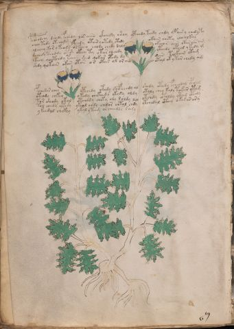

# Voynich Speculative Procedural Protocol — f48v

IMPORTANT: this is NOT a real or validated translation of the Voynich Manuscript. It is a speculative/procedural model that interprets EVA using a user-defined grammar to generate experimental recipes using safe, known edible substitutes.

This file is generated automatically from IVTFF/EVA transliteration plus a user-defined procedural grammar.



## Page / Folio
- folio: f48v
- page_number: 94
- section: herbal

## EVA Text (Transliteration)
```text
pcheodchy dshedy fchedy los aiin ykeeedy shey ypchedy teedy chdy ypair y chedyty
chey tedy otchody ykeedy otar yotedy cthdy okain chety choolkeey
alchey kor y keody olkeeey chody chedy daly okeeor aiin otar air am
dchedy tchddy otsh okeey ty otar alchdy yteedy oteed y kedy m
lkeey qocthedy taiin shed qokar otedy dy dain tolkain otam
shdy qokain okar otar or otees ol or ain otal ok y tar chedy am
pchedar chey ypchedy otedy shef eeedy al shedy otedy fcheodal cpheeg
oteody chkey okedy chckhedy ykedy oldy otoly chey kaly tokar otam
tor shody okal otchedy cheky oly loldy lol otchdy otoldy ytam otedy
tol chedy ytedy ykeol chdy chdor chtol chdy ytchedal cthey okar ar ary
ykeedal chckhy ykal y tam or cheedls [s:d]ary
```

## Domain Context (Heuristic; Not a Translation)

This section summarizes recurring **basewords** in this IVTFF domain and shows simple substring evidence that the token markers used by the procedural grammar occur inside frequent words.

Any Italian anagram / English gloss is a best-effort lexicon match, not a decipherment.


### Associated basewords (non-generic; top by frequency in this domain)
- `paiin` (count=477) → Italian anagram `piani`; English: plans (arrangements)
- `okaiin` (count=59) → Italian anagram `coniai`; English: [n/a]
- `qokep` (count=41) → Italian anagram `pecco`; English: [n/a]
- `saiin` (count=40) → Italian anagram `asini`; English: [n/a]
- `kaiin` (count=40) → Italian anagram `acini`; English: [n/a]
- `chaiin` (count=39) → Italian anagram `acini`; English: [n/a]
- `qokaiin` (count=34) → Italian anagram `ciancio`; English: [n/a]
- `qokar` (count=29) → Italian anagram `carco`; English: [n/a]
- `opaiin` (count=29) → Italian anagram `inopia`; English: poverty
- `otchol` (count=25) → Italian anagram `colto`; English: cultivated
- `chopaiin` (count=24) → Italian anagram `apocini`; English: [n/a]
- `qotol` (count=20) → Italian anagram `colto`; English: cultivated
- `okain` (count=19) → Italian anagram `acino`; English: a berry
- `qotor` (count=18) → Italian anagram `corto`; English: short
- `qopaiin` (count=15) → Italian anagram `apocini`; English: [n/a]

### Marker evidence (substring in frequent basewords)
- `qo`: 58 basewords; examples: `qotch`, `qok`, `qot`, `qokch`, `qokep`, `qokaiin`
- `q`: 59 basewords; examples: `qotch`, `qok`, `qot`, `qokch`, `qokep`, `qokaiin`
- `o`: 274 basewords; examples: `chol`, `o`, `chor`, `or`, `shol`, `ol`
- `k`: 146 basewords; examples: `ok`, `k`, `okaiin`, `kch`, `chckh`, `qok`
- `t`: 101 basewords; examples: `cth`, `ot`, `t`, `qotch`, `cthol`, `qot`
- `p`: 152 basewords; examples: `paiin`, `p`, `par`, `pain`, `pal`, `chep`
- `ch`: 145 basewords; examples: `chol`, `chor`, `ch`, `che`, `chep`, `cho`
- `sh`: 51 basewords; examples: `shol`, `sh`, `sho`, `shor`, `she`, `shep`
- `f`: 2 basewords; examples: `fchep`, `f`
- `cth`: 18 basewords; examples: `cth`, `cthol`, `cthor`, `cthe`, `chcth`, `ctho`
- `ckh`: 18 basewords; examples: `chckh`, `ckh`, `ckhe`, `ckhol`, `shckh`, `checkh`
- `cph`: 3 basewords; examples: `cph`, `cphol`, `cphe`
- `iin`: 39 basewords; examples: `paiin`, `aiin`, `okaiin`, `saiin`, `kaiin`, `chaiin`
- `aiin`: 31 basewords; examples: `paiin`, `aiin`, `okaiin`, `saiin`, `kaiin`, `chaiin`

## Recipes Index (This Page)
- [f48v.1,@P0](#f48v-1-f48v-1-p0)
- [f48v.2,+P0](#f48v-2-f48v-2-p0)
- [f48v.3,+P0](#f48v-3-f48v-3-p0)
- [f48v.4,+P0](#f48v-4-f48v-4-p0)
- [f48v.5,+P0](#f48v-5-f48v-5-p0)
- [f48v.6,+P0](#f48v-6-f48v-6-p0)
- [f48v.7,+P0](#f48v-7-f48v-7-p0)
- [f48v.8,+P0](#f48v-8-f48v-8-p0)
- [f48v.9,+P0](#f48v-9-f48v-9-p0)
- [f48v.10,+P0](#f48v-10-f48v-10-p0)
- [f48v.11,+P0](#f48v-11-f48v-11-p0)

## Line Glosses (Procedural Gloss Only; Not a Translation)

<a id="f48v-1-f48v-1-p0"></a>

### f48v.1,@P0

EVA: pcheodchy dshedy fchedy los aiin ykeeedy shey ypchedy teedy chdy ypair y chedyty

Direct Gloss (Procedural, Not a Real Translation):
- pcheodchy: tokens: p ch e o p ch → vowel_run: e (level 1; class e)
- dshedy: tokens: p sh e p → vowel_run: e (level 1; class e)
- fchedy: tokens: f ch e p → vowel_run: e (level 1; class e)
- los: tokens: l o s → connectors: l s
- aiin: tokens: aiin → vowel_run: a (level 1; class a) → suffix: aiin
- ykeeedy: tokens: k eee p → vowel_run: eee (level 3; class e)
- shey: tokens: sh e → vowel_run: e (level 1; class e)
- ypchedy: tokens: p ch e p → vowel_run: e (level 1; class e)
- teedy: tokens: t ee p → vowel_run: ee (level 2; class e)
- chdy: tokens: ch p
- ypair: tokens: p a i r → connectors: r → vowel_run: a (level 1; class a)
- y: [unparsed]
- chedyty: tokens: ch e p t → vowel_run: e (level 1; class e)

<a id="f48v-2-f48v-2-p0"></a>

### f48v.2,+P0

EVA: chey tedy otchody ykeedy otar yotedy cthdy okain chety choolkeey

Direct Gloss (Procedural, Not a Real Translation):
- chey: tokens: ch e → vowel_run: e (level 1; class e)
- tedy: tokens: t e p → vowel_run: e (level 1; class e)
- otchody: tokens: o t ch o p
- ykeedy: tokens: k ee p → vowel_run: ee (level 2; class e)
- otar: tokens: o t a r → connectors: r → vowel_run: a (level 1; class a)
- yotedy: tokens: o t e p → vowel_run: e (level 1; class e)
- cthdy: tokens: cth p
- okain: tokens: o k a i n → connectors: n → vowel_run: a (level 1; class a) (lexicon-context: `okain` → `conia`; [n/a])
- chety: tokens: ch e t → vowel_run: e (level 1; class e)
- choolkeey: tokens: ch o o l k ee → connectors: l → vowel_run: ee (level 2; class e)

<a id="f48v-3-f48v-3-p0"></a>

### f48v.3,+P0

EVA: alchey kor y keody olkeeey chody chedy daly okeeor aiin otar air am

Direct Gloss (Procedural, Not a Real Translation):
- alchey: tokens: a l ch e → connectors: l → vowel_run: a (level 1; class a)
- kor: tokens: k o r → connectors: r
- y: [unparsed]
- keody: tokens: k e o p → vowel_run: e (level 1; class e)
- olkeeey: tokens: o l k eee → connectors: l → vowel_run: eee (level 3; class e)
- chody: tokens: ch o p
- chedy: tokens: ch e p → vowel_run: e (level 1; class e)
- daly: tokens: p a l → connectors: l → vowel_run: a (level 1; class a)
- okeeor: tokens: o k ee o r → connectors: r → vowel_run: ee (level 2; class e)
- aiin: tokens: aiin → vowel_run: a (level 1; class a) → suffix: aiin
- otar: tokens: o t a r → connectors: r → vowel_run: a (level 1; class a)
- air: tokens: a i r → connectors: r → vowel_run: a (level 1; class a)
- am: tokens: a m → connectors: m → vowel_run: a (level 1; class a)

<a id="f48v-4-f48v-4-p0"></a>

### f48v.4,+P0

EVA: dchedy tchddy otsh okeey ty otar alchdy yteedy oteed y kedy m

Direct Gloss (Procedural, Not a Real Translation):
- dchedy: tokens: p ch e p → vowel_run: e (level 1; class e)
- tchddy: tokens: t ch p p
- otsh: tokens: o t sh
- okeey: tokens: o k ee → vowel_run: ee (level 2; class e)
- ty: tokens: t
- otar: tokens: o t a r → connectors: r → vowel_run: a (level 1; class a)
- alchdy: tokens: a l ch p → connectors: l → vowel_run: a (level 1; class a)
- yteedy: tokens: t ee p → vowel_run: ee (level 2; class e)
- oteed: tokens: o t ee p → vowel_run: ee (level 2; class e)
- y: [unparsed]
- kedy: tokens: k e p → vowel_run: e (level 1; class e)
- m: tokens: m → connectors: m

<a id="f48v-5-f48v-5-p0"></a>

### f48v.5,+P0

EVA: lkeey qocthedy taiin shed qokar otedy dy dain tolkain otam

Direct Gloss (Procedural, Not a Real Translation):
- lkeey: tokens: l k ee → connectors: l → vowel_run: ee (level 2; class e)
- qocthedy: tokens: qo cth e p → vowel_run: e (level 1; class e)
- taiin: tokens: t aiin → vowel_run: a (level 1; class a) → suffix: aiin
- shed: tokens: sh e p → vowel_run: e (level 1; class e)
- qokar: tokens: qo k a r → connectors: r → vowel_run: a (level 1; class a)
- otedy: tokens: o t e p → vowel_run: e (level 1; class e)
- dy: tokens: p
- dain: tokens: p a i n → connectors: n → vowel_run: a (level 1; class a)
- tolkain: tokens: t o l k a i n → connectors: l n → vowel_run: a (level 1; class a)
- otam: tokens: o t a m → connectors: m → vowel_run: a (level 1; class a)

<a id="f48v-6-f48v-6-p0"></a>

### f48v.6,+P0

EVA: shdy qokain okar otar or otees ol or ain otal ok y tar chedy am

Direct Gloss (Procedural, Not a Real Translation):
- shdy: tokens: sh p
- qokain: tokens: qo k a i n → connectors: n → vowel_run: a (level 1; class a) (lexicon-context: `okain` → `conia`; [n/a])
- okar: tokens: o k a r → connectors: r → vowel_run: a (level 1; class a)
- otar: tokens: o t a r → connectors: r → vowel_run: a (level 1; class a)
- or: tokens: o r → connectors: r
- otees: tokens: o t ee s → connectors: s → vowel_run: ee (level 2; class e)
- ol: tokens: o l → connectors: l
- or: tokens: o r → connectors: r
- ain: tokens: a i n → connectors: n → vowel_run: a (level 1; class a)
- otal: tokens: o t a l → connectors: l → vowel_run: a (level 1; class a)
- ok: tokens: o k
- y: [unparsed]
- tar: tokens: t a r → connectors: r → vowel_run: a (level 1; class a)
- chedy: tokens: ch e p → vowel_run: e (level 1; class e)
- am: tokens: a m → connectors: m → vowel_run: a (level 1; class a)

<a id="f48v-7-f48v-7-p0"></a>

### f48v.7,+P0

EVA: pchedar chey ypchedy otedy shef eeedy al shedy otedy fcheodal cpheeg

Direct Gloss (Procedural, Not a Real Translation):
- pchedar: tokens: p ch e p a r → connectors: r → vowel_run: e (level 1; class e)
- chey: tokens: ch e → vowel_run: e (level 1; class e)
- ypchedy: tokens: p ch e p → vowel_run: e (level 1; class e)
- otedy: tokens: o t e p → vowel_run: e (level 1; class e)
- shef: tokens: sh e f → vowel_run: e (level 1; class e)
- eeedy: tokens: eee p → vowel_run: eee (level 3; class e)
- al: tokens: a l → connectors: l → vowel_run: a (level 1; class a)
- shedy: tokens: sh e p → vowel_run: e (level 1; class e)
- otedy: tokens: o t e p → vowel_run: e (level 1; class e)
- fcheodal: tokens: f ch e o p a l → connectors: l → vowel_run: e (level 1; class e)
- cpheeg: tokens: cph ee g → vowel_run: ee (level 2; class e)

<a id="f48v-8-f48v-8-p0"></a>

### f48v.8,+P0

EVA: oteody chkey okedy chckhedy ykedy oldy otoly chey kaly tokar otam

Direct Gloss (Procedural, Not a Real Translation):
- oteody: tokens: o t e o p → vowel_run: e (level 1; class e)
- chkey: tokens: ch k e → vowel_run: e (level 1; class e)
- okedy: tokens: o k e p → vowel_run: e (level 1; class e)
- chckhedy: tokens: ch ckh e p → vowel_run: e (level 1; class e)
- ykedy: tokens: k e p → vowel_run: e (level 1; class e)
- oldy: tokens: o l p → connectors: l
- otoly: tokens: o t o l → connectors: l
- chey: tokens: ch e → vowel_run: e (level 1; class e)
- kaly: tokens: k a l → connectors: l → vowel_run: a (level 1; class a)
- tokar: tokens: t o k a r → connectors: r → vowel_run: a (level 1; class a)
- otam: tokens: o t a m → connectors: m → vowel_run: a (level 1; class a)

<a id="f48v-9-f48v-9-p0"></a>

### f48v.9,+P0

EVA: tor shody okal otchedy cheky oly loldy lol otchdy otoldy ytam otedy

Direct Gloss (Procedural, Not a Real Translation):
- tor: tokens: t o r → connectors: r
- shody: tokens: sh o p
- okal: tokens: o k a l → connectors: l → vowel_run: a (level 1; class a)
- otchedy: tokens: o t ch e p → vowel_run: e (level 1; class e)
- cheky: tokens: ch e k → vowel_run: e (level 1; class e)
- oly: tokens: o l → connectors: l
- loldy: tokens: l o l p → connectors: l l
- lol: tokens: l o l → connectors: l l
- otchdy: tokens: o t ch p
- otoldy: tokens: o t o l p → connectors: l
- ytam: tokens: t a m → connectors: m → vowel_run: a (level 1; class a)
- otedy: tokens: o t e p → vowel_run: e (level 1; class e)

<a id="f48v-10-f48v-10-p0"></a>

### f48v.10,+P0

EVA: tol chedy ytedy ykeol chdy chdor chtol chdy ytchedal cthey okar ar ary

Direct Gloss (Procedural, Not a Real Translation):
- tol: tokens: t o l → connectors: l
- chedy: tokens: ch e p → vowel_run: e (level 1; class e)
- ytedy: tokens: t e p → vowel_run: e (level 1; class e)
- ykeol: tokens: k e o l → connectors: l → vowel_run: e (level 1; class e)
- chdy: tokens: ch p
- chdor: tokens: ch p o r → connectors: r
- chtol: tokens: ch t o l → connectors: l
- chdy: tokens: ch p
- ytchedal: tokens: t ch e p a l → connectors: l → vowel_run: e (level 1; class e)
- cthey: tokens: cth e → vowel_run: e (level 1; class e)
- okar: tokens: o k a r → connectors: r → vowel_run: a (level 1; class a)
- ar: tokens: a r → connectors: r → vowel_run: a (level 1; class a)
- ary: tokens: a r → connectors: r → vowel_run: a (level 1; class a)

<a id="f48v-11-f48v-11-p0"></a>

### f48v.11,+P0

EVA: ykeedal chckhy ykal y tam or cheedls [s:d]ary

Direct Gloss (Procedural, Not a Real Translation):
- ykeedal: tokens: k ee p a l → connectors: l → vowel_run: ee (level 2; class e)
- chckhy: tokens: ch ckh
- ykal: tokens: k a l → connectors: l → vowel_run: a (level 1; class a)
- y: [unparsed]
- tam: tokens: t a m → connectors: m → vowel_run: a (level 1; class a)
- or: tokens: o r → connectors: r
- cheedls: tokens: ch ee p l s → connectors: l s → vowel_run: ee (level 2; class e)
- s: tokens: s → connectors: s
- d: tokens: p
- ary: tokens: a r → connectors: r → vowel_run: a (level 1; class a)
