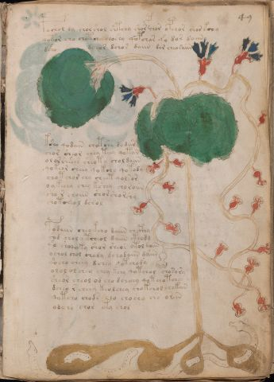

# Voynich Speculative Procedural Protocol — f49r

IMPORTANT: this is NOT a real or validated translation of the Voynich Manuscript. It is a speculative/procedural model that interprets EVA using a user-defined grammar to generate experimental recipes using safe, known edible substitutes.

This file is generated automatically from IVTFF/EVA transliteration plus a user-defined procedural grammar.



## Page / Folio
- folio: f49r
- page_number: 95
- section: herbal

## EVA Text (Transliteration)
```text
pychol dy [sh:ch]or shol shtchy shorpchor opchor shor kchy
qotor sho chotchy choshy qopchar q'o dor daiin
dsho dchor dchor daiin dor cheoraiin
ksh[o:a] qodain chotshy dodar
chor sheor chey teey qotan
ol or she'ees sheoty choldaiin
qokeor cheey qokchy qotody
chot chor chy cheet qolsor
oykeeey chey kshey choroiin
sho r choiin shor shor shy
chotcheol dchol
podaiin cheo kcho daiin chcthy
c'od chol y tcheol daiin cthodd
q'o shoqoky shor sheor otol daiin
ochol chol chody dchodaiin da'iin
q'ocho cheey dchey qotchody
olol ol chey chey kchy qotchol chosory
sheor cheol od cho dcheeey qot chotchy
dcheo r cheey keolchey chokchol chokan
qotcho chods cho cho[ch:sh]y chs oriin
odch[o:y] chor ety shol
```

## Domain Context (Heuristic; Not a Translation)

This section summarizes recurring **basewords** in this IVTFF domain and shows simple substring evidence that the token markers used by the procedural grammar occur inside frequent words.

Any Italian anagram / English gloss is a best-effort lexicon match, not a decipherment.


### Associated basewords (non-generic; top by frequency in this domain)
- `daiin` (count=461) → Italian anagram `piani`; English: plans (arrangements)
- `okaiin` (count=59) → Italian anagram `coniai`; English: [n/a]
- `chaiin` (count=39) → Italian anagram `acini`; English: [n/a]
- `saiin` (count=37) → Italian anagram `asini`; English: [n/a]
- `qokaiin` (count=34) → Italian anagram `ciancio`; English: [n/a]
- `qokar` (count=29) → Italian anagram `carco`; English: [n/a]
- `odaiin` (count=27) → Italian anagram `inopia`; English: poverty
- `otchol` (count=25) → Italian anagram `colto`; English: cultivated
- `kaiin` (count=24) → Italian anagram `acini`; English: [n/a]
- `chodaiin` (count=24) → Italian anagram `apocini`; English: [n/a]
- `qotol` (count=20) → Italian anagram `colto`; English: cultivated
- `okain` (count=19) → Italian anagram `acino`; English: a berry
- `qotor` (count=18) → Italian anagram `corto`; English: short
- `ykaiin` (count=16) → Italian anagram `acini`; English: [n/a]
- `qodaiin` (count=15) → Italian anagram `apocini`; English: [n/a]

### Marker evidence (substring in frequent basewords)
- `qo`: 57 basewords; examples: `qotchy`, `qokchy`, `qokedy`, `qokaiin`, `qoky`, `qokol`
- `q`: 58 basewords; examples: `qotchy`, `qokchy`, `qokedy`, `qokaiin`, `qoky`, `qokol`
- `o`: 252 basewords; examples: `chol`, `o`, `chor`, `or`, `shol`, `ol`
- `k`: 142 basewords; examples: `okaiin`, `oky`, `chckhy`, `qokchy`, `qokedy`, `okal`
- `t`: 102 basewords; examples: `cthy`, `oty`, `qotchy`, `cthol`, `cthor`, `otaiin`
- `p`: 15 basewords; examples: `cphy`, `ypchedy`, `opchy`, `opchey`, `pchor`, `qopchy`
- `ch`: 138 basewords; examples: `chol`, `chor`, `chy`, `chey`, `chedy`, `chdy`
- `sh`: 46 basewords; examples: `shol`, `sho`, `shy`, `shor`, `shey`, `shedy`
- `f`: 1 basewords; examples: `f`
- `cth`: 17 basewords; examples: `cthy`, `cthol`, `cthor`, `cthey`, `chcthy`, `ctho`
- `ckh`: 15 basewords; examples: `chckhy`, `ckhy`, `ckhol`, `ckhey`, `checkhy`, `shckhy`
- `cph`: 2 basewords; examples: `cphy`, `cphol`
- `dy`: 78 basewords; examples: `dy`, `chedy`, `chdy`, `chody`, `qokedy`, `shedy`
- `iin`: 39 basewords; examples: `daiin`, `aiin`, `okaiin`, `chaiin`, `saiin`, `qokaiin`
- `aiin`: 32 basewords; examples: `daiin`, `aiin`, `okaiin`, `chaiin`, `saiin`, `qokaiin`

## Recipes Index (This Page)
- [f49r.1,@P0](#f49r-1-f49r-1-p0)
- [f49r.2,+P0](#f49r-2-f49r-2-p0)
- [f49r.3,+P0](#f49r-3-f49r-3-p0)
- [f49r.4,+P0](#f49r-4-f49r-4-p0)
- [f49r.5,+P0](#f49r-5-f49r-5-p0)
- [f49r.6,+P0](#f49r-6-f49r-6-p0)
- [f49r.7,+P0](#f49r-7-f49r-7-p0)
- [f49r.8,+P0](#f49r-8-f49r-8-p0)
- [f49r.9,+P0](#f49r-9-f49r-9-p0)
- [f49r.10,+P0](#f49r-10-f49r-10-p0)
- [f49r.11,+P0](#f49r-11-f49r-11-p0)
- [f49r.12,+P0](#f49r-12-f49r-12-p0)
- [f49r.13,+P0](#f49r-13-f49r-13-p0)
- [f49r.14,+P0](#f49r-14-f49r-14-p0)
- [f49r.15,+P0](#f49r-15-f49r-15-p0)
- [f49r.16,+P0](#f49r-16-f49r-16-p0)
- [f49r.17,+P0](#f49r-17-f49r-17-p0)
- [f49r.18,+P0](#f49r-18-f49r-18-p0)
- [f49r.19,+P0](#f49r-19-f49r-19-p0)
- [f49r.20,+P0](#f49r-20-f49r-20-p0)
- [f49r.21,+P0](#f49r-21-f49r-21-p0)

## Line Glosses (Procedural Gloss Only; Not a Translation)

<a id="f49r-1-f49r-1-p0"></a>

### f49r.1,@P0

EVA: pychol dy [sh:ch]or shol shtchy shorpchor opchor shor kchy

Direct Gloss (Procedural, Not a Real Translation):
- pychol: tokens: p ch o l → connectors: l
- dy: tokens: p
- sh: tokens: sh
- ch: tokens: ch
- or: tokens: o r → connectors: r
- shol: tokens: sh o l → connectors: l
- shtchy: tokens: sh t ch
- shorpchor: tokens: sh o r p ch o r → connectors: r r
- opchor: tokens: o p ch o r → connectors: r
- shor: tokens: sh o r → connectors: r
- kchy: tokens: k ch

<a id="f49r-2-f49r-2-p0"></a>

### f49r.2,+P0

EVA: qotor sho chotchy choshy qopchar q'o dor daiin

Direct Gloss (Procedural, Not a Real Translation):
- qotor: tokens: qo t o r → connectors: r
- sho: tokens: sh o
- chotchy: tokens: ch o t ch
- choshy: tokens: ch o sh
- qopchar: tokens: qo p ch a r → connectors: r → vowel_run: a (level 1; class a)
- q: tokens: q
- o: tokens: o
- dor: tokens: p o r → connectors: r
- daiin: tokens: p aiin → vowel_run: a (level 1; class a) → suffix: aiin

<a id="f49r-3-f49r-3-p0"></a>

### f49r.3,+P0

EVA: dsho dchor dchor daiin dor cheoraiin

Direct Gloss (Procedural, Not a Real Translation):
- dsho: tokens: p sh o
- dchor: tokens: p ch o r → connectors: r
- dchor: tokens: p ch o r → connectors: r
- daiin: tokens: p aiin → vowel_run: a (level 1; class a) → suffix: aiin
- dor: tokens: p o r → connectors: r
- cheoraiin: tokens: ch e o r aiin → connectors: r → vowel_run: e (level 1; class e) → suffix: aiin

<a id="f49r-4-f49r-4-p0"></a>

### f49r.4,+P0

EVA: ksh[o:a] qodain chotshy dodar

Direct Gloss (Procedural, Not a Real Translation):
- ksh: tokens: k sh
- o: tokens: o
- a: tokens: a → vowel_run: a (level 1; class a)
- qodain: tokens: qo p a i n → connectors: n → vowel_run: a (level 1; class a)
- chotshy: tokens: ch o t sh
- dodar: tokens: p o p a r → connectors: r → vowel_run: a (level 1; class a)

<a id="f49r-5-f49r-5-p0"></a>

### f49r.5,+P0

EVA: chor sheor chey teey qotan

Direct Gloss (Procedural, Not a Real Translation):
- chor: tokens: ch o r → connectors: r
- sheor: tokens: sh e o r → connectors: r → vowel_run: e (level 1; class e)
- chey: tokens: ch e → vowel_run: e (level 1; class e)
- teey: tokens: t ee → vowel_run: ee (level 2; class e)
- qotan: tokens: qo t a n → connectors: n → vowel_run: a (level 1; class a)

<a id="f49r-6-f49r-6-p0"></a>

### f49r.6,+P0

EVA: ol or she'ees sheoty choldaiin

Direct Gloss (Procedural, Not a Real Translation):
- ol: tokens: o l → connectors: l
- or: tokens: o r → connectors: r
- she: tokens: sh e → vowel_run: e (level 1; class e)
- ees: tokens: ee s → connectors: s → vowel_run: ee (level 2; class e)
- sheoty: tokens: sh e o t → vowel_run: e (level 1; class e)
- choldaiin: tokens: ch o l p aiin → connectors: l → vowel_run: a (level 1; class a) → suffix: aiin

<a id="f49r-7-f49r-7-p0"></a>

### f49r.7,+P0

EVA: qokeor cheey qokchy qotody

Direct Gloss (Procedural, Not a Real Translation):
- qokeor: tokens: qo k e o r → connectors: r → vowel_run: e (level 1; class e)
- cheey: tokens: ch ee → vowel_run: ee (level 2; class e)
- qokchy: tokens: qo k ch
- qotody: tokens: qo t o p

<a id="f49r-8-f49r-8-p0"></a>

### f49r.8,+P0

EVA: chot chor chy cheet qolsor

Direct Gloss (Procedural, Not a Real Translation):
- chot: tokens: ch o t
- chor: tokens: ch o r → connectors: r
- chy: tokens: ch
- cheet: tokens: ch ee t → vowel_run: ee (level 2; class e)
- qolsor: tokens: qo l s o r → connectors: l s r

<a id="f49r-9-f49r-9-p0"></a>

### f49r.9,+P0

EVA: oykeeey chey kshey choroiin

Direct Gloss (Procedural, Not a Real Translation):
- oykeeey: tokens: o k eee → vowel_run: eee (level 3; class e)
- chey: tokens: ch e → vowel_run: e (level 1; class e)
- kshey: tokens: k sh e → vowel_run: e (level 1; class e)
- choroiin: tokens: ch o r o iin → connectors: r → vowel_run: ii (level 2; class i) → suffix: iin

<a id="f49r-10-f49r-10-p0"></a>

### f49r.10,+P0

EVA: sho r choiin shor shor shy

Direct Gloss (Procedural, Not a Real Translation):
- sho: tokens: sh o
- r: tokens: r → connectors: r
- choiin: tokens: ch o iin → vowel_run: ii (level 2; class i) → suffix: iin
- shor: tokens: sh o r → connectors: r
- shor: tokens: sh o r → connectors: r
- shy: tokens: sh

<a id="f49r-11-f49r-11-p0"></a>

### f49r.11,+P0

EVA: chotcheol dchol

Direct Gloss (Procedural, Not a Real Translation):
- chotcheol: tokens: ch o t ch e o l → connectors: l → vowel_run: e (level 1; class e)
- dchol: tokens: p ch o l → connectors: l

<a id="f49r-12-f49r-12-p0"></a>

### f49r.12,+P0

EVA: podaiin cheo kcho daiin chcthy

Direct Gloss (Procedural, Not a Real Translation):
- podaiin: tokens: p o p aiin → vowel_run: a (level 1; class a) → suffix: aiin
- cheo: tokens: ch e o → vowel_run: e (level 1; class e)
- kcho: tokens: k ch o
- daiin: tokens: p aiin → vowel_run: a (level 1; class a) → suffix: aiin
- chcthy: tokens: ch cth

<a id="f49r-13-f49r-13-p0"></a>

### f49r.13,+P0

EVA: c'od chol y tcheol daiin cthodd

Direct Gloss (Procedural, Not a Real Translation):
- c: tokens: c
- od: tokens: o p
- chol: tokens: ch o l → connectors: l
- y: [unparsed]
- tcheol: tokens: t ch e o l → connectors: l → vowel_run: e (level 1; class e)
- daiin: tokens: p aiin → vowel_run: a (level 1; class a) → suffix: aiin
- cthodd: tokens: cth o p p

<a id="f49r-14-f49r-14-p0"></a>

### f49r.14,+P0

EVA: q'o shoqoky shor sheor otol daiin

Direct Gloss (Procedural, Not a Real Translation):
- q: tokens: q
- o: tokens: o
- shoqoky: tokens: sh o qo k
- shor: tokens: sh o r → connectors: r
- sheor: tokens: sh e o r → connectors: r → vowel_run: e (level 1; class e)
- otol: tokens: o t o l → connectors: l
- daiin: tokens: p aiin → vowel_run: a (level 1; class a) → suffix: aiin

<a id="f49r-15-f49r-15-p0"></a>

### f49r.15,+P0

EVA: ochol chol chody dchodaiin da'iin

Direct Gloss (Procedural, Not a Real Translation):
- ochol: tokens: o ch o l → connectors: l
- chol: tokens: ch o l → connectors: l
- chody: tokens: ch o p
- dchodaiin: tokens: p ch o p aiin → vowel_run: a (level 1; class a) → suffix: aiin
- da: tokens: p a → vowel_run: a (level 1; class a)
- iin: tokens: iin → vowel_run: ii (level 2; class i) → suffix: iin

<a id="f49r-16-f49r-16-p0"></a>

### f49r.16,+P0

EVA: q'ocho cheey dchey qotchody

Direct Gloss (Procedural, Not a Real Translation):
- q: tokens: q
- ocho: tokens: o ch o
- cheey: tokens: ch ee → vowel_run: ee (level 2; class e)
- dchey: tokens: p ch e → vowel_run: e (level 1; class e)
- qotchody: tokens: qo t ch o p

<a id="f49r-17-f49r-17-p0"></a>

### f49r.17,+P0

EVA: olol ol chey chey kchy qotchol chosory

Direct Gloss (Procedural, Not a Real Translation):
- olol: tokens: o l o l → connectors: l l
- ol: tokens: o l → connectors: l
- chey: tokens: ch e → vowel_run: e (level 1; class e)
- chey: tokens: ch e → vowel_run: e (level 1; class e)
- kchy: tokens: k ch
- qotchol: tokens: qo t ch o l → connectors: l
- chosory: tokens: ch o s o r → connectors: s r

<a id="f49r-18-f49r-18-p0"></a>

### f49r.18,+P0

EVA: sheor cheol od cho dcheeey qot chotchy

Direct Gloss (Procedural, Not a Real Translation):
- sheor: tokens: sh e o r → connectors: r → vowel_run: e (level 1; class e)
- cheol: tokens: ch e o l → connectors: l → vowel_run: e (level 1; class e)
- od: tokens: o p
- cho: tokens: ch o
- dcheeey: tokens: p ch eee → vowel_run: eee (level 3; class e)
- qot: tokens: qo t
- chotchy: tokens: ch o t ch

<a id="f49r-19-f49r-19-p0"></a>

### f49r.19,+P0

EVA: dcheo r cheey keolchey chokchol chokan

Direct Gloss (Procedural, Not a Real Translation):
- dcheo: tokens: p ch e o → vowel_run: e (level 1; class e)
- r: tokens: r → connectors: r
- cheey: tokens: ch ee → vowel_run: ee (level 2; class e)
- keolchey: tokens: k e o l ch e → connectors: l → vowel_run: e (level 1; class e)
- chokchol: tokens: ch o k ch o l → connectors: l
- chokan: tokens: ch o k a n → connectors: n → vowel_run: a (level 1; class a)

<a id="f49r-20-f49r-20-p0"></a>

### f49r.20,+P0

EVA: qotcho chods cho cho[ch:sh]y chs oriin

Direct Gloss (Procedural, Not a Real Translation):
- qotcho: tokens: qo t ch o
- chods: tokens: ch o p s → connectors: s
- cho: tokens: ch o
- cho: tokens: ch o
- ch: tokens: ch
- sh: tokens: sh
- y: [unparsed]
- chs: tokens: ch s → connectors: s
- oriin: tokens: o r iin → connectors: r → vowel_run: ii (level 2; class i) → suffix: iin

<a id="f49r-21-f49r-21-p0"></a>

### f49r.21,+P0

EVA: odch[o:y] chor ety shol

Direct Gloss (Procedural, Not a Real Translation):
- odch: tokens: o p ch
- o: tokens: o
- y: [unparsed]
- chor: tokens: ch o r → connectors: r
- ety: tokens: e t → vowel_run: e (level 1; class e)
- shol: tokens: sh o l → connectors: l
