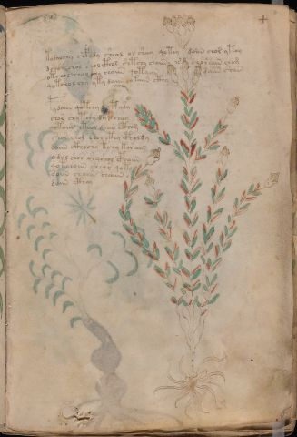

# Voynich Speculative Herbal Ferment Recipe — f4r

IMPORTANT: this is NOT a real or validated translation of the Voynich Manuscript. It is a speculative/procedural model that interprets EVA using a user-defined grammar to generate experimental recipes using safe, known edible substitutes.

This file is generated automatically from IVTFF/EVA transliteration plus a user-defined procedural grammar.



## Page / Folio
- currier: A
- folio: f4r
- page_number: 7
- section: herbal

## EVA Text (Transliteration)
```text
kodalchy chpady sheol ol sheey qotey doiin chor ytoy
dchor shol shol cthol shtchy chaiin @163;s choraiin chom
otchol chol chy chaiin qotaiin daiin shain
qotchol chy yty daiin okaiin cthy
pydaiin qotchy dy tydy
chor shytchy dytcheey
qotaiin cthol daiin cthom
shor shol shol cthy cpholdy
daiin ckhochy tchy kor aiin
odal shor shyshol cphaiin
qotchoiin she[o:a]r qoty
soiin chaiin chaiin
daiin cthey
```

## Domain Context (Heuristic; Not a Translation)

This section summarizes recurring **basewords** in this IVTFF domain and shows simple substring evidence that the token markers used by the procedural grammar occur inside frequent words.

Any Italian anagram / English gloss is a best-effort lexicon match, not a decipherment.


### Associated basewords (non-generic; top by frequency in this domain)
- `daiin` (count=461) → Italian anagram `piani`; English: plans (arrangements)
- `okaiin` (count=59) → Italian anagram `coniai`; English: [n/a]
- `chaiin` (count=39) → Italian anagram `acini`; English: [n/a]
- `saiin` (count=37) → Italian anagram `asini`; English: [n/a]
- `qokaiin` (count=34) → Italian anagram `ciancio`; English: [n/a]
- `qokar` (count=29) → Italian anagram `carco`; English: [n/a]
- `odaiin` (count=27) → Italian anagram `inopia`; English: poverty
- `otchol` (count=25) → Italian anagram `colto`; English: cultivated
- `kaiin` (count=24) → Italian anagram `acini`; English: [n/a]
- `chodaiin` (count=24) → Italian anagram `apocini`; English: [n/a]
- `qotol` (count=20) → Italian anagram `colto`; English: cultivated
- `okain` (count=19) → Italian anagram `acino`; English: a berry
- `qotor` (count=18) → Italian anagram `corto`; English: short
- `ykaiin` (count=16) → Italian anagram `acini`; English: [n/a]
- `qodaiin` (count=15) → Italian anagram `apocini`; English: [n/a]

### Marker evidence (substring in frequent basewords)
- `qo`: 57 basewords; examples: `qotchy`, `qokchy`, `qokedy`, `qokaiin`, `qoky`, `qokol`
- `q`: 58 basewords; examples: `qotchy`, `qokchy`, `qokedy`, `qokaiin`, `qoky`, `qokol`
- `o`: 252 basewords; examples: `chol`, `o`, `chor`, `or`, `shol`, `ol`
- `k`: 142 basewords; examples: `okaiin`, `oky`, `chckhy`, `qokchy`, `qokedy`, `okal`
- `t`: 102 basewords; examples: `cthy`, `oty`, `qotchy`, `cthol`, `cthor`, `otaiin`
- `p`: 15 basewords; examples: `cphy`, `ypchedy`, `opchy`, `opchey`, `pchor`, `qopchy`
- `ch`: 138 basewords; examples: `chol`, `chor`, `chy`, `chey`, `chedy`, `chdy`
- `sh`: 46 basewords; examples: `shol`, `sho`, `shy`, `shor`, `shey`, `shedy`
- `f`: 1 basewords; examples: `f`
- `cth`: 17 basewords; examples: `cthy`, `cthol`, `cthor`, `cthey`, `chcthy`, `ctho`
- `ckh`: 15 basewords; examples: `chckhy`, `ckhy`, `ckhol`, `ckhey`, `checkhy`, `shckhy`
- `cph`: 2 basewords; examples: `cphy`, `cphol`
- `dy`: 78 basewords; examples: `dy`, `chedy`, `chdy`, `chody`, `qokedy`, `shedy`
- `iin`: 39 basewords; examples: `daiin`, `aiin`, `okaiin`, `chaiin`, `saiin`, `qokaiin`
- `aiin`: 32 basewords; examples: `daiin`, `aiin`, `okaiin`, `chaiin`, `saiin`, `qokaiin`

## Recipes Index (This Page)
- [f4r.1,@P0](#f4r-1-f4r-1-p0)
- [f4r.2,+P0](#f4r-2-f4r-2-p0)
- [f4r.3,+P0](#f4r-3-f4r-3-p0)
- [f4r.4,+P0](#f4r-4-f4r-4-p0)
- [f4r.5,+P0](#f4r-5-f4r-5-p0)
- [f4r.6,+P0](#f4r-6-f4r-6-p0)
- [f4r.7,+P0](#f4r-7-f4r-7-p0)
- [f4r.8,+P0](#f4r-8-f4r-8-p0)
- [f4r.9,+P0](#f4r-9-f4r-9-p0)
- [f4r.10,+P0](#f4r-10-f4r-10-p0)
- [f4r.11,+P0](#f4r-11-f4r-11-p0)
- [f4r.12,+P0](#f4r-12-f4r-12-p0)
- [f4r.13,+P0](#f4r-13-f4r-13-p0)

## Line Glosses (Procedural Gloss Only; Not a Translation)

<a id="f4r-1-f4r-1-p0"></a>

### f4r.1,@P0

EVA: kodalchy chpady sheol ol sheey qotey doiin chor ytoy

Direct Gloss (Procedural, Not a Real Translation):
- kodalchy: add fermentable sugars → add main plant (safe substitute) → mix / transfer → start fermentation (yeast) → duration level 1 → state: fermentation start
- chpady: add main plant (safe substitute) → start fermentation (yeast) → duration level 1 → state: fermentation start
- sheol: add secondary herb (safe substitute) → mix / transfer → duration level 1 → state: active extraction
- ol: mix / transfer
- sheey: add secondary herb (safe substitute) → duration level 2 → state: active extraction
- qotey: prepare liquid base → apply heat/cooking → duration level 1 → state: active extraction
- doiin: mix / transfer → start fermentation (yeast) → duration level 2 → state: cooling/rest → medium fermentation phase
- chor: add main plant (safe substitute) → mix / transfer
- ytoy: apply heat/cooking → mix / transfer

<a id="f4r-2-f4r-2-p0"></a>

### f4r.2,+P0

EVA: dchor shol shol cthol shtchy chaiin @163;s choraiin chom

Direct Gloss (Procedural, Not a Real Translation):
- dchor: add main plant (safe substitute) → mix / transfer → start fermentation (yeast)
- shol: add secondary herb (safe substitute) → mix / transfer
- shol: add secondary herb (safe substitute) → mix / transfer
- cthol: mix / transfer → add complex herbal compound (safe blend)
- shtchy: apply heat/cooking → add main plant (safe substitute) → add secondary herb (safe substitute)
- chaiin: add main plant (safe substitute) → duration level 1 → state: fermentation start → long fermentation / aging phase
- s: [unparsed]
- choraiin: add main plant (safe substitute) → mix / transfer → duration level 1 → state: fermentation start → long fermentation / aging phase
- chom: add main plant (safe substitute) → mix / transfer

<a id="f4r-3-f4r-3-p0"></a>

### f4r.3,+P0

EVA: otchol chol chy chaiin qotaiin daiin shain

Direct Gloss (Procedural, Not a Real Translation):
- otchol: apply heat/cooking → add main plant (safe substitute) → mix / transfer
- chol: add main plant (safe substitute) → mix / transfer
- chy: add main plant (safe substitute)
- chaiin: add main plant (safe substitute) → duration level 1 → state: fermentation start → long fermentation / aging phase
- qotaiin: prepare liquid base → apply heat/cooking → duration level 1 → state: fermentation start → long fermentation / aging phase
- daiin: start fermentation (yeast) → duration level 1 → state: fermentation start → long fermentation / aging phase
- shain: add secondary herb (safe substitute) → duration level 1 → state: fermentation start

<a id="f4r-4-f4r-4-p0"></a>

### f4r.4,+P0

EVA: qotchol chy yty daiin okaiin cthy

Direct Gloss (Procedural, Not a Real Translation):
- qotchol: prepare liquid base → apply heat/cooking → add main plant (safe substitute) → mix / transfer
- chy: add main plant (safe substitute)
- yty: apply heat/cooking
- daiin: start fermentation (yeast) → duration level 1 → state: fermentation start → long fermentation / aging phase
- okaiin: add fermentable sugars → mix / transfer → duration level 1 → state: fermentation start → long fermentation / aging phase
- cthy: add complex herbal compound (safe blend)

<a id="f4r-5-f4r-5-p0"></a>

### f4r.5,+P0

EVA: pydaiin qotchy dy tydy

Direct Gloss (Procedural, Not a Real Translation):
- pydaiin: start fermentation (yeast) → duration level 1 → state: fermentation start → long fermentation / aging phase
- qotchy: prepare liquid base → apply heat/cooking → add main plant (safe substitute)
- dy: start fermentation (yeast)
- tydy: apply heat/cooking → start fermentation (yeast)

<a id="f4r-6-f4r-6-p0"></a>

### f4r.6,+P0

EVA: chor shytchy dytcheey

Direct Gloss (Procedural, Not a Real Translation):
- chor: add main plant (safe substitute) → mix / transfer
- shytchy: apply heat/cooking → add main plant (safe substitute) → add secondary herb (safe substitute)
- dytcheey: apply heat/cooking → add main plant (safe substitute) → start fermentation (yeast) → duration level 2 → state: active extraction

<a id="f4r-7-f4r-7-p0"></a>

### f4r.7,+P0

EVA: qotaiin cthol daiin cthom

Direct Gloss (Procedural, Not a Real Translation):
- qotaiin: prepare liquid base → apply heat/cooking → duration level 1 → state: fermentation start → long fermentation / aging phase
- cthol: mix / transfer → add complex herbal compound (safe blend)
- daiin: start fermentation (yeast) → duration level 1 → state: fermentation start → long fermentation / aging phase
- cthom: mix / transfer → add complex herbal compound (safe blend)

<a id="f4r-8-f4r-8-p0"></a>

### f4r.8,+P0

EVA: shor shol shol cthy cpholdy

Direct Gloss (Procedural, Not a Real Translation):
- shor: add secondary herb (safe substitute) → mix / transfer
- shol: add secondary herb (safe substitute) → mix / transfer
- shol: add secondary herb (safe substitute) → mix / transfer
- cthy: add complex herbal compound (safe blend)
- cpholdy: mix / transfer → start fermentation (yeast) → add complex herbal compound (safe blend)

<a id="f4r-9-f4r-9-p0"></a>

### f4r.9,+P0

EVA: daiin ckhochy tchy kor aiin

Direct Gloss (Procedural, Not a Real Translation):
- daiin: start fermentation (yeast) → duration level 1 → state: fermentation start → long fermentation / aging phase
- ckhochy: add main plant (safe substitute) → mix / transfer → add complex herbal compound (safe blend)
- tchy: apply heat/cooking → add main plant (safe substitute)
- kor: add fermentable sugars → mix / transfer
- aiin: duration level 1 → state: fermentation start → long fermentation / aging phase

<a id="f4r-10-f4r-10-p0"></a>

### f4r.10,+P0

EVA: odal shor shyshol cphaiin

Direct Gloss (Procedural, Not a Real Translation):
- odal: mix / transfer → start fermentation (yeast) → duration level 1 → state: fermentation start
- shor: add secondary herb (safe substitute) → mix / transfer
- shyshol: add secondary herb (safe substitute) → mix / transfer
- cphaiin: add complex herbal compound (safe blend) → duration level 1 → state: fermentation start → long fermentation / aging phase

<a id="f4r-11-f4r-11-p0"></a>

### f4r.11,+P0

EVA: qotchoiin she[o:a]r qoty

Direct Gloss (Procedural, Not a Real Translation):
- qotchoiin: prepare liquid base → apply heat/cooking → add main plant (safe substitute) → mix / transfer → duration level 2 → state: cooling/rest → medium fermentation phase
- she: add secondary herb (safe substitute) → duration level 1 → state: active extraction
- o: mix / transfer
- a: duration level 1 → state: fermentation start
- r: [unparsed]
- qoty: prepare liquid base → apply heat/cooking

<a id="f4r-12-f4r-12-p0"></a>

### f4r.12,+P0

EVA: soiin chaiin chaiin

Direct Gloss (Procedural, Not a Real Translation):
- soiin: mix / transfer → duration level 2 → state: cooling/rest → medium fermentation phase
- chaiin: add main plant (safe substitute) → duration level 1 → state: fermentation start → long fermentation / aging phase
- chaiin: add main plant (safe substitute) → duration level 1 → state: fermentation start → long fermentation / aging phase

<a id="f4r-13-f4r-13-p0"></a>

### f4r.13,+P0

EVA: daiin cthey

Direct Gloss (Procedural, Not a Real Translation):
- daiin: start fermentation (yeast) → duration level 1 → state: fermentation start → long fermentation / aging phase
- cthey: add complex herbal compound (safe blend) → duration level 1 → state: active extraction
