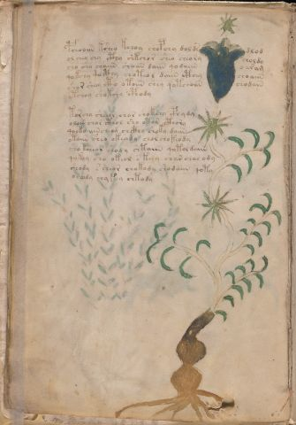

# Voynich Speculative Procedural Protocol — f4v

IMPORTANT: this is NOT a real or validated translation of the Voynich Manuscript. It is a speculative/procedural model that interprets EVA using a user-defined grammar to generate experimental recipes using safe, known edible substitutes.

This file is generated automatically from IVTFF/EVA transliteration plus a user-defined procedural grammar.



## Page / Folio
- currier: A
- folio: f4v
- page_number: 8
- section: herbal

## EVA Text (Transliteration)
```text
pchooiin ksheo kchoy chopchy dolds dlod
ol chey chy cthy shkchor sheo cheory choldy
sho sho chaiin shaiin daiin qodaiin o aram
qok[sh:ch]y qocthy choteol daiin cthey choaiin
shor sheey cto otoiin shey qotchoiin chodain
ytchoy shokchy cphody
torchy sheeor chor chokch[y:e] cphydy
oleeeb chor cthol sho otor cthory
qooko iiin cheog chcthy shoky daiin
otaiin sheo okeody chol chokeody
sho kcheor shody shtaiin qotol daiin
qokey sho okeol s keey shar char ody
shody s cheor chokody shodaiin qoty
ochody chy key chtody
```

## Domain Context (Heuristic; Not a Translation)

This section summarizes recurring **basewords** in this IVTFF domain and shows simple substring evidence that the token markers used by the procedural grammar occur inside frequent words.

Any Italian anagram / English gloss is a best-effort lexicon match, not a decipherment.


### Associated basewords (non-generic; top by frequency in this domain)
- `daiin` (count=461) → Italian anagram `piani`; English: plans (arrangements)
- `okaiin` (count=59) → Italian anagram `coniai`; English: [n/a]
- `chaiin` (count=39) → Italian anagram `acini`; English: [n/a]
- `saiin` (count=37) → Italian anagram `asini`; English: [n/a]
- `qokaiin` (count=34) → Italian anagram `ciancio`; English: [n/a]
- `qokar` (count=29) → Italian anagram `carco`; English: [n/a]
- `odaiin` (count=27) → Italian anagram `inopia`; English: poverty
- `otchol` (count=25) → Italian anagram `colto`; English: cultivated
- `kaiin` (count=24) → Italian anagram `acini`; English: [n/a]
- `chodaiin` (count=24) → Italian anagram `apocini`; English: [n/a]
- `qotol` (count=20) → Italian anagram `colto`; English: cultivated
- `okain` (count=19) → Italian anagram `acino`; English: a berry
- `qotor` (count=18) → Italian anagram `corto`; English: short
- `ykaiin` (count=16) → Italian anagram `acini`; English: [n/a]
- `qodaiin` (count=15) → Italian anagram `apocini`; English: [n/a]

### Marker evidence (substring in frequent basewords)
- `qo`: 57 basewords; examples: `qotchy`, `qokchy`, `qokedy`, `qokaiin`, `qoky`, `qokol`
- `q`: 58 basewords; examples: `qotchy`, `qokchy`, `qokedy`, `qokaiin`, `qoky`, `qokol`
- `o`: 252 basewords; examples: `chol`, `o`, `chor`, `or`, `shol`, `ol`
- `k`: 142 basewords; examples: `okaiin`, `oky`, `chckhy`, `qokchy`, `qokedy`, `okal`
- `t`: 102 basewords; examples: `cthy`, `oty`, `qotchy`, `cthol`, `cthor`, `otaiin`
- `p`: 15 basewords; examples: `cphy`, `ypchedy`, `opchy`, `opchey`, `pchor`, `qopchy`
- `ch`: 138 basewords; examples: `chol`, `chor`, `chy`, `chey`, `chedy`, `chdy`
- `sh`: 46 basewords; examples: `shol`, `sho`, `shy`, `shor`, `shey`, `shedy`
- `f`: 1 basewords; examples: `f`
- `cth`: 17 basewords; examples: `cthy`, `cthol`, `cthor`, `cthey`, `chcthy`, `ctho`
- `ckh`: 15 basewords; examples: `chckhy`, `ckhy`, `ckhol`, `ckhey`, `checkhy`, `shckhy`
- `cph`: 2 basewords; examples: `cphy`, `cphol`
- `dy`: 78 basewords; examples: `dy`, `chedy`, `chdy`, `chody`, `qokedy`, `shedy`
- `iin`: 39 basewords; examples: `daiin`, `aiin`, `okaiin`, `chaiin`, `saiin`, `qokaiin`
- `aiin`: 32 basewords; examples: `daiin`, `aiin`, `okaiin`, `chaiin`, `saiin`, `qokaiin`

## Recipes Index (This Page)
- [f4v.1,@P0](#f4v-1-f4v-1-p0)
- [f4v.2,+P0](#f4v-2-f4v-2-p0)
- [f4v.3,+P0](#f4v-3-f4v-3-p0)
- [f4v.4,+P0](#f4v-4-f4v-4-p0)
- [f4v.5,+P0](#f4v-5-f4v-5-p0)
- [f4v.6,+P0](#f4v-6-f4v-6-p0)
- [f4v.7,+P0](#f4v-7-f4v-7-p0)
- [f4v.8,+P0](#f4v-8-f4v-8-p0)
- [f4v.9,+P0](#f4v-9-f4v-9-p0)
- [f4v.10,+P0](#f4v-10-f4v-10-p0)
- [f4v.11,+P0](#f4v-11-f4v-11-p0)
- [f4v.12,+P0](#f4v-12-f4v-12-p0)
- [f4v.13,+P0](#f4v-13-f4v-13-p0)
- [f4v.14,+P0](#f4v-14-f4v-14-p0)

## Line Glosses (Procedural Gloss Only; Not a Translation)

<a id="f4v-1-f4v-1-p0"></a>

### f4v.1,@P0

EVA: pchooiin ksheo kchoy chopchy dolds dlod

Direct Gloss (Procedural, Not a Real Translation):
- pchooiin: tokens: p ch o o iin → vowel_run: ii (level 2; class i) → suffix: iin
- ksheo: tokens: k sh e o → vowel_run: e (level 1; class e)
- kchoy: tokens: k ch o
- chopchy: tokens: ch o p ch
- dolds: tokens: p o l p s → connectors: l s
- dlod: tokens: p l o p → connectors: l

<a id="f4v-2-f4v-2-p0"></a>

### f4v.2,+P0

EVA: ol chey chy cthy shkchor sheo cheory choldy

Direct Gloss (Procedural, Not a Real Translation):
- ol: tokens: o l → connectors: l
- chey: tokens: ch e → vowel_run: e (level 1; class e)
- chy: tokens: ch
- cthy: tokens: cth
- shkchor: tokens: sh k ch o r → connectors: r
- sheo: tokens: sh e o → vowel_run: e (level 1; class e)
- cheory: tokens: ch e o r → connectors: r → vowel_run: e (level 1; class e)
- choldy: tokens: ch o l p → connectors: l

<a id="f4v-3-f4v-3-p0"></a>

### f4v.3,+P0

EVA: sho sho chaiin shaiin daiin qodaiin o aram

Direct Gloss (Procedural, Not a Real Translation):
- sho: tokens: sh o
- sho: tokens: sh o
- chaiin: tokens: ch aiin → vowel_run: a (level 1; class a) → suffix: aiin (lexicon-context: `chaiin` → `acini`; [n/a])
- shaiin: tokens: sh aiin → vowel_run: a (level 1; class a) → suffix: aiin (lexicon-context: `shaiin` → `asini`; [n/a])
- daiin: tokens: p aiin → vowel_run: a (level 1; class a) → suffix: aiin (lexicon-context: `daiin` → `piani`; plans (arrangements))
- qodaiin: tokens: qo p aiin → vowel_run: a (level 1; class a) → suffix: aiin (lexicon-context: `qodaiin` → `apocini`; [n/a])
- o: tokens: o
- aram: tokens: a r a m → connectors: r m → vowel_run: a (level 1; class a)

<a id="f4v-4-f4v-4-p0"></a>

### f4v.4,+P0

EVA: qok[sh:ch]y qocthy choteol daiin cthey choaiin

Direct Gloss (Procedural, Not a Real Translation):
- qok: tokens: qo k
- sh: tokens: sh
- ch: tokens: ch
- y: [unparsed]
- qocthy: tokens: qo cth
- choteol: tokens: ch o t e o l → connectors: l → vowel_run: e (level 1; class e)
- daiin: tokens: p aiin → vowel_run: a (level 1; class a) → suffix: aiin (lexicon-context: `daiin` → `piani`; plans (arrangements))
- cthey: tokens: cth e → vowel_run: e (level 1; class e)
- choaiin: tokens: ch o aiin → vowel_run: a (level 1; class a) → suffix: aiin

<a id="f4v-5-f4v-5-p0"></a>

### f4v.5,+P0

EVA: shor sheey cto otoiin shey qotchoiin chodain

Direct Gloss (Procedural, Not a Real Translation):
- shor: tokens: sh o r → connectors: r
- sheey: tokens: sh ee → vowel_run: ee (level 2; class e)
- cto: tokens: c t o
- otoiin: tokens: o t o iin → vowel_run: ii (level 2; class i) → suffix: iin
- shey: tokens: sh e → vowel_run: e (level 1; class e)
- qotchoiin: tokens: qo t ch o iin → vowel_run: ii (level 2; class i) → suffix: iin
- chodain: tokens: ch o p a i n → connectors: n → vowel_run: a (level 1; class a)

<a id="f4v-6-f4v-6-p0"></a>

### f4v.6,+P0

EVA: ytchoy shokchy cphody

Direct Gloss (Procedural, Not a Real Translation):
- ytchoy: tokens: t ch o
- shokchy: tokens: sh o k ch
- cphody: tokens: cph o p

<a id="f4v-7-f4v-7-p0"></a>

### f4v.7,+P0

EVA: torchy sheeor chor chokch[y:e] cphydy

Direct Gloss (Procedural, Not a Real Translation):
- torchy: tokens: t o r ch → connectors: r
- sheeor: tokens: sh ee o r → connectors: r → vowel_run: ee (level 2; class e)
- chor: tokens: ch o r → connectors: r
- chokch: tokens: ch o k ch
- y: [unparsed]
- e: tokens: e → vowel_run: e (level 1; class e)
- cphydy: tokens: cph p

<a id="f4v-8-f4v-8-p0"></a>

### f4v.8,+P0

EVA: oleeeb chor cthol sho otor cthory

Direct Gloss (Procedural, Not a Real Translation):
- oleeeb: tokens: o l eee b → connectors: l → vowel_run: eee (level 3; class e) → unmodeled_tokens: b
- chor: tokens: ch o r → connectors: r
- cthol: tokens: cth o l → connectors: l
- sho: tokens: sh o
- otor: tokens: o t o r → connectors: r
- cthory: tokens: cth o r → connectors: r

<a id="f4v-9-f4v-9-p0"></a>

### f4v.9,+P0

EVA: qooko iiin cheog chcthy shoky daiin

Direct Gloss (Procedural, Not a Real Translation):
- qooko: tokens: qo o k o
- iiin: tokens: iii n → connectors: n → vowel_run: iii (level 3; class i) → suffix: iin
- cheog: tokens: ch e o g → vowel_run: e (level 1; class e)
- chcthy: tokens: ch cth
- shoky: tokens: sh o k
- daiin: tokens: p aiin → vowel_run: a (level 1; class a) → suffix: aiin (lexicon-context: `daiin` → `piani`; plans (arrangements))

<a id="f4v-10-f4v-10-p0"></a>

### f4v.10,+P0

EVA: otaiin sheo okeody chol chokeody

Direct Gloss (Procedural, Not a Real Translation):
- otaiin: tokens: o t aiin → vowel_run: a (level 1; class a) → suffix: aiin
- sheo: tokens: sh e o → vowel_run: e (level 1; class e)
- okeody: tokens: o k e o p → vowel_run: e (level 1; class e)
- chol: tokens: ch o l → connectors: l
- chokeody: tokens: ch o k e o p → vowel_run: e (level 1; class e)

<a id="f4v-11-f4v-11-p0"></a>

### f4v.11,+P0

EVA: sho kcheor shody shtaiin qotol daiin

Direct Gloss (Procedural, Not a Real Translation):
- sho: tokens: sh o
- kcheor: tokens: k ch e o r → connectors: r → vowel_run: e (level 1; class e)
- shody: tokens: sh o p
- shtaiin: tokens: sh t aiin → vowel_run: a (level 1; class a) → suffix: aiin
- qotol: tokens: qo t o l → connectors: l (lexicon-context: `qotol` → `colto`; cultivated)
- daiin: tokens: p aiin → vowel_run: a (level 1; class a) → suffix: aiin (lexicon-context: `daiin` → `piani`; plans (arrangements))

<a id="f4v-12-f4v-12-p0"></a>

### f4v.12,+P0

EVA: qokey sho okeol s keey shar char ody

Direct Gloss (Procedural, Not a Real Translation):
- qokey: tokens: qo k e → vowel_run: e (level 1; class e)
- sho: tokens: sh o
- okeol: tokens: o k e o l → connectors: l → vowel_run: e (level 1; class e)
- s: tokens: s → connectors: s
- keey: tokens: k ee → vowel_run: ee (level 2; class e)
- shar: tokens: sh a r → connectors: r → vowel_run: a (level 1; class a)
- char: tokens: ch a r → connectors: r → vowel_run: a (level 1; class a)
- ody: tokens: o p

<a id="f4v-13-f4v-13-p0"></a>

### f4v.13,+P0

EVA: shody s cheor chokody shodaiin qoty

Direct Gloss (Procedural, Not a Real Translation):
- shody: tokens: sh o p
- s: tokens: s → connectors: s
- cheor: tokens: ch e o r → connectors: r → vowel_run: e (level 1; class e)
- chokody: tokens: ch o k o p
- shodaiin: tokens: sh o p aiin → vowel_run: a (level 1; class a) → suffix: aiin (lexicon-context: `shodaiin` → `sinopia`; [n/a])
- qoty: tokens: qo t

<a id="f4v-14-f4v-14-p0"></a>

### f4v.14,+P0

EVA: ochody chy key chtody

Direct Gloss (Procedural, Not a Real Translation):
- ochody: tokens: o ch o p
- chy: tokens: ch
- key: tokens: k e → vowel_run: e (level 1; class e)
- chtody: tokens: ch t o p
