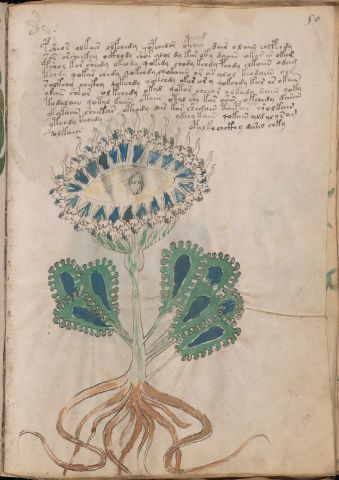

# Voynich Speculative Procedural Protocol — f50r

IMPORTANT: this is NOT a real or validated translation of the Voynich Manuscript. It is a speculative/procedural model that interprets EVA using a user-defined grammar to generate experimental recipes using safe, known edible substitutes.

This file is generated automatically from IVTFF/EVA transliteration plus a user-defined procedural grammar.



## Page / Folio
- currier: B
- folio: f50r
- page_number: 97
- section: herbal

## EVA Text (Transliteration)
```text
psheor olkair olfchedy qop[eee:che]dar opchey dair o laiin chefchdy
sor orsheckhy ockhody shos alol dy kar oky daiiin okar ar okam
tshol kar sheedy okeody qokedy chody kchdy pchdy chkaiin odam
tchdy qokas chedy qokchdy qokaiin or ar alol keodaiin ols
solkchy chckhy qokchdy qokchdy okar ar y qokchdy kar ar okain
ykain [sh:c's]ear ol kchedy okal qotor cheeor olk[ee:a]dy daiin qoky
todalain qotal kaiin otaiin otal she ka[r:s] ariin okchedy dariin
yk ykaiin sheekar otchdy dar kar shedain taipar orolkain
ytchdy kchedy ykeey kaiin qokain ald [a:y]lo[s:r]am
solkaiin opalke chckhy darin chky
```

## Domain Context (Heuristic; Not a Translation)

This section summarizes recurring **basewords** in this IVTFF domain and shows simple substring evidence that the token markers used by the procedural grammar occur inside frequent words.

Any Italian anagram / English gloss is a best-effort lexicon match, not a decipherment.


### Associated basewords (non-generic; top by frequency in this domain)
- `paiin` (count=477) → Italian anagram `piani`; English: plans (arrangements)
- `okaiin` (count=59) → Italian anagram `coniai`; English: [n/a]
- `qokep` (count=41) → Italian anagram `pecco`; English: [n/a]
- `saiin` (count=40) → Italian anagram `asini`; English: [n/a]
- `kaiin` (count=40) → Italian anagram `acini`; English: [n/a]
- `chaiin` (count=39) → Italian anagram `acini`; English: [n/a]
- `qokaiin` (count=34) → Italian anagram `ciancio`; English: [n/a]
- `qokar` (count=29) → Italian anagram `carco`; English: [n/a]
- `opaiin` (count=29) → Italian anagram `inopia`; English: poverty
- `otchol` (count=25) → Italian anagram `colto`; English: cultivated
- `chopaiin` (count=24) → Italian anagram `apocini`; English: [n/a]
- `qotol` (count=20) → Italian anagram `colto`; English: cultivated
- `okain` (count=19) → Italian anagram `acino`; English: a berry
- `qotor` (count=18) → Italian anagram `corto`; English: short
- `qopaiin` (count=15) → Italian anagram `apocini`; English: [n/a]

### Marker evidence (substring in frequent basewords)
- `qo`: 58 basewords; examples: `qotch`, `qok`, `qot`, `qokch`, `qokep`, `qokaiin`
- `q`: 59 basewords; examples: `qotch`, `qok`, `qot`, `qokch`, `qokep`, `qokaiin`
- `o`: 274 basewords; examples: `chol`, `o`, `chor`, `or`, `shol`, `ol`
- `k`: 146 basewords; examples: `ok`, `k`, `okaiin`, `kch`, `chckh`, `qok`
- `t`: 101 basewords; examples: `cth`, `ot`, `t`, `qotch`, `cthol`, `qot`
- `p`: 152 basewords; examples: `paiin`, `p`, `par`, `pain`, `pal`, `chep`
- `ch`: 145 basewords; examples: `chol`, `chor`, `ch`, `che`, `chep`, `cho`
- `sh`: 51 basewords; examples: `shol`, `sh`, `sho`, `shor`, `she`, `shep`
- `f`: 2 basewords; examples: `fchep`, `f`
- `cth`: 18 basewords; examples: `cth`, `cthol`, `cthor`, `cthe`, `chcth`, `ctho`
- `ckh`: 18 basewords; examples: `chckh`, `ckh`, `ckhe`, `ckhol`, `shckh`, `checkh`
- `cph`: 3 basewords; examples: `cph`, `cphol`, `cphe`
- `iin`: 39 basewords; examples: `paiin`, `aiin`, `okaiin`, `saiin`, `kaiin`, `chaiin`
- `aiin`: 31 basewords; examples: `paiin`, `aiin`, `okaiin`, `saiin`, `kaiin`, `chaiin`

## Recipes Index (This Page)
- [f50r.1,@P0](#f50r-1-f50r-1-p0)
- [f50r.2,+P0](#f50r-2-f50r-2-p0)
- [f50r.3,+P0](#f50r-3-f50r-3-p0)
- [f50r.4,+P0](#f50r-4-f50r-4-p0)
- [f50r.5,+P0](#f50r-5-f50r-5-p0)
- [f50r.6,+P0](#f50r-6-f50r-6-p0)
- [f50r.7,+P0](#f50r-7-f50r-7-p0)
- [f50r.8,+P0](#f50r-8-f50r-8-p0)
- [f50r.9,+P0](#f50r-9-f50r-9-p0)
- [f50r.10,+P0](#f50r-10-f50r-10-p0)

## Line Glosses (Procedural Gloss Only; Not a Translation)

<a id="f50r-1-f50r-1-p0"></a>

### f50r.1,@P0

EVA (original line):
```text
psheor olkair olfchedy qop[eee:che]dar opchey dair o laiin chefchdy
```

English structural gloss (generated):

- psheor: tokens: p sh e o r → connectors: r → vowel_run: e (level 1; class e)
- olkair: tokens: o l k a i r → connectors: l r → vowel_run: a (level 1; class a)
- olfchedy: tokens: o l f ch e p → connectors: l → vowel_run: e (level 1; class e)
- qop: tokens: qo p
- eee: tokens: eee → vowel_run: eee (level 3; class e)
- che: tokens: ch e → vowel_run: e (level 1; class e)
- dar: tokens: p a r → connectors: r → vowel_run: a (level 1; class a)
- opchey: tokens: o p ch e → vowel_run: e (level 1; class e)
- dair: tokens: p a i r → connectors: r → vowel_run: a (level 1; class a)
- o: tokens: o
- laiin: tokens: l aiin → connectors: l → vowel_run: a (level 1; class a) → suffix: aiin
- chefchdy: tokens: ch e f ch p → vowel_run: e (level 1; class e)

<a id="f50r-2-f50r-2-p0"></a>

### f50r.2,+P0

EVA (original line):
```text
sor orsheckhy ockhody shos alol dy kar oky daiiin okar ar okam
```

English structural gloss (generated):

- sor: tokens: s o r → connectors: s r
- orsheckhy: tokens: o r sh e ckh → connectors: r → vowel_run: e (level 1; class e)
- ockhody: tokens: o ckh o p
- shos: tokens: sh o s → connectors: s
- alol: tokens: a l o l → connectors: l l → vowel_run: a (level 1; class a)
- dy: tokens: p
- kar: tokens: k a r → connectors: r → vowel_run: a (level 1; class a)
- oky: tokens: o k
- daiiin: tokens: p a iii n → connectors: n → vowel_run: a (level 1; class a) → suffix: iin
- okar: tokens: o k a r → connectors: r → vowel_run: a (level 1; class a)
- ar: tokens: a r → connectors: r → vowel_run: a (level 1; class a)
- okam: tokens: o k a m → connectors: m → vowel_run: a (level 1; class a)

<a id="f50r-3-f50r-3-p0"></a>

### f50r.3,+P0

EVA (original line):
```text
tshol kar sheedy okeody qokedy chody kchdy pchdy chkaiin odam
```

English structural gloss (generated):

- tshol: tokens: t sh o l → connectors: l
- kar: tokens: k a r → connectors: r → vowel_run: a (level 1; class a)
- sheedy: tokens: sh ee p → vowel_run: ee (level 2; class e)
- okeody: tokens: o k e o p → vowel_run: e (level 1; class e)
- qokedy: tokens: qo k e p → vowel_run: e (level 1; class e) (lexicon-context: `qokep` → `pecco`; [n/a])
- chody: tokens: ch o p
- kchdy: tokens: k ch p
- pchdy: tokens: p ch p
- chkaiin: tokens: ch k aiin → vowel_run: a (level 1; class a) → suffix: aiin (lexicon-context: `chkaiin` → `cinica`; [n/a])
- odam: tokens: o p a m → connectors: m → vowel_run: a (level 1; class a)

<a id="f50r-4-f50r-4-p0"></a>

### f50r.4,+P0

EVA (original line):
```text
tchdy qokas chedy qokchdy qokaiin or ar alol keodaiin ols
```

English structural gloss (generated):

- tchdy: tokens: t ch p
- qokas: tokens: qo k a s → connectors: s → vowel_run: a (level 1; class a)
- chedy: tokens: ch e p → vowel_run: e (level 1; class e)
- qokchdy: tokens: qo k ch p
- qokaiin: tokens: qo k aiin → vowel_run: a (level 1; class a) → suffix: aiin (lexicon-context: `qokaiin` → `conciai`; [n/a])
- or: tokens: o r → connectors: r
- ar: tokens: a r → connectors: r → vowel_run: a (level 1; class a)
- alol: tokens: a l o l → connectors: l l → vowel_run: a (level 1; class a)
- keodaiin: tokens: k e o p aiin → vowel_run: e (level 1; class e) → suffix: aiin (lexicon-context: `opaiin` → `opinai`; [n/a])
- ols: tokens: o l s → connectors: l s

<a id="f50r-5-f50r-5-p0"></a>

### f50r.5,+P0

EVA (original line):
```text
solkchy chckhy qokchdy qokchdy okar ar y qokchdy kar ar okain
```

English structural gloss (generated):

- solkchy: tokens: s o l k ch → connectors: s l
- chckhy: tokens: ch ckh
- qokchdy: tokens: qo k ch p
- qokchdy: tokens: qo k ch p
- okar: tokens: o k a r → connectors: r → vowel_run: a (level 1; class a)
- ar: tokens: a r → connectors: r → vowel_run: a (level 1; class a)
- y: [unparsed]
- qokchdy: tokens: qo k ch p
- kar: tokens: k a r → connectors: r → vowel_run: a (level 1; class a)
- ar: tokens: a r → connectors: r → vowel_run: a (level 1; class a)
- okain: tokens: o k a i n → connectors: n → vowel_run: a (level 1; class a) (lexicon-context: `okain` → `conia`; [n/a])

<a id="f50r-6-f50r-6-p0"></a>

### f50r.6,+P0

EVA (original line):
```text
ykain [sh:c's]ear ol kchedy okal qotor cheeor olk[ee:a]dy daiin qoky
```

English structural gloss (generated):

- ykain: tokens: k a i n → connectors: n → vowel_run: a (level 1; class a)
- sh: tokens: sh
- c: tokens: c
- s: tokens: s → connectors: s
- ear: tokens: e a r → connectors: r → vowel_run: e (level 1; class e)
- ol: tokens: o l → connectors: l
- kchedy: tokens: k ch e p → vowel_run: e (level 1; class e)
- okal: tokens: o k a l → connectors: l → vowel_run: a (level 1; class a)
- qotor: tokens: qo t o r → connectors: r (lexicon-context: `qotor` → `corto`; short)
- cheeor: tokens: ch ee o r → connectors: r → vowel_run: ee (level 2; class e)
- olk: tokens: o l k → connectors: l
- ee: tokens: ee → vowel_run: ee (level 2; class e)
- a: tokens: a → vowel_run: a (level 1; class a)
- dy: tokens: p
- daiin: tokens: p aiin → vowel_run: a (level 1; class a) → suffix: aiin (lexicon-context: `paiin` → `piani`; plans (arrangements))
- qoky: tokens: qo k

<a id="f50r-7-f50r-7-p0"></a>

### f50r.7,+P0

EVA (original line):
```text
todalain qotal kaiin otaiin otal she ka[r:s] ariin okchedy dariin
```

English structural gloss (generated):

- todalain: tokens: t o p a l a i n → connectors: l n → vowel_run: a (level 1; class a)
- qotal: tokens: qo t a l → connectors: l → vowel_run: a (level 1; class a)
- kaiin: tokens: k aiin → vowel_run: a (level 1; class a) → suffix: aiin
- otaiin: tokens: o t aiin → vowel_run: a (level 1; class a) → suffix: aiin
- otal: tokens: o t a l → connectors: l → vowel_run: a (level 1; class a)
- she: tokens: sh e → vowel_run: e (level 1; class e)
- ka: tokens: k a → vowel_run: a (level 1; class a)
- r: tokens: r → connectors: r
- s: tokens: s → connectors: s
- ariin: tokens: a r iin → connectors: r → vowel_run: a (level 1; class a) → suffix: iin
- okchedy: tokens: o k ch e p → vowel_run: e (level 1; class e)
- dariin: tokens: p a r iin → connectors: r → vowel_run: a (level 1; class a) → suffix: iin

<a id="f50r-8-f50r-8-p0"></a>

### f50r.8,+P0

EVA (original line):
```text
yk ykaiin sheekar otchdy dar kar shedain taipar orolkain
```

English structural gloss (generated):

- yk: tokens: k
- ykaiin: tokens: k aiin → vowel_run: a (level 1; class a) → suffix: aiin
- sheekar: tokens: sh ee k a r → connectors: r → vowel_run: ee (level 2; class e)
- otchdy: tokens: o t ch p
- dar: tokens: p a r → connectors: r → vowel_run: a (level 1; class a)
- kar: tokens: k a r → connectors: r → vowel_run: a (level 1; class a)
- shedain: tokens: sh e p a i n → connectors: n → vowel_run: e (level 1; class e)
- taipar: tokens: t a i p a r → connectors: r → vowel_run: a (level 1; class a)
- orolkain: tokens: o r o l k a i n → connectors: r l n → vowel_run: a (level 1; class a)

<a id="f50r-9-f50r-9-p0"></a>

### f50r.9,+P0

EVA (original line):
```text
ytchdy kchedy ykeey kaiin qokain ald [a:y]lo[s:r]am
```

English structural gloss (generated):

- ytchdy: tokens: t ch p
- kchedy: tokens: k ch e p → vowel_run: e (level 1; class e)
- ykeey: tokens: k ee → vowel_run: ee (level 2; class e)
- kaiin: tokens: k aiin → vowel_run: a (level 1; class a) → suffix: aiin
- qokain: tokens: qo k a i n → connectors: n → vowel_run: a (level 1; class a) (lexicon-context: `okain` → `conia`; [n/a])
- ald: tokens: a l p → connectors: l → vowel_run: a (level 1; class a)
- a: tokens: a → vowel_run: a (level 1; class a)
- y: [unparsed]
- lo: tokens: l o → connectors: l
- s: tokens: s → connectors: s
- r: tokens: r → connectors: r
- am: tokens: a m → connectors: m → vowel_run: a (level 1; class a)

<a id="f50r-10-f50r-10-p0"></a>

### f50r.10,+P0

EVA (original line):
```text
solkaiin opalke chckhy darin chky
```

English structural gloss (generated):

- solkaiin: tokens: s o l k aiin → connectors: s l → vowel_run: a (level 1; class a) → suffix: aiin
- opalke: tokens: o p a l k e → connectors: l → vowel_run: a (level 1; class a)
- chckhy: tokens: ch ckh
- darin: tokens: p a r i n → connectors: r n → vowel_run: a (level 1; class a)
- chky: tokens: ch k
