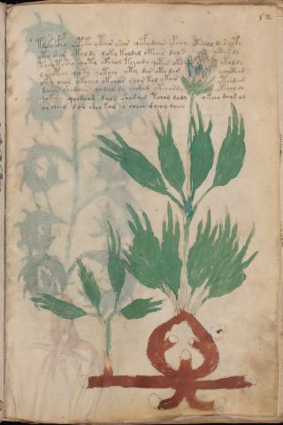

# Voynich Speculative Procedural Protocol — f52r

IMPORTANT: this is NOT a real or validated translation of the Voynich Manuscript. It is a speculative/procedural model that interprets EVA using a user-defined grammar to generate experimental recipes using safe, known edible substitutes.

This file is generated automatically from IVTFF/EVA transliteration plus a user-defined procedural grammar.



## Page / Folio
- currier: A
- folio: f52r
- page_number: 101
- section: herbal

## EVA Text (Transliteration)
```text
tdokchcfhy ycphko ytair shar qofy daiin ypchy otchol dar yty
oty shor ykoldy qoky koldal oteees dals otar dl
tchotshey qoty okchol tchody qotam oky ytoldy
l shopchy qoky qotchy oty dar oty dam ychcthod
oky chor okchal okchar shor tol ykair ytchdam
daiin shedaiin qodal dy [ch:ee]okam otchordy okchol do
qok[ch':cs]y qockhom dals shodaim tcham dody ykeey dai[g:m:d] a[m:@175;]
or cheey dor shey kom s cheey dch[o:a]m daiin
```

## Domain Context (Heuristic; Not a Translation)

This section summarizes recurring **basewords** in this IVTFF domain and shows simple substring evidence that the token markers used by the procedural grammar occur inside frequent words.

Any Italian anagram / English gloss is a best-effort lexicon match, not a decipherment.


### Associated basewords (non-generic; top by frequency in this domain)
- `daiin` (count=461) → Italian anagram `piani`; English: plans (arrangements)
- `okaiin` (count=59) → Italian anagram `coniai`; English: [n/a]
- `chaiin` (count=39) → Italian anagram `acini`; English: [n/a]
- `saiin` (count=37) → Italian anagram `asini`; English: [n/a]
- `qokaiin` (count=34) → Italian anagram `ciancio`; English: [n/a]
- `qokar` (count=29) → Italian anagram `carco`; English: [n/a]
- `odaiin` (count=27) → Italian anagram `inopia`; English: poverty
- `otchol` (count=25) → Italian anagram `colto`; English: cultivated
- `kaiin` (count=24) → Italian anagram `acini`; English: [n/a]
- `chodaiin` (count=24) → Italian anagram `apocini`; English: [n/a]
- `qotol` (count=20) → Italian anagram `colto`; English: cultivated
- `okain` (count=19) → Italian anagram `acino`; English: a berry
- `qotor` (count=18) → Italian anagram `corto`; English: short
- `ykaiin` (count=16) → Italian anagram `acini`; English: [n/a]
- `qodaiin` (count=15) → Italian anagram `apocini`; English: [n/a]

### Marker evidence (substring in frequent basewords)
- `qo`: 57 basewords; examples: `qotchy`, `qokchy`, `qokedy`, `qokaiin`, `qoky`, `qokol`
- `q`: 58 basewords; examples: `qotchy`, `qokchy`, `qokedy`, `qokaiin`, `qoky`, `qokol`
- `o`: 252 basewords; examples: `chol`, `o`, `chor`, `or`, `shol`, `ol`
- `k`: 142 basewords; examples: `okaiin`, `oky`, `chckhy`, `qokchy`, `qokedy`, `okal`
- `t`: 102 basewords; examples: `cthy`, `oty`, `qotchy`, `cthol`, `cthor`, `otaiin`
- `p`: 15 basewords; examples: `cphy`, `ypchedy`, `opchy`, `opchey`, `pchor`, `qopchy`
- `ch`: 138 basewords; examples: `chol`, `chor`, `chy`, `chey`, `chedy`, `chdy`
- `sh`: 46 basewords; examples: `shol`, `sho`, `shy`, `shor`, `shey`, `shedy`
- `f`: 1 basewords; examples: `f`
- `cth`: 17 basewords; examples: `cthy`, `cthol`, `cthor`, `cthey`, `chcthy`, `ctho`
- `ckh`: 15 basewords; examples: `chckhy`, `ckhy`, `ckhol`, `ckhey`, `checkhy`, `shckhy`
- `cph`: 2 basewords; examples: `cphy`, `cphol`
- `dy`: 78 basewords; examples: `dy`, `chedy`, `chdy`, `chody`, `qokedy`, `shedy`
- `iin`: 39 basewords; examples: `daiin`, `aiin`, `okaiin`, `chaiin`, `saiin`, `qokaiin`
- `aiin`: 32 basewords; examples: `daiin`, `aiin`, `okaiin`, `chaiin`, `saiin`, `qokaiin`

## Recipes Index (This Page)
- [f52r.1,@P0](#f52r-1-f52r-1-p0)
- [f52r.2,+P0](#f52r-2-f52r-2-p0)
- [f52r.3,+P0](#f52r-3-f52r-3-p0)
- [f52r.4,+P0](#f52r-4-f52r-4-p0)
- [f52r.5,+P0](#f52r-5-f52r-5-p0)
- [f52r.6,+P0](#f52r-6-f52r-6-p0)
- [f52r.7,+P0](#f52r-7-f52r-7-p0)
- [f52r.8,+P0](#f52r-8-f52r-8-p0)

## Line Glosses (Procedural Gloss Only; Not a Translation)

<a id="f52r-1-f52r-1-p0"></a>

### f52r.1,@P0

EVA: tdokchcfhy ycphko ytair shar qofy daiin ypchy otchol dar yty

Direct Gloss (Procedural, Not a Real Translation):
- tdokchcfhy: tokens: t p o k ch cfh
- ycphko: tokens: cph k o
- ytair: tokens: t a i r → connectors: r → vowel_run: a (level 1; class a)
- shar: tokens: sh a r → connectors: r → vowel_run: a (level 1; class a)
- qofy: tokens: qo f
- daiin: tokens: p aiin → vowel_run: a (level 1; class a) → suffix: aiin (lexicon-context: `daiin` → `piani`; plans (arrangements))
- ypchy: tokens: p ch
- otchol: tokens: o t ch o l → connectors: l (lexicon-context: `otchol` → `colto`; cultivated)
- dar: tokens: p a r → connectors: r → vowel_run: a (level 1; class a)
- yty: tokens: t

<a id="f52r-2-f52r-2-p0"></a>

### f52r.2,+P0

EVA: oty shor ykoldy qoky koldal oteees dals otar dl

Direct Gloss (Procedural, Not a Real Translation):
- oty: tokens: o t
- shor: tokens: sh o r → connectors: r
- ykoldy: tokens: k o l p → connectors: l
- qoky: tokens: qo k
- koldal: tokens: k o l p a l → connectors: l l → vowel_run: a (level 1; class a)
- oteees: tokens: o t eee s → connectors: s → vowel_run: eee (level 3; class e)
- dals: tokens: p a l s → connectors: l s → vowel_run: a (level 1; class a)
- otar: tokens: o t a r → connectors: r → vowel_run: a (level 1; class a)
- dl: tokens: p l → connectors: l

<a id="f52r-3-f52r-3-p0"></a>

### f52r.3,+P0

EVA: tchotshey qoty okchol tchody qotam oky ytoldy

Direct Gloss (Procedural, Not a Real Translation):
- tchotshey: tokens: t ch o t sh e → vowel_run: e (level 1; class e)
- qoty: tokens: qo t
- okchol: tokens: o k ch o l → connectors: l
- tchody: tokens: t ch o p
- qotam: tokens: qo t a m → connectors: m → vowel_run: a (level 1; class a)
- oky: tokens: o k
- ytoldy: tokens: t o l p → connectors: l

<a id="f52r-4-f52r-4-p0"></a>

### f52r.4,+P0

EVA: l shopchy qoky qotchy oty dar oty dam ychcthod

Direct Gloss (Procedural, Not a Real Translation):
- l: tokens: l → connectors: l
- shopchy: tokens: sh o p ch
- qoky: tokens: qo k
- qotchy: tokens: qo t ch
- oty: tokens: o t
- dar: tokens: p a r → connectors: r → vowel_run: a (level 1; class a)
- oty: tokens: o t
- dam: tokens: p a m → connectors: m → vowel_run: a (level 1; class a)
- ychcthod: tokens: ch cth o p

<a id="f52r-5-f52r-5-p0"></a>

### f52r.5,+P0

EVA: oky chor okchal okchar shor tol ykair ytchdam

Direct Gloss (Procedural, Not a Real Translation):
- oky: tokens: o k
- chor: tokens: ch o r → connectors: r
- okchal: tokens: o k ch a l → connectors: l → vowel_run: a (level 1; class a)
- okchar: tokens: o k ch a r → connectors: r → vowel_run: a (level 1; class a)
- shor: tokens: sh o r → connectors: r
- tol: tokens: t o l → connectors: l
- ykair: tokens: k a i r → connectors: r → vowel_run: a (level 1; class a)
- ytchdam: tokens: t ch p a m → connectors: m → vowel_run: a (level 1; class a)

<a id="f52r-6-f52r-6-p0"></a>

### f52r.6,+P0

EVA: daiin shedaiin qodal dy [ch:ee]okam otchordy okchol do

Direct Gloss (Procedural, Not a Real Translation):
- daiin: tokens: p aiin → vowel_run: a (level 1; class a) → suffix: aiin (lexicon-context: `daiin` → `piani`; plans (arrangements))
- shedaiin: tokens: sh e p aiin → vowel_run: e (level 1; class e) → suffix: aiin (lexicon-context: `daiin` → `piani`; plans (arrangements))
- qodal: tokens: qo p a l → connectors: l → vowel_run: a (level 1; class a)
- dy: tokens: p
- ch: tokens: ch
- ee: tokens: ee → vowel_run: ee (level 2; class e)
- okam: tokens: o k a m → connectors: m → vowel_run: a (level 1; class a)
- otchordy: tokens: o t ch o r p → connectors: r (lexicon-context: `otchor` → `corto`; short)
- okchol: tokens: o k ch o l → connectors: l
- do: tokens: p o

<a id="f52r-7-f52r-7-p0"></a>

### f52r.7,+P0

EVA: qok[ch':cs]y qockhom dals shodaim tcham dody ykeey dai[g:m:d] a[m:@175;]

Direct Gloss (Procedural, Not a Real Translation):
- qok: tokens: qo k
- ch: tokens: ch
- cs: tokens: c s → connectors: s
- y: [unparsed]
- qockhom: tokens: qo ckh o m → connectors: m
- dals: tokens: p a l s → connectors: l s → vowel_run: a (level 1; class a)
- shodaim: tokens: sh o p a i m → connectors: m → vowel_run: a (level 1; class a)
- tcham: tokens: t ch a m → connectors: m → vowel_run: a (level 1; class a)
- dody: tokens: p o p
- ykeey: tokens: k ee → vowel_run: ee (level 2; class e)
- dai: tokens: p a i → vowel_run: a (level 1; class a)
- g: tokens: g
- m: tokens: m → connectors: m
- d: tokens: p
- a: tokens: a → vowel_run: a (level 1; class a)
- m: tokens: m → connectors: m

<a id="f52r-8-f52r-8-p0"></a>

### f52r.8,+P0

EVA: or cheey dor shey kom s cheey dch[o:a]m daiin

Direct Gloss (Procedural, Not a Real Translation):
- or: tokens: o r → connectors: r
- cheey: tokens: ch ee → vowel_run: ee (level 2; class e)
- dor: tokens: p o r → connectors: r
- shey: tokens: sh e → vowel_run: e (level 1; class e)
- kom: tokens: k o m → connectors: m
- s: tokens: s → connectors: s
- cheey: tokens: ch ee → vowel_run: ee (level 2; class e)
- dch: tokens: p ch
- o: tokens: o
- a: tokens: a → vowel_run: a (level 1; class a)
- m: tokens: m → connectors: m
- daiin: tokens: p aiin → vowel_run: a (level 1; class a) → suffix: aiin (lexicon-context: `daiin` → `piani`; plans (arrangements))
