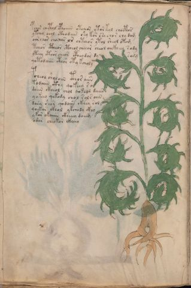

# Voynich Speculative Procedural Protocol — f52v

IMPORTANT: this is NOT a real or validated translation of the Voynich Manuscript. It is a speculative/procedural model that interprets EVA using a user-defined grammar to generate experimental recipes using safe, known edible substitutes.

This file is generated automatically from IVTFF/EVA transliteration plus a user-defined procedural grammar.



## Page / Folio
- currier: A
- folio: f52v
- page_number: 102
- section: herbal

## EVA Text (Transliteration)
```text
pchor chcphol cphaiiin otcheor ytor kol chocph[a:o]r
ytchey chol ctho daiir shy kor ese chor chy dam
oor chor chochar l[s:r] chteeor ytol sheol otam
tchor ctheor ctheol cheeor cheol chckheey s[o:a]dy
yteey cthor cheo[s:r] cpheodar dy sarg
qotodaiin cthor oty kcholy
pcheol sholoiin cthor aiin
kodaiin cthy qokeey s ol
daiin ckheol chol qoke[y:o]l daiin
yokee[y:o] qokody chol sol s aiin
daiin shor qodaiin ckhey sal
qoekar ckhol ykchody ckhy
yk[o:a]r okaiiin ckheeey daiig
odar cheokor ckheey
```

## Domain Context (Heuristic; Not a Translation)

This section summarizes recurring **basewords** in this IVTFF domain and shows simple substring evidence that the token markers used by the procedural grammar occur inside frequent words.

Any Italian anagram / English gloss is a best-effort lexicon match, not a decipherment.


### Associated basewords (non-generic; top by frequency in this domain)
- `paiin` (count=477) → Italian anagram `piani`; English: plans (arrangements)
- `okaiin` (count=59) → Italian anagram `coniai`; English: [n/a]
- `qokep` (count=41) → Italian anagram `pecco`; English: [n/a]
- `saiin` (count=40) → Italian anagram `asini`; English: [n/a]
- `kaiin` (count=40) → Italian anagram `acini`; English: [n/a]
- `chaiin` (count=39) → Italian anagram `acini`; English: [n/a]
- `qokaiin` (count=34) → Italian anagram `ciancio`; English: [n/a]
- `qokar` (count=29) → Italian anagram `carco`; English: [n/a]
- `opaiin` (count=29) → Italian anagram `inopia`; English: poverty
- `otchol` (count=25) → Italian anagram `colto`; English: cultivated
- `chopaiin` (count=24) → Italian anagram `apocini`; English: [n/a]
- `qotol` (count=20) → Italian anagram `colto`; English: cultivated
- `okain` (count=19) → Italian anagram `acino`; English: a berry
- `qotor` (count=18) → Italian anagram `corto`; English: short
- `qopaiin` (count=15) → Italian anagram `apocini`; English: [n/a]

### Marker evidence (substring in frequent basewords)
- `qo`: 58 basewords; examples: `qotch`, `qok`, `qot`, `qokch`, `qokep`, `qokaiin`
- `q`: 59 basewords; examples: `qotch`, `qok`, `qot`, `qokch`, `qokep`, `qokaiin`
- `o`: 274 basewords; examples: `chol`, `o`, `chor`, `or`, `shol`, `ol`
- `k`: 146 basewords; examples: `ok`, `k`, `okaiin`, `kch`, `chckh`, `qok`
- `t`: 101 basewords; examples: `cth`, `ot`, `t`, `qotch`, `cthol`, `qot`
- `p`: 152 basewords; examples: `paiin`, `p`, `par`, `pain`, `pal`, `chep`
- `ch`: 145 basewords; examples: `chol`, `chor`, `ch`, `che`, `chep`, `cho`
- `sh`: 51 basewords; examples: `shol`, `sh`, `sho`, `shor`, `she`, `shep`
- `f`: 2 basewords; examples: `fchep`, `f`
- `cth`: 18 basewords; examples: `cth`, `cthol`, `cthor`, `cthe`, `chcth`, `ctho`
- `ckh`: 18 basewords; examples: `chckh`, `ckh`, `ckhe`, `ckhol`, `shckh`, `checkh`
- `cph`: 3 basewords; examples: `cph`, `cphol`, `cphe`
- `iin`: 39 basewords; examples: `paiin`, `aiin`, `okaiin`, `saiin`, `kaiin`, `chaiin`
- `aiin`: 31 basewords; examples: `paiin`, `aiin`, `okaiin`, `saiin`, `kaiin`, `chaiin`

## Recipes Index (This Page)
- [f52v.1,@P0](#f52v-1-f52v-1-p0)
- [f52v.2,+P0](#f52v-2-f52v-2-p0)
- [f52v.3,+P0](#f52v-3-f52v-3-p0)
- [f52v.4,+P0](#f52v-4-f52v-4-p0)
- [f52v.5,+P0](#f52v-5-f52v-5-p0)
- [f52v.6,+P0](#f52v-6-f52v-6-p0)
- [f52v.7,+P0](#f52v-7-f52v-7-p0)
- [f52v.8,+P0](#f52v-8-f52v-8-p0)
- [f52v.9,+P0](#f52v-9-f52v-9-p0)
- [f52v.10,+P0](#f52v-10-f52v-10-p0)
- [f52v.11,+P0](#f52v-11-f52v-11-p0)
- [f52v.12,+P0](#f52v-12-f52v-12-p0)
- [f52v.13,+P0](#f52v-13-f52v-13-p0)
- [f52v.14,+P0](#f52v-14-f52v-14-p0)

## Line Glosses (Procedural Gloss Only; Not a Translation)

<a id="f52v-1-f52v-1-p0"></a>

### f52v.1,@P0

EVA: pchor chcphol cphaiiin otcheor ytor kol chocph[a:o]r

Direct Gloss (Procedural, Not a Real Translation):
- pchor: tokens: p ch o r → connectors: r
- chcphol: tokens: ch cph o l → connectors: l
- cphaiiin: tokens: cph a iii n → connectors: n → vowel_run: a (level 1; class a) → suffix: iin
- otcheor: tokens: o t ch e o r → connectors: r → vowel_run: e (level 1; class e)
- ytor: tokens: t o r → connectors: r
- kol: tokens: k o l → connectors: l
- chocph: tokens: ch o cph
- a: tokens: a → vowel_run: a (level 1; class a)
- o: tokens: o
- r: tokens: r → connectors: r

<a id="f52v-2-f52v-2-p0"></a>

### f52v.2,+P0

EVA: ytchey chol ctho daiir shy kor ese chor chy dam

Direct Gloss (Procedural, Not a Real Translation):
- ytchey: tokens: t ch e → vowel_run: e (level 1; class e)
- chol: tokens: ch o l → connectors: l
- ctho: tokens: cth o
- daiir: tokens: p a ii r → connectors: r → vowel_run: a (level 1; class a) (lexicon-context: `paiir` → `aprii`; [n/a])
- shy: tokens: sh
- kor: tokens: k o r → connectors: r
- ese: tokens: e s e → connectors: s → vowel_run: e (level 1; class e)
- chor: tokens: ch o r → connectors: r
- chy: tokens: ch
- dam: tokens: p a m → connectors: m → vowel_run: a (level 1; class a)

<a id="f52v-3-f52v-3-p0"></a>

### f52v.3,+P0

EVA: oor chor chochar l[s:r] chteeor ytol sheol otam

Direct Gloss (Procedural, Not a Real Translation):
- oor: tokens: o o r → connectors: r
- chor: tokens: ch o r → connectors: r
- chochar: tokens: ch o ch a r → connectors: r → vowel_run: a (level 1; class a)
- l: tokens: l → connectors: l
- s: tokens: s → connectors: s
- r: tokens: r → connectors: r
- chteeor: tokens: ch t ee o r → connectors: r → vowel_run: ee (level 2; class e)
- ytol: tokens: t o l → connectors: l
- sheol: tokens: sh e o l → connectors: l → vowel_run: e (level 1; class e)
- otam: tokens: o t a m → connectors: m → vowel_run: a (level 1; class a)

<a id="f52v-4-f52v-4-p0"></a>

### f52v.4,+P0

EVA: tchor ctheor ctheol cheeor cheol chckheey s[o:a]dy

Direct Gloss (Procedural, Not a Real Translation):
- tchor: tokens: t ch o r → connectors: r
- ctheor: tokens: cth e o r → connectors: r → vowel_run: e (level 1; class e)
- ctheol: tokens: cth e o l → connectors: l → vowel_run: e (level 1; class e)
- cheeor: tokens: ch ee o r → connectors: r → vowel_run: ee (level 2; class e)
- cheol: tokens: ch e o l → connectors: l → vowel_run: e (level 1; class e)
- chckheey: tokens: ch ckh ee → vowel_run: ee (level 2; class e)
- s: tokens: s → connectors: s
- o: tokens: o
- a: tokens: a → vowel_run: a (level 1; class a)
- dy: tokens: p

<a id="f52v-5-f52v-5-p0"></a>

### f52v.5,+P0

EVA: yteey cthor cheo[s:r] cpheodar dy sarg

Direct Gloss (Procedural, Not a Real Translation):
- yteey: tokens: t ee → vowel_run: ee (level 2; class e)
- cthor: tokens: cth o r → connectors: r
- cheo: tokens: ch e o → vowel_run: e (level 1; class e)
- s: tokens: s → connectors: s
- r: tokens: r → connectors: r
- cpheodar: tokens: cph e o p a r → connectors: r → vowel_run: e (level 1; class e)
- dy: tokens: p
- sarg: tokens: s a r g → connectors: s r → vowel_run: a (level 1; class a)

<a id="f52v-6-f52v-6-p0"></a>

### f52v.6,+P0

EVA: qotodaiin cthor oty kcholy

Direct Gloss (Procedural, Not a Real Translation):
- qotodaiin: tokens: qo t o p aiin → vowel_run: a (level 1; class a) → suffix: aiin (lexicon-context: `opaiin` → `opinai`; [n/a])
- cthor: tokens: cth o r → connectors: r
- oty: tokens: o t
- kcholy: tokens: k ch o l → connectors: l

<a id="f52v-7-f52v-7-p0"></a>

### f52v.7,+P0

EVA: pcheol sholoiin cthor aiin

Direct Gloss (Procedural, Not a Real Translation):
- pcheol: tokens: p ch e o l → connectors: l → vowel_run: e (level 1; class e)
- sholoiin: tokens: sh o l o iin → connectors: l → vowel_run: ii (level 2; class i) → suffix: iin
- cthor: tokens: cth o r → connectors: r
- aiin: tokens: aiin → vowel_run: a (level 1; class a) → suffix: aiin

<a id="f52v-8-f52v-8-p0"></a>

### f52v.8,+P0

EVA: kodaiin cthy qokeey s ol

Direct Gloss (Procedural, Not a Real Translation):
- kodaiin: tokens: k o p aiin → vowel_run: a (level 1; class a) → suffix: aiin (lexicon-context: `opaiin` → `opinai`; [n/a])
- cthy: tokens: cth
- qokeey: tokens: qo k ee → vowel_run: ee (level 2; class e)
- s: tokens: s → connectors: s
- ol: tokens: o l → connectors: l

<a id="f52v-9-f52v-9-p0"></a>

### f52v.9,+P0

EVA: daiin ckheol chol qoke[y:o]l daiin

Direct Gloss (Procedural, Not a Real Translation):
- daiin: tokens: p aiin → vowel_run: a (level 1; class a) → suffix: aiin (lexicon-context: `paiin` → `piani`; plans (arrangements))
- ckheol: tokens: ckh e o l → connectors: l → vowel_run: e (level 1; class e)
- chol: tokens: ch o l → connectors: l
- qoke: tokens: qo k e → vowel_run: e (level 1; class e)
- y: [unparsed]
- o: tokens: o
- l: tokens: l → connectors: l
- daiin: tokens: p aiin → vowel_run: a (level 1; class a) → suffix: aiin (lexicon-context: `paiin` → `piani`; plans (arrangements))

<a id="f52v-10-f52v-10-p0"></a>

### f52v.10,+P0

EVA: yokee[y:o] qokody chol sol s aiin

Direct Gloss (Procedural, Not a Real Translation):
- yokee: tokens: o k ee → vowel_run: ee (level 2; class e)
- y: [unparsed]
- o: tokens: o
- qokody: tokens: qo k o p
- chol: tokens: ch o l → connectors: l
- sol: tokens: s o l → connectors: s l
- s: tokens: s → connectors: s
- aiin: tokens: aiin → vowel_run: a (level 1; class a) → suffix: aiin

<a id="f52v-11-f52v-11-p0"></a>

### f52v.11,+P0

EVA: daiin shor qodaiin ckhey sal

Direct Gloss (Procedural, Not a Real Translation):
- daiin: tokens: p aiin → vowel_run: a (level 1; class a) → suffix: aiin (lexicon-context: `paiin` → `piani`; plans (arrangements))
- shor: tokens: sh o r → connectors: r
- qodaiin: tokens: qo p aiin → vowel_run: a (level 1; class a) → suffix: aiin
- ckhey: tokens: ckh e → vowel_run: e (level 1; class e)
- sal: tokens: s a l → connectors: s l → vowel_run: a (level 1; class a)

<a id="f52v-12-f52v-12-p0"></a>

### f52v.12,+P0

EVA: qoekar ckhol ykchody ckhy

Direct Gloss (Procedural, Not a Real Translation):
- qoekar: tokens: qo e k a r → connectors: r → vowel_run: e (level 1; class e)
- ckhol: tokens: ckh o l → connectors: l
- ykchody: tokens: k ch o p
- ckhy: tokens: ckh

<a id="f52v-13-f52v-13-p0"></a>

### f52v.13,+P0

EVA: yk[o:a]r okaiiin ckheeey daiig

Direct Gloss (Procedural, Not a Real Translation):
- yk: tokens: k
- o: tokens: o
- a: tokens: a → vowel_run: a (level 1; class a)
- r: tokens: r → connectors: r
- okaiiin: tokens: o k a iii n → connectors: n → vowel_run: a (level 1; class a) → suffix: iin
- ckheeey: tokens: ckh eee → vowel_run: eee (level 3; class e)
- daiig: tokens: p a ii g → vowel_run: a (level 1; class a)

<a id="f52v-14-f52v-14-p0"></a>

### f52v.14,+P0

EVA: odar cheokor ckheey

Direct Gloss (Procedural, Not a Real Translation):
- odar: tokens: o p a r → connectors: r → vowel_run: a (level 1; class a)
- cheokor: tokens: ch e o k o r → connectors: r → vowel_run: e (level 1; class e)
- ckheey: tokens: ckh ee → vowel_run: ee (level 2; class e)
