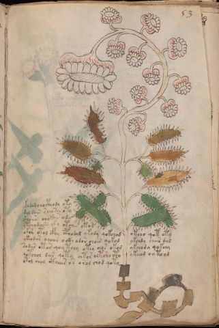

# Voynich Speculative Procedural Protocol — f53r

IMPORTANT: this is NOT a real or validated translation of the Voynich Manuscript. It is a speculative/procedural model that interprets EVA using a user-defined grammar to generate experimental recipes using safe, known edible substitutes.

This file is generated automatically from IVTFF/EVA transliteration plus a user-defined procedural grammar.



## Page / Folio
- currier: A
- folio: f53r
- page_number: 103
- section: herbal

## EVA Text (Transliteration)
```text
k[o:a]dam chocthody oty
dol dain s cho she oty
sho [a:o][s:r] chokan ody
ytchodaiin yky otchey otod
ok[sh:?] otol cfhy cphodol ykody qokchod otcho qot oty
ykeodar oqoor ocki odor chain qokod ykchdy chees dal
sodar otos qoy tchy otey chos okod ykchody qok[ch:ee]y
qotchol dar qoty chtor oltsho cto ykeeod o y toyd
otol chol ctheees os orol chod qoty
```

## Domain Context (Heuristic; Not a Translation)

This section summarizes recurring **basewords** in this IVTFF domain and shows simple substring evidence that the token markers used by the procedural grammar occur inside frequent words.

Any Italian anagram / English gloss is a best-effort lexicon match, not a decipherment.


### Associated basewords (non-generic; top by frequency in this domain)
- `daiin` (count=461) → Italian anagram `piani`; English: plans (arrangements)
- `okaiin` (count=59) → Italian anagram `coniai`; English: [n/a]
- `chaiin` (count=39) → Italian anagram `acini`; English: [n/a]
- `saiin` (count=37) → Italian anagram `asini`; English: [n/a]
- `qokaiin` (count=34) → Italian anagram `ciancio`; English: [n/a]
- `qokar` (count=29) → Italian anagram `carco`; English: [n/a]
- `odaiin` (count=27) → Italian anagram `inopia`; English: poverty
- `otchol` (count=25) → Italian anagram `colto`; English: cultivated
- `kaiin` (count=24) → Italian anagram `acini`; English: [n/a]
- `chodaiin` (count=24) → Italian anagram `apocini`; English: [n/a]
- `qotol` (count=20) → Italian anagram `colto`; English: cultivated
- `okain` (count=19) → Italian anagram `acino`; English: a berry
- `qotor` (count=18) → Italian anagram `corto`; English: short
- `ykaiin` (count=16) → Italian anagram `acini`; English: [n/a]
- `qodaiin` (count=15) → Italian anagram `apocini`; English: [n/a]

### Marker evidence (substring in frequent basewords)
- `qo`: 57 basewords; examples: `qotchy`, `qokchy`, `qokedy`, `qokaiin`, `qoky`, `qokol`
- `q`: 58 basewords; examples: `qotchy`, `qokchy`, `qokedy`, `qokaiin`, `qoky`, `qokol`
- `o`: 252 basewords; examples: `chol`, `o`, `chor`, `or`, `shol`, `ol`
- `k`: 142 basewords; examples: `okaiin`, `oky`, `chckhy`, `qokchy`, `qokedy`, `okal`
- `t`: 102 basewords; examples: `cthy`, `oty`, `qotchy`, `cthol`, `cthor`, `otaiin`
- `p`: 15 basewords; examples: `cphy`, `ypchedy`, `opchy`, `opchey`, `pchor`, `qopchy`
- `ch`: 138 basewords; examples: `chol`, `chor`, `chy`, `chey`, `chedy`, `chdy`
- `sh`: 46 basewords; examples: `shol`, `sho`, `shy`, `shor`, `shey`, `shedy`
- `f`: 1 basewords; examples: `f`
- `cth`: 17 basewords; examples: `cthy`, `cthol`, `cthor`, `cthey`, `chcthy`, `ctho`
- `ckh`: 15 basewords; examples: `chckhy`, `ckhy`, `ckhol`, `ckhey`, `checkhy`, `shckhy`
- `cph`: 2 basewords; examples: `cphy`, `cphol`
- `dy`: 78 basewords; examples: `dy`, `chedy`, `chdy`, `chody`, `qokedy`, `shedy`
- `iin`: 39 basewords; examples: `daiin`, `aiin`, `okaiin`, `chaiin`, `saiin`, `qokaiin`
- `aiin`: 32 basewords; examples: `daiin`, `aiin`, `okaiin`, `chaiin`, `saiin`, `qokaiin`

## Recipes Index (This Page)
- [f53r.1,@P0](#f53r-1-f53r-1-p0)
- [f53r.2,+P0](#f53r-2-f53r-2-p0)
- [f53r.3,+P0](#f53r-3-f53r-3-p0)
- [f53r.4,+P0](#f53r-4-f53r-4-p0)
- [f53r.5,+P0](#f53r-5-f53r-5-p0)
- [f53r.6,+P0](#f53r-6-f53r-6-p0)
- [f53r.7,+P0](#f53r-7-f53r-7-p0)
- [f53r.8,+P0](#f53r-8-f53r-8-p0)
- [f53r.9,+P0](#f53r-9-f53r-9-p0)

## Line Glosses (Procedural Gloss Only; Not a Translation)

<a id="f53r-1-f53r-1-p0"></a>

### f53r.1,@P0

EVA: k[o:a]dam chocthody oty

Direct Gloss (Procedural, Not a Real Translation):
- k: add fermentable sugars
- o: mix / transfer
- a: duration level 1 → state: phase transition/start
- dam: add starter / activate → duration level 1 → state: phase transition/start
- chocthody: add main plant (safe substitute) → mix / transfer → add starter / activate → add complex herbal compound (safe blend)
- oty: apply heat/cooking → mix / transfer

<a id="f53r-2-f53r-2-p0"></a>

### f53r.2,+P0

EVA: dol dain s cho she oty

Direct Gloss (Procedural, Not a Real Translation):
- dol: mix / transfer → add starter / activate
- dain: add starter / activate → duration level 1 → state: phase transition/start
- s: [unparsed]
- cho: add main plant (safe substitute) → mix / transfer
- she: add secondary herb (safe substitute) → duration level 1 → state: active extraction
- oty: apply heat/cooking → mix / transfer

<a id="f53r-3-f53r-3-p0"></a>

### f53r.3,+P0

EVA: sho [a:o][s:r] chokan ody

Direct Gloss (Procedural, Not a Real Translation):
- sho: add secondary herb (safe substitute) → mix / transfer
- a: duration level 1 → state: phase transition/start
- o: mix / transfer
- s: [unparsed]
- r: [unparsed]
- chokan: add fermentable sugars → add main plant (safe substitute) → mix / transfer → duration level 1 → state: phase transition/start
- ody: mix / transfer → add starter / activate

<a id="f53r-4-f53r-4-p0"></a>

### f53r.4,+P0

EVA: ytchodaiin yky otchey otod

Direct Gloss (Procedural, Not a Real Translation):
- ytchodaiin: apply heat/cooking → add main plant (safe substitute) → mix / transfer → add starter / activate → duration level 1 → state: phase transition/start → long phase
- yky: add fermentable sugars
- otchey: apply heat/cooking → add main plant (safe substitute) → mix / transfer → duration level 1 → state: active extraction
- otod: apply heat/cooking → mix / transfer → add starter / activate

<a id="f53r-5-f53r-5-p0"></a>

### f53r.5,+P0

EVA: ok[sh:?] otol cfhy cphodol ykody qokchod otcho qot oty

Direct Gloss (Procedural, Not a Real Translation):
- ok: add fermentable sugars → mix / transfer
- sh: add secondary herb (safe substitute)
- otol: apply heat/cooking → mix / transfer
- cfhy: add complex herbal compound (safe blend)
- cphodol: mix / transfer → add starter / activate → add complex herbal compound (safe blend)
- ykody: add fermentable sugars → mix / transfer → add starter / activate
- qokchod: prepare liquid base → add fermentable sugars → add main plant (safe substitute) → mix / transfer → add starter / activate
- otcho: apply heat/cooking → add main plant (safe substitute) → mix / transfer
- qot: prepare liquid base → apply heat/cooking
- oty: apply heat/cooking → mix / transfer

<a id="f53r-6-f53r-6-p0"></a>

### f53r.6,+P0

EVA: ykeodar oqoor ocki odor chain qokod ykchdy chees dal

Direct Gloss (Procedural, Not a Real Translation):
- ykeodar: add fermentable sugars → mix / transfer → add starter / activate → duration level 1 → state: active extraction
- oqoor: prepare liquid base → mix / transfer
- ocki: add fermentable sugars → mix / transfer → duration level 1 → state: cooling/rest
- odor: mix / transfer → add starter / activate
- chain: add main plant (safe substitute) → duration level 1 → state: phase transition/start
- qokod: prepare liquid base → add fermentable sugars → mix / transfer → add starter / activate
- ykchdy: add fermentable sugars → add main plant (safe substitute) → add starter / activate
- chees: add main plant (safe substitute) → duration level 2 → state: active extraction
- dal: add starter / activate → duration level 1 → state: phase transition/start

<a id="f53r-7-f53r-7-p0"></a>

### f53r.7,+P0

EVA: sodar otos qoy tchy otey chos okod ykchody qok[ch:ee]y

Direct Gloss (Procedural, Not a Real Translation):
- sodar: mix / transfer → add starter / activate → duration level 1 → state: phase transition/start
- otos: apply heat/cooking → mix / transfer
- qoy: prepare liquid base
- tchy: apply heat/cooking → add main plant (safe substitute)
- otey: apply heat/cooking → mix / transfer → duration level 1 → state: active extraction
- chos: add main plant (safe substitute) → mix / transfer
- okod: add fermentable sugars → mix / transfer → add starter / activate
- ykchody: add fermentable sugars → add main plant (safe substitute) → mix / transfer → add starter / activate
- qok: prepare liquid base → add fermentable sugars
- ch: add main plant (safe substitute)
- ee: duration level 2 → state: active extraction
- y: [unparsed]

<a id="f53r-8-f53r-8-p0"></a>

### f53r.8,+P0

EVA: qotchol dar qoty chtor oltsho cto ykeeod o y toyd

Direct Gloss (Procedural, Not a Real Translation):
- qotchol: prepare liquid base → apply heat/cooking → add main plant (safe substitute) → mix / transfer
- dar: add starter / activate → duration level 1 → state: phase transition/start
- qoty: prepare liquid base → apply heat/cooking
- chtor: apply heat/cooking → add main plant (safe substitute) → mix / transfer
- oltsho: apply heat/cooking → add secondary herb (safe substitute) → mix / transfer
- cto: apply heat/cooking → mix / transfer
- ykeeod: add fermentable sugars → mix / transfer → add starter / activate → duration level 2 → state: active extraction
- o: mix / transfer
- y: [unparsed]
- toyd: apply heat/cooking → mix / transfer → add starter / activate

<a id="f53r-9-f53r-9-p0"></a>

### f53r.9,+P0

EVA: otol chol ctheees os orol chod qoty

Direct Gloss (Procedural, Not a Real Translation):
- otol: apply heat/cooking → mix / transfer
- chol: add main plant (safe substitute) → mix / transfer
- ctheees: add complex herbal compound (safe blend) → duration level 3 → state: active extraction
- os: mix / transfer
- orol: mix / transfer
- chod: add main plant (safe substitute) → mix / transfer → add starter / activate
- qoty: prepare liquid base → apply heat/cooking
