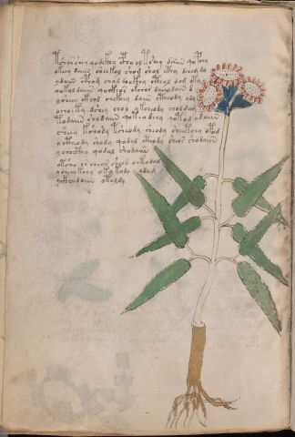

# Voynich Speculative Herbal Ferment Recipe — f53v

IMPORTANT: this is NOT a real or validated translation of the Voynich Manuscript. It is a speculative/procedural model that interprets EVA using a user-defined grammar to generate experimental recipes using safe, known edible substitutes.

This file is generated automatically from IVTFF/EVA transliteration plus a user-defined procedural grammar.



## Page / Folio
- currier: A
- folio: f53v
- page_number: 104
- section: herbal

## EVA Text (Transliteration)
```text
tshor shey qodckhy epho oltshey daiin qopchy
okeey daiin sheekol shom shol cthy dchom do
ydaiin cph[o:a]m chol dockhy cthol dam oty
qokol daiiin qockhor okchor daiio dain d
ysheey ckhol chckhey daiin ctheody ydy
ochoiky dshey chol ykcheody choldam
todaiin shodaiin qote[a:o] dchy qotod odaiin
sheey kshody tsheody sheody sheetchy opod
octheody shody qodal cthody sheos shodaiin
ychocthy qodal shodaiin
otsho or chear sheod chkodal
ycheey kchy oky kody ydam
yckhodaiin otoldy
```

## Domain Context (Heuristic; Not a Translation)

This section summarizes recurring **basewords** in this IVTFF domain and shows simple substring evidence that the token markers used by the procedural grammar occur inside frequent words.

Any Italian anagram / English gloss is a best-effort lexicon match, not a decipherment.


### Associated basewords (non-generic; top by frequency in this domain)
- `daiin` (count=461) → Italian anagram `piani`; English: plans (arrangements)
- `okaiin` (count=59) → Italian anagram `coniai`; English: [n/a]
- `chaiin` (count=39) → Italian anagram `acini`; English: [n/a]
- `saiin` (count=37) → Italian anagram `asini`; English: [n/a]
- `qokaiin` (count=34) → Italian anagram `ciancio`; English: [n/a]
- `qokar` (count=29) → Italian anagram `carco`; English: [n/a]
- `odaiin` (count=27) → Italian anagram `inopia`; English: poverty
- `otchol` (count=25) → Italian anagram `colto`; English: cultivated
- `kaiin` (count=24) → Italian anagram `acini`; English: [n/a]
- `chodaiin` (count=24) → Italian anagram `apocini`; English: [n/a]
- `qotol` (count=20) → Italian anagram `colto`; English: cultivated
- `okain` (count=19) → Italian anagram `acino`; English: a berry
- `qotor` (count=18) → Italian anagram `corto`; English: short
- `ykaiin` (count=16) → Italian anagram `acini`; English: [n/a]
- `qodaiin` (count=15) → Italian anagram `apocini`; English: [n/a]

### Marker evidence (substring in frequent basewords)
- `qo`: 57 basewords; examples: `qotchy`, `qokchy`, `qokedy`, `qokaiin`, `qoky`, `qokol`
- `q`: 58 basewords; examples: `qotchy`, `qokchy`, `qokedy`, `qokaiin`, `qoky`, `qokol`
- `o`: 252 basewords; examples: `chol`, `o`, `chor`, `or`, `shol`, `ol`
- `k`: 142 basewords; examples: `okaiin`, `oky`, `chckhy`, `qokchy`, `qokedy`, `okal`
- `t`: 102 basewords; examples: `cthy`, `oty`, `qotchy`, `cthol`, `cthor`, `otaiin`
- `p`: 15 basewords; examples: `cphy`, `ypchedy`, `opchy`, `opchey`, `pchor`, `qopchy`
- `ch`: 138 basewords; examples: `chol`, `chor`, `chy`, `chey`, `chedy`, `chdy`
- `sh`: 46 basewords; examples: `shol`, `sho`, `shy`, `shor`, `shey`, `shedy`
- `f`: 1 basewords; examples: `f`
- `cth`: 17 basewords; examples: `cthy`, `cthol`, `cthor`, `cthey`, `chcthy`, `ctho`
- `ckh`: 15 basewords; examples: `chckhy`, `ckhy`, `ckhol`, `ckhey`, `checkhy`, `shckhy`
- `cph`: 2 basewords; examples: `cphy`, `cphol`
- `dy`: 78 basewords; examples: `dy`, `chedy`, `chdy`, `chody`, `qokedy`, `shedy`
- `iin`: 39 basewords; examples: `daiin`, `aiin`, `okaiin`, `chaiin`, `saiin`, `qokaiin`
- `aiin`: 32 basewords; examples: `daiin`, `aiin`, `okaiin`, `chaiin`, `saiin`, `qokaiin`

## Recipes Index (This Page)
- [f53v.1,@P0](#f53v-1-f53v-1-p0)
- [f53v.2,+P0](#f53v-2-f53v-2-p0)
- [f53v.3,+P0](#f53v-3-f53v-3-p0)
- [f53v.4,+P0](#f53v-4-f53v-4-p0)
- [f53v.5,+P0](#f53v-5-f53v-5-p0)
- [f53v.6,+P0](#f53v-6-f53v-6-p0)
- [f53v.7,+P0](#f53v-7-f53v-7-p0)
- [f53v.8,+P0](#f53v-8-f53v-8-p0)
- [f53v.9,+P0](#f53v-9-f53v-9-p0)
- [f53v.10,+P0](#f53v-10-f53v-10-p0)
- [f53v.11,+P0](#f53v-11-f53v-11-p0)
- [f53v.12,+P0](#f53v-12-f53v-12-p0)
- [f53v.13,+P0](#f53v-13-f53v-13-p0)

## Line Glosses (Procedural Gloss Only; Not a Translation)

<a id="f53v-1-f53v-1-p0"></a>

### f53v.1,@P0

EVA: tshor shey qodckhy epho oltshey daiin qopchy

Direct Gloss (Procedural, Not a Real Translation):
- tshor: apply heat/cooking → add secondary herb (safe substitute) → mix / transfer
- shey: add secondary herb (safe substitute) → duration level 1 → state: active extraction
- qodckhy: prepare liquid base → start fermentation (yeast) → add complex herbal compound (safe blend)
- epho: mix / transfer → start fermentation (yeast) → duration level 1 → state: active extraction
- oltshey: apply heat/cooking → add secondary herb (safe substitute) → mix / transfer → duration level 1 → state: active extraction
- daiin: start fermentation (yeast) → duration level 1 → state: fermentation start → long fermentation / aging phase
- qopchy: prepare liquid base → add main plant (safe substitute) → start fermentation (yeast)

<a id="f53v-2-f53v-2-p0"></a>

### f53v.2,+P0

EVA: okeey daiin sheekol shom shol cthy dchom do

Direct Gloss (Procedural, Not a Real Translation):
- okeey: add fermentable sugars → mix / transfer → duration level 2 → state: active extraction
- daiin: start fermentation (yeast) → duration level 1 → state: fermentation start → long fermentation / aging phase
- sheekol: add fermentable sugars → add secondary herb (safe substitute) → mix / transfer → duration level 2 → state: active extraction
- shom: add secondary herb (safe substitute) → mix / transfer
- shol: add secondary herb (safe substitute) → mix / transfer
- cthy: add complex herbal compound (safe blend)
- dchom: add main plant (safe substitute) → mix / transfer → start fermentation (yeast)
- do: mix / transfer → start fermentation (yeast)

<a id="f53v-3-f53v-3-p0"></a>

### f53v.3,+P0

EVA: ydaiin cph[o:a]m chol dockhy cthol dam oty

Direct Gloss (Procedural, Not a Real Translation):
- ydaiin: start fermentation (yeast) → duration level 1 → state: fermentation start → long fermentation / aging phase
- cph: add complex herbal compound (safe blend)
- o: mix / transfer
- a: duration level 1 → state: fermentation start
- m: [unparsed]
- chol: add main plant (safe substitute) → mix / transfer
- dockhy: mix / transfer → start fermentation (yeast) → add complex herbal compound (safe blend)
- cthol: mix / transfer → add complex herbal compound (safe blend)
- dam: start fermentation (yeast) → duration level 1 → state: fermentation start
- oty: apply heat/cooking → mix / transfer

<a id="f53v-4-f53v-4-p0"></a>

### f53v.4,+P0

EVA: qokol daiiin qockhor okchor daiio dain d

Direct Gloss (Procedural, Not a Real Translation):
- qokol: prepare liquid base → add fermentable sugars → mix / transfer
- daiiin: start fermentation (yeast) → duration level 1 → state: fermentation start → medium fermentation phase
- qockhor: prepare liquid base → mix / transfer → add complex herbal compound (safe blend)
- okchor: add fermentable sugars → add main plant (safe substitute) → mix / transfer
- daiio: mix / transfer → start fermentation (yeast) → duration level 1 → state: fermentation start
- dain: start fermentation (yeast) → duration level 1 → state: fermentation start
- d: start fermentation (yeast)

<a id="f53v-5-f53v-5-p0"></a>

### f53v.5,+P0

EVA: ysheey ckhol chckhey daiin ctheody ydy

Direct Gloss (Procedural, Not a Real Translation):
- ysheey: add secondary herb (safe substitute) → duration level 2 → state: active extraction
- ckhol: mix / transfer → add complex herbal compound (safe blend)
- chckhey: add main plant (safe substitute) → add complex herbal compound (safe blend) → duration level 1 → state: active extraction
- daiin: start fermentation (yeast) → duration level 1 → state: fermentation start → long fermentation / aging phase
- ctheody: mix / transfer → start fermentation (yeast) → add complex herbal compound (safe blend) → duration level 1 → state: active extraction
- ydy: start fermentation (yeast)

<a id="f53v-6-f53v-6-p0"></a>

### f53v.6,+P0

EVA: ochoiky dshey chol ykcheody choldam

Direct Gloss (Procedural, Not a Real Translation):
- ochoiky: add fermentable sugars → add main plant (safe substitute) → mix / transfer → duration level 1 → state: cooling/rest
- dshey: add secondary herb (safe substitute) → start fermentation (yeast) → duration level 1 → state: active extraction
- chol: add main plant (safe substitute) → mix / transfer
- ykcheody: add fermentable sugars → add main plant (safe substitute) → mix / transfer → start fermentation (yeast) → duration level 1 → state: active extraction
- choldam: add main plant (safe substitute) → mix / transfer → start fermentation (yeast) → duration level 1 → state: fermentation start

<a id="f53v-7-f53v-7-p0"></a>

### f53v.7,+P0

EVA: todaiin shodaiin qote[a:o] dchy qotod odaiin

Direct Gloss (Procedural, Not a Real Translation):
- todaiin: apply heat/cooking → mix / transfer → start fermentation (yeast) → duration level 1 → state: fermentation start → long fermentation / aging phase
- shodaiin: add secondary herb (safe substitute) → mix / transfer → start fermentation (yeast) → duration level 1 → state: fermentation start → long fermentation / aging phase
- qote: prepare liquid base → apply heat/cooking → duration level 1 → state: active extraction
- a: duration level 1 → state: fermentation start
- o: mix / transfer
- dchy: add main plant (safe substitute) → start fermentation (yeast)
- qotod: prepare liquid base → apply heat/cooking → mix / transfer → start fermentation (yeast)
- odaiin: mix / transfer → start fermentation (yeast) → duration level 1 → state: fermentation start → long fermentation / aging phase

<a id="f53v-8-f53v-8-p0"></a>

### f53v.8,+P0

EVA: sheey kshody tsheody sheody sheetchy opod

Direct Gloss (Procedural, Not a Real Translation):
- sheey: add secondary herb (safe substitute) → duration level 2 → state: active extraction
- kshody: add fermentable sugars → add secondary herb (safe substitute) → mix / transfer → start fermentation (yeast)
- tsheody: apply heat/cooking → add secondary herb (safe substitute) → mix / transfer → start fermentation (yeast) → duration level 1 → state: active extraction
- sheody: add secondary herb (safe substitute) → mix / transfer → start fermentation (yeast) → duration level 1 → state: active extraction
- sheetchy: apply heat/cooking → add main plant (safe substitute) → add secondary herb (safe substitute) → duration level 2 → state: active extraction
- opod: mix / transfer → start fermentation (yeast)

<a id="f53v-9-f53v-9-p0"></a>

### f53v.9,+P0

EVA: octheody shody qodal cthody sheos shodaiin

Direct Gloss (Procedural, Not a Real Translation):
- octheody: mix / transfer → start fermentation (yeast) → add complex herbal compound (safe blend) → duration level 1 → state: active extraction
- shody: add secondary herb (safe substitute) → mix / transfer → start fermentation (yeast)
- qodal: prepare liquid base → start fermentation (yeast) → duration level 1 → state: fermentation start
- cthody: mix / transfer → start fermentation (yeast) → add complex herbal compound (safe blend)
- sheos: add secondary herb (safe substitute) → mix / transfer → duration level 1 → state: active extraction
- shodaiin: add secondary herb (safe substitute) → mix / transfer → start fermentation (yeast) → duration level 1 → state: fermentation start → long fermentation / aging phase

<a id="f53v-10-f53v-10-p0"></a>

### f53v.10,+P0

EVA: ychocthy qodal shodaiin

Direct Gloss (Procedural, Not a Real Translation):
- ychocthy: add main plant (safe substitute) → mix / transfer → add complex herbal compound (safe blend)
- qodal: prepare liquid base → start fermentation (yeast) → duration level 1 → state: fermentation start
- shodaiin: add secondary herb (safe substitute) → mix / transfer → start fermentation (yeast) → duration level 1 → state: fermentation start → long fermentation / aging phase

<a id="f53v-11-f53v-11-p0"></a>

### f53v.11,+P0

EVA: otsho or chear sheod chkodal

Direct Gloss (Procedural, Not a Real Translation):
- otsho: apply heat/cooking → add secondary herb (safe substitute) → mix / transfer
- or: mix / transfer
- chear: add main plant (safe substitute) → duration level 1 → state: active extraction
- sheod: add secondary herb (safe substitute) → mix / transfer → start fermentation (yeast) → duration level 1 → state: active extraction
- chkodal: add fermentable sugars → add main plant (safe substitute) → mix / transfer → start fermentation (yeast) → duration level 1 → state: fermentation start

<a id="f53v-12-f53v-12-p0"></a>

### f53v.12,+P0

EVA: ycheey kchy oky kody ydam

Direct Gloss (Procedural, Not a Real Translation):
- ycheey: add main plant (safe substitute) → duration level 2 → state: active extraction
- kchy: add fermentable sugars → add main plant (safe substitute)
- oky: add fermentable sugars → mix / transfer
- kody: add fermentable sugars → mix / transfer → start fermentation (yeast)
- ydam: start fermentation (yeast) → duration level 1 → state: fermentation start

<a id="f53v-13-f53v-13-p0"></a>

### f53v.13,+P0

EVA: yckhodaiin otoldy

Direct Gloss (Procedural, Not a Real Translation):
- yckhodaiin: mix / transfer → start fermentation (yeast) → add complex herbal compound (safe blend) → duration level 1 → state: fermentation start → long fermentation / aging phase
- otoldy: apply heat/cooking → mix / transfer → start fermentation (yeast)
