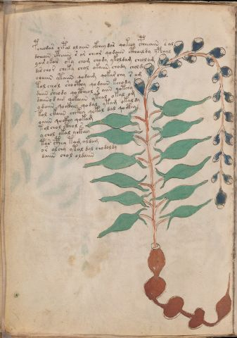

# Voynich Speculative Procedural Protocol — f54v

IMPORTANT: this is NOT a real or validated translation of the Voynich Manuscript. It is a speculative/procedural model that interprets EVA using a user-defined grammar to generate experimental recipes using safe, known edible substitutes.

This file is generated automatically from IVTFF/EVA transliteration plus a user-defined procedural grammar.



## Page / Folio
- currier: A
- folio: f54v
- page_number: 106
- section: herbal

## EVA Text (Transliteration)
```text
pcheodar chpal oloiin ckhey dar qokeey cpheeain s al
dcheain cphaiin s ar cheor qodaiin cthaildy ypchal
yair ykar oky cham chody ykoldam cheol am
dar chor cheky chol okaiin chody chol dy
o[d:?]aiin ytaiin qodaim qokar chy s am
tol cheol shocthy qodaiin k[ee:ch]ody
daiin sheody qoctheol s aiin qotchy
daiino d aim qokaiin yteal okal om
ydaiin qockhey qodal ytam okal dy
kol ckaiin chckhy qokal dal qocthy
oaiin qockhy qokam
tol chol cthol s
y chol okal yckhey
tar cphey tam aldam
or alchy ytal dol chodoldy
daiin chol oldaiin
```

## Domain Context (Heuristic; Not a Translation)

This section summarizes recurring **basewords** in this IVTFF domain and shows simple substring evidence that the token markers used by the procedural grammar occur inside frequent words.

Any Italian anagram / English gloss is a best-effort lexicon match, not a decipherment.


### Associated basewords (non-generic; top by frequency in this domain)
- `paiin` (count=477) → Italian anagram `piani`; English: plans (arrangements)
- `okaiin` (count=59) → Italian anagram `coniai`; English: [n/a]
- `qokep` (count=41) → Italian anagram `pecco`; English: [n/a]
- `saiin` (count=40) → Italian anagram `asini`; English: [n/a]
- `kaiin` (count=40) → Italian anagram `acini`; English: [n/a]
- `chaiin` (count=39) → Italian anagram `acini`; English: [n/a]
- `qokaiin` (count=34) → Italian anagram `ciancio`; English: [n/a]
- `qokar` (count=29) → Italian anagram `carco`; English: [n/a]
- `opaiin` (count=29) → Italian anagram `inopia`; English: poverty
- `otchol` (count=25) → Italian anagram `colto`; English: cultivated
- `chopaiin` (count=24) → Italian anagram `apocini`; English: [n/a]
- `qotol` (count=20) → Italian anagram `colto`; English: cultivated
- `okain` (count=19) → Italian anagram `acino`; English: a berry
- `qotor` (count=18) → Italian anagram `corto`; English: short
- `qopaiin` (count=15) → Italian anagram `apocini`; English: [n/a]

### Marker evidence (substring in frequent basewords)
- `qo`: 58 basewords; examples: `qotch`, `qok`, `qot`, `qokch`, `qokep`, `qokaiin`
- `q`: 59 basewords; examples: `qotch`, `qok`, `qot`, `qokch`, `qokep`, `qokaiin`
- `o`: 274 basewords; examples: `chol`, `o`, `chor`, `or`, `shol`, `ol`
- `k`: 146 basewords; examples: `ok`, `k`, `okaiin`, `kch`, `chckh`, `qok`
- `t`: 101 basewords; examples: `cth`, `ot`, `t`, `qotch`, `cthol`, `qot`
- `p`: 152 basewords; examples: `paiin`, `p`, `par`, `pain`, `pal`, `chep`
- `ch`: 145 basewords; examples: `chol`, `chor`, `ch`, `che`, `chep`, `cho`
- `sh`: 51 basewords; examples: `shol`, `sh`, `sho`, `shor`, `she`, `shep`
- `f`: 2 basewords; examples: `fchep`, `f`
- `cth`: 18 basewords; examples: `cth`, `cthol`, `cthor`, `cthe`, `chcth`, `ctho`
- `ckh`: 18 basewords; examples: `chckh`, `ckh`, `ckhe`, `ckhol`, `shckh`, `checkh`
- `cph`: 3 basewords; examples: `cph`, `cphol`, `cphe`
- `iin`: 39 basewords; examples: `paiin`, `aiin`, `okaiin`, `saiin`, `kaiin`, `chaiin`
- `aiin`: 31 basewords; examples: `paiin`, `aiin`, `okaiin`, `saiin`, `kaiin`, `chaiin`

## Recipes Index (This Page)
- [f54v.1,@P0](#f54v-1-f54v-1-p0)
- [f54v.2,+P0](#f54v-2-f54v-2-p0)
- [f54v.3,+P0](#f54v-3-f54v-3-p0)
- [f54v.4,+P0](#f54v-4-f54v-4-p0)
- [f54v.5,+P0](#f54v-5-f54v-5-p0)
- [f54v.6,+P0](#f54v-6-f54v-6-p0)
- [f54v.7,+P0](#f54v-7-f54v-7-p0)
- [f54v.8,+P0](#f54v-8-f54v-8-p0)
- [f54v.9,+P0](#f54v-9-f54v-9-p0)
- [f54v.10,+P0](#f54v-10-f54v-10-p0)
- [f54v.11,+P0](#f54v-11-f54v-11-p0)
- [f54v.12,+P0](#f54v-12-f54v-12-p0)
- [f54v.13,+P0](#f54v-13-f54v-13-p0)
- [f54v.14,+P0](#f54v-14-f54v-14-p0)
- [f54v.15,+P0](#f54v-15-f54v-15-p0)
- [f54v.16,+P0](#f54v-16-f54v-16-p0)

## Line Glosses (Procedural Gloss Only; Not a Translation)

<a id="f54v-1-f54v-1-p0"></a>

### f54v.1,@P0

EVA (original line):
```text
pcheodar chpal oloiin ckhey dar qokeey cpheeain s al
```

English structural gloss (generated):

- pcheodar: tokens: p ch e o p a r → connectors: r → vowel_run: e (level 1; class e)
- chpal: tokens: ch p a l → connectors: l → vowel_run: a (level 1; class a)
- oloiin: tokens: o l o iin → connectors: l → vowel_run: ii (level 2; class i) → suffix: iin
- ckhey: tokens: ckh e → vowel_run: e (level 1; class e)
- dar: tokens: p a r → connectors: r → vowel_run: a (level 1; class a)
- qokeey: tokens: qo k ee → vowel_run: ee (level 2; class e)
- cpheeain: tokens: cph ee a i n → connectors: n → vowel_run: ee (level 2; class e)
- s: tokens: s → connectors: s
- al: tokens: a l → connectors: l → vowel_run: a (level 1; class a)

<a id="f54v-2-f54v-2-p0"></a>

### f54v.2,+P0

EVA (original line):
```text
dcheain cphaiin s ar cheor qodaiin cthaildy ypchal
```

English structural gloss (generated):

- dcheain: tokens: p ch e a i n → connectors: n → vowel_run: e (level 1; class e)
- cphaiin: tokens: cph aiin → vowel_run: a (level 1; class a) → suffix: aiin
- s: tokens: s → connectors: s
- ar: tokens: a r → connectors: r → vowel_run: a (level 1; class a)
- cheor: tokens: ch e o r → connectors: r → vowel_run: e (level 1; class e)
- qodaiin: tokens: qo p aiin → vowel_run: a (level 1; class a) → suffix: aiin
- cthaildy: tokens: cth a i l p → connectors: l → vowel_run: a (level 1; class a)
- ypchal: tokens: p ch a l → connectors: l → vowel_run: a (level 1; class a)

<a id="f54v-3-f54v-3-p0"></a>

### f54v.3,+P0

EVA (original line):
```text
yair ykar oky cham chody ykoldam cheol am
```

English structural gloss (generated):

- yair: tokens: a i r → connectors: r → vowel_run: a (level 1; class a)
- ykar: tokens: k a r → connectors: r → vowel_run: a (level 1; class a)
- oky: tokens: o k
- cham: tokens: ch a m → connectors: m → vowel_run: a (level 1; class a)
- chody: tokens: ch o p
- ykoldam: tokens: k o l p a m → connectors: l m → vowel_run: a (level 1; class a)
- cheol: tokens: ch e o l → connectors: l → vowel_run: e (level 1; class e)
- am: tokens: a m → connectors: m → vowel_run: a (level 1; class a)

<a id="f54v-4-f54v-4-p0"></a>

### f54v.4,+P0

EVA (original line):
```text
dar chor cheky chol okaiin chody chol dy
```

English structural gloss (generated):

- dar: tokens: p a r → connectors: r → vowel_run: a (level 1; class a)
- chor: tokens: ch o r → connectors: r
- cheky: tokens: ch e k → vowel_run: e (level 1; class e)
- chol: tokens: ch o l → connectors: l
- okaiin: tokens: o k aiin → vowel_run: a (level 1; class a) → suffix: aiin (lexicon-context: `okaiin` → `coniai`; [n/a])
- chody: tokens: ch o p
- chol: tokens: ch o l → connectors: l
- dy: tokens: p

<a id="f54v-5-f54v-5-p0"></a>

### f54v.5,+P0

EVA (original line):
```text
o[d:?]aiin ytaiin qodaim qokar chy s am
```

English structural gloss (generated):

- o: tokens: o
- d: tokens: p
- aiin: tokens: aiin → vowel_run: a (level 1; class a) → suffix: aiin
- ytaiin: tokens: t aiin → vowel_run: a (level 1; class a) → suffix: aiin
- qodaim: tokens: qo p a i m → connectors: m → vowel_run: a (level 1; class a)
- qokar: tokens: qo k a r → connectors: r → vowel_run: a (level 1; class a)
- chy: tokens: ch
- s: tokens: s → connectors: s
- am: tokens: a m → connectors: m → vowel_run: a (level 1; class a)

<a id="f54v-6-f54v-6-p0"></a>

### f54v.6,+P0

EVA (original line):
```text
tol cheol shocthy qodaiin k[ee:ch]ody
```

English structural gloss (generated):

- tol: tokens: t o l → connectors: l
- cheol: tokens: ch e o l → connectors: l → vowel_run: e (level 1; class e)
- shocthy: tokens: sh o cth
- qodaiin: tokens: qo p aiin → vowel_run: a (level 1; class a) → suffix: aiin
- k: tokens: k
- ee: tokens: ee → vowel_run: ee (level 2; class e)
- ch: tokens: ch
- ody: tokens: o p

<a id="f54v-7-f54v-7-p0"></a>

### f54v.7,+P0

EVA (original line):
```text
daiin sheody qoctheol s aiin qotchy
```

English structural gloss (generated):

- daiin: tokens: p aiin → vowel_run: a (level 1; class a) → suffix: aiin (lexicon-context: `paiin` → `piani`; plans (arrangements))
- sheody: tokens: sh e o p → vowel_run: e (level 1; class e)
- qoctheol: tokens: qo cth e o l → connectors: l → vowel_run: e (level 1; class e)
- s: tokens: s → connectors: s
- aiin: tokens: aiin → vowel_run: a (level 1; class a) → suffix: aiin
- qotchy: tokens: qo t ch

<a id="f54v-8-f54v-8-p0"></a>

### f54v.8,+P0

EVA (original line):
```text
daiino d aim qokaiin yteal okal om
```

English structural gloss (generated):

- daiino: tokens: p aiin o → vowel_run: a (level 1; class a) → suffix: aiin (lexicon-context: `paiin` → `piani`; plans (arrangements))
- d: tokens: p
- aim: tokens: a i m → connectors: m → vowel_run: a (level 1; class a)
- qokaiin: tokens: qo k aiin → vowel_run: a (level 1; class a) → suffix: aiin (lexicon-context: `qokaiin` → `conciai`; [n/a])
- yteal: tokens: t e a l → connectors: l → vowel_run: e (level 1; class e)
- okal: tokens: o k a l → connectors: l → vowel_run: a (level 1; class a)
- om: tokens: o m → connectors: m

<a id="f54v-9-f54v-9-p0"></a>

### f54v.9,+P0

EVA (original line):
```text
ydaiin qockhey qodal ytam okal dy
```

English structural gloss (generated):

- ydaiin: tokens: p aiin → vowel_run: a (level 1; class a) → suffix: aiin (lexicon-context: `paiin` → `piani`; plans (arrangements))
- qockhey: tokens: qo ckh e → vowel_run: e (level 1; class e)
- qodal: tokens: qo p a l → connectors: l → vowel_run: a (level 1; class a)
- ytam: tokens: t a m → connectors: m → vowel_run: a (level 1; class a)
- okal: tokens: o k a l → connectors: l → vowel_run: a (level 1; class a)
- dy: tokens: p

<a id="f54v-10-f54v-10-p0"></a>

### f54v.10,+P0

EVA (original line):
```text
kol ckaiin chckhy qokal dal qocthy
```

English structural gloss (generated):

- kol: tokens: k o l → connectors: l
- ckaiin: tokens: c k aiin → vowel_run: a (level 1; class a) → suffix: aiin
- chckhy: tokens: ch ckh
- qokal: tokens: qo k a l → connectors: l → vowel_run: a (level 1; class a) (lexicon-context: `qokal` → `calco`; cast (of sculpture))
- dal: tokens: p a l → connectors: l → vowel_run: a (level 1; class a)
- qocthy: tokens: qo cth

<a id="f54v-11-f54v-11-p0"></a>

### f54v.11,+P0

EVA (original line):
```text
oaiin qockhy qokam
```

English structural gloss (generated):

- oaiin: tokens: o aiin → vowel_run: a (level 1; class a) → suffix: aiin
- qockhy: tokens: qo ckh
- qokam: tokens: qo k a m → connectors: m → vowel_run: a (level 1; class a)

<a id="f54v-12-f54v-12-p0"></a>

### f54v.12,+P0

EVA (original line):
```text
tol chol cthol s
```

English structural gloss (generated):

- tol: tokens: t o l → connectors: l
- chol: tokens: ch o l → connectors: l
- cthol: tokens: cth o l → connectors: l
- s: tokens: s → connectors: s

<a id="f54v-13-f54v-13-p0"></a>

### f54v.13,+P0

EVA (original line):
```text
y chol okal yckhey
```

English structural gloss (generated):

- y: [unparsed]
- chol: tokens: ch o l → connectors: l
- okal: tokens: o k a l → connectors: l → vowel_run: a (level 1; class a)
- yckhey: tokens: ckh e → vowel_run: e (level 1; class e)

<a id="f54v-14-f54v-14-p0"></a>

### f54v.14,+P0

EVA (original line):
```text
tar cphey tam aldam
```

English structural gloss (generated):

- tar: tokens: t a r → connectors: r → vowel_run: a (level 1; class a)
- cphey: tokens: cph e → vowel_run: e (level 1; class e)
- tam: tokens: t a m → connectors: m → vowel_run: a (level 1; class a)
- aldam: tokens: a l p a m → connectors: l m → vowel_run: a (level 1; class a)

<a id="f54v-15-f54v-15-p0"></a>

### f54v.15,+P0

EVA (original line):
```text
or alchy ytal dol chodoldy
```

English structural gloss (generated):

- or: tokens: o r → connectors: r
- alchy: tokens: a l ch → connectors: l → vowel_run: a (level 1; class a)
- ytal: tokens: t a l → connectors: l → vowel_run: a (level 1; class a)
- dol: tokens: p o l → connectors: l
- chodoldy: tokens: ch o p o l p → connectors: l

<a id="f54v-16-f54v-16-p0"></a>

### f54v.16,+P0

EVA (original line):
```text
daiin chol oldaiin
```

English structural gloss (generated):

- daiin: tokens: p aiin → vowel_run: a (level 1; class a) → suffix: aiin (lexicon-context: `paiin` → `piani`; plans (arrangements))
- chol: tokens: ch o l → connectors: l
- oldaiin: tokens: o l p aiin → connectors: l → vowel_run: a (level 1; class a) → suffix: aiin (lexicon-context: `paiin` → `piani`; plans (arrangements))
