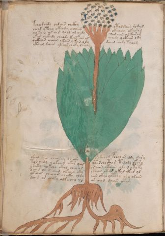

# Voynich Speculative Procedural Protocol — f55v

IMPORTANT: this is NOT a real or validated translation of the Voynich Manuscript. It is a speculative/procedural model that interprets EVA using a user-defined grammar to generate experimental recipes using safe, known edible substitutes.

This file is generated automatically from IVTFF/EVA transliteration plus a user-defined procedural grammar.



## Page / Folio
- currier: B
- folio: f55v
- page_number: 108
- section: herbal

## EVA Text (Transliteration)
```text
kcheedchdy oedain chckhy otoldaiin dodyd
oeeed yteey okeedy qoaiin okeody ykee[s:r]an
qokeeey os ain qool al chedy [s:?]ar aiin ol kar am
okar chckhdy che[o:a]dy keeyfar al ochedy qokain ody
qokaiin chaiin ykain ykan ody daiin chedy talam
ykaiin daiin ykair cheky daiiny
okchd yk[a:?]in [sh:ch]eokey or ain [ch:?] kchdy pchal ar aldy dary
tar chedy qokaiin okar qol otar cho@194;ar talody okar y
ykaky qokchy okal chey or or aiin okaiin ykain otaky
oaiin ol s aiin okaiin oky ytaiin otar y kal ykar ol
ykaiin cheoar cheeky oldy aiin okal oltchy or y orain
daiin [a:o]r cheky olkeechy sl ar aiin daiin otam
```

## Domain Context (Heuristic; Not a Translation)

This section summarizes recurring **basewords** in this IVTFF domain and shows simple substring evidence that the token markers used by the procedural grammar occur inside frequent words.

Any Italian anagram / English gloss is a best-effort lexicon match, not a decipherment.


### Associated basewords (non-generic; top by frequency in this domain)
- `paiin` (count=477) → Italian anagram `piani`; English: plans (arrangements)
- `okaiin` (count=59) → Italian anagram `coniai`; English: [n/a]
- `qokep` (count=41) → Italian anagram `pecco`; English: [n/a]
- `saiin` (count=40) → Italian anagram `asini`; English: [n/a]
- `kaiin` (count=40) → Italian anagram `acini`; English: [n/a]
- `chaiin` (count=39) → Italian anagram `acini`; English: [n/a]
- `qokaiin` (count=34) → Italian anagram `ciancio`; English: [n/a]
- `qokar` (count=29) → Italian anagram `carco`; English: [n/a]
- `opaiin` (count=29) → Italian anagram `inopia`; English: poverty
- `otchol` (count=25) → Italian anagram `colto`; English: cultivated
- `chopaiin` (count=24) → Italian anagram `apocini`; English: [n/a]
- `qotol` (count=20) → Italian anagram `colto`; English: cultivated
- `okain` (count=19) → Italian anagram `acino`; English: a berry
- `qotor` (count=18) → Italian anagram `corto`; English: short
- `qopaiin` (count=15) → Italian anagram `apocini`; English: [n/a]

### Marker evidence (substring in frequent basewords)
- `qo`: 58 basewords; examples: `qotch`, `qok`, `qot`, `qokch`, `qokep`, `qokaiin`
- `q`: 59 basewords; examples: `qotch`, `qok`, `qot`, `qokch`, `qokep`, `qokaiin`
- `o`: 274 basewords; examples: `chol`, `o`, `chor`, `or`, `shol`, `ol`
- `k`: 146 basewords; examples: `ok`, `k`, `okaiin`, `kch`, `chckh`, `qok`
- `t`: 101 basewords; examples: `cth`, `ot`, `t`, `qotch`, `cthol`, `qot`
- `p`: 152 basewords; examples: `paiin`, `p`, `par`, `pain`, `pal`, `chep`
- `ch`: 145 basewords; examples: `chol`, `chor`, `ch`, `che`, `chep`, `cho`
- `sh`: 51 basewords; examples: `shol`, `sh`, `sho`, `shor`, `she`, `shep`
- `f`: 2 basewords; examples: `fchep`, `f`
- `cth`: 18 basewords; examples: `cth`, `cthol`, `cthor`, `cthe`, `chcth`, `ctho`
- `ckh`: 18 basewords; examples: `chckh`, `ckh`, `ckhe`, `ckhol`, `shckh`, `checkh`
- `cph`: 3 basewords; examples: `cph`, `cphol`, `cphe`
- `iin`: 39 basewords; examples: `paiin`, `aiin`, `okaiin`, `saiin`, `kaiin`, `chaiin`
- `aiin`: 31 basewords; examples: `paiin`, `aiin`, `okaiin`, `saiin`, `kaiin`, `chaiin`

## Recipes Index (This Page)
- [f55v.1,@P0](#f55v-1-f55v-1-p0)
- [f55v.2,+P0](#f55v-2-f55v-2-p0)
- [f55v.3,+P0](#f55v-3-f55v-3-p0)
- [f55v.4,+P0](#f55v-4-f55v-4-p0)
- [f55v.5,+P0](#f55v-5-f55v-5-p0)
- [f55v.6,+P0](#f55v-6-f55v-6-p0)
- [f55v.7,+P0](#f55v-7-f55v-7-p0)
- [f55v.8,+P0](#f55v-8-f55v-8-p0)
- [f55v.9,+P0](#f55v-9-f55v-9-p0)
- [f55v.10,+P0](#f55v-10-f55v-10-p0)
- [f55v.11,+P0](#f55v-11-f55v-11-p0)
- [f55v.12,+P0](#f55v-12-f55v-12-p0)

## Line Glosses (Procedural Gloss Only; Not a Translation)

<a id="f55v-1-f55v-1-p0"></a>

### f55v.1,@P0

EVA: kcheedchdy oedain chckhy otoldaiin dodyd

Direct Gloss (Procedural, Not a Real Translation):
- kcheedchdy: tokens: k ch ee p ch p → vowel_run: ee (level 2; class e)
- oedain: tokens: o e p a i n → connectors: n → vowel_run: e (level 1; class e)
- chckhy: tokens: ch ckh
- otoldaiin: tokens: o t o l p aiin → connectors: l → vowel_run: a (level 1; class a) → suffix: aiin (lexicon-context: `paiin` → `piani`; plans (arrangements))
- dodyd: tokens: p o p p

<a id="f55v-2-f55v-2-p0"></a>

### f55v.2,+P0

EVA: oeeed yteey okeedy qoaiin okeody ykee[s:r]an

Direct Gloss (Procedural, Not a Real Translation):
- oeeed: tokens: o eee p → vowel_run: eee (level 3; class e)
- yteey: tokens: t ee → vowel_run: ee (level 2; class e)
- okeedy: tokens: o k ee p → vowel_run: ee (level 2; class e)
- qoaiin: tokens: qo aiin → vowel_run: a (level 1; class a) → suffix: aiin
- okeody: tokens: o k e o p → vowel_run: e (level 1; class e)
- ykee: tokens: k ee → vowel_run: ee (level 2; class e)
- s: tokens: s → connectors: s
- r: tokens: r → connectors: r
- an: tokens: a n → connectors: n → vowel_run: a (level 1; class a)

<a id="f55v-3-f55v-3-p0"></a>

### f55v.3,+P0

EVA: qokeeey os ain qool al chedy [s:?]ar aiin ol kar am

Direct Gloss (Procedural, Not a Real Translation):
- qokeeey: tokens: qo k eee → vowel_run: eee (level 3; class e)
- os: tokens: o s → connectors: s
- ain: tokens: a i n → connectors: n → vowel_run: a (level 1; class a)
- qool: tokens: qo o l → connectors: l
- al: tokens: a l → connectors: l → vowel_run: a (level 1; class a)
- chedy: tokens: ch e p → vowel_run: e (level 1; class e)
- s: tokens: s → connectors: s
- ar: tokens: a r → connectors: r → vowel_run: a (level 1; class a)
- aiin: tokens: aiin → vowel_run: a (level 1; class a) → suffix: aiin
- ol: tokens: o l → connectors: l
- kar: tokens: k a r → connectors: r → vowel_run: a (level 1; class a)
- am: tokens: a m → connectors: m → vowel_run: a (level 1; class a)

<a id="f55v-4-f55v-4-p0"></a>

### f55v.4,+P0

EVA: okar chckhdy che[o:a]dy keeyfar al ochedy qokain ody

Direct Gloss (Procedural, Not a Real Translation):
- okar: tokens: o k a r → connectors: r → vowel_run: a (level 1; class a)
- chckhdy: tokens: ch ckh p
- che: tokens: ch e → vowel_run: e (level 1; class e)
- o: tokens: o
- a: tokens: a → vowel_run: a (level 1; class a)
- dy: tokens: p
- keeyfar: tokens: k ee f a r → connectors: r → vowel_run: ee (level 2; class e)
- al: tokens: a l → connectors: l → vowel_run: a (level 1; class a)
- ochedy: tokens: o ch e p → vowel_run: e (level 1; class e)
- qokain: tokens: qo k a i n → connectors: n → vowel_run: a (level 1; class a) (lexicon-context: `okain` → `conia`; [n/a])
- ody: tokens: o p

<a id="f55v-5-f55v-5-p0"></a>

### f55v.5,+P0

EVA: qokaiin chaiin ykain ykan ody daiin chedy talam

Direct Gloss (Procedural, Not a Real Translation):
- qokaiin: tokens: qo k aiin → vowel_run: a (level 1; class a) → suffix: aiin (lexicon-context: `qokaiin` → `conciai`; [n/a])
- chaiin: tokens: ch aiin → vowel_run: a (level 1; class a) → suffix: aiin
- ykain: tokens: k a i n → connectors: n → vowel_run: a (level 1; class a)
- ykan: tokens: k a n → connectors: n → vowel_run: a (level 1; class a)
- ody: tokens: o p
- daiin: tokens: p aiin → vowel_run: a (level 1; class a) → suffix: aiin (lexicon-context: `paiin` → `piani`; plans (arrangements))
- chedy: tokens: ch e p → vowel_run: e (level 1; class e)
- talam: tokens: t a l a m → connectors: l m → vowel_run: a (level 1; class a)

<a id="f55v-6-f55v-6-p0"></a>

### f55v.6,+P0

EVA: ykaiin daiin ykair cheky daiiny

Direct Gloss (Procedural, Not a Real Translation):
- ykaiin: tokens: k aiin → vowel_run: a (level 1; class a) → suffix: aiin
- daiin: tokens: p aiin → vowel_run: a (level 1; class a) → suffix: aiin (lexicon-context: `paiin` → `piani`; plans (arrangements))
- ykair: tokens: k a i r → connectors: r → vowel_run: a (level 1; class a)
- cheky: tokens: ch e k → vowel_run: e (level 1; class e)
- daiiny: tokens: p aiin → vowel_run: a (level 1; class a) → suffix: aiin (lexicon-context: `paiin` → `piani`; plans (arrangements))

<a id="f55v-7-f55v-7-p0"></a>

### f55v.7,+P0

EVA: okchd yk[a:?]in [sh:ch]eokey or ain [ch:?] kchdy pchal ar aldy dary

Direct Gloss (Procedural, Not a Real Translation):
- okchd: tokens: o k ch p
- yk: tokens: k
- a: tokens: a → vowel_run: a (level 1; class a)
- in: tokens: i n → connectors: n → vowel_run: i (level 1; class i)
- sh: tokens: sh
- ch: tokens: ch
- eokey: tokens: e o k e → vowel_run: e (level 1; class e)
- or: tokens: o r → connectors: r
- ain: tokens: a i n → connectors: n → vowel_run: a (level 1; class a)
- ch: tokens: ch
- kchdy: tokens: k ch p
- pchal: tokens: p ch a l → connectors: l → vowel_run: a (level 1; class a)
- ar: tokens: a r → connectors: r → vowel_run: a (level 1; class a)
- aldy: tokens: a l p → connectors: l → vowel_run: a (level 1; class a)
- dary: tokens: p a r → connectors: r → vowel_run: a (level 1; class a)

<a id="f55v-8-f55v-8-p0"></a>

### f55v.8,+P0

EVA: tar chedy qokaiin okar qol otar cho@194;ar talody okar y

Direct Gloss (Procedural, Not a Real Translation):
- tar: tokens: t a r → connectors: r → vowel_run: a (level 1; class a)
- chedy: tokens: ch e p → vowel_run: e (level 1; class e)
- qokaiin: tokens: qo k aiin → vowel_run: a (level 1; class a) → suffix: aiin (lexicon-context: `qokaiin` → `conciai`; [n/a])
- okar: tokens: o k a r → connectors: r → vowel_run: a (level 1; class a)
- qol: tokens: qo l → connectors: l
- otar: tokens: o t a r → connectors: r → vowel_run: a (level 1; class a)
- cho: tokens: ch o
- ar: tokens: a r → connectors: r → vowel_run: a (level 1; class a)
- talody: tokens: t a l o p → connectors: l → vowel_run: a (level 1; class a)
- okar: tokens: o k a r → connectors: r → vowel_run: a (level 1; class a)
- y: [unparsed]

<a id="f55v-9-f55v-9-p0"></a>

### f55v.9,+P0

EVA: ykaky qokchy okal chey or or aiin okaiin ykain otaky

Direct Gloss (Procedural, Not a Real Translation):
- ykaky: tokens: k a k → vowel_run: a (level 1; class a)
- qokchy: tokens: qo k ch
- okal: tokens: o k a l → connectors: l → vowel_run: a (level 1; class a)
- chey: tokens: ch e → vowel_run: e (level 1; class e)
- or: tokens: o r → connectors: r
- or: tokens: o r → connectors: r
- aiin: tokens: aiin → vowel_run: a (level 1; class a) → suffix: aiin
- okaiin: tokens: o k aiin → vowel_run: a (level 1; class a) → suffix: aiin (lexicon-context: `okaiin` → `coniai`; [n/a])
- ykain: tokens: k a i n → connectors: n → vowel_run: a (level 1; class a)
- otaky: tokens: o t a k → vowel_run: a (level 1; class a)

<a id="f55v-10-f55v-10-p0"></a>

### f55v.10,+P0

EVA: oaiin ol s aiin okaiin oky ytaiin otar y kal ykar ol

Direct Gloss (Procedural, Not a Real Translation):
- oaiin: tokens: o aiin → vowel_run: a (level 1; class a) → suffix: aiin
- ol: tokens: o l → connectors: l
- s: tokens: s → connectors: s
- aiin: tokens: aiin → vowel_run: a (level 1; class a) → suffix: aiin
- okaiin: tokens: o k aiin → vowel_run: a (level 1; class a) → suffix: aiin (lexicon-context: `okaiin` → `coniai`; [n/a])
- oky: tokens: o k
- ytaiin: tokens: t aiin → vowel_run: a (level 1; class a) → suffix: aiin
- otar: tokens: o t a r → connectors: r → vowel_run: a (level 1; class a)
- y: [unparsed]
- kal: tokens: k a l → connectors: l → vowel_run: a (level 1; class a)
- ykar: tokens: k a r → connectors: r → vowel_run: a (level 1; class a)
- ol: tokens: o l → connectors: l

<a id="f55v-11-f55v-11-p0"></a>

### f55v.11,+P0

EVA: ykaiin cheoar cheeky oldy aiin okal oltchy or y orain

Direct Gloss (Procedural, Not a Real Translation):
- ykaiin: tokens: k aiin → vowel_run: a (level 1; class a) → suffix: aiin
- cheoar: tokens: ch e o a r → connectors: r → vowel_run: e (level 1; class e)
- cheeky: tokens: ch ee k → vowel_run: ee (level 2; class e)
- oldy: tokens: o l p → connectors: l
- aiin: tokens: aiin → vowel_run: a (level 1; class a) → suffix: aiin
- okal: tokens: o k a l → connectors: l → vowel_run: a (level 1; class a)
- oltchy: tokens: o l t ch → connectors: l
- or: tokens: o r → connectors: r
- y: [unparsed]
- orain: tokens: o r a i n → connectors: r n → vowel_run: a (level 1; class a)

<a id="f55v-12-f55v-12-p0"></a>

### f55v.12,+P0

EVA: daiin [a:o]r cheky olkeechy sl ar aiin daiin otam

Direct Gloss (Procedural, Not a Real Translation):
- daiin: tokens: p aiin → vowel_run: a (level 1; class a) → suffix: aiin (lexicon-context: `paiin` → `piani`; plans (arrangements))
- a: tokens: a → vowel_run: a (level 1; class a)
- o: tokens: o
- r: tokens: r → connectors: r
- cheky: tokens: ch e k → vowel_run: e (level 1; class e)
- olkeechy: tokens: o l k ee ch → connectors: l → vowel_run: ee (level 2; class e)
- sl: tokens: s l → connectors: s l
- ar: tokens: a r → connectors: r → vowel_run: a (level 1; class a)
- aiin: tokens: aiin → vowel_run: a (level 1; class a) → suffix: aiin
- daiin: tokens: p aiin → vowel_run: a (level 1; class a) → suffix: aiin (lexicon-context: `paiin` → `piani`; plans (arrangements))
- otam: tokens: o t a m → connectors: m → vowel_run: a (level 1; class a)
