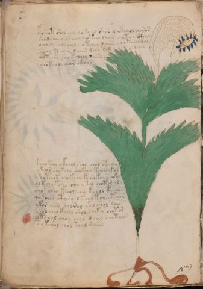

# Voynich Speculative Procedural Protocol — f56v

IMPORTANT: this is NOT a real or validated translation of the Voynich Manuscript. It is a speculative/procedural model that interprets EVA using a user-defined grammar to generate experimental recipes using safe, known edible substitutes.

This file is generated automatically from IVTFF/EVA transliteration plus a user-defined procedural grammar.



## Page / Folio
- currier: A
- folio: f56v
- page_number: 110
- section: herbal

## EVA Text (Transliteration)
```text
kche[a:o]t shol chey qokoiin shor qotcheol choror
shodshey qot[eee:ech]y qoteey daiin qoteey cthar
ochey chol chol qotchey daiin choteeey dal
schy t chey daiin d eey tad dain
qoteees sho kcheey s aiin
chokchol chor ckhos
kchokchy ckchol shol chol otchyd
ykchor chokchy qokcho tcheey kol
shotchot chokcho kcho kaiin oky
ol kchy ksho shy ytol chotor y dy
chotchey keeol chey kchol tchain
qokchey ctheey lkeey kcheeytain
ykor aiin chorol sho shol daiin
chol cheo kchol chol choky chotor
otchol chol chol daiin chotaiin
s o kchol chol chol daiin
```

## Domain Context (Heuristic; Not a Translation)

This section summarizes recurring **basewords** in this IVTFF domain and shows simple substring evidence that the token markers used by the procedural grammar occur inside frequent words.

Any Italian anagram / English gloss is a best-effort lexicon match, not a decipherment.


### Associated basewords (non-generic; top by frequency in this domain)
- `daiin` (count=461) → Italian anagram `piani`; English: plans (arrangements)
- `okaiin` (count=59) → Italian anagram `coniai`; English: [n/a]
- `chaiin` (count=39) → Italian anagram `acini`; English: [n/a]
- `saiin` (count=37) → Italian anagram `asini`; English: [n/a]
- `qokaiin` (count=34) → Italian anagram `ciancio`; English: [n/a]
- `qokar` (count=29) → Italian anagram `carco`; English: [n/a]
- `odaiin` (count=27) → Italian anagram `inopia`; English: poverty
- `otchol` (count=25) → Italian anagram `colto`; English: cultivated
- `kaiin` (count=24) → Italian anagram `acini`; English: [n/a]
- `chodaiin` (count=24) → Italian anagram `apocini`; English: [n/a]
- `qotol` (count=20) → Italian anagram `colto`; English: cultivated
- `okain` (count=19) → Italian anagram `acino`; English: a berry
- `qotor` (count=18) → Italian anagram `corto`; English: short
- `ykaiin` (count=16) → Italian anagram `acini`; English: [n/a]
- `qodaiin` (count=15) → Italian anagram `apocini`; English: [n/a]

### Marker evidence (substring in frequent basewords)
- `qo`: 57 basewords; examples: `qotchy`, `qokchy`, `qokedy`, `qokaiin`, `qoky`, `qokol`
- `q`: 58 basewords; examples: `qotchy`, `qokchy`, `qokedy`, `qokaiin`, `qoky`, `qokol`
- `o`: 252 basewords; examples: `chol`, `o`, `chor`, `or`, `shol`, `ol`
- `k`: 142 basewords; examples: `okaiin`, `oky`, `chckhy`, `qokchy`, `qokedy`, `okal`
- `t`: 102 basewords; examples: `cthy`, `oty`, `qotchy`, `cthol`, `cthor`, `otaiin`
- `p`: 15 basewords; examples: `cphy`, `ypchedy`, `opchy`, `opchey`, `pchor`, `qopchy`
- `ch`: 138 basewords; examples: `chol`, `chor`, `chy`, `chey`, `chedy`, `chdy`
- `sh`: 46 basewords; examples: `shol`, `sho`, `shy`, `shor`, `shey`, `shedy`
- `f`: 1 basewords; examples: `f`
- `cth`: 17 basewords; examples: `cthy`, `cthol`, `cthor`, `cthey`, `chcthy`, `ctho`
- `ckh`: 15 basewords; examples: `chckhy`, `ckhy`, `ckhol`, `ckhey`, `checkhy`, `shckhy`
- `cph`: 2 basewords; examples: `cphy`, `cphol`
- `dy`: 78 basewords; examples: `dy`, `chedy`, `chdy`, `chody`, `qokedy`, `shedy`
- `iin`: 39 basewords; examples: `daiin`, `aiin`, `okaiin`, `chaiin`, `saiin`, `qokaiin`
- `aiin`: 32 basewords; examples: `daiin`, `aiin`, `okaiin`, `chaiin`, `saiin`, `qokaiin`

## Recipes Index (This Page)
- [f56v.1,@P0](#f56v-1-f56v-1-p0)
- [f56v.2,+P0](#f56v-2-f56v-2-p0)
- [f56v.3,+P0](#f56v-3-f56v-3-p0)
- [f56v.4,+P0](#f56v-4-f56v-4-p0)
- [f56v.5,+P0](#f56v-5-f56v-5-p0)
- [f56v.6,+P0](#f56v-6-f56v-6-p0)
- [f56v.7,+P0](#f56v-7-f56v-7-p0)
- [f56v.8,+P0](#f56v-8-f56v-8-p0)
- [f56v.9,+P0](#f56v-9-f56v-9-p0)
- [f56v.10,+P0](#f56v-10-f56v-10-p0)
- [f56v.11,+P0](#f56v-11-f56v-11-p0)
- [f56v.12,+P0](#f56v-12-f56v-12-p0)
- [f56v.13,+P0](#f56v-13-f56v-13-p0)
- [f56v.14,+P0](#f56v-14-f56v-14-p0)
- [f56v.15,+P0](#f56v-15-f56v-15-p0)
- [f56v.16,+P0](#f56v-16-f56v-16-p0)

## Line Glosses (Procedural Gloss Only; Not a Translation)

<a id="f56v-1-f56v-1-p0"></a>

### f56v.1,@P0

EVA: kche[a:o]t shol chey qokoiin shor qotcheol choror

Direct Gloss (Procedural, Not a Real Translation):
- kche: tokens: k ch e → vowel_run: e (level 1; class e)
- a: tokens: a → vowel_run: a (level 1; class a)
- o: tokens: o
- t: tokens: t
- shol: tokens: sh o l → connectors: l
- chey: tokens: ch e → vowel_run: e (level 1; class e)
- qokoiin: tokens: qo k o iin → vowel_run: ii (level 2; class i) → suffix: iin
- shor: tokens: sh o r → connectors: r
- qotcheol: tokens: qo t ch e o l → connectors: l → vowel_run: e (level 1; class e)
- choror: tokens: ch o r o r → connectors: r r

<a id="f56v-2-f56v-2-p0"></a>

### f56v.2,+P0

EVA: shodshey qot[eee:ech]y qoteey daiin qoteey cthar

Direct Gloss (Procedural, Not a Real Translation):
- shodshey: tokens: sh o p sh e → vowel_run: e (level 1; class e)
- qot: tokens: qo t
- eee: tokens: eee → vowel_run: eee (level 3; class e)
- ech: tokens: e ch → vowel_run: e (level 1; class e)
- y: [unparsed]
- qoteey: tokens: qo t ee → vowel_run: ee (level 2; class e)
- daiin: tokens: p aiin → vowel_run: a (level 1; class a) → suffix: aiin (lexicon-context: `daiin` → `piani`; plans (arrangements))
- qoteey: tokens: qo t ee → vowel_run: ee (level 2; class e)
- cthar: tokens: cth a r → connectors: r → vowel_run: a (level 1; class a)

<a id="f56v-3-f56v-3-p0"></a>

### f56v.3,+P0

EVA: ochey chol chol qotchey daiin choteeey dal

Direct Gloss (Procedural, Not a Real Translation):
- ochey: tokens: o ch e → vowel_run: e (level 1; class e)
- chol: tokens: ch o l → connectors: l
- chol: tokens: ch o l → connectors: l
- qotchey: tokens: qo t ch e → vowel_run: e (level 1; class e)
- daiin: tokens: p aiin → vowel_run: a (level 1; class a) → suffix: aiin (lexicon-context: `daiin` → `piani`; plans (arrangements))
- choteeey: tokens: ch o t eee → vowel_run: eee (level 3; class e)
- dal: tokens: p a l → connectors: l → vowel_run: a (level 1; class a)

<a id="f56v-4-f56v-4-p0"></a>

### f56v.4,+P0

EVA: schy t chey daiin d eey tad dain

Direct Gloss (Procedural, Not a Real Translation):
- schy: tokens: s ch → connectors: s
- t: tokens: t
- chey: tokens: ch e → vowel_run: e (level 1; class e)
- daiin: tokens: p aiin → vowel_run: a (level 1; class a) → suffix: aiin (lexicon-context: `daiin` → `piani`; plans (arrangements))
- d: tokens: p
- eey: tokens: ee → vowel_run: ee (level 2; class e)
- tad: tokens: t a p → vowel_run: a (level 1; class a)
- dain: tokens: p a i n → connectors: n → vowel_run: a (level 1; class a)

<a id="f56v-5-f56v-5-p0"></a>

### f56v.5,+P0

EVA: qoteees sho kcheey s aiin

Direct Gloss (Procedural, Not a Real Translation):
- qoteees: tokens: qo t eee s → connectors: s → vowel_run: eee (level 3; class e)
- sho: tokens: sh o
- kcheey: tokens: k ch ee → vowel_run: ee (level 2; class e)
- s: tokens: s → connectors: s
- aiin: tokens: aiin → vowel_run: a (level 1; class a) → suffix: aiin

<a id="f56v-6-f56v-6-p0"></a>

### f56v.6,+P0

EVA: chokchol chor ckhos

Direct Gloss (Procedural, Not a Real Translation):
- chokchol: tokens: ch o k ch o l → connectors: l
- chor: tokens: ch o r → connectors: r
- ckhos: tokens: ckh o s → connectors: s

<a id="f56v-7-f56v-7-p0"></a>

### f56v.7,+P0

EVA: kchokchy ckchol shol chol otchyd

Direct Gloss (Procedural, Not a Real Translation):
- kchokchy: tokens: k ch o k ch
- ckchol: tokens: c k ch o l → connectors: l
- shol: tokens: sh o l → connectors: l
- chol: tokens: ch o l → connectors: l
- otchyd: tokens: o t ch p

<a id="f56v-8-f56v-8-p0"></a>

### f56v.8,+P0

EVA: ykchor chokchy qokcho tcheey kol

Direct Gloss (Procedural, Not a Real Translation):
- ykchor: tokens: k ch o r → connectors: r
- chokchy: tokens: ch o k ch
- qokcho: tokens: qo k ch o
- tcheey: tokens: t ch ee → vowel_run: ee (level 2; class e)
- kol: tokens: k o l → connectors: l

<a id="f56v-9-f56v-9-p0"></a>

### f56v.9,+P0

EVA: shotchot chokcho kcho kaiin oky

Direct Gloss (Procedural, Not a Real Translation):
- shotchot: tokens: sh o t ch o t
- chokcho: tokens: ch o k ch o
- kcho: tokens: k ch o
- kaiin: tokens: k aiin → vowel_run: a (level 1; class a) → suffix: aiin (lexicon-context: `kaiin` → `acini`; [n/a])
- oky: tokens: o k

<a id="f56v-10-f56v-10-p0"></a>

### f56v.10,+P0

EVA: ol kchy ksho shy ytol chotor y dy

Direct Gloss (Procedural, Not a Real Translation):
- ol: tokens: o l → connectors: l
- kchy: tokens: k ch
- ksho: tokens: k sh o
- shy: tokens: sh
- ytol: tokens: t o l → connectors: l
- chotor: tokens: ch o t o r → connectors: r
- y: [unparsed]
- dy: tokens: p

<a id="f56v-11-f56v-11-p0"></a>

### f56v.11,+P0

EVA: chotchey keeol chey kchol tchain

Direct Gloss (Procedural, Not a Real Translation):
- chotchey: tokens: ch o t ch e → vowel_run: e (level 1; class e)
- keeol: tokens: k ee o l → connectors: l → vowel_run: ee (level 2; class e)
- chey: tokens: ch e → vowel_run: e (level 1; class e)
- kchol: tokens: k ch o l → connectors: l
- tchain: tokens: t ch a i n → connectors: n → vowel_run: a (level 1; class a)

<a id="f56v-12-f56v-12-p0"></a>

### f56v.12,+P0

EVA: qokchey ctheey lkeey kcheeytain

Direct Gloss (Procedural, Not a Real Translation):
- qokchey: tokens: qo k ch e → vowel_run: e (level 1; class e)
- ctheey: tokens: cth ee → vowel_run: ee (level 2; class e)
- lkeey: tokens: l k ee → connectors: l → vowel_run: ee (level 2; class e)
- kcheeytain: tokens: k ch ee t a i n → connectors: n → vowel_run: ee (level 2; class e)

<a id="f56v-13-f56v-13-p0"></a>

### f56v.13,+P0

EVA: ykor aiin chorol sho shol daiin

Direct Gloss (Procedural, Not a Real Translation):
- ykor: tokens: k o r → connectors: r
- aiin: tokens: aiin → vowel_run: a (level 1; class a) → suffix: aiin
- chorol: tokens: ch o r o l → connectors: r l
- sho: tokens: sh o
- shol: tokens: sh o l → connectors: l
- daiin: tokens: p aiin → vowel_run: a (level 1; class a) → suffix: aiin (lexicon-context: `daiin` → `piani`; plans (arrangements))

<a id="f56v-14-f56v-14-p0"></a>

### f56v.14,+P0

EVA: chol cheo kchol chol choky chotor

Direct Gloss (Procedural, Not a Real Translation):
- chol: tokens: ch o l → connectors: l
- cheo: tokens: ch e o → vowel_run: e (level 1; class e)
- kchol: tokens: k ch o l → connectors: l
- chol: tokens: ch o l → connectors: l
- choky: tokens: ch o k
- chotor: tokens: ch o t o r → connectors: r

<a id="f56v-15-f56v-15-p0"></a>

### f56v.15,+P0

EVA: otchol chol chol daiin chotaiin

Direct Gloss (Procedural, Not a Real Translation):
- otchol: tokens: o t ch o l → connectors: l (lexicon-context: `otchol` → `colto`; cultivated)
- chol: tokens: ch o l → connectors: l
- chol: tokens: ch o l → connectors: l
- daiin: tokens: p aiin → vowel_run: a (level 1; class a) → suffix: aiin (lexicon-context: `daiin` → `piani`; plans (arrangements))
- chotaiin: tokens: ch o t aiin → vowel_run: a (level 1; class a) → suffix: aiin

<a id="f56v-16-f56v-16-p0"></a>

### f56v.16,+P0

EVA: s o kchol chol chol daiin

Direct Gloss (Procedural, Not a Real Translation):
- s: tokens: s → connectors: s
- o: tokens: o
- kchol: tokens: k ch o l → connectors: l
- chol: tokens: ch o l → connectors: l
- chol: tokens: ch o l → connectors: l
- daiin: tokens: p aiin → vowel_run: a (level 1; class a) → suffix: aiin (lexicon-context: `daiin` → `piani`; plans (arrangements))
