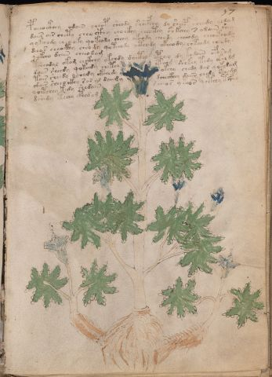

# Voynich Speculative Herbal Ferment Recipe — f57r

IMPORTANT: this is NOT a real or validated translation of the Voynich Manuscript. It is a speculative/procedural model that interprets EVA using a user-defined grammar to generate experimental recipes using safe, known edible substitutes.

This file is generated automatically from IVTFF/EVA transliteration plus a user-defined procedural grammar.



## Page / Folio
- currier: B
- folio: f57r
- page_number: 111
- section: herbal

## EVA Text (Transliteration)
```text
poeeockhey odain cheop sheody shocfhey dy sheep sheody [e:y]odam
daiir air chety cheo ckhy chockhy cheotey sh kchey s odaiin shey
qokeeody cheooky qokeody sheey okeody cheody cheeody cheekeody
dchos cheocthy cheody qot[ee:ch]ody octhody okeeody chteody cheody s
qok[ch:ee]o daiin cheeodam
tcheodal okam chckhey okchdy doctho opchey dy kedaiin oforam
daii[s:r] sheedy qokeedy chetey oteeod shekey tedy okaldg
tair sheedy ochedy ckhhhdy okchy chedy dal qokedam
[a:o]dair sheeo ckhy sar al daii[d:j]y dcheckhey daiin chedy cthedy
qoetchey kedy shedaiin s cheos ykeos qcthhy tcfhy
dshedy ctechy cphedam
```

## Recipes Index (This Page)
- [f57r.1,@P0](#f57r-1-f57r-1-p0)
- [f57r.2,+P0](#f57r-2-f57r-2-p0)
- [f57r.3,+P0](#f57r-3-f57r-3-p0)
- [f57r.4,+P0](#f57r-4-f57r-4-p0)
- [f57r.5,+P0](#f57r-5-f57r-5-p0)
- [f57r.6,+P0](#f57r-6-f57r-6-p0)
- [f57r.7,+P0](#f57r-7-f57r-7-p0)
- [f57r.8,+P0](#f57r-8-f57r-8-p0)
- [f57r.9,+P0](#f57r-9-f57r-9-p0)
- [f57r.10,+P0](#f57r-10-f57r-10-p0)
- [f57r.11,+P0](#f57r-11-f57r-11-p0)

## Line Glosses (Procedural Gloss Only; Not a Translation)

<a id="f57r-1-f57r-1-p0"></a>

### f57r.1,@P0

EVA: poeeockhey odain cheop sheody shocfhey dy sheep sheody [e:y]odam

Direct Gloss (Procedural, Not a Real Translation):
- poeeockhey: mix / transfer → start fermentation (yeast) → add complex herbal compound (safe blend) → duration level 2 → state: active extraction
- odain: mix / transfer → start fermentation (yeast) → duration level 1 → state: fermentation start
- cheop: add main plant (safe substitute) → mix / transfer → start fermentation (yeast) → duration level 1 → state: active extraction
- sheody: add secondary herb (safe substitute) → mix / transfer → start fermentation (yeast) → duration level 1 → state: active extraction
- shocfhey: add secondary herb (safe substitute) → mix / transfer → add complex herbal compound (safe blend) → duration level 1 → state: active extraction
- dy: start fermentation (yeast)
- sheep: add secondary herb (safe substitute) → start fermentation (yeast) → duration level 2 → state: active extraction
- sheody: add secondary herb (safe substitute) → mix / transfer → start fermentation (yeast) → duration level 1 → state: active extraction
- e: duration level 1 → state: active extraction
- y: [unparsed]
- odam: mix / transfer → start fermentation (yeast) → duration level 1 → state: fermentation start

<a id="f57r-2-f57r-2-p0"></a>

### f57r.2,+P0

EVA: daiir air chety cheo ckhy chockhy cheotey sh kchey s odaiin shey

Direct Gloss (Procedural, Not a Real Translation):
- daiir: start fermentation (yeast) → duration level 1 → state: fermentation start
- air: duration level 1 → state: fermentation start
- chety: apply heat/cooking → add main plant (safe substitute) → duration level 1 → state: active extraction
- cheo: add main plant (safe substitute) → mix / transfer → duration level 1 → state: active extraction
- ckhy: add complex herbal compound (safe blend)
- chockhy: add main plant (safe substitute) → mix / transfer → add complex herbal compound (safe blend)
- cheotey: apply heat/cooking → add main plant (safe substitute) → mix / transfer → duration level 1 → state: active extraction
- sh: add secondary herb (safe substitute)
- kchey: add fermentable sugars → add main plant (safe substitute) → duration level 1 → state: active extraction
- s: [unparsed]
- odaiin: mix / transfer → start fermentation (yeast) → duration level 1 → state: fermentation start → long fermentation / aging phase
- shey: add secondary herb (safe substitute) → duration level 1 → state: active extraction

<a id="f57r-3-f57r-3-p0"></a>

### f57r.3,+P0

EVA: qokeeody cheooky qokeody sheey okeody cheody cheeody cheekeody

Direct Gloss (Procedural, Not a Real Translation):
- qokeeody: prepare liquid base → add fermentable sugars → mix / transfer → start fermentation (yeast) → duration level 2 → state: active extraction
- cheooky: add fermentable sugars → add main plant (safe substitute) → mix / transfer → duration level 1 → state: active extraction
- qokeody: prepare liquid base → add fermentable sugars → mix / transfer → start fermentation (yeast) → duration level 1 → state: active extraction
- sheey: add secondary herb (safe substitute) → duration level 2 → state: active extraction
- okeody: add fermentable sugars → mix / transfer → start fermentation (yeast) → duration level 1 → state: active extraction
- cheody: add main plant (safe substitute) → mix / transfer → start fermentation (yeast) → duration level 1 → state: active extraction
- cheeody: add main plant (safe substitute) → mix / transfer → start fermentation (yeast) → duration level 2 → state: active extraction
- cheekeody: add fermentable sugars → add main plant (safe substitute) → mix / transfer → start fermentation (yeast) → duration level 2 → state: active extraction

<a id="f57r-4-f57r-4-p0"></a>

### f57r.4,+P0

EVA: dchos cheocthy cheody qot[ee:ch]ody octhody okeeody chteody cheody s

Direct Gloss (Procedural, Not a Real Translation):
- dchos: add main plant (safe substitute) → mix / transfer → start fermentation (yeast)
- cheocthy: add main plant (safe substitute) → mix / transfer → add complex herbal compound (safe blend) → duration level 1 → state: active extraction
- cheody: add main plant (safe substitute) → mix / transfer → start fermentation (yeast) → duration level 1 → state: active extraction
- qot: prepare liquid base → apply heat/cooking
- ee: duration level 2 → state: active extraction
- ch: add main plant (safe substitute)
- ody: mix / transfer → start fermentation (yeast)
- octhody: mix / transfer → start fermentation (yeast) → add complex herbal compound (safe blend)
- okeeody: add fermentable sugars → mix / transfer → start fermentation (yeast) → duration level 2 → state: active extraction
- chteody: apply heat/cooking → add main plant (safe substitute) → mix / transfer → start fermentation (yeast) → duration level 1 → state: active extraction
- cheody: add main plant (safe substitute) → mix / transfer → start fermentation (yeast) → duration level 1 → state: active extraction
- s: [unparsed]

<a id="f57r-5-f57r-5-p0"></a>

### f57r.5,+P0

EVA: qok[ch:ee]o daiin cheeodam

Direct Gloss (Procedural, Not a Real Translation):
- qok: prepare liquid base → add fermentable sugars
- ch: add main plant (safe substitute)
- ee: duration level 2 → state: active extraction
- o: mix / transfer
- daiin: start fermentation (yeast) → duration level 1 → state: fermentation start → long fermentation / aging phase
- cheeodam: add main plant (safe substitute) → mix / transfer → start fermentation (yeast) → duration level 2 → state: active extraction

<a id="f57r-6-f57r-6-p0"></a>

### f57r.6,+P0

EVA: tcheodal okam chckhey okchdy doctho opchey dy kedaiin oforam

Direct Gloss (Procedural, Not a Real Translation):
- tcheodal: apply heat/cooking → add main plant (safe substitute) → mix / transfer → start fermentation (yeast) → duration level 1 → state: active extraction
- okam: add fermentable sugars → mix / transfer → duration level 1 → state: fermentation start
- chckhey: add main plant (safe substitute) → add complex herbal compound (safe blend) → duration level 1 → state: active extraction
- okchdy: add fermentable sugars → add main plant (safe substitute) → mix / transfer → start fermentation (yeast)
- doctho: mix / transfer → start fermentation (yeast) → add complex herbal compound (safe blend)
- opchey: add main plant (safe substitute) → mix / transfer → start fermentation (yeast) → duration level 1 → state: active extraction
- dy: start fermentation (yeast)
- kedaiin: add fermentable sugars → start fermentation (yeast) → duration level 1 → state: active extraction → long fermentation / aging phase
- oforam: add aroma modifier → mix / transfer → duration level 1 → state: fermentation start

<a id="f57r-7-f57r-7-p0"></a>

### f57r.7,+P0

EVA: daii[s:r] sheedy qokeedy chetey oteeod shekey tedy okaldg

Direct Gloss (Procedural, Not a Real Translation):
- daii: start fermentation (yeast) → duration level 1 → state: fermentation start
- s: [unparsed]
- r: [unparsed]
- sheedy: add secondary herb (safe substitute) → start fermentation (yeast) → duration level 2 → state: active extraction
- qokeedy: prepare liquid base → add fermentable sugars → start fermentation (yeast) → duration level 2 → state: active extraction
- chetey: apply heat/cooking → add main plant (safe substitute) → duration level 1 → state: active extraction
- oteeod: apply heat/cooking → mix / transfer → start fermentation (yeast) → duration level 2 → state: active extraction
- shekey: add fermentable sugars → add secondary herb (safe substitute) → duration level 1 → state: active extraction
- tedy: apply heat/cooking → start fermentation (yeast) → duration level 1 → state: active extraction
- okaldg: add fermentable sugars → mix / transfer → start fermentation (yeast) → duration level 1 → state: fermentation start

<a id="f57r-8-f57r-8-p0"></a>

### f57r.8,+P0

EVA: tair sheedy ochedy ckhhhdy okchy chedy dal qokedam

Direct Gloss (Procedural, Not a Real Translation):
- tair: apply heat/cooking → duration level 1 → state: fermentation start
- sheedy: add secondary herb (safe substitute) → start fermentation (yeast) → duration level 2 → state: active extraction
- ochedy: add main plant (safe substitute) → mix / transfer → start fermentation (yeast) → duration level 1 → state: active extraction
- ckhhhdy: start fermentation (yeast) → add complex herbal compound (safe blend)
- okchy: add fermentable sugars → add main plant (safe substitute) → mix / transfer
- chedy: add main plant (safe substitute) → start fermentation (yeast) → duration level 1 → state: active extraction
- dal: start fermentation (yeast) → duration level 1 → state: fermentation start
- qokedam: prepare liquid base → add fermentable sugars → start fermentation (yeast) → duration level 1 → state: active extraction

<a id="f57r-9-f57r-9-p0"></a>

### f57r.9,+P0

EVA: [a:o]dair sheeo ckhy sar al daii[d:j]y dcheckhey daiin chedy cthedy

Direct Gloss (Procedural, Not a Real Translation):
- a: duration level 1 → state: fermentation start
- o: mix / transfer
- dair: start fermentation (yeast) → duration level 1 → state: fermentation start
- sheeo: add secondary herb (safe substitute) → mix / transfer → duration level 2 → state: active extraction
- ckhy: add complex herbal compound (safe blend)
- sar: duration level 1 → state: fermentation start
- al: duration level 1 → state: fermentation start
- daii: start fermentation (yeast) → duration level 1 → state: fermentation start
- d: start fermentation (yeast)
- j: [unparsed]
- y: [unparsed]
- dcheckhey: add main plant (safe substitute) → start fermentation (yeast) → add complex herbal compound (safe blend) → duration level 1 → state: active extraction
- daiin: start fermentation (yeast) → duration level 1 → state: fermentation start → long fermentation / aging phase
- chedy: add main plant (safe substitute) → start fermentation (yeast) → duration level 1 → state: active extraction
- cthedy: start fermentation (yeast) → add complex herbal compound (safe blend) → duration level 1 → state: active extraction

<a id="f57r-10-f57r-10-p0"></a>

### f57r.10,+P0

EVA: qoetchey kedy shedaiin s cheos ykeos qcthhy tcfhy

Direct Gloss (Procedural, Not a Real Translation):
- qoetchey: prepare liquid base → apply heat/cooking → add main plant (safe substitute) → duration level 1 → state: active extraction
- kedy: add fermentable sugars → start fermentation (yeast) → duration level 1 → state: active extraction
- shedaiin: add secondary herb (safe substitute) → start fermentation (yeast) → duration level 1 → state: active extraction → long fermentation / aging phase
- s: [unparsed]
- cheos: add main plant (safe substitute) → mix / transfer → duration level 1 → state: active extraction
- ykeos: add fermentable sugars → mix / transfer → duration level 1 → state: active extraction
- qcthhy: prepare base (generic) → add complex herbal compound (safe blend)
- tcfhy: apply heat/cooking → add complex herbal compound (safe blend)

<a id="f57r-11-f57r-11-p0"></a>

### f57r.11,+P0

EVA: dshedy ctechy cphedam

Direct Gloss (Procedural, Not a Real Translation):
- dshedy: add secondary herb (safe substitute) → start fermentation (yeast) → duration level 1 → state: active extraction
- ctechy: apply heat/cooking → add main plant (safe substitute) → duration level 1 → state: active extraction
- cphedam: start fermentation (yeast) → add complex herbal compound (safe blend) → duration level 1 → state: active extraction
