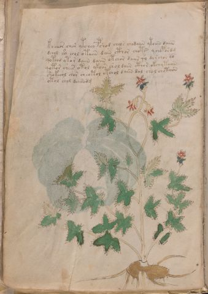

# Voynich Speculative Herbal Ferment Recipe — f5v

IMPORTANT: this is NOT a real or validated translation of the Voynich Manuscript. It is a speculative/procedural model that interprets EVA using a user-defined grammar to generate experimental recipes using safe, known edible substitutes.

This file is generated automatically from IVTFF/EVA transliteration plus a user-defined procedural grammar.



## Page / Folio
- currier: A
- folio: f5v
- page_number: 10
- section: herbal

## EVA Text (Transliteration)
```text
k o cheor chor ytchey pshod chols chodaiin ytoiiin daiin
dchol c'y chol otaiin dain cthor chots ychopordg
qotcho ytor daiin daiin otchor daiin q'o darchor do
qotor shees otol ykoiin shol daiin cthor okch y taiin
shokeeol chor cheotol otchol daiin dal chol chotaiin
otol chol dairodg
```

## Recipes Index (This Page)
- [f5v.1,@P0](#f5v-1-f5v-1-p0)
- [f5v.2,+P0](#f5v-2-f5v-2-p0)
- [f5v.3,+P0](#f5v-3-f5v-3-p0)
- [f5v.4,+P0](#f5v-4-f5v-4-p0)
- [f5v.5,+P0](#f5v-5-f5v-5-p0)
- [f5v.6,+P0](#f5v-6-f5v-6-p0)

## Line Glosses (Procedural Gloss Only; Not a Translation)

<a id="f5v-1-f5v-1-p0"></a>

### f5v.1,@P0

EVA: k o cheor chor ytchey pshod chols chodaiin ytoiiin daiin

Direct Gloss (Procedural, Not a Real Translation):
- k: add fermentable sugars
- o: mix / transfer
- cheor: add main plant (safe substitute) → mix / transfer → duration level 1 → state: active extraction
- chor: add main plant (safe substitute) → mix / transfer
- ytchey: apply heat/cooking → add main plant (safe substitute) → duration level 1 → state: active extraction
- pshod: add secondary herb (safe substitute) → mix / transfer → start fermentation (yeast)
- chols: add main plant (safe substitute) → mix / transfer
- chodaiin: add main plant (safe substitute) → mix / transfer → start fermentation (yeast) → duration level 1 → state: fermentation start → long fermentation / aging phase
- ytoiiin: apply heat/cooking → mix / transfer → duration level 3 → state: cooling/rest → medium fermentation phase
- daiin: start fermentation (yeast) → duration level 1 → state: fermentation start → long fermentation / aging phase

<a id="f5v-2-f5v-2-p0"></a>

### f5v.2,+P0

EVA: dchol c'y chol otaiin dain cthor chots ychopordg

Direct Gloss (Procedural, Not a Real Translation):
- dchol: add main plant (safe substitute) → mix / transfer → start fermentation (yeast)
- c: [unparsed]
- y: [unparsed]
- chol: add main plant (safe substitute) → mix / transfer
- otaiin: apply heat/cooking → mix / transfer → duration level 1 → state: fermentation start → long fermentation / aging phase
- dain: start fermentation (yeast) → duration level 1 → state: fermentation start
- cthor: mix / transfer → add complex herbal compound (safe blend)
- chots: apply heat/cooking → add main plant (safe substitute) → mix / transfer
- ychopordg: add main plant (safe substitute) → mix / transfer → start fermentation (yeast)

<a id="f5v-3-f5v-3-p0"></a>

### f5v.3,+P0

EVA: qotcho ytor daiin daiin otchor daiin q'o darchor do

Direct Gloss (Procedural, Not a Real Translation):
- qotcho: prepare liquid base → apply heat/cooking → add main plant (safe substitute) → mix / transfer
- ytor: apply heat/cooking → mix / transfer
- daiin: start fermentation (yeast) → duration level 1 → state: fermentation start → long fermentation / aging phase
- daiin: start fermentation (yeast) → duration level 1 → state: fermentation start → long fermentation / aging phase
- otchor: apply heat/cooking → add main plant (safe substitute) → mix / transfer
- daiin: start fermentation (yeast) → duration level 1 → state: fermentation start → long fermentation / aging phase
- q: prepare base (generic)
- o: mix / transfer
- darchor: add main plant (safe substitute) → mix / transfer → start fermentation (yeast) → duration level 1 → state: fermentation start
- do: mix / transfer → start fermentation (yeast)

<a id="f5v-4-f5v-4-p0"></a>

### f5v.4,+P0

EVA: qotor shees otol ykoiin shol daiin cthor okch y taiin

Direct Gloss (Procedural, Not a Real Translation):
- qotor: prepare liquid base → apply heat/cooking → mix / transfer
- shees: add secondary herb (safe substitute) → duration level 2 → state: active extraction
- otol: apply heat/cooking → mix / transfer
- ykoiin: add fermentable sugars → mix / transfer → duration level 2 → state: cooling/rest → medium fermentation phase
- shol: add secondary herb (safe substitute) → mix / transfer
- daiin: start fermentation (yeast) → duration level 1 → state: fermentation start → long fermentation / aging phase
- cthor: mix / transfer → add complex herbal compound (safe blend)
- okch: add fermentable sugars → add main plant (safe substitute) → mix / transfer
- y: [unparsed]
- taiin: apply heat/cooking → duration level 1 → state: fermentation start → long fermentation / aging phase

<a id="f5v-5-f5v-5-p0"></a>

### f5v.5,+P0

EVA: shokeeol chor cheotol otchol daiin dal chol chotaiin

Direct Gloss (Procedural, Not a Real Translation):
- shokeeol: add fermentable sugars → add secondary herb (safe substitute) → mix / transfer → duration level 2 → state: active extraction
- chor: add main plant (safe substitute) → mix / transfer
- cheotol: apply heat/cooking → add main plant (safe substitute) → mix / transfer → duration level 1 → state: active extraction
- otchol: apply heat/cooking → add main plant (safe substitute) → mix / transfer
- daiin: start fermentation (yeast) → duration level 1 → state: fermentation start → long fermentation / aging phase
- dal: start fermentation (yeast) → duration level 1 → state: fermentation start
- chol: add main plant (safe substitute) → mix / transfer
- chotaiin: apply heat/cooking → add main plant (safe substitute) → mix / transfer → duration level 1 → state: fermentation start → long fermentation / aging phase

<a id="f5v-6-f5v-6-p0"></a>

### f5v.6,+P0

EVA: otol chol dairodg

Direct Gloss (Procedural, Not a Real Translation):
- otol: apply heat/cooking → mix / transfer
- chol: add main plant (safe substitute) → mix / transfer
- dairodg: mix / transfer → start fermentation (yeast) → duration level 1 → state: fermentation start
