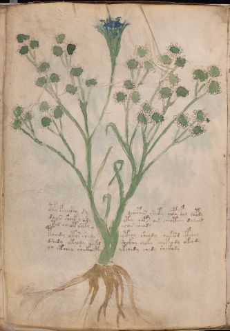

# Voynich Speculative Procedural Protocol — f65v

IMPORTANT: this is NOT a real or validated translation of the Voynich Manuscript. It is a speculative/procedural model that interprets EVA using a user-defined grammar to generate experimental recipes using safe, known edible substitutes.

This file is generated automatically from IVTFF/EVA transliteration plus a user-defined procedural grammar.



## Page / Folio
- folio: f65v
- page_number: 116
- section: herbal

## EVA Text (Transliteration)
```text
cphy fchecfhy dy dchepain shety qopy fol chpdy
daiin sheek l ody yteo qop[s:r] air cheot[ee:ch]y dal[o:a]m
ytal cheot shky y [s:?]as cheody
toeedy otar shedy yteey sheody qok[es:?]d yfchey
dshedy okeody qokd shckhy choky chokeody okey dy
qo ytchey sh ckhhcphy ykchedy chedy shckhdy
```

## Domain Context (Heuristic; Not a Translation)

This section summarizes recurring **basewords** in this IVTFF domain and shows simple substring evidence that the token markers used by the procedural grammar occur inside frequent words.

Any Italian anagram / English gloss is a best-effort lexicon match, not a decipherment.


### Associated basewords (non-generic; top by frequency in this domain)
- `paiin` (count=477) → Italian anagram `piani`; English: plans (arrangements)
- `okaiin` (count=59) → Italian anagram `coniai`; English: [n/a]
- `qokep` (count=41) → Italian anagram `pecco`; English: [n/a]
- `saiin` (count=40) → Italian anagram `asini`; English: [n/a]
- `kaiin` (count=40) → Italian anagram `acini`; English: [n/a]
- `chaiin` (count=39) → Italian anagram `acini`; English: [n/a]
- `qokaiin` (count=34) → Italian anagram `ciancio`; English: [n/a]
- `qokar` (count=29) → Italian anagram `carco`; English: [n/a]
- `opaiin` (count=29) → Italian anagram `inopia`; English: poverty
- `otchol` (count=25) → Italian anagram `colto`; English: cultivated
- `chopaiin` (count=24) → Italian anagram `apocini`; English: [n/a]
- `qotol` (count=20) → Italian anagram `colto`; English: cultivated
- `okain` (count=19) → Italian anagram `acino`; English: a berry
- `qotor` (count=18) → Italian anagram `corto`; English: short
- `qopaiin` (count=15) → Italian anagram `apocini`; English: [n/a]

### Marker evidence (substring in frequent basewords)
- `qo`: 58 basewords; examples: `qotch`, `qok`, `qot`, `qokch`, `qokep`, `qokaiin`
- `q`: 59 basewords; examples: `qotch`, `qok`, `qot`, `qokch`, `qokep`, `qokaiin`
- `o`: 274 basewords; examples: `chol`, `o`, `chor`, `or`, `shol`, `ol`
- `k`: 146 basewords; examples: `ok`, `k`, `okaiin`, `kch`, `chckh`, `qok`
- `t`: 101 basewords; examples: `cth`, `ot`, `t`, `qotch`, `cthol`, `qot`
- `p`: 152 basewords; examples: `paiin`, `p`, `par`, `pain`, `pal`, `chep`
- `ch`: 145 basewords; examples: `chol`, `chor`, `ch`, `che`, `chep`, `cho`
- `sh`: 51 basewords; examples: `shol`, `sh`, `sho`, `shor`, `she`, `shep`
- `f`: 2 basewords; examples: `fchep`, `f`
- `cth`: 18 basewords; examples: `cth`, `cthol`, `cthor`, `cthe`, `chcth`, `ctho`
- `ckh`: 18 basewords; examples: `chckh`, `ckh`, `ckhe`, `ckhol`, `shckh`, `checkh`
- `cph`: 3 basewords; examples: `cph`, `cphol`, `cphe`
- `iin`: 39 basewords; examples: `paiin`, `aiin`, `okaiin`, `saiin`, `kaiin`, `chaiin`
- `aiin`: 31 basewords; examples: `paiin`, `aiin`, `okaiin`, `saiin`, `kaiin`, `chaiin`

## Recipes Index (This Page)
- [f65v.1,@P0](#f65v-1-f65v-1-p0)
- [f65v.2,+P0](#f65v-2-f65v-2-p0)
- [f65v.3,+P0](#f65v-3-f65v-3-p0)
- [f65v.4,+P0](#f65v-4-f65v-4-p0)
- [f65v.5,+P0](#f65v-5-f65v-5-p0)
- [f65v.6,+P0](#f65v-6-f65v-6-p0)

## Line Glosses (Procedural Gloss Only; Not a Translation)

<a id="f65v-1-f65v-1-p0"></a>

### f65v.1,@P0

EVA (original line):
```text
cphy fchecfhy dy dchepain shety qopy fol chpdy
```

English structural gloss (generated):

- cphy: tokens: cph
- fchecfhy: tokens: f ch e cfh → vowel_run: e (level 1; class e)
- dy: tokens: p
- dchepain: tokens: p ch e p a i n → connectors: n → vowel_run: e (level 1; class e)
- shety: tokens: sh e t → vowel_run: e (level 1; class e)
- qopy: tokens: qo p
- fol: tokens: f o l → connectors: l
- chpdy: tokens: ch p p

<a id="f65v-2-f65v-2-p0"></a>

### f65v.2,+P0

EVA (original line):
```text
daiin sheek l ody yteo qop[s:r] air cheot[ee:ch]y dal[o:a]m
```

English structural gloss (generated):

- daiin: tokens: p aiin → vowel_run: a (level 1; class a) → suffix: aiin (lexicon-context: `paiin` → `piani`; plans (arrangements))
- sheek: tokens: sh ee k → vowel_run: ee (level 2; class e)
- l: tokens: l → connectors: l
- ody: tokens: o p
- yteo: tokens: t e o → vowel_run: e (level 1; class e)
- qop: tokens: qo p
- s: tokens: s → connectors: s
- r: tokens: r → connectors: r
- air: tokens: a i r → connectors: r → vowel_run: a (level 1; class a)
- cheot: tokens: ch e o t → vowel_run: e (level 1; class e)
- ee: tokens: ee → vowel_run: ee (level 2; class e)
- ch: tokens: ch
- y: [unparsed]
- dal: tokens: p a l → connectors: l → vowel_run: a (level 1; class a)
- o: tokens: o
- a: tokens: a → vowel_run: a (level 1; class a)
- m: tokens: m → connectors: m

<a id="f65v-3-f65v-3-p0"></a>

### f65v.3,+P0

EVA (original line):
```text
ytal cheot shky y [s:?]as cheody
```

English structural gloss (generated):

- ytal: tokens: t a l → connectors: l → vowel_run: a (level 1; class a)
- cheot: tokens: ch e o t → vowel_run: e (level 1; class e)
- shky: tokens: sh k
- y: [unparsed]
- s: tokens: s → connectors: s
- as: tokens: a s → connectors: s → vowel_run: a (level 1; class a)
- cheody: tokens: ch e o p → vowel_run: e (level 1; class e)

<a id="f65v-4-f65v-4-p0"></a>

### f65v.4,+P0

EVA (original line):
```text
toeedy otar shedy yteey sheody qok[es:?]d yfchey
```

English structural gloss (generated):

- toeedy: tokens: t o ee p → vowel_run: ee (level 2; class e)
- otar: tokens: o t a r → connectors: r → vowel_run: a (level 1; class a)
- shedy: tokens: sh e p → vowel_run: e (level 1; class e)
- yteey: tokens: t ee → vowel_run: ee (level 2; class e)
- sheody: tokens: sh e o p → vowel_run: e (level 1; class e)
- qok: tokens: qo k
- es: tokens: e s → connectors: s → vowel_run: e (level 1; class e)
- d: tokens: p
- yfchey: tokens: f ch e → vowel_run: e (level 1; class e)

<a id="f65v-5-f65v-5-p0"></a>

### f65v.5,+P0

EVA (original line):
```text
dshedy okeody qokd shckhy choky chokeody okey dy
```

English structural gloss (generated):

- dshedy: tokens: p sh e p → vowel_run: e (level 1; class e)
- okeody: tokens: o k e o p → vowel_run: e (level 1; class e)
- qokd: tokens: qo k p
- shckhy: tokens: sh ckh
- choky: tokens: ch o k
- chokeody: tokens: ch o k e o p → vowel_run: e (level 1; class e)
- okey: tokens: o k e → vowel_run: e (level 1; class e)
- dy: tokens: p

<a id="f65v-6-f65v-6-p0"></a>

### f65v.6,+P0

EVA (original line):
```text
qo ytchey sh ckhhcphy ykchedy chedy shckhdy
```

English structural gloss (generated):

- qo: tokens: qo
- ytchey: tokens: t ch e → vowel_run: e (level 1; class e)
- sh: tokens: sh
- ckhhcphy: tokens: ckh h cph → unmodeled_tokens: h
- ykchedy: tokens: k ch e p → vowel_run: e (level 1; class e)
- chedy: tokens: ch e p → vowel_run: e (level 1; class e)
- shckhdy: tokens: sh ckh p
