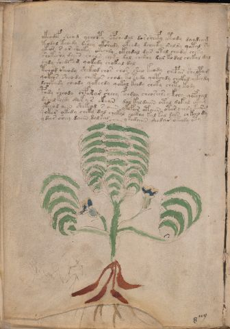

# Voynich Speculative Procedural Protocol — f66v

IMPORTANT: this is NOT a real or validated translation of the Voynich Manuscript. It is a speculative/procedural model that interprets EVA using a user-defined grammar to generate experimental recipes using safe, known edible substitutes.

This file is generated automatically from IVTFF/EVA transliteration plus a user-defined procedural grammar.



## Page / Folio
- currier: B
- folio: f66v
- page_number: 118
- section: herbal

## EVA Text (Transliteration)
```text
okeodof sheod ychoopy opch dal dor sheefy ytody da[l:?]deam
teodal t[che:chh]dy dshey okshedy okeedy dcheeky daldy qotal sy
ytos s or sheeky okechdy ok[ee:ch]dal dar otal chody cheky
shokeshy daiin cheos chety dol chckhy dal ko dal chekal dal
shdy shedefam qokedy chokal dal
tchod sheody shckhed chos chor sheo keody chepar sheopam
qokeos sheody chekeos chody kotody qotchdy chckhd ytchdy
dchekeedy cheody qokchdy qokol keedy cheky chety kody
pody sheody chpadar sheey fchdly cheoseesey kchy qofchal
dshal keedy qok [o:y]r okaiin dol kaldaiin otal dokal okag
yteeod aiin shekeod saiin ykofar otaiin otar ched[y:o] kar[c':s]
qekar okedy cheky dal chekal chckhy kal kal dar chk[ch:ee]ody
ydees shey daiin dalkal ykedaiin shedar ok[ch:ee]dy oty
```

## Domain Context (Heuristic; Not a Translation)

This section summarizes recurring **basewords** in this IVTFF domain and shows simple substring evidence that the token markers used by the procedural grammar occur inside frequent words.

Any Italian anagram / English gloss is a best-effort lexicon match, not a decipherment.


### Associated basewords (non-generic; top by frequency in this domain)
- `daiin` (count=461) → Italian anagram `piani`; English: plans (arrangements)
- `okaiin` (count=59) → Italian anagram `coniai`; English: [n/a]
- `chaiin` (count=39) → Italian anagram `acini`; English: [n/a]
- `saiin` (count=37) → Italian anagram `asini`; English: [n/a]
- `qokaiin` (count=34) → Italian anagram `ciancio`; English: [n/a]
- `qokar` (count=29) → Italian anagram `carco`; English: [n/a]
- `odaiin` (count=27) → Italian anagram `inopia`; English: poverty
- `otchol` (count=25) → Italian anagram `colto`; English: cultivated
- `kaiin` (count=24) → Italian anagram `acini`; English: [n/a]
- `chodaiin` (count=24) → Italian anagram `apocini`; English: [n/a]
- `qotol` (count=20) → Italian anagram `colto`; English: cultivated
- `okain` (count=19) → Italian anagram `acino`; English: a berry
- `qotor` (count=18) → Italian anagram `corto`; English: short
- `ykaiin` (count=16) → Italian anagram `acini`; English: [n/a]
- `qodaiin` (count=15) → Italian anagram `apocini`; English: [n/a]

### Marker evidence (substring in frequent basewords)
- `qo`: 57 basewords; examples: `qotchy`, `qokchy`, `qokedy`, `qokaiin`, `qoky`, `qokol`
- `q`: 58 basewords; examples: `qotchy`, `qokchy`, `qokedy`, `qokaiin`, `qoky`, `qokol`
- `o`: 252 basewords; examples: `chol`, `o`, `chor`, `or`, `shol`, `ol`
- `k`: 142 basewords; examples: `okaiin`, `oky`, `chckhy`, `qokchy`, `qokedy`, `okal`
- `t`: 102 basewords; examples: `cthy`, `oty`, `qotchy`, `cthol`, `cthor`, `otaiin`
- `p`: 15 basewords; examples: `cphy`, `ypchedy`, `opchy`, `opchey`, `pchor`, `qopchy`
- `ch`: 138 basewords; examples: `chol`, `chor`, `chy`, `chey`, `chedy`, `chdy`
- `sh`: 46 basewords; examples: `shol`, `sho`, `shy`, `shor`, `shey`, `shedy`
- `f`: 1 basewords; examples: `f`
- `cth`: 17 basewords; examples: `cthy`, `cthol`, `cthor`, `cthey`, `chcthy`, `ctho`
- `ckh`: 15 basewords; examples: `chckhy`, `ckhy`, `ckhol`, `ckhey`, `checkhy`, `shckhy`
- `cph`: 2 basewords; examples: `cphy`, `cphol`
- `dy`: 78 basewords; examples: `dy`, `chedy`, `chdy`, `chody`, `qokedy`, `shedy`
- `iin`: 39 basewords; examples: `daiin`, `aiin`, `okaiin`, `chaiin`, `saiin`, `qokaiin`
- `aiin`: 32 basewords; examples: `daiin`, `aiin`, `okaiin`, `chaiin`, `saiin`, `qokaiin`

## Recipes Index (This Page)
- [f66v.1,@P0](#f66v-1-f66v-1-p0)
- [f66v.2,+P0](#f66v-2-f66v-2-p0)
- [f66v.3,+P0](#f66v-3-f66v-3-p0)
- [f66v.4,+P0](#f66v-4-f66v-4-p0)
- [f66v.5,+P0](#f66v-5-f66v-5-p0)
- [f66v.6,+P0](#f66v-6-f66v-6-p0)
- [f66v.7,+P0](#f66v-7-f66v-7-p0)
- [f66v.8,+P0](#f66v-8-f66v-8-p0)
- [f66v.9,+P0](#f66v-9-f66v-9-p0)
- [f66v.10,+P0](#f66v-10-f66v-10-p0)
- [f66v.11,+P0](#f66v-11-f66v-11-p0)
- [f66v.12,+P0](#f66v-12-f66v-12-p0)
- [f66v.13,+P0](#f66v-13-f66v-13-p0)

## Line Glosses (Procedural Gloss Only; Not a Translation)

<a id="f66v-1-f66v-1-p0"></a>

### f66v.1,@P0

EVA: okeodof sheod ychoopy opch dal dor sheefy ytody da[l:?]deam

Direct Gloss (Procedural, Not a Real Translation):
- okeodof: tokens: o k e o p o f → vowel_run: e (level 1; class e)
- sheod: tokens: sh e o p → vowel_run: e (level 1; class e)
- ychoopy: tokens: ch o o p
- opch: tokens: o p ch
- dal: tokens: p a l → connectors: l → vowel_run: a (level 1; class a)
- dor: tokens: p o r → connectors: r
- sheefy: tokens: sh ee f → vowel_run: ee (level 2; class e)
- ytody: tokens: t o p
- da: tokens: p a → vowel_run: a (level 1; class a)
- l: tokens: l → connectors: l
- deam: tokens: p e a m → connectors: m → vowel_run: e (level 1; class e)

<a id="f66v-2-f66v-2-p0"></a>

### f66v.2,+P0

EVA: teodal t[che:chh]dy dshey okshedy okeedy dcheeky daldy qotal sy

Direct Gloss (Procedural, Not a Real Translation):
- teodal: tokens: t e o p a l → connectors: l → vowel_run: e (level 1; class e)
- t: tokens: t
- che: tokens: ch e → vowel_run: e (level 1; class e)
- chh: tokens: ch h → unmodeled_tokens: h
- dy: tokens: p
- dshey: tokens: p sh e → vowel_run: e (level 1; class e)
- okshedy: tokens: o k sh e p → vowel_run: e (level 1; class e)
- okeedy: tokens: o k ee p → vowel_run: ee (level 2; class e)
- dcheeky: tokens: p ch ee k → vowel_run: ee (level 2; class e)
- daldy: tokens: p a l p → connectors: l → vowel_run: a (level 1; class a)
- qotal: tokens: qo t a l → connectors: l → vowel_run: a (level 1; class a)
- sy: tokens: s → connectors: s

<a id="f66v-3-f66v-3-p0"></a>

### f66v.3,+P0

EVA: ytos s or sheeky okechdy ok[ee:ch]dal dar otal chody cheky

Direct Gloss (Procedural, Not a Real Translation):
- ytos: tokens: t o s → connectors: s
- s: tokens: s → connectors: s
- or: tokens: o r → connectors: r
- sheeky: tokens: sh ee k → vowel_run: ee (level 2; class e)
- okechdy: tokens: o k e ch p → vowel_run: e (level 1; class e)
- ok: tokens: o k
- ee: tokens: ee → vowel_run: ee (level 2; class e)
- ch: tokens: ch
- dal: tokens: p a l → connectors: l → vowel_run: a (level 1; class a)
- dar: tokens: p a r → connectors: r → vowel_run: a (level 1; class a)
- otal: tokens: o t a l → connectors: l → vowel_run: a (level 1; class a)
- chody: tokens: ch o p
- cheky: tokens: ch e k → vowel_run: e (level 1; class e)

<a id="f66v-4-f66v-4-p0"></a>

### f66v.4,+P0

EVA: shokeshy daiin cheos chety dol chckhy dal ko dal chekal dal

Direct Gloss (Procedural, Not a Real Translation):
- shokeshy: tokens: sh o k e sh → vowel_run: e (level 1; class e)
- daiin: tokens: p aiin → vowel_run: a (level 1; class a) → suffix: aiin
- cheos: tokens: ch e o s → connectors: s → vowel_run: e (level 1; class e)
- chety: tokens: ch e t → vowel_run: e (level 1; class e)
- dol: tokens: p o l → connectors: l
- chckhy: tokens: ch ckh
- dal: tokens: p a l → connectors: l → vowel_run: a (level 1; class a)
- ko: tokens: k o
- dal: tokens: p a l → connectors: l → vowel_run: a (level 1; class a)
- chekal: tokens: ch e k a l → connectors: l → vowel_run: e (level 1; class e)
- dal: tokens: p a l → connectors: l → vowel_run: a (level 1; class a)

<a id="f66v-5-f66v-5-p0"></a>

### f66v.5,+P0

EVA: shdy shedefam qokedy chokal dal

Direct Gloss (Procedural, Not a Real Translation):
- shdy: tokens: sh p
- shedefam: tokens: sh e p e f a m → connectors: m → vowel_run: e (level 1; class e)
- qokedy: tokens: qo k e p → vowel_run: e (level 1; class e)
- chokal: tokens: ch o k a l → connectors: l → vowel_run: a (level 1; class a)
- dal: tokens: p a l → connectors: l → vowel_run: a (level 1; class a)

<a id="f66v-6-f66v-6-p0"></a>

### f66v.6,+P0

EVA: tchod sheody shckhed chos chor sheo keody chepar sheopam

Direct Gloss (Procedural, Not a Real Translation):
- tchod: tokens: t ch o p
- sheody: tokens: sh e o p → vowel_run: e (level 1; class e)
- shckhed: tokens: sh ckh e p → vowel_run: e (level 1; class e)
- chos: tokens: ch o s → connectors: s
- chor: tokens: ch o r → connectors: r
- sheo: tokens: sh e o → vowel_run: e (level 1; class e)
- keody: tokens: k e o p → vowel_run: e (level 1; class e)
- chepar: tokens: ch e p a r → connectors: r → vowel_run: e (level 1; class e)
- sheopam: tokens: sh e o p a m → connectors: m → vowel_run: e (level 1; class e)

<a id="f66v-7-f66v-7-p0"></a>

### f66v.7,+P0

EVA: qokeos sheody chekeos chody kotody qotchdy chckhd ytchdy

Direct Gloss (Procedural, Not a Real Translation):
- qokeos: tokens: qo k e o s → connectors: s → vowel_run: e (level 1; class e)
- sheody: tokens: sh e o p → vowel_run: e (level 1; class e)
- chekeos: tokens: ch e k e o s → connectors: s → vowel_run: e (level 1; class e)
- chody: tokens: ch o p
- kotody: tokens: k o t o p
- qotchdy: tokens: qo t ch p
- chckhd: tokens: ch ckh p
- ytchdy: tokens: t ch p

<a id="f66v-8-f66v-8-p0"></a>

### f66v.8,+P0

EVA: dchekeedy cheody qokchdy qokol keedy cheky chety kody

Direct Gloss (Procedural, Not a Real Translation):
- dchekeedy: tokens: p ch e k ee p → vowel_run: e (level 1; class e)
- cheody: tokens: ch e o p → vowel_run: e (level 1; class e)
- qokchdy: tokens: qo k ch p
- qokol: tokens: qo k o l → connectors: l
- keedy: tokens: k ee p → vowel_run: ee (level 2; class e)
- cheky: tokens: ch e k → vowel_run: e (level 1; class e)
- chety: tokens: ch e t → vowel_run: e (level 1; class e)
- kody: tokens: k o p

<a id="f66v-9-f66v-9-p0"></a>

### f66v.9,+P0

EVA: pody sheody chpadar sheey fchdly cheoseesey kchy qofchal

Direct Gloss (Procedural, Not a Real Translation):
- pody: tokens: p o p
- sheody: tokens: sh e o p → vowel_run: e (level 1; class e)
- chpadar: tokens: ch p a p a r → connectors: r → vowel_run: a (level 1; class a)
- sheey: tokens: sh ee → vowel_run: ee (level 2; class e)
- fchdly: tokens: f ch p l → connectors: l
- cheoseesey: tokens: ch e o s ee s e → connectors: s s → vowel_run: e (level 1; class e)
- kchy: tokens: k ch
- qofchal: tokens: qo f ch a l → connectors: l → vowel_run: a (level 1; class a)

<a id="f66v-10-f66v-10-p0"></a>

### f66v.10,+P0

EVA: dshal keedy qok [o:y]r okaiin dol kaldaiin otal dokal okag

Direct Gloss (Procedural, Not a Real Translation):
- dshal: tokens: p sh a l → connectors: l → vowel_run: a (level 1; class a)
- keedy: tokens: k ee p → vowel_run: ee (level 2; class e)
- qok: tokens: qo k
- o: tokens: o
- y: [unparsed]
- r: tokens: r → connectors: r
- okaiin: tokens: o k aiin → vowel_run: a (level 1; class a) → suffix: aiin
- dol: tokens: p o l → connectors: l
- kaldaiin: tokens: k a l p aiin → connectors: l → vowel_run: a (level 1; class a) → suffix: aiin
- otal: tokens: o t a l → connectors: l → vowel_run: a (level 1; class a)
- dokal: tokens: p o k a l → connectors: l → vowel_run: a (level 1; class a)
- okag: tokens: o k a g → vowel_run: a (level 1; class a)

<a id="f66v-11-f66v-11-p0"></a>

### f66v.11,+P0

EVA: yteeod aiin shekeod saiin ykofar otaiin otar ched[y:o] kar[c':s]

Direct Gloss (Procedural, Not a Real Translation):
- yteeod: tokens: t ee o p → vowel_run: ee (level 2; class e)
- aiin: tokens: aiin → vowel_run: a (level 1; class a) → suffix: aiin
- shekeod: tokens: sh e k e o p → vowel_run: e (level 1; class e)
- saiin: tokens: s aiin → connectors: s → vowel_run: a (level 1; class a) → suffix: aiin
- ykofar: tokens: k o f a r → connectors: r → vowel_run: a (level 1; class a)
- otaiin: tokens: o t aiin → vowel_run: a (level 1; class a) → suffix: aiin
- otar: tokens: o t a r → connectors: r → vowel_run: a (level 1; class a)
- ched: tokens: ch e p → vowel_run: e (level 1; class e)
- y: [unparsed]
- o: tokens: o
- kar: tokens: k a r → connectors: r → vowel_run: a (level 1; class a)
- c: tokens: c
- s: tokens: s → connectors: s

<a id="f66v-12-f66v-12-p0"></a>

### f66v.12,+P0

EVA: qekar okedy cheky dal chekal chckhy kal kal dar chk[ch:ee]ody

Direct Gloss (Procedural, Not a Real Translation):
- qekar: tokens: q e k a r → connectors: r → vowel_run: e (level 1; class e)
- okedy: tokens: o k e p → vowel_run: e (level 1; class e)
- cheky: tokens: ch e k → vowel_run: e (level 1; class e)
- dal: tokens: p a l → connectors: l → vowel_run: a (level 1; class a)
- chekal: tokens: ch e k a l → connectors: l → vowel_run: e (level 1; class e)
- chckhy: tokens: ch ckh
- kal: tokens: k a l → connectors: l → vowel_run: a (level 1; class a)
- kal: tokens: k a l → connectors: l → vowel_run: a (level 1; class a)
- dar: tokens: p a r → connectors: r → vowel_run: a (level 1; class a)
- chk: tokens: ch k
- ch: tokens: ch
- ee: tokens: ee → vowel_run: ee (level 2; class e)
- ody: tokens: o p

<a id="f66v-13-f66v-13-p0"></a>

### f66v.13,+P0

EVA: ydees shey daiin dalkal ykedaiin shedar ok[ch:ee]dy oty

Direct Gloss (Procedural, Not a Real Translation):
- ydees: tokens: p ee s → connectors: s → vowel_run: ee (level 2; class e)
- shey: tokens: sh e → vowel_run: e (level 1; class e)
- daiin: tokens: p aiin → vowel_run: a (level 1; class a) → suffix: aiin
- dalkal: tokens: p a l k a l → connectors: l l → vowel_run: a (level 1; class a)
- ykedaiin: tokens: k e p aiin → vowel_run: e (level 1; class e) → suffix: aiin
- shedar: tokens: sh e p a r → connectors: r → vowel_run: e (level 1; class e)
- ok: tokens: o k
- ch: tokens: ch
- ee: tokens: ee → vowel_run: ee (level 2; class e)
- dy: tokens: p
- oty: tokens: o t
