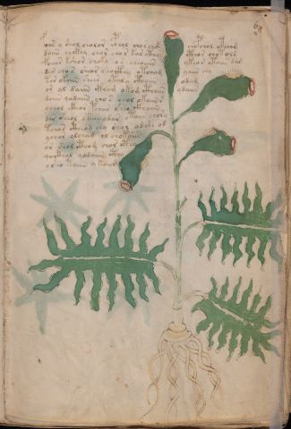

# Voynich Speculative Procedural Protocol — f6r

IMPORTANT: this is NOT a real or validated translation of the Voynich Manuscript. It is a speculative/procedural model that interprets EVA using a user-defined grammar to generate experimental recipes using safe, known edible substitutes.

This file is generated automatically from IVTFF/EVA transliteration plus a user-defined procedural grammar.



## Page / Folio
- currier: A
- folio: f6r
- page_number: 11
- section: herbal

## EVA Text (Transliteration)
```text
foar y shol cholor cphol chor chck chopchol otcham
daiin chckhy chor chor kar cthy cthor chotols
foeear kshor choky os cheoeees ykeor ytaiin dam
dar cho s sheor choithy otcham yaiir chy
t[a:o]r okoiin shees ytaly cthaiin odam
or al daiin ckham okom cthaiin ydaiin
daiin qodaiin cho s chol okaiin s
ychol ckhor pchar sheo ckhaiin
dar sheol skaiiodar otaiin chory
tchor ctheod chy shor od she od
ychar olchaj ol chokaiin
or shol cthom chor cthy
qocthol [y:q]odaiin cthy
ysho taiin y kaiim
```

## Domain Context (Heuristic; Not a Translation)

This section summarizes recurring **basewords** in this IVTFF domain and shows simple substring evidence that the token markers used by the procedural grammar occur inside frequent words.

Any Italian anagram / English gloss is a best-effort lexicon match, not a decipherment.


### Associated basewords (non-generic; top by frequency in this domain)
- `paiin` (count=477) → Italian anagram `piani`; English: plans (arrangements)
- `okaiin` (count=59) → Italian anagram `coniai`; English: [n/a]
- `qokep` (count=41) → Italian anagram `pecco`; English: [n/a]
- `saiin` (count=40) → Italian anagram `asini`; English: [n/a]
- `kaiin` (count=40) → Italian anagram `acini`; English: [n/a]
- `chaiin` (count=39) → Italian anagram `acini`; English: [n/a]
- `qokaiin` (count=34) → Italian anagram `ciancio`; English: [n/a]
- `qokar` (count=29) → Italian anagram `carco`; English: [n/a]
- `opaiin` (count=29) → Italian anagram `inopia`; English: poverty
- `otchol` (count=25) → Italian anagram `colto`; English: cultivated
- `chopaiin` (count=24) → Italian anagram `apocini`; English: [n/a]
- `qotol` (count=20) → Italian anagram `colto`; English: cultivated
- `okain` (count=19) → Italian anagram `acino`; English: a berry
- `qotor` (count=18) → Italian anagram `corto`; English: short
- `qopaiin` (count=15) → Italian anagram `apocini`; English: [n/a]

### Marker evidence (substring in frequent basewords)
- `qo`: 58 basewords; examples: `qotch`, `qok`, `qot`, `qokch`, `qokep`, `qokaiin`
- `q`: 59 basewords; examples: `qotch`, `qok`, `qot`, `qokch`, `qokep`, `qokaiin`
- `o`: 274 basewords; examples: `chol`, `o`, `chor`, `or`, `shol`, `ol`
- `k`: 146 basewords; examples: `ok`, `k`, `okaiin`, `kch`, `chckh`, `qok`
- `t`: 101 basewords; examples: `cth`, `ot`, `t`, `qotch`, `cthol`, `qot`
- `p`: 152 basewords; examples: `paiin`, `p`, `par`, `pain`, `pal`, `chep`
- `ch`: 145 basewords; examples: `chol`, `chor`, `ch`, `che`, `chep`, `cho`
- `sh`: 51 basewords; examples: `shol`, `sh`, `sho`, `shor`, `she`, `shep`
- `f`: 2 basewords; examples: `fchep`, `f`
- `cth`: 18 basewords; examples: `cth`, `cthol`, `cthor`, `cthe`, `chcth`, `ctho`
- `ckh`: 18 basewords; examples: `chckh`, `ckh`, `ckhe`, `ckhol`, `shckh`, `checkh`
- `cph`: 3 basewords; examples: `cph`, `cphol`, `cphe`
- `iin`: 39 basewords; examples: `paiin`, `aiin`, `okaiin`, `saiin`, `kaiin`, `chaiin`
- `aiin`: 31 basewords; examples: `paiin`, `aiin`, `okaiin`, `saiin`, `kaiin`, `chaiin`

## Recipes Index (This Page)
- [f6r.1,@P0](#f6r-1-f6r-1-p0)
- [f6r.2,+P0](#f6r-2-f6r-2-p0)
- [f6r.3,+P0](#f6r-3-f6r-3-p0)
- [f6r.4,+P0](#f6r-4-f6r-4-p0)
- [f6r.5,+P0](#f6r-5-f6r-5-p0)
- [f6r.6,+P0](#f6r-6-f6r-6-p0)
- [f6r.7,+P0](#f6r-7-f6r-7-p0)
- [f6r.8,+P0](#f6r-8-f6r-8-p0)
- [f6r.9,+P0](#f6r-9-f6r-9-p0)
- [f6r.10,+P0](#f6r-10-f6r-10-p0)
- [f6r.11,+P0](#f6r-11-f6r-11-p0)
- [f6r.12,+P0](#f6r-12-f6r-12-p0)
- [f6r.13,+P0](#f6r-13-f6r-13-p0)
- [f6r.14,+P0](#f6r-14-f6r-14-p0)

## Line Glosses (Procedural Gloss Only; Not a Translation)

<a id="f6r-1-f6r-1-p0"></a>

### f6r.1,@P0

EVA: foar y shol cholor cphol chor chck chopchol otcham

Direct Gloss (Procedural, Not a Real Translation):
- foar: tokens: f o a r → connectors: r → vowel_run: a (level 1; class a)
- y: [unparsed]
- shol: tokens: sh o l → connectors: l
- cholor: tokens: ch o l o r → connectors: l r
- cphol: tokens: cph o l → connectors: l
- chor: tokens: ch o r → connectors: r
- chck: tokens: ch c k
- chopchol: tokens: ch o p ch o l → connectors: l
- otcham: tokens: o t ch a m → connectors: m → vowel_run: a (level 1; class a)

<a id="f6r-2-f6r-2-p0"></a>

### f6r.2,+P0

EVA: daiin chckhy chor chor kar cthy cthor chotols

Direct Gloss (Procedural, Not a Real Translation):
- daiin: tokens: p aiin → vowel_run: a (level 1; class a) → suffix: aiin (lexicon-context: `paiin` → `piani`; plans (arrangements))
- chckhy: tokens: ch ckh
- chor: tokens: ch o r → connectors: r
- chor: tokens: ch o r → connectors: r
- kar: tokens: k a r → connectors: r → vowel_run: a (level 1; class a)
- cthy: tokens: cth
- cthor: tokens: cth o r → connectors: r
- chotols: tokens: ch o t o l s → connectors: l s

<a id="f6r-3-f6r-3-p0"></a>

### f6r.3,+P0

EVA: foeear kshor choky os cheoeees ykeor ytaiin dam

Direct Gloss (Procedural, Not a Real Translation):
- foeear: tokens: f o ee a r → connectors: r → vowel_run: ee (level 2; class e)
- kshor: tokens: k sh o r → connectors: r
- choky: tokens: ch o k
- os: tokens: o s → connectors: s
- cheoeees: tokens: ch e o eee s → connectors: s → vowel_run: e (level 1; class e)
- ykeor: tokens: k e o r → connectors: r → vowel_run: e (level 1; class e)
- ytaiin: tokens: t aiin → vowel_run: a (level 1; class a) → suffix: aiin
- dam: tokens: p a m → connectors: m → vowel_run: a (level 1; class a)

<a id="f6r-4-f6r-4-p0"></a>

### f6r.4,+P0

EVA: dar cho s sheor choithy otcham yaiir chy

Direct Gloss (Procedural, Not a Real Translation):
- dar: tokens: p a r → connectors: r → vowel_run: a (level 1; class a)
- cho: tokens: ch o
- s: tokens: s → connectors: s
- sheor: tokens: sh e o r → connectors: r → vowel_run: e (level 1; class e)
- choithy: tokens: ch o i t h → vowel_run: i (level 1; class i) → unmodeled_tokens: h
- otcham: tokens: o t ch a m → connectors: m → vowel_run: a (level 1; class a)
- yaiir: tokens: a ii r → connectors: r → vowel_run: a (level 1; class a)
- chy: tokens: ch

<a id="f6r-5-f6r-5-p0"></a>

### f6r.5,+P0

EVA: t[a:o]r okoiin shees ytaly cthaiin odam

Direct Gloss (Procedural, Not a Real Translation):
- t: tokens: t
- a: tokens: a → vowel_run: a (level 1; class a)
- o: tokens: o
- r: tokens: r → connectors: r
- okoiin: tokens: o k o iin → vowel_run: ii (level 2; class i) → suffix: iin
- shees: tokens: sh ee s → connectors: s → vowel_run: ee (level 2; class e)
- ytaly: tokens: t a l → connectors: l → vowel_run: a (level 1; class a)
- cthaiin: tokens: cth aiin → vowel_run: a (level 1; class a) → suffix: aiin
- odam: tokens: o p a m → connectors: m → vowel_run: a (level 1; class a)

<a id="f6r-6-f6r-6-p0"></a>

### f6r.6,+P0

EVA: or al daiin ckham okom cthaiin ydaiin

Direct Gloss (Procedural, Not a Real Translation):
- or: tokens: o r → connectors: r
- al: tokens: a l → connectors: l → vowel_run: a (level 1; class a)
- daiin: tokens: p aiin → vowel_run: a (level 1; class a) → suffix: aiin (lexicon-context: `paiin` → `piani`; plans (arrangements))
- ckham: tokens: ckh a m → connectors: m → vowel_run: a (level 1; class a)
- okom: tokens: o k o m → connectors: m
- cthaiin: tokens: cth aiin → vowel_run: a (level 1; class a) → suffix: aiin
- ydaiin: tokens: p aiin → vowel_run: a (level 1; class a) → suffix: aiin (lexicon-context: `paiin` → `piani`; plans (arrangements))

<a id="f6r-7-f6r-7-p0"></a>

### f6r.7,+P0

EVA: daiin qodaiin cho s chol okaiin s

Direct Gloss (Procedural, Not a Real Translation):
- daiin: tokens: p aiin → vowel_run: a (level 1; class a) → suffix: aiin (lexicon-context: `paiin` → `piani`; plans (arrangements))
- qodaiin: tokens: qo p aiin → vowel_run: a (level 1; class a) → suffix: aiin
- cho: tokens: ch o
- s: tokens: s → connectors: s
- chol: tokens: ch o l → connectors: l
- okaiin: tokens: o k aiin → vowel_run: a (level 1; class a) → suffix: aiin (lexicon-context: `okaiin` → `coniai`; [n/a])
- s: tokens: s → connectors: s

<a id="f6r-8-f6r-8-p0"></a>

### f6r.8,+P0

EVA: ychol ckhor pchar sheo ckhaiin

Direct Gloss (Procedural, Not a Real Translation):
- ychol: tokens: ch o l → connectors: l
- ckhor: tokens: ckh o r → connectors: r
- pchar: tokens: p ch a r → connectors: r → vowel_run: a (level 1; class a)
- sheo: tokens: sh e o → vowel_run: e (level 1; class e)
- ckhaiin: tokens: ckh aiin → vowel_run: a (level 1; class a) → suffix: aiin

<a id="f6r-9-f6r-9-p0"></a>

### f6r.9,+P0

EVA: dar sheol skaiiodar otaiin chory

Direct Gloss (Procedural, Not a Real Translation):
- dar: tokens: p a r → connectors: r → vowel_run: a (level 1; class a)
- sheol: tokens: sh e o l → connectors: l → vowel_run: e (level 1; class e)
- skaiiodar: tokens: s k a ii o p a r → connectors: s r → vowel_run: a (level 1; class a)
- otaiin: tokens: o t aiin → vowel_run: a (level 1; class a) → suffix: aiin
- chory: tokens: ch o r → connectors: r

<a id="f6r-10-f6r-10-p0"></a>

### f6r.10,+P0

EVA: tchor ctheod chy shor od she od

Direct Gloss (Procedural, Not a Real Translation):
- tchor: tokens: t ch o r → connectors: r
- ctheod: tokens: cth e o p → vowel_run: e (level 1; class e)
- chy: tokens: ch
- shor: tokens: sh o r → connectors: r
- od: tokens: o p
- she: tokens: sh e → vowel_run: e (level 1; class e)
- od: tokens: o p

<a id="f6r-11-f6r-11-p0"></a>

### f6r.11,+P0

EVA: ychar olchaj ol chokaiin

Direct Gloss (Procedural, Not a Real Translation):
- ychar: tokens: ch a r → connectors: r → vowel_run: a (level 1; class a)
- olchaj: tokens: o l ch a j → connectors: l → vowel_run: a (level 1; class a)
- ol: tokens: o l → connectors: l
- chokaiin: tokens: ch o k aiin → vowel_run: a (level 1; class a) → suffix: aiin (lexicon-context: `okaiin` → `coniai`; [n/a])

<a id="f6r-12-f6r-12-p0"></a>

### f6r.12,+P0

EVA: or shol cthom chor cthy

Direct Gloss (Procedural, Not a Real Translation):
- or: tokens: o r → connectors: r
- shol: tokens: sh o l → connectors: l
- cthom: tokens: cth o m → connectors: m
- chor: tokens: ch o r → connectors: r
- cthy: tokens: cth

<a id="f6r-13-f6r-13-p0"></a>

### f6r.13,+P0

EVA: qocthol [y:q]odaiin cthy

Direct Gloss (Procedural, Not a Real Translation):
- qocthol: tokens: qo cth o l → connectors: l
- y: [unparsed]
- q: tokens: q
- odaiin: tokens: o p aiin → vowel_run: a (level 1; class a) → suffix: aiin (lexicon-context: `opaiin` → `opinai`; [n/a])
- cthy: tokens: cth

<a id="f6r-14-f6r-14-p0"></a>

### f6r.14,+P0

EVA: ysho taiin y kaiim

Direct Gloss (Procedural, Not a Real Translation):
- ysho: tokens: sh o
- taiin: tokens: t aiin → vowel_run: a (level 1; class a) → suffix: aiin
- y: [unparsed]
- kaiim: tokens: k a ii m → connectors: m → vowel_run: a (level 1; class a)
