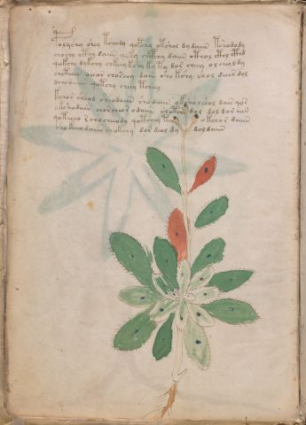

# Voynich Speculative Procedural Protocol — f7v

IMPORTANT: this is NOT a real or validated translation of the Voynich Manuscript. It is a speculative/procedural model that interprets EVA using a user-defined grammar to generate experimental recipes using safe, known edible substitutes.

This file is generated automatically from IVTFF/EVA transliteration plus a user-defined procedural grammar.



## Page / Folio
- currier: A
- folio: f7v
- page_number: 14
- section: herbal

## EVA Text (Transliteration)
```text
polyshy shey tchody qopchy otshol dy daiin tshodody
chochy cthy daiin qoky chcphhy daiin cthol cthy cthd
qokchy dykchy chkeey kshy ky ty dor cheey o l cheol dy
choteeeb oeear choschy dain sho kshy shol deees dol
dchodaiin qotchy cheey tcheey
kchor sheod sheodaiin sho daiin oksho lshol dair qos
okshodeeeb chorcheor odaiin shotch[o:?] dol dol dor aiin
qoteeeo r cho cheeody qotchey tey o kcho r daiin
sho keeo daiir chokchy dor deol dy dol daiin
```

## Domain Context (Heuristic; Not a Translation)

This section summarizes recurring **basewords** in this IVTFF domain and shows simple substring evidence that the token markers used by the procedural grammar occur inside frequent words.

Any Italian anagram / English gloss is a best-effort lexicon match, not a decipherment.


### Associated basewords (non-generic; top by frequency in this domain)
- `paiin` (count=477) → Italian anagram `piani`; English: plans (arrangements)
- `okaiin` (count=59) → Italian anagram `coniai`; English: [n/a]
- `qokep` (count=41) → Italian anagram `pecco`; English: [n/a]
- `saiin` (count=40) → Italian anagram `asini`; English: [n/a]
- `kaiin` (count=40) → Italian anagram `acini`; English: [n/a]
- `chaiin` (count=39) → Italian anagram `acini`; English: [n/a]
- `qokaiin` (count=34) → Italian anagram `ciancio`; English: [n/a]
- `qokar` (count=29) → Italian anagram `carco`; English: [n/a]
- `opaiin` (count=29) → Italian anagram `inopia`; English: poverty
- `otchol` (count=25) → Italian anagram `colto`; English: cultivated
- `chopaiin` (count=24) → Italian anagram `apocini`; English: [n/a]
- `qotol` (count=20) → Italian anagram `colto`; English: cultivated
- `okain` (count=19) → Italian anagram `acino`; English: a berry
- `qotor` (count=18) → Italian anagram `corto`; English: short
- `qopaiin` (count=15) → Italian anagram `apocini`; English: [n/a]

### Marker evidence (substring in frequent basewords)
- `qo`: 58 basewords; examples: `qotch`, `qok`, `qot`, `qokch`, `qokep`, `qokaiin`
- `q`: 59 basewords; examples: `qotch`, `qok`, `qot`, `qokch`, `qokep`, `qokaiin`
- `o`: 274 basewords; examples: `chol`, `o`, `chor`, `or`, `shol`, `ol`
- `k`: 146 basewords; examples: `ok`, `k`, `okaiin`, `kch`, `chckh`, `qok`
- `t`: 101 basewords; examples: `cth`, `ot`, `t`, `qotch`, `cthol`, `qot`
- `p`: 152 basewords; examples: `paiin`, `p`, `par`, `pain`, `pal`, `chep`
- `ch`: 145 basewords; examples: `chol`, `chor`, `ch`, `che`, `chep`, `cho`
- `sh`: 51 basewords; examples: `shol`, `sh`, `sho`, `shor`, `she`, `shep`
- `f`: 2 basewords; examples: `fchep`, `f`
- `cth`: 18 basewords; examples: `cth`, `cthol`, `cthor`, `cthe`, `chcth`, `ctho`
- `ckh`: 18 basewords; examples: `chckh`, `ckh`, `ckhe`, `ckhol`, `shckh`, `checkh`
- `cph`: 3 basewords; examples: `cph`, `cphol`, `cphe`
- `iin`: 39 basewords; examples: `paiin`, `aiin`, `okaiin`, `saiin`, `kaiin`, `chaiin`
- `aiin`: 31 basewords; examples: `paiin`, `aiin`, `okaiin`, `saiin`, `kaiin`, `chaiin`

## Recipes Index (This Page)
- [f7v.1,@P0](#f7v-1-f7v-1-p0)
- [f7v.2,+P0](#f7v-2-f7v-2-p0)
- [f7v.3,+P0](#f7v-3-f7v-3-p0)
- [f7v.4,+P0](#f7v-4-f7v-4-p0)
- [f7v.5,+P0](#f7v-5-f7v-5-p0)
- [f7v.6,+P0](#f7v-6-f7v-6-p0)
- [f7v.7,+P0](#f7v-7-f7v-7-p0)
- [f7v.8,+P0](#f7v-8-f7v-8-p0)
- [f7v.9,+P0](#f7v-9-f7v-9-p0)

## Line Glosses (Procedural Gloss Only; Not a Translation)

<a id="f7v-1-f7v-1-p0"></a>

### f7v.1,@P0

EVA (original line):
```text
polyshy shey tchody qopchy otshol dy daiin tshodody
```

English structural gloss (generated):

- polyshy: tokens: p o l sh → connectors: l
- shey: tokens: sh e → vowel_run: e (level 1; class e)
- tchody: tokens: t ch o p
- qopchy: tokens: qo p ch
- otshol: tokens: o t sh o l → connectors: l
- dy: tokens: p
- daiin: tokens: p aiin → vowel_run: a (level 1; class a) → suffix: aiin (lexicon-context: `paiin` → `piani`; plans (arrangements))
- tshodody: tokens: t sh o p o p

<a id="f7v-2-f7v-2-p0"></a>

### f7v.2,+P0

EVA (original line):
```text
chochy cthy daiin qoky chcphhy daiin cthol cthy cthd
```

English structural gloss (generated):

- chochy: tokens: ch o ch
- cthy: tokens: cth
- daiin: tokens: p aiin → vowel_run: a (level 1; class a) → suffix: aiin (lexicon-context: `paiin` → `piani`; plans (arrangements))
- qoky: tokens: qo k
- chcphhy: tokens: ch cph h → unmodeled_tokens: h
- daiin: tokens: p aiin → vowel_run: a (level 1; class a) → suffix: aiin (lexicon-context: `paiin` → `piani`; plans (arrangements))
- cthol: tokens: cth o l → connectors: l
- cthy: tokens: cth
- cthd: tokens: cth p

<a id="f7v-3-f7v-3-p0"></a>

### f7v.3,+P0

EVA (original line):
```text
qokchy dykchy chkeey kshy ky ty dor cheey o l cheol dy
```

English structural gloss (generated):

- qokchy: tokens: qo k ch
- dykchy: tokens: p k ch
- chkeey: tokens: ch k ee → vowel_run: ee (level 2; class e)
- kshy: tokens: k sh
- ky: tokens: k
- ty: tokens: t
- dor: tokens: p o r → connectors: r
- cheey: tokens: ch ee → vowel_run: ee (level 2; class e)
- o: tokens: o
- l: tokens: l → connectors: l
- cheol: tokens: ch e o l → connectors: l → vowel_run: e (level 1; class e)
- dy: tokens: p

<a id="f7v-4-f7v-4-p0"></a>

### f7v.4,+P0

EVA (original line):
```text
choteeeb oeear choschy dain sho kshy shol deees dol
```

English structural gloss (generated):

- choteeeb: tokens: ch o t eee b → vowel_run: eee (level 3; class e) → unmodeled_tokens: b
- oeear: tokens: o ee a r → connectors: r → vowel_run: ee (level 2; class e)
- choschy: tokens: ch o s ch → connectors: s
- dain: tokens: p a i n → connectors: n → vowel_run: a (level 1; class a)
- sho: tokens: sh o
- kshy: tokens: k sh
- shol: tokens: sh o l → connectors: l
- deees: tokens: p eee s → connectors: s → vowel_run: eee (level 3; class e)
- dol: tokens: p o l → connectors: l

<a id="f7v-5-f7v-5-p0"></a>

### f7v.5,+P0

EVA (original line):
```text
dchodaiin qotchy cheey tcheey
```

English structural gloss (generated):

- dchodaiin: tokens: p ch o p aiin → vowel_run: a (level 1; class a) → suffix: aiin
- qotchy: tokens: qo t ch
- cheey: tokens: ch ee → vowel_run: ee (level 2; class e)
- tcheey: tokens: t ch ee → vowel_run: ee (level 2; class e)

<a id="f7v-6-f7v-6-p0"></a>

### f7v.6,+P0

EVA (original line):
```text
kchor sheod sheodaiin sho daiin oksho lshol dair qos
```

English structural gloss (generated):

- kchor: tokens: k ch o r → connectors: r
- sheod: tokens: sh e o p → vowel_run: e (level 1; class e)
- sheodaiin: tokens: sh e o p aiin → vowel_run: e (level 1; class e) → suffix: aiin (lexicon-context: `opaiin` → `opinai`; [n/a])
- sho: tokens: sh o
- daiin: tokens: p aiin → vowel_run: a (level 1; class a) → suffix: aiin (lexicon-context: `paiin` → `piani`; plans (arrangements))
- oksho: tokens: o k sh o
- lshol: tokens: l sh o l → connectors: l l
- dair: tokens: p a i r → connectors: r → vowel_run: a (level 1; class a)
- qos: tokens: qo s → connectors: s

<a id="f7v-7-f7v-7-p0"></a>

### f7v.7,+P0

EVA (original line):
```text
okshodeeeb chorcheor odaiin shotch[o:?] dol dol dor aiin
```

English structural gloss (generated):

- okshodeeeb: tokens: o k sh o p eee b → vowel_run: eee (level 3; class e) → unmodeled_tokens: b
- chorcheor: tokens: ch o r ch e o r → connectors: r r → vowel_run: e (level 1; class e)
- odaiin: tokens: o p aiin → vowel_run: a (level 1; class a) → suffix: aiin (lexicon-context: `opaiin` → `opinai`; [n/a])
- shotch: tokens: sh o t ch
- o: tokens: o
- dol: tokens: p o l → connectors: l
- dol: tokens: p o l → connectors: l
- dor: tokens: p o r → connectors: r
- aiin: tokens: aiin → vowel_run: a (level 1; class a) → suffix: aiin

<a id="f7v-8-f7v-8-p0"></a>

### f7v.8,+P0

EVA (original line):
```text
qoteeeo r cho cheeody qotchey tey o kcho r daiin
```

English structural gloss (generated):

- qoteeeo: tokens: qo t eee o → vowel_run: eee (level 3; class e)
- r: tokens: r → connectors: r
- cho: tokens: ch o
- cheeody: tokens: ch ee o p → vowel_run: ee (level 2; class e)
- qotchey: tokens: qo t ch e → vowel_run: e (level 1; class e)
- tey: tokens: t e → vowel_run: e (level 1; class e)
- o: tokens: o
- kcho: tokens: k ch o
- r: tokens: r → connectors: r
- daiin: tokens: p aiin → vowel_run: a (level 1; class a) → suffix: aiin (lexicon-context: `paiin` → `piani`; plans (arrangements))

<a id="f7v-9-f7v-9-p0"></a>

### f7v.9,+P0

EVA (original line):
```text
sho keeo daiir chokchy dor deol dy dol daiin
```

English structural gloss (generated):

- sho: tokens: sh o
- keeo: tokens: k ee o → vowel_run: ee (level 2; class e)
- daiir: tokens: p a ii r → connectors: r → vowel_run: a (level 1; class a) (lexicon-context: `paiir` → `aprii`; [n/a])
- chokchy: tokens: ch o k ch
- dor: tokens: p o r → connectors: r
- deol: tokens: p e o l → connectors: l → vowel_run: e (level 1; class e)
- dy: tokens: p
- dol: tokens: p o l → connectors: l
- daiin: tokens: p aiin → vowel_run: a (level 1; class a) → suffix: aiin (lexicon-context: `paiin` → `piani`; plans (arrangements))
