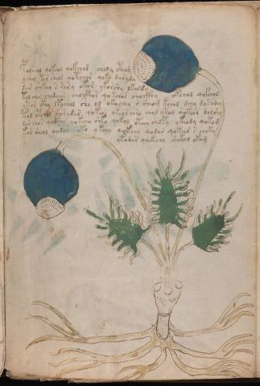

# Voynich Speculative Procedural Protocol — f90r1

IMPORTANT: this is NOT a real or validated translation of the Voynich Manuscript. It is a speculative/procedural model that interprets EVA using a user-defined grammar to generate experimental recipes using safe, known edible substitutes.

This file is generated automatically from IVTFF/EVA transliteration plus a user-defined procedural grammar.



## Page / Folio
- currier: A
- folio: f90r1
- page_number: 187
- section: herbal

## EVA Text (Transliteration)
```text
poleeol qokeol qokchod choly ctho[g:m]
yshol tor sheor qotchor qoky darala
dair shkeea s sary okar ykorshy lkaldy
talchor chodaiin chocfhor qokchor chockhy okchod qofchol
ytor ckhy lpychol sho ol okachey [r:s] sheom kchol dchy dasady
tol otchol shorydar qokeos okeoschso chol ytod qokeos dolshy
dar chos qocthy qokcha shko qokol oteey chofy ykeody qokod
kor sheol qodar oko ykeey qokeey qodar qokeed s choky
ykodar qoekchy shokol okam
```

## Domain Context (Heuristic; Not a Translation)

This section summarizes recurring **basewords** in this IVTFF domain and shows simple substring evidence that the token markers used by the procedural grammar occur inside frequent words.

Any Italian anagram / English gloss is a best-effort lexicon match, not a decipherment.


### Associated basewords (non-generic; top by frequency in this domain)
- `paiin` (count=477) → Italian anagram `piani`; English: plans (arrangements)
- `okaiin` (count=59) → Italian anagram `coniai`; English: [n/a]
- `qokep` (count=41) → Italian anagram `pecco`; English: [n/a]
- `saiin` (count=40) → Italian anagram `asini`; English: [n/a]
- `kaiin` (count=40) → Italian anagram `acini`; English: [n/a]
- `chaiin` (count=39) → Italian anagram `acini`; English: [n/a]
- `qokaiin` (count=34) → Italian anagram `ciancio`; English: [n/a]
- `qokar` (count=29) → Italian anagram `carco`; English: [n/a]
- `opaiin` (count=29) → Italian anagram `inopia`; English: poverty
- `otchol` (count=25) → Italian anagram `colto`; English: cultivated
- `chopaiin` (count=24) → Italian anagram `apocini`; English: [n/a]
- `qotol` (count=20) → Italian anagram `colto`; English: cultivated
- `okain` (count=19) → Italian anagram `acino`; English: a berry
- `qotor` (count=18) → Italian anagram `corto`; English: short
- `qopaiin` (count=15) → Italian anagram `apocini`; English: [n/a]

### Marker evidence (substring in frequent basewords)
- `qo`: 58 basewords; examples: `qotch`, `qok`, `qot`, `qokch`, `qokep`, `qokaiin`
- `q`: 59 basewords; examples: `qotch`, `qok`, `qot`, `qokch`, `qokep`, `qokaiin`
- `o`: 274 basewords; examples: `chol`, `o`, `chor`, `or`, `shol`, `ol`
- `k`: 146 basewords; examples: `ok`, `k`, `okaiin`, `kch`, `chckh`, `qok`
- `t`: 101 basewords; examples: `cth`, `ot`, `t`, `qotch`, `cthol`, `qot`
- `p`: 152 basewords; examples: `paiin`, `p`, `par`, `pain`, `pal`, `chep`
- `ch`: 145 basewords; examples: `chol`, `chor`, `ch`, `che`, `chep`, `cho`
- `sh`: 51 basewords; examples: `shol`, `sh`, `sho`, `shor`, `she`, `shep`
- `f`: 2 basewords; examples: `fchep`, `f`
- `cth`: 18 basewords; examples: `cth`, `cthol`, `cthor`, `cthe`, `chcth`, `ctho`
- `ckh`: 18 basewords; examples: `chckh`, `ckh`, `ckhe`, `ckhol`, `shckh`, `checkh`
- `cph`: 3 basewords; examples: `cph`, `cphol`, `cphe`
- `iin`: 39 basewords; examples: `paiin`, `aiin`, `okaiin`, `saiin`, `kaiin`, `chaiin`
- `aiin`: 31 basewords; examples: `paiin`, `aiin`, `okaiin`, `saiin`, `kaiin`, `chaiin`

## Recipes Index (This Page)
- [f90r1.1,@P0](#f90r1-1-f90r1-1-p0)
- [f90r1.2,+P0](#f90r1-2-f90r1-2-p0)
- [f90r1.3,+P0](#f90r1-3-f90r1-3-p0)
- [f90r1.4,+P0](#f90r1-4-f90r1-4-p0)
- [f90r1.5,+P0](#f90r1-5-f90r1-5-p0)
- [f90r1.6,+P0](#f90r1-6-f90r1-6-p0)
- [f90r1.7,+P0](#f90r1-7-f90r1-7-p0)
- [f90r1.8,+P0](#f90r1-8-f90r1-8-p0)
- [f90r1.9,+Pr](#f90r1-9-f90r1-9-pr)

## Line Glosses (Procedural Gloss Only; Not a Translation)

<a id="f90r1-1-f90r1-1-p0"></a>

### f90r1.1,@P0

EVA (original line):
```text
poleeol qokeol qokchod choly ctho[g:m]
```

English structural gloss (generated):

- poleeol: tokens: p o l ee o l → connectors: l l → vowel_run: ee (level 2; class e)
- qokeol: tokens: qo k e o l → connectors: l → vowel_run: e (level 1; class e)
- qokchod: tokens: qo k ch o p
- choly: tokens: ch o l → connectors: l
- ctho: tokens: cth o
- g: tokens: g
- m: tokens: m → connectors: m

<a id="f90r1-2-f90r1-2-p0"></a>

### f90r1.2,+P0

EVA (original line):
```text
yshol tor sheor qotchor qoky darala
```

English structural gloss (generated):

- yshol: tokens: sh o l → connectors: l
- tor: tokens: t o r → connectors: r
- sheor: tokens: sh e o r → connectors: r → vowel_run: e (level 1; class e)
- qotchor: tokens: qo t ch o r → connectors: r (lexicon-context: `otchor` → `corto`; short)
- qoky: tokens: qo k
- darala: tokens: p a r a l a → connectors: r l → vowel_run: a (level 1; class a)

<a id="f90r1-3-f90r1-3-p0"></a>

### f90r1.3,+P0

EVA (original line):
```text
dair shkeea s sary okar ykorshy lkaldy
```

English structural gloss (generated):

- dair: tokens: p a i r → connectors: r → vowel_run: a (level 1; class a)
- shkeea: tokens: sh k ee a → vowel_run: ee (level 2; class e)
- s: tokens: s → connectors: s
- sary: tokens: s a r → connectors: s r → vowel_run: a (level 1; class a)
- okar: tokens: o k a r → connectors: r → vowel_run: a (level 1; class a)
- ykorshy: tokens: k o r sh → connectors: r
- lkaldy: tokens: l k a l p → connectors: l l → vowel_run: a (level 1; class a)

<a id="f90r1-4-f90r1-4-p0"></a>

### f90r1.4,+P0

EVA (original line):
```text
talchor chodaiin chocfhor qokchor chockhy okchod qofchol
```

English structural gloss (generated):

- talchor: tokens: t a l ch o r → connectors: l r → vowel_run: a (level 1; class a)
- chodaiin: tokens: ch o p aiin → vowel_run: a (level 1; class a) → suffix: aiin
- chocfhor: tokens: ch o cfh o r → connectors: r
- qokchor: tokens: qo k ch o r → connectors: r
- chockhy: tokens: ch o ckh
- okchod: tokens: o k ch o p
- qofchol: tokens: qo f ch o l → connectors: l

<a id="f90r1-5-f90r1-5-p0"></a>

### f90r1.5,+P0

EVA (original line):
```text
ytor ckhy lpychol sho ol okachey [r:s] sheom kchol dchy dasady
```

English structural gloss (generated):

- ytor: tokens: t o r → connectors: r
- ckhy: tokens: ckh
- lpychol: tokens: l p ch o l → connectors: l l
- sho: tokens: sh o
- ol: tokens: o l → connectors: l
- okachey: tokens: o k a ch e → vowel_run: a (level 1; class a)
- r: tokens: r → connectors: r
- s: tokens: s → connectors: s
- sheom: tokens: sh e o m → connectors: m → vowel_run: e (level 1; class e)
- kchol: tokens: k ch o l → connectors: l
- dchy: tokens: p ch
- dasady: tokens: p a s a p → connectors: s → vowel_run: a (level 1; class a)

<a id="f90r1-6-f90r1-6-p0"></a>

### f90r1.6,+P0

EVA (original line):
```text
tol otchol shorydar qokeos okeoschso chol ytod qokeos dolshy
```

English structural gloss (generated):

- tol: tokens: t o l → connectors: l
- otchol: tokens: o t ch o l → connectors: l (lexicon-context: `otchol` → `colto`; cultivated)
- shorydar: tokens: sh o r p a r → connectors: r r → vowel_run: a (level 1; class a)
- qokeos: tokens: qo k e o s → connectors: s → vowel_run: e (level 1; class e)
- okeoschso: tokens: o k e o s ch s o → connectors: s s → vowel_run: e (level 1; class e)
- chol: tokens: ch o l → connectors: l
- ytod: tokens: t o p
- qokeos: tokens: qo k e o s → connectors: s → vowel_run: e (level 1; class e)
- dolshy: tokens: p o l sh → connectors: l

<a id="f90r1-7-f90r1-7-p0"></a>

### f90r1.7,+P0

EVA (original line):
```text
dar chos qocthy qokcha shko qokol oteey chofy ykeody qokod
```

English structural gloss (generated):

- dar: tokens: p a r → connectors: r → vowel_run: a (level 1; class a)
- chos: tokens: ch o s → connectors: s
- qocthy: tokens: qo cth
- qokcha: tokens: qo k ch a → vowel_run: a (level 1; class a)
- shko: tokens: sh k o
- qokol: tokens: qo k o l → connectors: l
- oteey: tokens: o t ee → vowel_run: ee (level 2; class e)
- chofy: tokens: ch o f
- ykeody: tokens: k e o p → vowel_run: e (level 1; class e)
- qokod: tokens: qo k o p

<a id="f90r1-8-f90r1-8-p0"></a>

### f90r1.8,+P0

EVA (original line):
```text
kor sheol qodar oko ykeey qokeey qodar qokeed s choky
```

English structural gloss (generated):

- kor: tokens: k o r → connectors: r
- sheol: tokens: sh e o l → connectors: l → vowel_run: e (level 1; class e)
- qodar: tokens: qo p a r → connectors: r → vowel_run: a (level 1; class a) (lexicon-context: `qopar` → `copra`; [n/a])
- oko: tokens: o k o
- ykeey: tokens: k ee → vowel_run: ee (level 2; class e)
- qokeey: tokens: qo k ee → vowel_run: ee (level 2; class e)
- qodar: tokens: qo p a r → connectors: r → vowel_run: a (level 1; class a) (lexicon-context: `qopar` → `copra`; [n/a])
- qokeed: tokens: qo k ee p → vowel_run: ee (level 2; class e)
- s: tokens: s → connectors: s
- choky: tokens: ch o k

<a id="f90r1-9-f90r1-9-pr"></a>

### f90r1.9,+Pr

EVA (original line):
```text
ykodar qoekchy shokol okam
```

English structural gloss (generated):

- ykodar: tokens: k o p a r → connectors: r → vowel_run: a (level 1; class a)
- qoekchy: tokens: qo e k ch → vowel_run: e (level 1; class e)
- shokol: tokens: sh o k o l → connectors: l
- okam: tokens: o k a m → connectors: m → vowel_run: a (level 1; class a)
