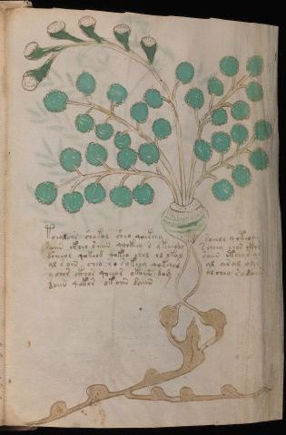

# Voynich Speculative Herbal Ferment Recipe — f90r2

IMPORTANT: this is NOT a real or validated translation of the Voynich Manuscript. It is a speculative/procedural model that interprets EVA using a user-defined grammar to generate experimental recipes using safe, known edible substitutes.

This file is generated automatically from IVTFF/EVA transliteration plus a user-defined procedural grammar.



## Page / Folio
- currier: A
- folio: f90r2
- page_number: 188
- section: herbal

## EVA Text (Transliteration)
```text
toealchs shakol sheo qoekeey soeeol qoteody
saiin ckheo saiin qockhey s ykeeody s cheey chos ckhs
dsheeos qokeod qokeo chol ol okal saiin ctheo s ar
al s oin cheo ro sokeey qokeeas al aral oy[r:s]
ychor ckhor qoeeor okaiin dom olcheo rodaiin
daiin qokor okoiin daiin
```

## Recipes Index (This Page)
- [f90r2.1,@P0](#f90r2-1-f90r2-1-p0)
- [f90r2.2,+P0](#f90r2-2-f90r2-2-p0)
- [f90r2.3,+P0](#f90r2-3-f90r2-3-p0)
- [f90r2.4,+P0](#f90r2-4-f90r2-4-p0)
- [f90r2.5,+P0](#f90r2-5-f90r2-5-p0)
- [f90r2.6,+P0](#f90r2-6-f90r2-6-p0)

## Line Glosses (Procedural Gloss Only; Not a Translation)

<a id="f90r2-1-f90r2-1-p0"></a>

### f90r2.1,@P0

EVA: toealchs shakol sheo qoekeey soeeol qoteody

Direct Gloss (Procedural, Not a Real Translation):
- toealchs: apply heat/cooking → add main plant (safe substitute) → mix / transfer → duration level 1 → state: active extraction
- shakol: add fermentable sugars → add secondary herb (safe substitute) → mix / transfer → duration level 1 → state: fermentation start
- sheo: add secondary herb (safe substitute) → mix / transfer → duration level 1 → state: active extraction
- qoekeey: prepare liquid base → add fermentable sugars → duration level 1 → state: active extraction
- soeeol: mix / transfer → duration level 2 → state: active extraction
- qoteody: prepare liquid base → apply heat/cooking → mix / transfer → start fermentation (yeast) → duration level 1 → state: active extraction

<a id="f90r2-2-f90r2-2-p0"></a>

### f90r2.2,+P0

EVA: saiin ckheo saiin qockhey s ykeeody s cheey chos ckhs

Direct Gloss (Procedural, Not a Real Translation):
- saiin: duration level 1 → state: fermentation start → long fermentation / aging phase
- ckheo: mix / transfer → add complex herbal compound (safe blend) → duration level 1 → state: active extraction
- saiin: duration level 1 → state: fermentation start → long fermentation / aging phase
- qockhey: prepare liquid base → add complex herbal compound (safe blend) → duration level 1 → state: active extraction
- s: [unparsed]
- ykeeody: add fermentable sugars → mix / transfer → start fermentation (yeast) → duration level 2 → state: active extraction
- s: [unparsed]
- cheey: add main plant (safe substitute) → duration level 2 → state: active extraction
- chos: add main plant (safe substitute) → mix / transfer
- ckhs: add complex herbal compound (safe blend)

<a id="f90r2-3-f90r2-3-p0"></a>

### f90r2.3,+P0

EVA: dsheeos qokeod qokeo chol ol okal saiin ctheo s ar

Direct Gloss (Procedural, Not a Real Translation):
- dsheeos: add secondary herb (safe substitute) → mix / transfer → start fermentation (yeast) → duration level 2 → state: active extraction
- qokeod: prepare liquid base → add fermentable sugars → mix / transfer → start fermentation (yeast) → duration level 1 → state: active extraction
- qokeo: prepare liquid base → add fermentable sugars → mix / transfer → duration level 1 → state: active extraction
- chol: add main plant (safe substitute) → mix / transfer
- ol: mix / transfer
- okal: add fermentable sugars → mix / transfer → duration level 1 → state: fermentation start
- saiin: duration level 1 → state: fermentation start → long fermentation / aging phase
- ctheo: mix / transfer → add complex herbal compound (safe blend) → duration level 1 → state: active extraction
- s: [unparsed]
- ar: duration level 1 → state: fermentation start

<a id="f90r2-4-f90r2-4-p0"></a>

### f90r2.4,+P0

EVA: al s oin cheo ro sokeey qokeeas al aral oy[r:s]

Direct Gloss (Procedural, Not a Real Translation):
- al: duration level 1 → state: fermentation start
- s: [unparsed]
- oin: mix / transfer → duration level 1 → state: cooling/rest
- cheo: add main plant (safe substitute) → mix / transfer → duration level 1 → state: active extraction
- ro: mix / transfer
- sokeey: add fermentable sugars → mix / transfer → duration level 2 → state: active extraction
- qokeeas: prepare liquid base → add fermentable sugars → duration level 2 → state: active extraction
- al: duration level 1 → state: fermentation start
- aral: duration level 1 → state: fermentation start
- oy: mix / transfer
- r: [unparsed]
- s: [unparsed]

<a id="f90r2-5-f90r2-5-p0"></a>

### f90r2.5,+P0

EVA: ychor ckhor qoeeor okaiin dom olcheo rodaiin

Direct Gloss (Procedural, Not a Real Translation):
- ychor: add main plant (safe substitute) → mix / transfer
- ckhor: mix / transfer → add complex herbal compound (safe blend)
- qoeeor: prepare liquid base → mix / transfer → duration level 2 → state: active extraction
- okaiin: add fermentable sugars → mix / transfer → duration level 1 → state: fermentation start → long fermentation / aging phase
- dom: mix / transfer → start fermentation (yeast)
- olcheo: add main plant (safe substitute) → mix / transfer → duration level 1 → state: active extraction
- rodaiin: mix / transfer → start fermentation (yeast) → duration level 1 → state: fermentation start → long fermentation / aging phase

<a id="f90r2-6-f90r2-6-p0"></a>

### f90r2.6,+P0

EVA: daiin qokor okoiin daiin

Direct Gloss (Procedural, Not a Real Translation):
- daiin: start fermentation (yeast) → duration level 1 → state: fermentation start → long fermentation / aging phase
- qokor: prepare liquid base → add fermentable sugars → mix / transfer
- okoiin: add fermentable sugars → mix / transfer → duration level 2 → state: cooling/rest → medium fermentation phase
- daiin: start fermentation (yeast) → duration level 1 → state: fermentation start → long fermentation / aging phase
