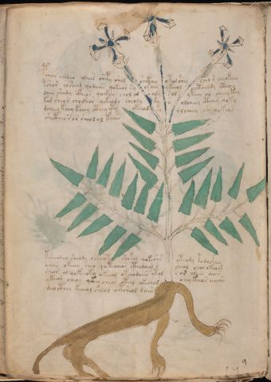

# Voynich Speculative Herbal Ferment Recipe — f90v1

IMPORTANT: this is NOT a real or validated translation of the Voynich Manuscript. It is a speculative/procedural model that interprets EVA using a user-defined grammar to generate experimental recipes using safe, known edible substitutes.

This file is generated automatically from IVTFF/EVA transliteration plus a user-defined procedural grammar.



## Page / Folio
- currier: A
- folio: f90v1
- page_number: 190
- section: herbal

## EVA Text (Transliteration)
```text
pcheor chodar oleees chepy shol shckheo otol shey cheo r cheokeey
tshor olsheod qodaiin qokeor sy oraiin ykeeol octheody cthhhy
daiin shody cfheos qockhy chol ol sals sol yteey or cheey tey
kos sheor chockhor qekeody cheody sy s olcheey cthhy qoky
dcheey keey keeey cthey yty okeeody sy olcheey sh qokeys
shctheo ror sheol ol kaiin
ksheodal sheody qocheot[o:y] shokol qokeshs yteody podai@182;hey
daiin okeeey cheo qotecheor cthodaim s cheol chor okeam
sheor ol qokeeoky okeeol okeeodaiin ytol sor a[s:r]iin aiin
ykeeor cheos qkhey cheos oteol okechod oeey keeos aiiin
deeocthey keeeol sheol c'tsheol daiin
```

## Recipes Index (This Page)
- [f90v1.1,@P0](#f90v1-1-f90v1-1-p0)
- [f90v1.2,+P0](#f90v1-2-f90v1-2-p0)
- [f90v1.3,+P0](#f90v1-3-f90v1-3-p0)
- [f90v1.4,+P0](#f90v1-4-f90v1-4-p0)
- [f90v1.5,+P0](#f90v1-5-f90v1-5-p0)
- [f90v1.6,+P0](#f90v1-6-f90v1-6-p0)
- [f90v1.7,+P0](#f90v1-7-f90v1-7-p0)
- [f90v1.8,+P0](#f90v1-8-f90v1-8-p0)
- [f90v1.9,+P0](#f90v1-9-f90v1-9-p0)
- [f90v1.10,+P0](#f90v1-10-f90v1-10-p0)
- [f90v1.11,+P0](#f90v1-11-f90v1-11-p0)

## Line Glosses (Procedural Gloss Only; Not a Translation)

<a id="f90v1-1-f90v1-1-p0"></a>

### f90v1.1,@P0

EVA: pcheor chodar oleees chepy shol shckheo otol shey cheo r cheokeey

Direct Gloss (Procedural, Not a Real Translation):
- pcheor: add main plant (safe substitute) → mix / transfer → start fermentation (yeast) → duration level 1 → state: active extraction
- chodar: add main plant (safe substitute) → mix / transfer → start fermentation (yeast) → duration level 1 → state: fermentation start
- oleees: mix / transfer → duration level 3 → state: active extraction
- chepy: add main plant (safe substitute) → start fermentation (yeast) → duration level 1 → state: active extraction
- shol: add secondary herb (safe substitute) → mix / transfer
- shckheo: add secondary herb (safe substitute) → mix / transfer → add complex herbal compound (safe blend) → duration level 1 → state: active extraction
- otol: apply heat/cooking → mix / transfer
- shey: add secondary herb (safe substitute) → duration level 1 → state: active extraction
- cheo: add main plant (safe substitute) → mix / transfer → duration level 1 → state: active extraction
- r: [unparsed]
- cheokeey: add fermentable sugars → add main plant (safe substitute) → mix / transfer → duration level 1 → state: active extraction

<a id="f90v1-2-f90v1-2-p0"></a>

### f90v1.2,+P0

EVA: tshor olsheod qodaiin qokeor sy oraiin ykeeol octheody cthhhy

Direct Gloss (Procedural, Not a Real Translation):
- tshor: apply heat/cooking → add secondary herb (safe substitute) → mix / transfer
- olsheod: add secondary herb (safe substitute) → mix / transfer → start fermentation (yeast) → duration level 1 → state: active extraction
- qodaiin: prepare liquid base → start fermentation (yeast) → duration level 1 → state: fermentation start → long fermentation / aging phase
- qokeor: prepare liquid base → add fermentable sugars → mix / transfer → duration level 1 → state: active extraction
- sy: [unparsed]
- oraiin: mix / transfer → duration level 1 → state: fermentation start → long fermentation / aging phase
- ykeeol: add fermentable sugars → mix / transfer → duration level 2 → state: active extraction
- octheody: mix / transfer → start fermentation (yeast) → add complex herbal compound (safe blend) → duration level 1 → state: active extraction
- cthhhy: add complex herbal compound (safe blend)

<a id="f90v1-3-f90v1-3-p0"></a>

### f90v1.3,+P0

EVA: daiin shody cfheos qockhy chol ol sals sol yteey or cheey tey

Direct Gloss (Procedural, Not a Real Translation):
- daiin: start fermentation (yeast) → duration level 1 → state: fermentation start → long fermentation / aging phase
- shody: add secondary herb (safe substitute) → mix / transfer → start fermentation (yeast)
- cfheos: mix / transfer → add complex herbal compound (safe blend) → duration level 1 → state: active extraction
- qockhy: prepare liquid base → add complex herbal compound (safe blend)
- chol: add main plant (safe substitute) → mix / transfer
- ol: mix / transfer
- sals: duration level 1 → state: fermentation start
- sol: mix / transfer
- yteey: apply heat/cooking → duration level 2 → state: active extraction
- or: mix / transfer
- cheey: add main plant (safe substitute) → duration level 2 → state: active extraction
- tey: apply heat/cooking → duration level 1 → state: active extraction

<a id="f90v1-4-f90v1-4-p0"></a>

### f90v1.4,+P0

EVA: kos sheor chockhor qekeody cheody sy s olcheey cthhy qoky

Direct Gloss (Procedural, Not a Real Translation):
- kos: add fermentable sugars → mix / transfer
- sheor: add secondary herb (safe substitute) → mix / transfer → duration level 1 → state: active extraction
- chockhor: add main plant (safe substitute) → mix / transfer → add complex herbal compound (safe blend)
- qekeody: prepare base (generic) → add fermentable sugars → mix / transfer → start fermentation (yeast) → duration level 1 → state: active extraction
- cheody: add main plant (safe substitute) → mix / transfer → start fermentation (yeast) → duration level 1 → state: active extraction
- sy: [unparsed]
- s: [unparsed]
- olcheey: add main plant (safe substitute) → mix / transfer → duration level 2 → state: active extraction
- cthhy: add complex herbal compound (safe blend)
- qoky: prepare liquid base → add fermentable sugars

<a id="f90v1-5-f90v1-5-p0"></a>

### f90v1.5,+P0

EVA: dcheey keey keeey cthey yty okeeody sy olcheey sh qokeys

Direct Gloss (Procedural, Not a Real Translation):
- dcheey: add main plant (safe substitute) → start fermentation (yeast) → duration level 2 → state: active extraction
- keey: add fermentable sugars → duration level 2 → state: active extraction
- keeey: add fermentable sugars → duration level 3 → state: active extraction
- cthey: add complex herbal compound (safe blend) → duration level 1 → state: active extraction
- yty: apply heat/cooking
- okeeody: add fermentable sugars → mix / transfer → start fermentation (yeast) → duration level 2 → state: active extraction
- sy: [unparsed]
- olcheey: add main plant (safe substitute) → mix / transfer → duration level 2 → state: active extraction
- sh: add secondary herb (safe substitute)
- qokeys: prepare liquid base → add fermentable sugars → duration level 1 → state: active extraction

<a id="f90v1-6-f90v1-6-p0"></a>

### f90v1.6,+P0

EVA: shctheo ror sheol ol kaiin

Direct Gloss (Procedural, Not a Real Translation):
- shctheo: add secondary herb (safe substitute) → mix / transfer → add complex herbal compound (safe blend) → duration level 1 → state: active extraction
- ror: mix / transfer
- sheol: add secondary herb (safe substitute) → mix / transfer → duration level 1 → state: active extraction
- ol: mix / transfer
- kaiin: add fermentable sugars → duration level 1 → state: fermentation start → long fermentation / aging phase

<a id="f90v1-7-f90v1-7-p0"></a>

### f90v1.7,+P0

EVA: ksheodal sheody qocheot[o:y] shokol qokeshs yteody podai@182;hey

Direct Gloss (Procedural, Not a Real Translation):
- ksheodal: add fermentable sugars → add secondary herb (safe substitute) → mix / transfer → start fermentation (yeast) → duration level 1 → state: active extraction
- sheody: add secondary herb (safe substitute) → mix / transfer → start fermentation (yeast) → duration level 1 → state: active extraction
- qocheot: prepare liquid base → apply heat/cooking → add main plant (safe substitute) → mix / transfer → duration level 1 → state: active extraction
- o: mix / transfer
- y: [unparsed]
- shokol: add fermentable sugars → add secondary herb (safe substitute) → mix / transfer
- qokeshs: prepare liquid base → add fermentable sugars → add secondary herb (safe substitute) → duration level 1 → state: active extraction
- yteody: apply heat/cooking → mix / transfer → start fermentation (yeast) → duration level 1 → state: active extraction
- podai: mix / transfer → start fermentation (yeast) → duration level 1 → state: fermentation start
- hey: duration level 1 → state: active extraction

<a id="f90v1-8-f90v1-8-p0"></a>

### f90v1.8,+P0

EVA: daiin okeeey cheo qotecheor cthodaim s cheol chor okeam

Direct Gloss (Procedural, Not a Real Translation):
- daiin: start fermentation (yeast) → duration level 1 → state: fermentation start → long fermentation / aging phase
- okeeey: add fermentable sugars → mix / transfer → duration level 3 → state: active extraction
- cheo: add main plant (safe substitute) → mix / transfer → duration level 1 → state: active extraction
- qotecheor: prepare liquid base → apply heat/cooking → add main plant (safe substitute) → mix / transfer → duration level 1 → state: active extraction
- cthodaim: mix / transfer → start fermentation (yeast) → add complex herbal compound (safe blend) → duration level 1 → state: fermentation start
- s: [unparsed]
- cheol: add main plant (safe substitute) → mix / transfer → duration level 1 → state: active extraction
- chor: add main plant (safe substitute) → mix / transfer
- okeam: add fermentable sugars → mix / transfer → duration level 1 → state: active extraction

<a id="f90v1-9-f90v1-9-p0"></a>

### f90v1.9,+P0

EVA: sheor ol qokeeoky okeeol okeeodaiin ytol sor a[s:r]iin aiin

Direct Gloss (Procedural, Not a Real Translation):
- sheor: add secondary herb (safe substitute) → mix / transfer → duration level 1 → state: active extraction
- ol: mix / transfer
- qokeeoky: prepare liquid base → add fermentable sugars → mix / transfer → duration level 2 → state: active extraction
- okeeol: add fermentable sugars → mix / transfer → duration level 2 → state: active extraction
- okeeodaiin: add fermentable sugars → mix / transfer → start fermentation (yeast) → duration level 2 → state: active extraction → long fermentation / aging phase
- ytol: apply heat/cooking → mix / transfer
- sor: mix / transfer
- a: duration level 1 → state: fermentation start
- s: [unparsed]
- r: [unparsed]
- iin: duration level 2 → state: cooling/rest → medium fermentation phase
- aiin: duration level 1 → state: fermentation start → long fermentation / aging phase

<a id="f90v1-10-f90v1-10-p0"></a>

### f90v1.10,+P0

EVA: ykeeor cheos qkhey cheos oteol okechod oeey keeos aiiin

Direct Gloss (Procedural, Not a Real Translation):
- ykeeor: add fermentable sugars → mix / transfer → duration level 2 → state: active extraction
- cheos: add main plant (safe substitute) → mix / transfer → duration level 1 → state: active extraction
- qkhey: prepare base (generic) → add fermentable sugars → duration level 1 → state: active extraction
- cheos: add main plant (safe substitute) → mix / transfer → duration level 1 → state: active extraction
- oteol: apply heat/cooking → mix / transfer → duration level 1 → state: active extraction
- okechod: add fermentable sugars → add main plant (safe substitute) → mix / transfer → start fermentation (yeast) → duration level 1 → state: active extraction
- oeey: mix / transfer → duration level 2 → state: active extraction
- keeos: add fermentable sugars → mix / transfer → duration level 2 → state: active extraction
- aiiin: duration level 1 → state: fermentation start → medium fermentation phase

<a id="f90v1-11-f90v1-11-p0"></a>

### f90v1.11,+P0

EVA: deeocthey keeeol sheol c'tsheol daiin

Direct Gloss (Procedural, Not a Real Translation):
- deeocthey: mix / transfer → start fermentation (yeast) → add complex herbal compound (safe blend) → duration level 2 → state: active extraction
- keeeol: add fermentable sugars → mix / transfer → duration level 3 → state: active extraction
- sheol: add secondary herb (safe substitute) → mix / transfer → duration level 1 → state: active extraction
- c: [unparsed]
- tsheol: apply heat/cooking → add secondary herb (safe substitute) → mix / transfer → duration level 1 → state: active extraction
- daiin: start fermentation (yeast) → duration level 1 → state: fermentation start → long fermentation / aging phase
