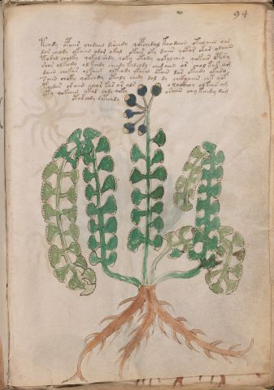

# Voynich Speculative Procedural Protocol — f94r

IMPORTANT: this is NOT a real or validated translation of the Voynich Manuscript. It is a speculative/procedural model that interprets EVA using a user-defined grammar to generate experimental recipes using safe, known edible substitutes.

This file is generated automatically from IVTFF/EVA transliteration plus a user-defined procedural grammar.



## Page / Folio
- currier: B
- folio: f94r
- page_number: 193
- section: herbal

## EVA Text (Transliteration)
```text
tchedy opaiir chedaiin dsheedy qopchedal keodaiin otalaiin oar
dor cheody okaiin odor okal okair oky daiir qotar okar olaiin
todal cholky qokal shdy qoky otody qokolchey qokair opary
shor olkeedy ol kchdy cheedy kalchdy chedaiin or chol kar am
daiin chekar olkaiin olkeody ykaiin otain dar okeed[y:o] ykaro
saiin choky qotchdy otaly chedy dal dy chckhaiin chk qof
pchedar oraiin cheor kas or als o xockhhy olkain am
yty qokaiin ykal chdy qoky osain chykaidy dam
otar chdy dytchdy
```

## Domain Context (Heuristic; Not a Translation)

This section summarizes recurring **basewords** in this IVTFF domain and shows simple substring evidence that the token markers used by the procedural grammar occur inside frequent words.

Any Italian anagram / English gloss is a best-effort lexicon match, not a decipherment.


### Associated basewords (non-generic; top by frequency in this domain)
- `daiin` (count=461) → Italian anagram `piani`; English: plans (arrangements)
- `okaiin` (count=59) → Italian anagram `coniai`; English: [n/a]
- `chaiin` (count=39) → Italian anagram `acini`; English: [n/a]
- `saiin` (count=37) → Italian anagram `asini`; English: [n/a]
- `qokaiin` (count=34) → Italian anagram `ciancio`; English: [n/a]
- `qokar` (count=29) → Italian anagram `carco`; English: [n/a]
- `odaiin` (count=27) → Italian anagram `inopia`; English: poverty
- `otchol` (count=25) → Italian anagram `colto`; English: cultivated
- `kaiin` (count=24) → Italian anagram `acini`; English: [n/a]
- `chodaiin` (count=24) → Italian anagram `apocini`; English: [n/a]
- `qotol` (count=20) → Italian anagram `colto`; English: cultivated
- `okain` (count=19) → Italian anagram `acino`; English: a berry
- `qotor` (count=18) → Italian anagram `corto`; English: short
- `ykaiin` (count=16) → Italian anagram `acini`; English: [n/a]
- `qodaiin` (count=15) → Italian anagram `apocini`; English: [n/a]

### Marker evidence (substring in frequent basewords)
- `qo`: 57 basewords; examples: `qotchy`, `qokchy`, `qokedy`, `qokaiin`, `qoky`, `qokol`
- `q`: 58 basewords; examples: `qotchy`, `qokchy`, `qokedy`, `qokaiin`, `qoky`, `qokol`
- `o`: 252 basewords; examples: `chol`, `o`, `chor`, `or`, `shol`, `ol`
- `k`: 142 basewords; examples: `okaiin`, `oky`, `chckhy`, `qokchy`, `qokedy`, `okal`
- `t`: 102 basewords; examples: `cthy`, `oty`, `qotchy`, `cthol`, `cthor`, `otaiin`
- `p`: 15 basewords; examples: `cphy`, `ypchedy`, `opchy`, `opchey`, `pchor`, `qopchy`
- `ch`: 138 basewords; examples: `chol`, `chor`, `chy`, `chey`, `chedy`, `chdy`
- `sh`: 46 basewords; examples: `shol`, `sho`, `shy`, `shor`, `shey`, `shedy`
- `f`: 1 basewords; examples: `f`
- `cth`: 17 basewords; examples: `cthy`, `cthol`, `cthor`, `cthey`, `chcthy`, `ctho`
- `ckh`: 15 basewords; examples: `chckhy`, `ckhy`, `ckhol`, `ckhey`, `checkhy`, `shckhy`
- `cph`: 2 basewords; examples: `cphy`, `cphol`
- `dy`: 78 basewords; examples: `dy`, `chedy`, `chdy`, `chody`, `qokedy`, `shedy`
- `iin`: 39 basewords; examples: `daiin`, `aiin`, `okaiin`, `chaiin`, `saiin`, `qokaiin`
- `aiin`: 32 basewords; examples: `daiin`, `aiin`, `okaiin`, `chaiin`, `saiin`, `qokaiin`

## Recipes Index (This Page)
- [f94r.1,@P0](#f94r-1-f94r-1-p0)
- [f94r.2,+P0](#f94r-2-f94r-2-p0)
- [f94r.3,+P0](#f94r-3-f94r-3-p0)
- [f94r.4,+P0](#f94r-4-f94r-4-p0)
- [f94r.5,+P0](#f94r-5-f94r-5-p0)
- [f94r.6,+P0](#f94r-6-f94r-6-p0)
- [f94r.7,+P0](#f94r-7-f94r-7-p0)
- [f94r.8,+P0](#f94r-8-f94r-8-p0)
- [f94r.9,+Pc](#f94r-9-f94r-9-pc)

## Line Glosses (Procedural Gloss Only; Not a Translation)

<a id="f94r-1-f94r-1-p0"></a>

### f94r.1,@P0

EVA: tchedy opaiir chedaiin dsheedy qopchedal keodaiin otalaiin oar

Direct Gloss (Procedural, Not a Real Translation):
- tchedy: apply heat/cooking → add main plant (safe substitute) → add starter / activate → duration level 1 → state: active extraction
- opaiir: mix / transfer → add starter / activate → duration level 1 → state: phase transition/start
- chedaiin: add main plant (safe substitute) → add starter / activate → duration level 1 → state: active extraction → long phase
- dsheedy: add secondary herb (safe substitute) → add starter / activate → duration level 2 → state: active extraction
- qopchedal: prepare liquid base → add main plant (safe substitute) → add starter / activate → duration level 1 → state: active extraction
- keodaiin: add fermentable sugars → mix / transfer → add starter / activate → duration level 1 → state: active extraction → long phase
- otalaiin: apply heat/cooking → mix / transfer → duration level 1 → state: phase transition/start → long phase
- oar: mix / transfer → duration level 1 → state: phase transition/start

<a id="f94r-2-f94r-2-p0"></a>

### f94r.2,+P0

EVA: dor cheody okaiin odor okal okair oky daiir qotar okar olaiin

Direct Gloss (Procedural, Not a Real Translation):
- dor: mix / transfer → add starter / activate
- cheody: add main plant (safe substitute) → mix / transfer → add starter / activate → duration level 1 → state: active extraction
- okaiin: add fermentable sugars → mix / transfer → duration level 1 → state: phase transition/start → long phase
- odor: mix / transfer → add starter / activate
- okal: add fermentable sugars → mix / transfer → duration level 1 → state: phase transition/start
- okair: add fermentable sugars → mix / transfer → duration level 1 → state: phase transition/start
- oky: add fermentable sugars → mix / transfer
- daiir: add starter / activate → duration level 1 → state: phase transition/start
- qotar: prepare liquid base → apply heat/cooking → duration level 1 → state: phase transition/start
- okar: add fermentable sugars → mix / transfer → duration level 1 → state: phase transition/start
- olaiin: mix / transfer → duration level 1 → state: phase transition/start → long phase

<a id="f94r-3-f94r-3-p0"></a>

### f94r.3,+P0

EVA: todal cholky qokal shdy qoky otody qokolchey qokair opary

Direct Gloss (Procedural, Not a Real Translation):
- todal: apply heat/cooking → mix / transfer → add starter / activate → duration level 1 → state: phase transition/start
- cholky: add fermentable sugars → add main plant (safe substitute) → mix / transfer
- qokal: prepare liquid base → add fermentable sugars → duration level 1 → state: phase transition/start
- shdy: add secondary herb (safe substitute) → add starter / activate
- qoky: prepare liquid base → add fermentable sugars
- otody: apply heat/cooking → mix / transfer → add starter / activate
- qokolchey: prepare liquid base → add fermentable sugars → add main plant (safe substitute) → mix / transfer → duration level 1 → state: active extraction
- qokair: prepare liquid base → add fermentable sugars → duration level 1 → state: phase transition/start
- opary: mix / transfer → add starter / activate → duration level 1 → state: phase transition/start

<a id="f94r-4-f94r-4-p0"></a>

### f94r.4,+P0

EVA: shor olkeedy ol kchdy cheedy kalchdy chedaiin or chol kar am

Direct Gloss (Procedural, Not a Real Translation):
- shor: add secondary herb (safe substitute) → mix / transfer
- olkeedy: add fermentable sugars → mix / transfer → add starter / activate → duration level 2 → state: active extraction
- ol: mix / transfer
- kchdy: add fermentable sugars → add main plant (safe substitute) → add starter / activate
- cheedy: add main plant (safe substitute) → add starter / activate → duration level 2 → state: active extraction
- kalchdy: add fermentable sugars → add main plant (safe substitute) → add starter / activate → duration level 1 → state: phase transition/start
- chedaiin: add main plant (safe substitute) → add starter / activate → duration level 1 → state: active extraction → long phase
- or: mix / transfer
- chol: add main plant (safe substitute) → mix / transfer
- kar: add fermentable sugars → duration level 1 → state: phase transition/start
- am: duration level 1 → state: phase transition/start

<a id="f94r-5-f94r-5-p0"></a>

### f94r.5,+P0

EVA: daiin chekar olkaiin olkeody ykaiin otain dar okeed[y:o] ykaro

Direct Gloss (Procedural, Not a Real Translation):
- daiin: add starter / activate → duration level 1 → state: phase transition/start → long phase
- chekar: add fermentable sugars → add main plant (safe substitute) → duration level 1 → state: active extraction
- olkaiin: add fermentable sugars → mix / transfer → duration level 1 → state: phase transition/start → long phase
- olkeody: add fermentable sugars → mix / transfer → add starter / activate → duration level 1 → state: active extraction
- ykaiin: add fermentable sugars → duration level 1 → state: phase transition/start → long phase
- otain: apply heat/cooking → mix / transfer → duration level 1 → state: phase transition/start
- dar: add starter / activate → duration level 1 → state: phase transition/start
- okeed: add fermentable sugars → mix / transfer → add starter / activate → duration level 2 → state: active extraction
- y: [unparsed]
- o: mix / transfer
- ykaro: add fermentable sugars → mix / transfer → duration level 1 → state: phase transition/start

<a id="f94r-6-f94r-6-p0"></a>

### f94r.6,+P0

EVA: saiin choky qotchdy otaly chedy dal dy chckhaiin chk qof

Direct Gloss (Procedural, Not a Real Translation):
- saiin: duration level 1 → state: phase transition/start → long phase
- choky: add fermentable sugars → add main plant (safe substitute) → mix / transfer
- qotchdy: prepare liquid base → apply heat/cooking → add main plant (safe substitute) → add starter / activate
- otaly: apply heat/cooking → mix / transfer → duration level 1 → state: phase transition/start
- chedy: add main plant (safe substitute) → add starter / activate → duration level 1 → state: active extraction
- dal: add starter / activate → duration level 1 → state: phase transition/start
- dy: add starter / activate
- chckhaiin: add main plant (safe substitute) → add complex herbal compound (safe blend) → duration level 1 → state: phase transition/start → long phase
- chk: add fermentable sugars → add main plant (safe substitute)
- qof: prepare liquid base → add aroma modifier

<a id="f94r-7-f94r-7-p0"></a>

### f94r.7,+P0

EVA: pchedar oraiin cheor kas or als o xockhhy olkain am

Direct Gloss (Procedural, Not a Real Translation):
- pchedar: add main plant (safe substitute) → add starter / activate → duration level 1 → state: active extraction
- oraiin: mix / transfer → duration level 1 → state: phase transition/start → long phase
- cheor: add main plant (safe substitute) → mix / transfer → duration level 1 → state: active extraction
- kas: add fermentable sugars → duration level 1 → state: phase transition/start
- or: mix / transfer
- als: duration level 1 → state: phase transition/start
- o: mix / transfer
- xockhhy: mix / transfer → add complex herbal compound (safe blend) → unmodeled token(s) present: h
- olkain: add fermentable sugars → mix / transfer → duration level 1 → state: phase transition/start
- am: duration level 1 → state: phase transition/start

<a id="f94r-8-f94r-8-p0"></a>

### f94r.8,+P0

EVA: yty qokaiin ykal chdy qoky osain chykaidy dam

Direct Gloss (Procedural, Not a Real Translation):
- yty: apply heat/cooking
- qokaiin: prepare liquid base → add fermentable sugars → duration level 1 → state: phase transition/start → long phase
- ykal: add fermentable sugars → duration level 1 → state: phase transition/start
- chdy: add main plant (safe substitute) → add starter / activate
- qoky: prepare liquid base → add fermentable sugars
- osain: mix / transfer → duration level 1 → state: phase transition/start
- chykaidy: add fermentable sugars → add main plant (safe substitute) → add starter / activate → duration level 1 → state: phase transition/start
- dam: add starter / activate → duration level 1 → state: phase transition/start

<a id="f94r-9-f94r-9-pc"></a>

### f94r.9,+Pc

EVA: otar chdy dytchdy

Direct Gloss (Procedural, Not a Real Translation):
- otar: apply heat/cooking → mix / transfer → duration level 1 → state: phase transition/start
- chdy: add main plant (safe substitute) → add starter / activate
- dytchdy: apply heat/cooking → add main plant (safe substitute) → add starter / activate
