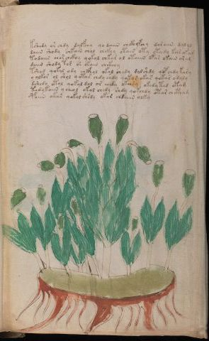

# Voynich Speculative Procedural Protocol — f95r2

IMPORTANT: this is NOT a real or validated translation of the Voynich Manuscript. It is a speculative/procedural model that interprets EVA using a user-defined grammar to generate experimental recipes using safe, known edible substitutes.

This file is generated automatically from IVTFF/EVA transliteration plus a user-defined procedural grammar.



## Page / Folio
- currier: B
- folio: f95r2
- page_number: 196
- section: herbal

## EVA Text (Transliteration)
```text
kshedy or chdy dalfchy qodaiin chckhyfchy daraiin dalal
daiin shody chkain chol chckhy otain oty oteedy kar okam
todaiin chor chckhy qokol chkar ol otaiin ofar okain aram
daiin shody tor or okain chckhey
tshod qokal ody chcfhol okal chedy dalshdy qopchdy kary
y olkor ol shol qotar chdy chdy qokar okar qokar odaly
dshedy otal qokal dol or eeedy okeedy okedyted otam
tedykaiin y cheol okal chedy shdy qokchdy otar chctham
poiin okar qokol shsdy okar chdaiin olky
```

## Domain Context (Heuristic; Not a Translation)

This section summarizes recurring **basewords** in this IVTFF domain and shows simple substring evidence that the token markers used by the procedural grammar occur inside frequent words.

Any Italian anagram / English gloss is a best-effort lexicon match, not a decipherment.


### Associated basewords (non-generic; top by frequency in this domain)
- `paiin` (count=477) → Italian anagram `piani`; English: plans (arrangements)
- `okaiin` (count=59) → Italian anagram `coniai`; English: [n/a]
- `qokep` (count=41) → Italian anagram `pecco`; English: [n/a]
- `saiin` (count=40) → Italian anagram `asini`; English: [n/a]
- `kaiin` (count=40) → Italian anagram `acini`; English: [n/a]
- `chaiin` (count=39) → Italian anagram `acini`; English: [n/a]
- `qokaiin` (count=34) → Italian anagram `ciancio`; English: [n/a]
- `qokar` (count=29) → Italian anagram `carco`; English: [n/a]
- `opaiin` (count=29) → Italian anagram `inopia`; English: poverty
- `otchol` (count=25) → Italian anagram `colto`; English: cultivated
- `chopaiin` (count=24) → Italian anagram `apocini`; English: [n/a]
- `qotol` (count=20) → Italian anagram `colto`; English: cultivated
- `okain` (count=19) → Italian anagram `acino`; English: a berry
- `qotor` (count=18) → Italian anagram `corto`; English: short
- `qopaiin` (count=15) → Italian anagram `apocini`; English: [n/a]

### Marker evidence (substring in frequent basewords)
- `qo`: 58 basewords; examples: `qotch`, `qok`, `qot`, `qokch`, `qokep`, `qokaiin`
- `q`: 59 basewords; examples: `qotch`, `qok`, `qot`, `qokch`, `qokep`, `qokaiin`
- `o`: 274 basewords; examples: `chol`, `o`, `chor`, `or`, `shol`, `ol`
- `k`: 146 basewords; examples: `ok`, `k`, `okaiin`, `kch`, `chckh`, `qok`
- `t`: 101 basewords; examples: `cth`, `ot`, `t`, `qotch`, `cthol`, `qot`
- `p`: 152 basewords; examples: `paiin`, `p`, `par`, `pain`, `pal`, `chep`
- `ch`: 145 basewords; examples: `chol`, `chor`, `ch`, `che`, `chep`, `cho`
- `sh`: 51 basewords; examples: `shol`, `sh`, `sho`, `shor`, `she`, `shep`
- `f`: 2 basewords; examples: `fchep`, `f`
- `cth`: 18 basewords; examples: `cth`, `cthol`, `cthor`, `cthe`, `chcth`, `ctho`
- `ckh`: 18 basewords; examples: `chckh`, `ckh`, `ckhe`, `ckhol`, `shckh`, `checkh`
- `cph`: 3 basewords; examples: `cph`, `cphol`, `cphe`
- `iin`: 39 basewords; examples: `paiin`, `aiin`, `okaiin`, `saiin`, `kaiin`, `chaiin`
- `aiin`: 31 basewords; examples: `paiin`, `aiin`, `okaiin`, `saiin`, `kaiin`, `chaiin`

## Recipes Index (This Page)
- [f95r2.1,@P0](#f95r2-1-f95r2-1-p0)
- [f95r2.2,+P0](#f95r2-2-f95r2-2-p0)
- [f95r2.3,+P0](#f95r2-3-f95r2-3-p0)
- [f95r2.4,+P0](#f95r2-4-f95r2-4-p0)
- [f95r2.5,+P0](#f95r2-5-f95r2-5-p0)
- [f95r2.6,+P0](#f95r2-6-f95r2-6-p0)
- [f95r2.7,+P0](#f95r2-7-f95r2-7-p0)
- [f95r2.8,+P0](#f95r2-8-f95r2-8-p0)
- [f95r2.9,+P0](#f95r2-9-f95r2-9-p0)

## Line Glosses (Procedural Gloss Only; Not a Translation)

<a id="f95r2-1-f95r2-1-p0"></a>

### f95r2.1,@P0

EVA: kshedy or chdy dalfchy qodaiin chckhyfchy daraiin dalal

Direct Gloss (Procedural, Not a Real Translation):
- kshedy: tokens: k sh e p → vowel_run: e (level 1; class e)
- or: tokens: o r → connectors: r
- chdy: tokens: ch p
- dalfchy: tokens: p a l f ch → connectors: l → vowel_run: a (level 1; class a)
- qodaiin: tokens: qo p aiin → vowel_run: a (level 1; class a) → suffix: aiin
- chckhyfchy: tokens: ch ckh f ch
- daraiin: tokens: p a r aiin → connectors: r → vowel_run: a (level 1; class a) → suffix: aiin
- dalal: tokens: p a l a l → connectors: l l → vowel_run: a (level 1; class a)

<a id="f95r2-2-f95r2-2-p0"></a>

### f95r2.2,+P0

EVA: daiin shody chkain chol chckhy otain oty oteedy kar okam

Direct Gloss (Procedural, Not a Real Translation):
- daiin: tokens: p aiin → vowel_run: a (level 1; class a) → suffix: aiin (lexicon-context: `paiin` → `piani`; plans (arrangements))
- shody: tokens: sh o p
- chkain: tokens: ch k a i n → connectors: n → vowel_run: a (level 1; class a)
- chol: tokens: ch o l → connectors: l
- chckhy: tokens: ch ckh
- otain: tokens: o t a i n → connectors: n → vowel_run: a (level 1; class a) (lexicon-context: `otain` → `notai`; [n/a])
- oty: tokens: o t
- oteedy: tokens: o t ee p → vowel_run: ee (level 2; class e)
- kar: tokens: k a r → connectors: r → vowel_run: a (level 1; class a)
- okam: tokens: o k a m → connectors: m → vowel_run: a (level 1; class a)

<a id="f95r2-3-f95r2-3-p0"></a>

### f95r2.3,+P0

EVA: todaiin chor chckhy qokol chkar ol otaiin ofar okain aram

Direct Gloss (Procedural, Not a Real Translation):
- todaiin: tokens: t o p aiin → vowel_run: a (level 1; class a) → suffix: aiin (lexicon-context: `opaiin` → `opinai`; [n/a])
- chor: tokens: ch o r → connectors: r
- chckhy: tokens: ch ckh
- qokol: tokens: qo k o l → connectors: l
- chkar: tokens: ch k a r → connectors: r → vowel_run: a (level 1; class a)
- ol: tokens: o l → connectors: l
- otaiin: tokens: o t aiin → vowel_run: a (level 1; class a) → suffix: aiin
- ofar: tokens: o f a r → connectors: r → vowel_run: a (level 1; class a)
- okain: tokens: o k a i n → connectors: n → vowel_run: a (level 1; class a) (lexicon-context: `okain` → `conia`; [n/a])
- aram: tokens: a r a m → connectors: r m → vowel_run: a (level 1; class a)

<a id="f95r2-4-f95r2-4-p0"></a>

### f95r2.4,+P0

EVA: daiin shody tor or okain chckhey

Direct Gloss (Procedural, Not a Real Translation):
- daiin: tokens: p aiin → vowel_run: a (level 1; class a) → suffix: aiin (lexicon-context: `paiin` → `piani`; plans (arrangements))
- shody: tokens: sh o p
- tor: tokens: t o r → connectors: r
- or: tokens: o r → connectors: r
- okain: tokens: o k a i n → connectors: n → vowel_run: a (level 1; class a) (lexicon-context: `okain` → `conia`; [n/a])
- chckhey: tokens: ch ckh e → vowel_run: e (level 1; class e)

<a id="f95r2-5-f95r2-5-p0"></a>

### f95r2.5,+P0

EVA: tshod qokal ody chcfhol okal chedy dalshdy qopchdy kary

Direct Gloss (Procedural, Not a Real Translation):
- tshod: tokens: t sh o p
- qokal: tokens: qo k a l → connectors: l → vowel_run: a (level 1; class a) (lexicon-context: `qokal` → `calco`; cast (of sculpture))
- ody: tokens: o p
- chcfhol: tokens: ch cfh o l → connectors: l
- okal: tokens: o k a l → connectors: l → vowel_run: a (level 1; class a)
- chedy: tokens: ch e p → vowel_run: e (level 1; class e)
- dalshdy: tokens: p a l sh p → connectors: l → vowel_run: a (level 1; class a)
- qopchdy: tokens: qo p ch p
- kary: tokens: k a r → connectors: r → vowel_run: a (level 1; class a)

<a id="f95r2-6-f95r2-6-p0"></a>

### f95r2.6,+P0

EVA: y olkor ol shol qotar chdy chdy qokar okar qokar odaly

Direct Gloss (Procedural, Not a Real Translation):
- y: [unparsed]
- olkor: tokens: o l k o r → connectors: l r
- ol: tokens: o l → connectors: l
- shol: tokens: sh o l → connectors: l
- qotar: tokens: qo t a r → connectors: r → vowel_run: a (level 1; class a) (lexicon-context: `qotar` → `corta`; [n/a])
- chdy: tokens: ch p
- chdy: tokens: ch p
- qokar: tokens: qo k a r → connectors: r → vowel_run: a (level 1; class a)
- okar: tokens: o k a r → connectors: r → vowel_run: a (level 1; class a)
- qokar: tokens: qo k a r → connectors: r → vowel_run: a (level 1; class a)
- odaly: tokens: o p a l → connectors: l → vowel_run: a (level 1; class a)

<a id="f95r2-7-f95r2-7-p0"></a>

### f95r2.7,+P0

EVA: dshedy otal qokal dol or eeedy okeedy okedyted otam

Direct Gloss (Procedural, Not a Real Translation):
- dshedy: tokens: p sh e p → vowel_run: e (level 1; class e)
- otal: tokens: o t a l → connectors: l → vowel_run: a (level 1; class a)
- qokal: tokens: qo k a l → connectors: l → vowel_run: a (level 1; class a) (lexicon-context: `qokal` → `calco`; cast (of sculpture))
- dol: tokens: p o l → connectors: l
- or: tokens: o r → connectors: r
- eeedy: tokens: eee p → vowel_run: eee (level 3; class e)
- okeedy: tokens: o k ee p → vowel_run: ee (level 2; class e)
- okedyted: tokens: o k e p t e p → vowel_run: e (level 1; class e)
- otam: tokens: o t a m → connectors: m → vowel_run: a (level 1; class a)

<a id="f95r2-8-f95r2-8-p0"></a>

### f95r2.8,+P0

EVA: tedykaiin y cheol okal chedy shdy qokchdy otar chctham

Direct Gloss (Procedural, Not a Real Translation):
- tedykaiin: tokens: t e p k aiin → vowel_run: e (level 1; class e) → suffix: aiin
- y: [unparsed]
- cheol: tokens: ch e o l → connectors: l → vowel_run: e (level 1; class e)
- okal: tokens: o k a l → connectors: l → vowel_run: a (level 1; class a)
- chedy: tokens: ch e p → vowel_run: e (level 1; class e)
- shdy: tokens: sh p
- qokchdy: tokens: qo k ch p
- otar: tokens: o t a r → connectors: r → vowel_run: a (level 1; class a)
- chctham: tokens: ch cth a m → connectors: m → vowel_run: a (level 1; class a)

<a id="f95r2-9-f95r2-9-p0"></a>

### f95r2.9,+P0

EVA: poiin okar qokol shsdy okar chdaiin olky

Direct Gloss (Procedural, Not a Real Translation):
- poiin: tokens: p o iin → vowel_run: ii (level 2; class i) → suffix: iin
- okar: tokens: o k a r → connectors: r → vowel_run: a (level 1; class a)
- qokol: tokens: qo k o l → connectors: l
- shsdy: tokens: sh s p → connectors: s
- okar: tokens: o k a r → connectors: r → vowel_run: a (level 1; class a)
- chdaiin: tokens: ch p aiin → vowel_run: a (level 1; class a) → suffix: aiin (lexicon-context: `paiin` → `piani`; plans (arrangements))
- olky: tokens: o l k → connectors: l
